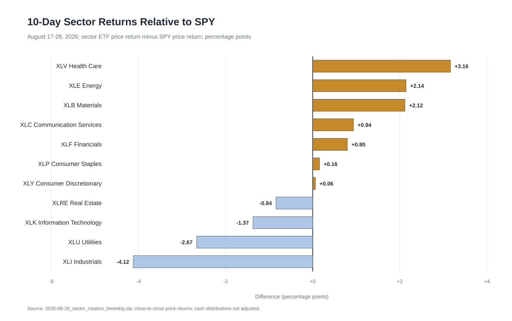
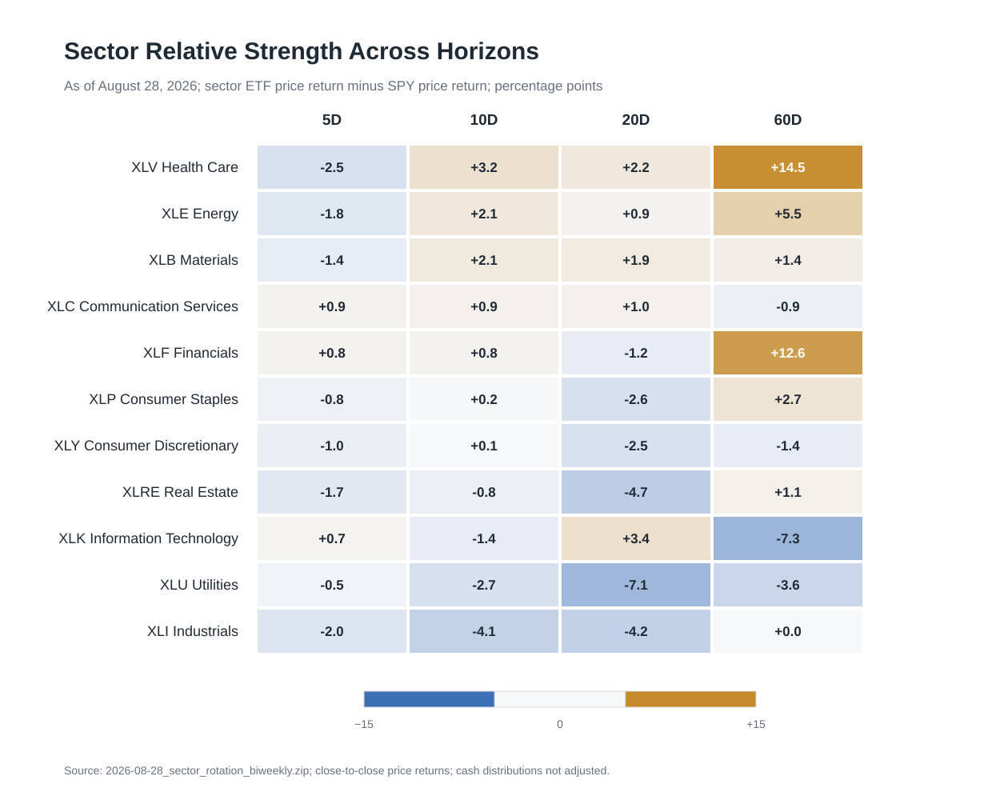
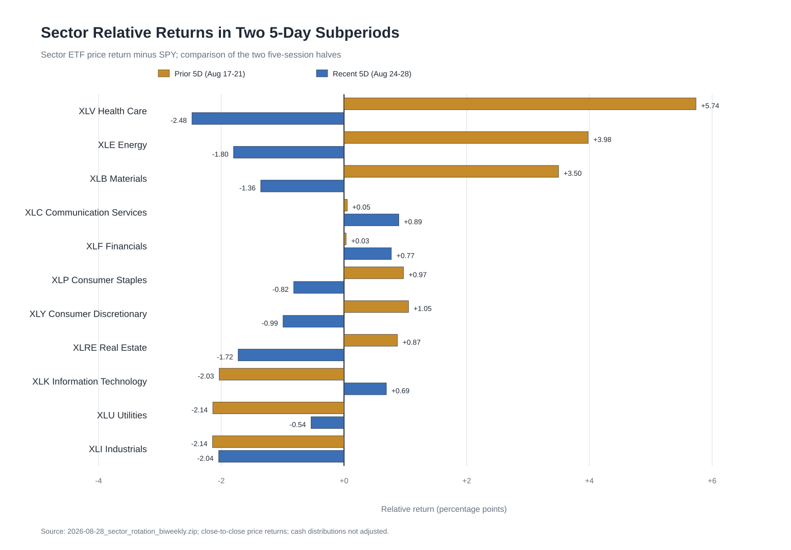
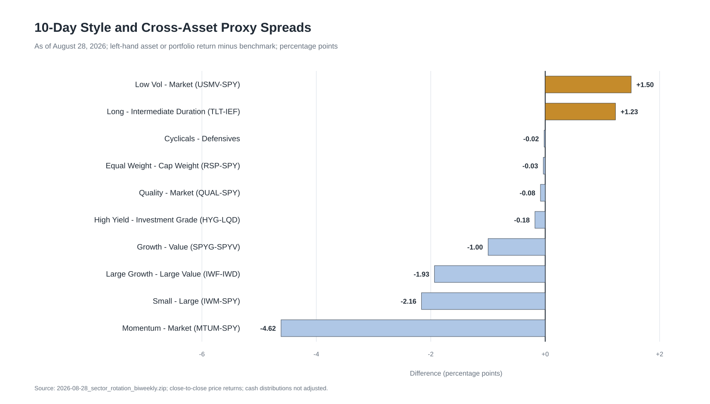

+++
title = "板块轮动双周复盘：截至2026年8月28日"
date = "2026-08-29"
draft = false
description = "报告发布于2026年8月29日，复盘截至8月28日的10D板块相对强弱、5D领导切换、市场广度及跨资产确认。"
series = "市场板块轮动双周复盘"
categories = ["市场结构"]
tags = ["板块轮动", "ETF", "相对强弱", "市场广度", "风格因子", "跨资产"]
featured = false
private = false
+++

> **日期口径：** 本报告发布于 **2026年8月29日**（Asia/Singapore），板块与市场价格窗口截至 **2026年8月28日（ET）**。跨资产宏观序列存在不同发布时滞，正文逐项列明实际观测日；其中 WTI spot 截至 **2026年8月25日**。

## Executive Summary

- **完整 10D 窗口呈现指数回撤和有限的相对 breadth。** SPY、QQQ、RSP、IWM 分别下跌 0.90%、2.00%、0.93% 和 3.06%；11 个板块仅 4 个取得正收益、6 个位于 20D 均线上方。7 个板块跑赢 SPY，主要受 SPY 本身下跌影响，无法据此确认绝对上涨已扩散。

- **XLV、XLE、XLB 保持完整窗口前三名，近期动量已经反转。** 三者 10D 分别跑赢 SPY 3.16pp、2.14pp 和 2.12pp，但在最近 5D 全部下跌并落后 SPY。中期相对强势仍在，边际资金方向与完整窗口排名出现冲突。

- **最近 5D 的边际领导转向 XLC、XLF、XLK，持续性证据仍窄。** 三者是最近 5D 仅有的正收益板块，也全部跑赢 SPY；其中只有 XLC 与 XLF 在前后两个 5D 都跑赢 SPY，较早 5D 的领先幅度仅 +0.05pp 和 +0.03pp。Top-3 与比较期零重合、排名相关系数仅 0.10，说明板块顺序仍在快速换手。

- **跨资产组合支持“久期改善、商品退潮、风险确认混合”的判断。** TLT−IEF 10D 为 +1.23pp，30Y Treasury 和 10Y real yield 分别下降 6bp、7bp；最近 5D USO、DBC、GLD 分别下跌 3.57%、1.52%、3.36%。信用利差收窄，但 HYG−LQD 价格差为 -0.18pp，VIX 小幅上升 0.26 点，尚未形成单向 risk-on 证据。

## 市场回撤仍广，小盘与等权没有确认扩散

**四个市场代理的 10D 收益全部为负，完整窗口仍处于回撤。** SPY 下跌 0.90%，QQQ 与 IWM 跌幅更深；RSP 与 SPY 接近，RSP−SPY 仅 -0.03pp。较早 5D 四个代理均下跌，最近 5D SPY 和 QQQ 小幅转正，RSP 与 IWM继续走弱，市场修复集中在大盘股。

| 市场代理 | 较早5D | 最近5D | 10D收益 | 20D收益 | 60D收益 | 20D均线 |
|---|---:|---:|---:|---:|---:|---|
| SPY 标普500 | -1.20% | +0.31% | -0.90% | +3.34% | +2.00% | 上方 |
| QQQ 纳斯达克100 | -2.30% | +0.31% | -2.00% | +4.59% | -3.63% | 下方 |
| RSP 标普500等权 | -0.37% | -0.57% | -0.93% | +2.88% | +5.88% | 下方 |
| IWM 罗素2000 | -1.54% | -1.54% | -3.06% | +2.12% | +3.05% | 下方 |

板块平均收益为 -0.87%，中位数为 -0.74%；剔除最强的 XLV 后，其他十个板块平均下跌 1.18%。仅 4/11 板块上涨、6/11 位于 20D 均线上方。7/11 跑赢 SPY 表明部分板块相对抗跌，结合 RSP 和 IWM 的表现，尚未看到稳定的 equal-weight 或 small-cap broadening。

*图注：2026年8月17—28日；板块 ETF 价格收益减 SPY 价格收益，单位为百分点。金色表示跑赢，蓝色表示落后。*

板块相对收益的 top-bottom spread 为 7.29pp，横截面标准差为 2.07%。XLV、XLE、XLB 的相对领先均超过 2pp，XLI 落后 4.12pp；这一差距说明板块选择影响显著，同时市场总体为负使“相对领先”未必对应可观的绝对收益。

## 完整窗口前三名保留中期优势，排名稳定性很低

**完整 10D 排名由医疗、能源和原材料占据，比较期的科技与工业 leadership 明显降温。** 比较期前三名 XLK、XLI、XLC 在本期分别降至第 9、第 11 和第 4；本期前三名 XLV、XLE、XLB 在比较期仅列第 5、第 6 和第 4。Top-3 零重合，XLK 和 XLI 分别下降 8 位、9 位，排名相关系数为 0.10。

| 板块 ETF | 比较期→本期排名 | 10D收益 | 10D相对SPY | 最近5D相对SPY | 20D相对SPY | 60D相对SPY | 20D均线 |
|---|---:|---:|---:|---:|---:|---:|---|
| XLV 医疗保健 | 5 → 1 | +2.26% | +3.16pp | -2.48pp | +2.15pp | +14.51pp | 上方 |
| XLE 能源 | 6 → 2 | +1.24% | +2.14pp | -1.80pp | +0.87pp | +5.53pp | 上方 |
| XLB 原材料 | 4 → 3 | +1.22% | +2.12pp | -1.36pp | +1.90pp | +1.38pp | 上方 |
| XLC 通信服务 | 3 → 4 | +0.04% | +0.94pp | +0.89pp | +1.05pp | -0.93pp | 上方 |
| XLF 金融 | 7 → 5 | -0.10% | +0.80pp | +0.77pp | -1.20pp | +12.61pp | 上方 |
| XLP 必需消费 | 9 → 6 | -0.74% | +0.16pp | -0.82pp | -2.57pp | +2.73pp | 下方 |
| XLY 可选消费 | 8 → 7 | -0.84% | +0.06pp | -0.99pp | -2.50pp | -1.39pp | 下方 |
| XLRE 房地产 | 10 → 8 | -1.75% | -0.84pp | -1.72pp | -4.66pp | +1.13pp | 下方 |
| XLK 信息技术 | 1 → 9 | -2.27% | -1.37pp | +0.69pp | +3.38pp | -7.26pp | 上方 |
| XLU 公用事业 | 11 → 10 | -3.57% | -2.67pp | -0.54pp | -7.10pp | -3.62pp | 下方 |
| XLI 工业 | 2 → 11 | -5.02% | -4.12pp | -2.04pp | -4.22pp | +0.02pp | 下方 |

XLV、XLE、XLB 在 10D、20D 和 60D 均跑赢 SPY，说明其完整窗口领先带有中期积累；三者最近 5D 已同时转为相对落后，当前信号更适合标记为“中期强、短期降温”。XLC 在 5D、10D、20D 均领先但 60D 仍落后；XLF 的 60D 优势显著、20D 相对收益为负；XLK 最近 5D回升且 20D 领先，60D 背景仍弱。多时间尺度尚未收敛到统一的新领导组合。

*图注：截至2026年8月28日；5D、10D、20D、60D 均为板块 ETF 价格收益减 SPY，单位为百分点。*

热图显示 XLV 的 60D 相对收益达到 +14.51pp，XLF 为 +12.61pp；XLK 的 60D 相对收益为 -7.26pp，却在最近 5D 转正。短期反弹与长期 leadership 是不同层级的证据，后续需要连续窗口确认，避免把单周变化直接外推为稳定趋势。

## 最近5D从医疗、能源转向通信、金融和科技

**两个 5D 子窗口之间发生了清晰的方向切换。** 较早 5D，XLV、XLE、XLB 分别上涨 4.53%、2.78%、2.29%，并显著跑赢 SPY；最近 5D 三者分别下跌 2.17%、1.49%、1.05%，全部转为相对落后。近期取得正收益且跑赢 SPY 的只有 XLC、XLF、XLK。

*图注：金色为8月17—21日，蓝色为8月24—28日；板块 ETF 价格收益减 SPY，单位为百分点。*

XLC、XLF 是仅有的两个连续子窗口相对领先板块，较早 5D 的相对优势分别只有 +0.05pp 和 +0.03pp，最近 5D 扩大到 +0.89pp 和 +0.77pp。XLK 从较早 5D 落后 2.03pp 转为最近 5D 领先 0.69pp，属于较明确的短期 reversal；其完整 10D 仍下跌 2.27%。最近 5D 只有 3/11 板块上涨和跑赢 SPY，新增 leadership 的宽度有限。

## 低波占优、动量承压，风险偏好信号分化

**风格代理继续呈现低波和反动量特征。** USMV−SPY 10D 为 +1.50pp，MTUM−SPY 为 -4.62pp；Growth−Value 为 -1.00pp，Large Growth−Large Value 为 -1.93pp。最近 5D Growth−Value 回升至 +0.60pp，但 large growth−value 仍为 -0.36pp，成长内部的恢复并不一致。

*图注：截至2026年8月28日；左侧资产或组合价格收益减右侧基准，单位为百分点。价差均为叙事代理，混合市值、久期、行业和信用质量等暴露。*

RSP−SPY 为 -0.03pp，IWM−SPY 为 -2.16pp，说明等权没有获得相对优势，小盘更弱；Cyclical−Defensive 为 -0.02pp，剔除 XLE 后为 -0.51pp，周期扩张证据不足。QUAL−SPY 仅 -0.08pp，质量因子接近中性。总体结构更接近低波占优、传统动量承压和内部快速换手，风险偏好没有形成一致方向。

## 久期资产改善，信用和波动率只提供部分确认

**长端名义与实际利率下降，久期代理同步改善。** 30Y Treasury 较 8月14日下降 6bp，10Y real yield 下降 7bp；TLT−IEF 10D 为 +1.23pp。2Y Treasury 上升 3bp、10Y 下降 1bp，10Y−2Y 收窄 12bp；10Y−3M 小幅扩大 1bp，曲线形态仍有分化。

| 指标 | 最新值 | 较8月14日变化 | 最新日期（ET） | 观察 |
|---|---:|---:|---|---|
| 2Y Treasury | 4.20% | +3bp | 8月27日 | 前端小幅上行 |
| 10Y Treasury | 4.67% | -1bp | 8月27日 | 长端略降 |
| 30Y Treasury | 5.19% | -6bp | 8月27日 | 超长端降幅更大 |
| 10Y real yield | 2.34% | -7bp | 8月27日 | 实际利率下降 |
| 10Y breakeven | 2.31% | +4bp | 8月28日 | 通胀补偿小幅上升 |
| 10Y−2Y | 0.39% | -12bp | 8月28日 | 2s10s 走平 |
| 10Y−3M | 0.83% | +1bp | 8月28日 | 3m10y 近乎稳定 |
| HY OAS | 2.63% | -4bp | 8月27日 | 高收益信用利差收窄 |
| Corporate OAS | 0.79% | -1bp | 8月27日 | 投资级利差小幅收窄 |
| VIX | 14.51 | +0.26点 | 8月27日 | 水平仍低、方向略升 |
| WTI spot | $83.90 | -$0.09 | 8月25日 | 终点早于报告截止日 |

信用利差收窄通常对应信用风险补偿下降；HYG−LQD 的 10D 价格差为 -0.18pp，给出相反方向。LQD 久期通常更长，本期长久期资产占优会抬升 LQD 相对表现，因此该冲突含有久期混杂，信用确认应保持 mixed。VIX 最新值 14.51，较比较期小幅增加 0.26 点，未显示显著风险冲击，也没有配合利差给出统一的 risk-on 信号。

商品资产在两个 5D 之间快速反转：较早 5D USO、DBC、GLD 分别上涨 6.24%、4.22%、5.38%，最近 5D 分别下跌 3.57%、1.52%、3.36%。XLE 同期由强转弱，与商品方向一致；WTI 现货截至 8月25日较 8月14日仅下降 0.09 美元，且缺少报告末三日观测，数据包无法据此识别能源板块波动的单一驱动因素。

## 后续确认条件

下一观察窗口应重点检验三组条件。第一，XLC、XLF、XLK 能否继续取得正的绝对收益，并将最近 5D 的相对领先延伸到新的 10D 窗口；若仅排名提升而绝对收益转负，边际 leadership 仍可能只是跌幅差异。第二，XLV、XLE、XLB 能否守住 20D 均线及 20D 相对优势；若短期回撤继续侵蚀中期强势，当前前三名的参考价值会快速下降。第三，RSP−SPY 与 IWM−SPY 能否同步转正，并伴随上涨板块数增加；这将是市场 breadth 真正扩大的更强确认。

跨资产方面，可继续观察 30Y/10Y real yield 的下降能否延续、HYG−LQD 与 OAS 能否恢复同向、商品回撤是否稳定。若久期资产继续领先但小盘、等权和周期板块仍弱，市场结构更可能保持选择性；若信用利差重新走阔且 VIX 持续上升，近期的通信、金融和科技修复需要下调信号强度。

## 免责声明

> 本报告仅基于所列历史市场与宏观数据进行描述性分析，仅供一般性信息与教育参考，不构成任何证券、行业、金融工具或投资组合的投资建议、理财建议、交易建议、买卖推荐或收益承诺。历史表现、相对强弱、风险指标及跨资产关系不代表未来结果。数据可能存在发布时滞、价格调整口径、修订、分红处理和样本期限制；报告中的相关性、同步变化与情景分析不构成因果证明。读者应结合自身目标、风险承受能力及其他独立信息作出判断，并自行承担相关决策风险。
