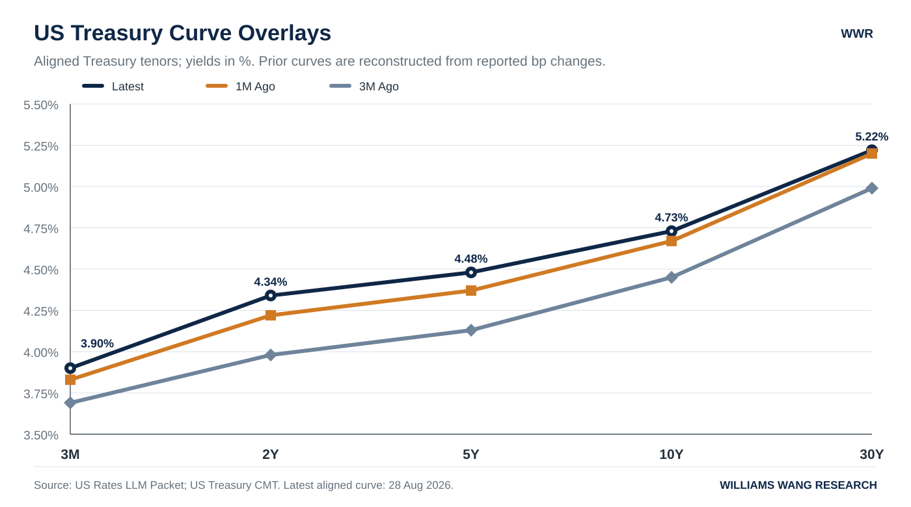
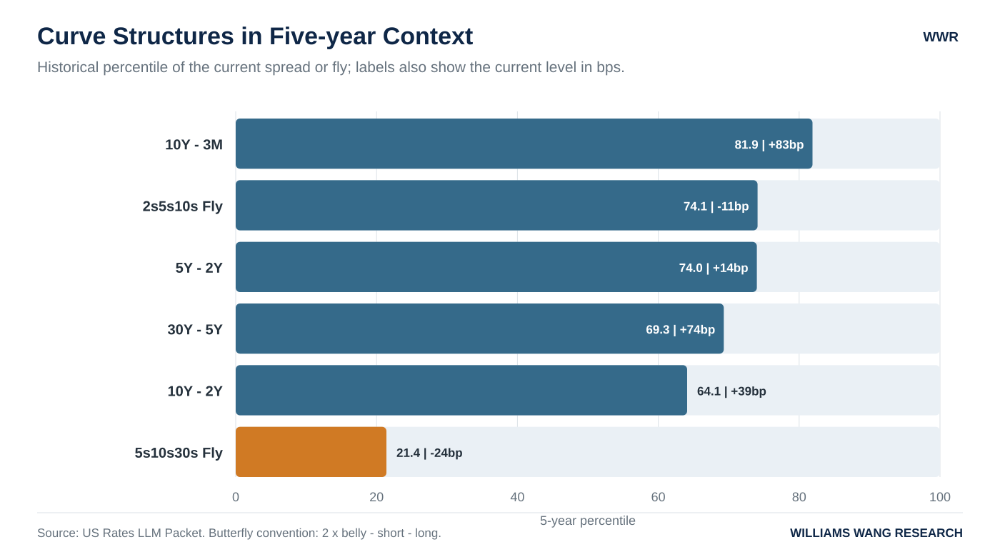
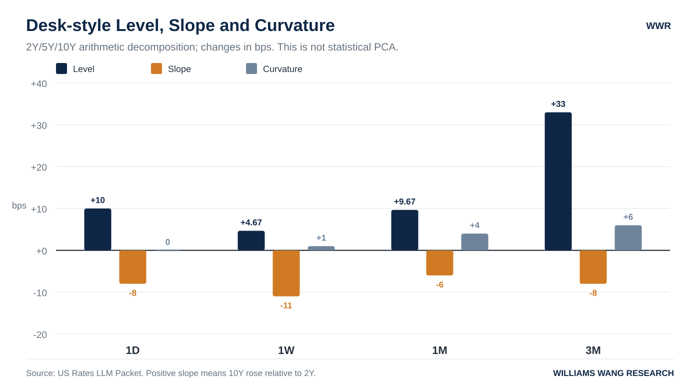
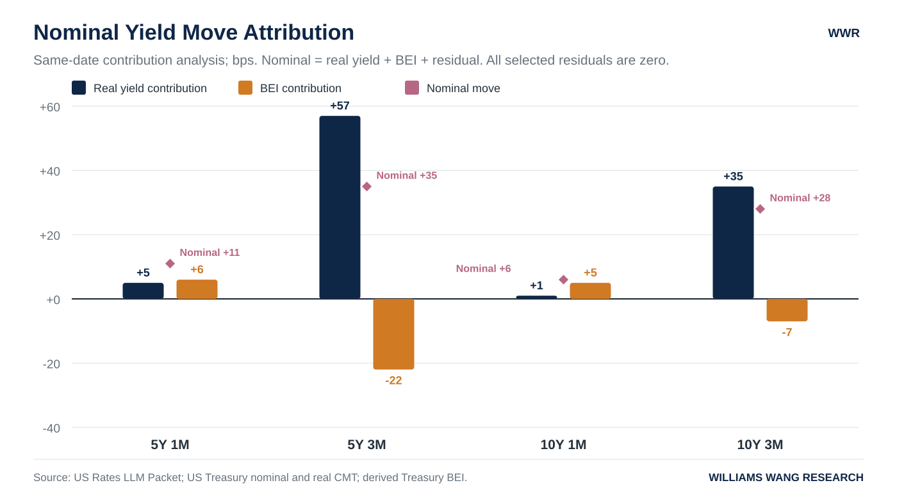
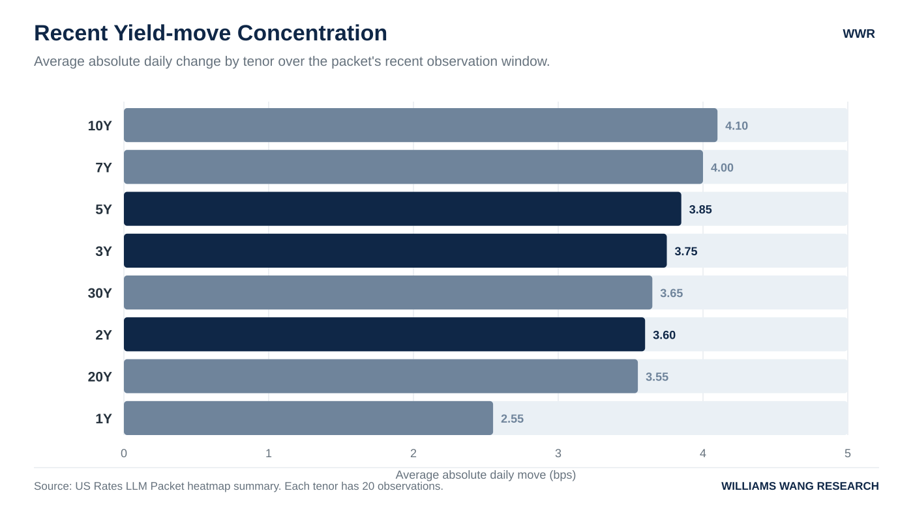

+++
title = "美国利率期限结构分析：截至2026年8月28日"
date = "2026-08-30"
draft = false
description = "报告日期为2026年8月30日；基于截至8月28日的美国国债曲线，分析收益率上移、bear flattening、实际利率与BEI归因及MOVE状态。"
series = "利率期限结构分析"
categories = ["宏观与政策", "市场结构"]
tags = ["美国国债", "收益率曲线", "实际利率", "BEI", "MOVE", "SOFR"]
featured = false
private = false
+++

> **日期口径：** 本报告日期为 **2026年8月30日**（Asia/Singapore）。核心 Treasury 曲线与 MOVE 数据截至 **2026年8月28日**；SOFR 及 FRED DFII5/DFII10 的最新观测为 **2026年8月27日**。页面发布日期沿用原报告日期，不以本次上线日期重置。

## 1. Executive Summary

- **最新交易日是 level 上移与强 bear flattening 的组合。** 2026年8月28日的3M、2Y、5Y、10Y和30Y收益率分别上行6bp、14bp、10bp、6bp和3bp；2Y/5Y/10Y desk-style 分解为 level +10bp、slope -8bp、curvature 0bp。Level的绝对量略大，但期限差异同样显著，selloff幅度集中在 front-end 与 belly。
- **跨窗口的稳健主线是绝对收益率上移，同时曲线持续趋平。** 一周内 slope -11bp超过 level +4.67bp，是前端 selloff 与长端 rally 并存的 twist flattening；一个月与三个月则分别由 level +9.67bp和+33bp主导，slope仍为-6bp和-8bp，说明中期环境更接近 broad bear flattening。
- **局部斜率已到近期低位，curvature呈现分化。** 10Y-2Y为39bp、30Y-5Y为74bp，均处于20观察值低点；5Y-2Y为14bp，距20观察值低点仅1bp。2s5s10s fly升至-11bp并接近局部高点，显示5Y相对2Y/10Y两翼已明显 cheapen；5s10s30s fly仍为-24bp、处于5年21.4%分位，10Y相对5Y/30Y两翼继续偏 rich。
- **名义收益率归因随窗口切换。** 1D与1W主要由 real yield 上行推动，BEI下降形成抵消；1M则转为 BEI 贡献略占主导；3M再次由 real yield 主导，5Y和10Y实际利率分别贡献+57bp和+35bp。八组同日归因 residual 均为0bp。
- **核心曲线可用，但来源同步性仍需分项披露。** Treasury完整曲线对齐至2026年8月28日，alignmentAudit为OK，总体 freshness 为 fresh_vs_basic_business_day；SOFR及FRED DFII5/DFII10仅到8月27日。当前real/BEI使用8月28日Treasury同日数据，未受FRED fallback滞后影响。MOVE为70.97、同日更新且比较日期正常，但来源仍是Yahoo Finance/yfinance补充数据。

## 2. Curve Snapshot

**当前曲线保持正斜率，但最新冲击高度集中于2Y至5Y。** Treasury曲线从3M的3.90%上行至30Y的5.22%；SOFR为3.64%，实际观测日为2026年8月27日，较Treasury锚点滞后1天，以下单列而不作伪同步比较。

| Tenor | 当前水平 | 实际观测日 | 1D | 1W | 1M | 3M |
|:--|--:|:--:|--:|--:|--:|--:|
| SOFR | 3.64% | 2026-08-27 | 0bp | +1bp | -1bp | +1bp |
| 3M | 3.90% | 2026-08-28 | +6bp | +2bp | +7bp | +21bp |
| 2Y | 4.34% | 2026-08-28 | +14bp | +10bp | +12bp | +36bp |
| 5Y | 4.48% | 2026-08-28 | +10bp | +5bp | +11bp | +35bp |
| 10Y | 4.73% | 2026-08-28 | +6bp | -1bp | +6bp | +28bp |
| 30Y | 5.22% | 2026-08-28 | +3bp | -5bp | +2bp | +23bp |

*Source: us_llm_packet.json, latestCurve.points。Treasury的1D、1W、1M和3M比较日分别为2026年8月27日、8月21日、7月29日和5月29日；SOFR使用其自身可得日期8月26日、8月20日、7月28日和5月29日。*

一个月与三个月的同日Treasury曲线对比显示，所有核心期限收益率均高于比较日；升幅从2Y/5Y向30Y递减。因此，中期主线是 broad selloff 中的 flattening，而非单纯平行上移。

最新一日的横截面更集中：2Y和5Y上行14bp和10bp，10Y和30Y仅上行6bp和3bp，10Y-2Y单日收窄8bp。过去一周的分化更强，2Y上行10bp，而10Y和30Y分别下行1bp和5bp，形成典型 twist flattening。一个月和三个月内各期限均上行，但2Y/5Y升幅持续高于长端，bear flattening具有跨窗口一致性。

滚动位置强化了这一判断。2Y和5Y均处于20观察值高点，5Y同时达到60观察值高点；10Y距离20和60观察值高点仅1bp和2bp。30Y则较20与60观察值高点低9bp，并仅高于20观察值低点5bp。当前selloff并非由超长端主导，压力中心在2Y至10Y，尤其是2Y和5Y。

## 3. Spreads and Butterflies

**2Y至30Y的主要斜率显著压缩，但10Y-3M仍处于较高长期分位。** 10Y-2Y和30Y-5Y已经触及20观察值低点，5Y-2Y亦接近低点；10Y-3M为83bp、5年分位81.9%，说明3M至10Y段的绝对陡峭程度仍高于多数历史观测。

| 结构 | 当前 | 1D | 1W | 1M | 3M | 5年分位 | 20观察值区间 | 60观察值区间 |
|:--|--:|--:|--:|--:|--:|--:|:--:|:--:|
| 10Y-2Y | +39bp | -8bp | -11bp | -6bp | -8bp | 64.1% | 39至53bp | 27至53bp |
| 10Y-3M | +83bp | 0bp | -3bp | -1bp | +7bp | 81.9% | 74至86bp | 51至92bp |
| 30Y-5Y | +74bp | -7bp | -10bp | -9bp | -12bp | 69.3% | 74至93bp | 66至93bp |
| 5Y-2Y | +14bp | -4bp | -5bp | -1bp | -1bp | 74.0% | 13至20bp | 4至20bp |
| 2s5s10s fly | -11bp | 0bp | +1bp | +4bp | +6bp | 74.1% | -17至-10bp | -21至-10bp |
| 5s10s30s fly | -24bp | -1bp | -2bp | -1bp | -2bp | 21.4% | -27至-22bp | -27至-20bp |

*Source: us_llm_packet.json, spreadsAndButterflies.items。Butterfly convention 为 2 * belly - short - long。*

**Slope：** 10Y-2Y在1D、1W、1M和3M分别收窄8bp、11bp、6bp和8bp，当前39bp已是20观察值低点。30Y-5Y在四个窗口分别收窄7bp、10bp、9bp和12bp，当前74bp同样触及20观察值低点。5Y-2Y为14bp，距20观察值低点仅1bp。上述三段共同确认flattening不是单一期限的偶然变化。10Y-3M的情况不同：当前分位较高，且三个月仍扩大7bp，说明更靠近现金端的斜率尚未完成相同程度的长期压缩。

**Curvature：** 2s5s10s fly为-11bp，较三个月前上升6bp，距20和60观察值高点-10bp仅1bp，表明5Y收益率相对2Y/10Y两翼明显上移，即belly已明显 cheapen。5s10s30s fly为-24bp，5年分位仅21.4%，且各窗口继续小幅下降，显示10Y收益率仍低于5Y与30Y两翼的简单平均，即10Y在价格空间相对偏 rich。两项fly均为yield-space算术指标，不代表duration-neutral组合或可执行交易信号。

## 4. Three-Factor Decomposition

**Slope在四个窗口均为负，是最稳定的方向性特征；1D、1M和3M仍以level上移为主，1W则由slope主导。** 本报告采用2Y/5Y/10Y desk-style分解：`Level = (Δy2Y + Δy5Y + Δy10Y) / 3`；`Slope = Δy10Y − Δy2Y`；`Curvature = 2 × Δy5Y − Δy2Y − Δy10Y`。

| 窗口 | 2Y / 5Y / 10Y变化 | Level | Slope | Curvature | 主要形态 |
|:--|:--:|--:|--:|--:|:--|
| 1D | +14 / +10 / +6bp | +10.00bp | -8bp | 0bp | 广泛selloff伴强flattening |
| 1W | +10 / +5 / -1bp | +4.67bp | -11bp | +1bp | slope-led twist flattening |
| 1M | +12 / +11 / +6bp | +9.67bp | -6bp | +4bp | level-led bear flattening |
| 3M | +36 / +35 / +28bp | +33.00bp | -8bp | +6bp | 广泛bear selloff伴持续flattening |

*Source: us_llm_packet.json, threeFactorDecomposition.windows；公式已以底层tenor moves独立复算。*

1D的level +10bp略大于slope -8bp，表明广泛selloff与强flattening同时存在；1W的slope -11bp明显超过level +4.67bp，更接近方向相反的twist。1M和3M中，level绝对量再度占主导，但slope仍为负值，因而不宜把中期变化概括为纯平行上移。Curvature在1M和3M为+4bp和+6bp，与5Y相对两翼cheapening一致，但量级小于对应level。这是便于desk解读的三点算术分解，不是统计PCA，三个因子也不应被视为完全正交的风险来源。

## 5. Real Rates / Inflation Compensation / MOVE

**最新一日与一周的名义收益率变化由real yield上行主导，BEI下降提供部分抵消；一个月窗口转为BEI贡献略占主导，三个月则再度回到real-led。** 2026年8月28日的水平恒等式在同日数据上成立：5Y nominal 4.48% = real 2.18% + BEI 2.30%；10Y nominal 4.73% = real 2.42% + BEI 2.31%。

| 期限 | 窗口 | Nominal | Real | BEI | Residual |
|:--:|:--:|--:|--:|--:|--:|
| 5Y | 1D | +10bp | +11bp | -1bp | 0bp |
| 5Y | 1W | +5bp | +9bp | -4bp | 0bp |
| 5Y | 1M | +11bp | +5bp | +6bp | 0bp |
| 5Y | 3M | +35bp | +57bp | -22bp | 0bp |
| 10Y | 1D | +6bp | +8bp | -2bp | 0bp |
| 10Y | 1W | -1bp | +2bp | -3bp | 0bp |
| 10Y | 1M | +6bp | +1bp | +5bp | 0bp |
| 10Y | 3M | +28bp | +35bp | -7bp | 0bp |

*Source: us_llm_packet.json, nominalRealBreakevenAttribution；八组归因均有2,104个同日交集观测，largeResiduals为空。*

1D中，5Y和10Y名义收益率分别上行10bp和6bp，对应real yield上行11bp和8bp，BEI分别下降1bp和2bp。1W的10Y名义收益率下降1bp，则是BEI下降3bp超过real yield上行2bp的净结果。1M中BEI对5Y和10Y分别贡献+6bp和+5bp，略高于real贡献；3M中real yield贡献扩大至+57bp和+35bp，BEI下降22bp和7bp形成对冲。BEI表示inflation compensation，其中还可能包含通胀风险溢价与市场技术因素，不能等同于纯通胀预期。

MOVE在2026年8月28日为70.97，1D上升1.11，1W、1M分别下降2.43和3.21，3M上升0.75；其1年和5年分位分别为44.8%和12.5%。因此，最新单日曲线大幅变动伴随MOVE小幅上升，但当前波动水平仍不处于长期历史高分位。MOVE来自Yahoo Finance/yfinance补充数据，上述关系仅是同日现象，不构成因果证据。

## 6. Heatmap / Move Concentration

**8月28日是方向高度同步、幅度集中于front-end与belly的全曲线selloff。** 14个观测期限全部上行；front-end 8个期限平均上行7.12bp，belly 3个期限平均上行9.33bp，long-end 3个期限平均上行4.00bp。

| 区段 | 上行 / 观测数 | 下行 / 观测数 | 平均变化 |
|:--|--:|--:|--:|
| Front-end | 8 / 8 | 0 / 8 | +7.12bp |
| Belly | 3 / 3 | 0 / 3 | +9.33bp |
| Long-end | 3 / 3 | 0 / 3 | +4.00bp |

*Source: us_llm_packet.json, heatmapSummary.latestBreadth。*

当日最大上行依次为2Y +14bp、1Y和3Y各+11bp、5Y +10bp及6M +8bp，进一步确认幅度集中在前中段。最近窗口也有显著反向波动：8月25日2Y和7Y均下降7bp，3Y、5Y和10Y均下降6bp。20观察值的平均绝对变化在10Y、7Y、5Y和3Y最高，分别为4.10bp、4.00bp、3.85bp和3.75bp。综合看，最新一日的方向同步性很强，但近期并非单向连续上行，3Y至10Y仍是双向变动最活跃的区域。

## 7. Trading Desk Interpretation

**可直接确认的事实是：收益率全线上行，但2Y/5Y涨幅超过30Y；两条主要斜率降至20观察值低点；短窗口名义变化以real yield上行为主。** 这些证据更符合front-end/belly-led repricing，而不是long-end-led move。30Y未跟随2Y和5Y创出同等程度的近期高位，30Y-5Y反而收窄至74bp，故现有数据对“独立long-end term-premium压力”的支持较弱。

对机制的判断仍属推断。2Y领涨可能与policy-path repricing相容，real yield上行也与real-rate tightening相容；但数据包没有OIS/利率期货、宏观事件、auction/flow、term-premium模型或cross-market数据，无法把曲线形态归因于具体驱动，需要额外数据确认。

相对价值信息集中在belly。2s5s10s fly在三个月内升6bp至-11bp，显示5Y的原有yield richness正在收敛；5s10s30s fly为-24bp且长期分位偏低，显示10Y yield仍相对两翼偏低。这些信息只描述yield-space形态，未经duration、convexity、carry或融资成本调整。

后续监测应聚焦三类变化：斜率是否继续跌破60观察值区间低点；2s5s10s与5s10s30s是否突破近期区间；real/BEI主导项与MOVE是否同步切换。当前MOVE的5年分位仅12.5%，所以曲线大幅变化尚未与长期高波动分位同时出现。

## 8. What Would Change My View

当前判断的核心是“front-end/belly-led bear flattening，短窗口real-led，长期波动分位仍低”。以下可观测条件会迫使重新评估：

| 观察项 | 变更条件 | 对当前观点的含义 |
|:--|:--|:--|
| 主要斜率反转 | 10Y-2Y升破53bp，且30Y-5Y升破93bp | 同时突破20/60观察值高点，反驳广泛flattening |
| 趋平向长周期延伸 | 10Y-2Y跌破27bp，且30Y-5Y跌破66bp | 突破60观察值低点，确认flattening进一步扩大 |
| Belly结构切换 | 2s5s10s跌破-17bp或升破-10bp | 前者表示5Y重新明显richen；后者确认belly继续cheapen |
| 10Y相对两翼改变 | 5s10s30s跌破-27bp或升破-20bp | 前者表示10Y相对richness加深；后者显著削弱该判断 |
| 归因与波动切换 | 1D/1W转为BEI正贡献并超过real贡献，或MOVE长期分位显著、持续上升 | 重估“real-led且不在长期高波动区间”的解释 |

上述阈值是packet中20/60观察值区间的客观边界，不是交易入场、止损或目标位。

## 结论

2026年8月28日的美国利率曲线呈现全线selloff与front-end/belly-led bear flattening的组合；一周由slope主导，一个月与三个月则以level上移为主，但flattening始终存在。短窗口的名义变化以real yield上行为主，而MOVE仍在长期低分位。有效解读应保留SOFR与FRED的一天滞后、历史序列未随包提供及外部驱动数据缺失。

> 本文所载观点与意见仅代表作者个人立场，仅供一般性的信息与教育参考之用，不构成任何形式的投资建议、理财建议、交易建议或买卖证券的推荐。读者不应将本文的任何内容视为购买或出售任何金融工具的邀请或要约。
