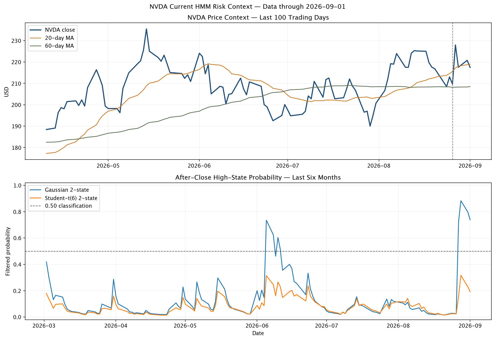

+++
title = "NVDA基本面强劲、短期风险仍高：截至2026年9月1日的HMM交易决策报告"
date = "2026-09-02"
draft = false
description = "基于2026年9月1日收盘，结合 Gaussian 与 Student-t HMM 分析 NVDA 的短期波动风险、模型分歧及仓位管理含义；不构成自动买卖指令。"
series = ""
categories = ["科技产业", "研究方法"]
tags = ["NVDA", "HMM", "波动率", "风险管理", "NVDL"]
featured = false
private = false
+++

> **日期与用途：** 本报告日期为 **2026年9月2日**（Asia/Singapore），最新完整交易日为 **2026年9月1日**（America/New_York）。本文用于风险状态、建仓节奏、仓位与退出管理；不构成自动买卖指令。

## 核心结论

NVDA当前呈现“基本面增长强、价格中期结构尚未明显破坏、短期风险偏高、模型分歧较大”的组合。9月1日收盘价为$217.44，单日下跌1.51%；20日和60日实际年化波动率为45.2%和40.9%。价格略低于20日均线$219.03，仍高于60日均线$208.52，距离252日收盘高点$235.47约7.7%。

Gaussian HMM在收盘后给出73.9%的高状态概率和59.9%的次日年化波动预测；Student-t挑战模型分别为19.2%和45.5%。两模型的预测波动率相差14.4%，因此当前风险判断存在明显model-risk。

HMM没有产生独立买卖结论。750个严格样本外交易日支持风险区分能力，没有证明1、5、10或20个交易日的收益方向优势。当前更有依据的动作是控制仓位和杠杆、采用分批执行，并以基本面或价格结构失效作为退出条件。

## 当前状态快照

| Metric | As of 2026-09-01 close |
| --- | --- |
| Latest close | $217.44 |
| 1-day return | -1.51% |
| 20d / 60d realized volatility | 45.2% / 40.9% |
| Gaussian P(high) | 73.9% |
| Gaussian next-day vol | 59.9% |
| Student-t next-day vol | 45.5% |



## 价格与最新财报背景

最近5、20、60和252个交易日收益分别为2.1%、2.6%、6.0%和25.0%。中期价格路径仍为正，最新价格回到20日均线附近，短期方向优势有限。

NVIDIA于8月26日公布FY2027第二季度收入962亿美元，同比增长106%；Data Center收入890亿美元，同比增长117%；第三季度收入展望为1080亿美元、上下浮动2%，GAAP和non-GAAP毛利率展望均为74.0%、上下浮动50个基点。[NVIDIA官方财报](https://investor.nvidia.com/news/press-release-details/2026/NVIDIA-Announces-Financial-Results-for-Second-Quarter-Fiscal-2027/default.aspx)

财报后的价格路径出现明显双向波动。财报与波动上升在时间上同步，本研究没有据此认定单一因果机制。

| Date | Close | Daily return | Volume |
| --- | --- | --- | --- |
| 2026-08-24 | $208.48 | -2.91% | 135.2m |
| 2026-08-25 | $213.05 | 2.19% | 122.3m |
| 2026-08-26 | $209.66 | -1.59% | 179.9m |
| 2026-08-27 | $227.98 | 8.74% | 298.9m |
| 2026-08-28 | $217.55 | -4.57% | 195.1m |
| 2026-08-31 | $220.78 | 1.48% | 124.7m |
| 2026-09-01 | $217.44 | -1.51% | 109.8m |

## HMM当前读数

模型参数只使用截至8月31日的数据；9月1日收益只用于收盘后过滤，时间顺序为：

```text
截至8月31日拟合参数 → 观察9月1日收盘收益 → 更新posterior → 预测下一交易日风险
```

| Model | P(high) | Next P(high) | Next vol | Q05 return | Q95 return | Q05 price | Q95 price |
| --- | --- | --- | --- | --- | --- | --- | --- |
| Gaussian 2-state (selected) | 73.9% | 73.2% | 59.9% | -6.1% | 6.5% | $204.58 | $231.96 |
| Student-t(6) 2-state (challenger) | 19.2% | 19.6% | 45.5% | -4.2% | 4.7% | $208.40 | $227.85 |

Gaussian模型给出的90%单日模型区间约为-6.1%至+6.5%，对应约$204.58至$231.96。Student-t模型对应-4.2%至+4.7%，即约$208.40至$227.85。这些数值是分布分位数，不是目标价，也没有覆盖全部隔夜跳空风险。

Gaussian模型更容易把大幅收益解释为状态切换；Student-t模型允许同一状态内出现更厚尾部。当前两模型P(high)差异属于模型结构不确定性，实际风控应优先参考连续预测波动率，并显示挑战模型差异。

## 对交易决策的含义

### 尚未持有

若基本面和估值研究已经形成独立做多判断，当前状态支持分批建仓和较小第一笔风险。HMM本身不支持追涨或抄底。以假设性的40%目标波动率和正常风险预算100为例，两模型对应风险倍率约0.67至0.88；保守处理会把正常风险预算缩放至约67。该示例没有纳入个人组合、估值、税务和交易成本。

### 已经持有

高波动状态不足以单独构成平仓理由。若长期逻辑仍成立，应检查单一股票集中度、降低不必要杠杆、预留回撤承受空间。若投资逻辑失效或组合风险超限，则执行减仓或退出，不等待HMM确认方向。

### 战术交易与NVDL

当前HMM没有给出5天、10天或20天收益方向优势。战术交易仍需独立方向条件，例如价格吸收、趋势恢复或此前研究的开盘一小时冲击信号。Gaussian风险预测较高且模型分歧明显时，NVDL的每日杠杆重置和路径依赖会放大结果分散度，应特别限制杠杆风险。

### 止损与退出

Gaussian和Student-t分别对应约3.8%和2.9%的单日波动尺度。高波动环境中机械收紧止损容易增加噪声触发；更一致的方法是扩大价格容忍区间并同步减小股数，使美元风险预算稳定。盈利目标和时间退出仍需由具体策略定义。

## 当前条件—动作—失效点

| 当前条件 | 动作含义 | 失效点或复核条件 |
| --- | --- | --- |
| 财务增长强、价格仍高于60日均线 | 保留中长期研究逻辑 | 收入、毛利率或需求兑现明显偏离假设 |
| Gaussian P(high)高于0.50 | 降低初始仓位、杠杆和隔夜风险 | 风险预测持续回落且方向信号仍成立 |
| 两模型风险预测分歧较大 | 使用较高风险预测并标记model-risk | 两模型预测重新收敛 |
| 价格接近20日均线 | 等待独立确认或分批执行 | 趋势、吸收或基本面条件出现明确变化 |
| 投资逻辑失效或组合风险超限 | 执行减仓或退出 | 不等待HMM方向确认 |

0.50只是状态分类阈值，未被验证为最优交易阈值。
