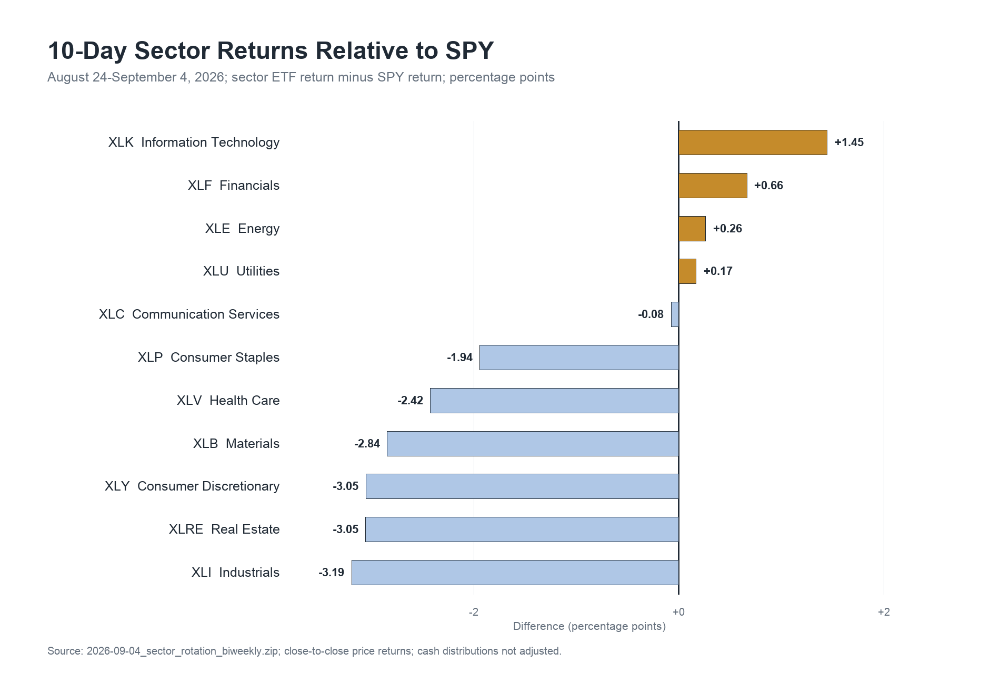
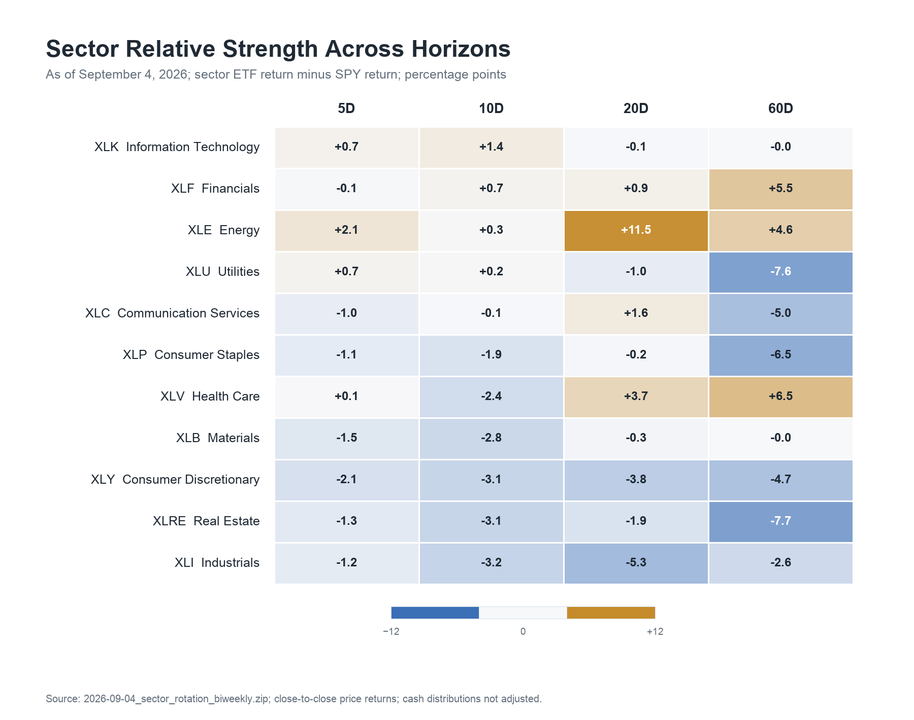
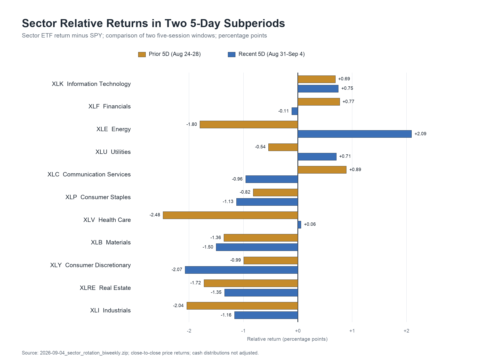
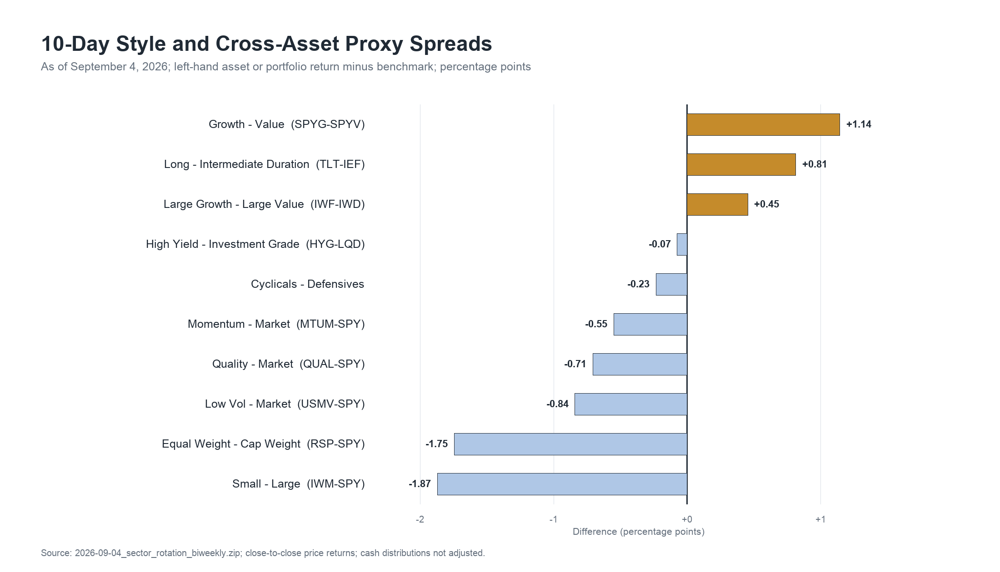

+++
title = "2026年9月4日板块轮动双周复盘：大盘科技接棒，市场广度继续收缩"
date = "2026-09-05"
data_as_of = ["2026-09-04","2026-09-03","2026-09-01"]
draft = false
description = "复盘大盘科技接棒、板块相对表现及市场广度变化。"
series = "市场板块轮动双周复盘"
categories = ["市场结构"]
tags = []
featured = false
private = false
content_preservation = "verbatim"
source_sha256 = "ffc3dad8e2c88d971a296092af0fcc752a6a47766716c8452b968b6de78a8ff1"
source_front_matter_reviewed = true

[cover]
as_of = "20260904"
subtitle = "大盘科技接棒，市场广度继续收缩"
disclosure = "本报告仅基于所列历史市场与宏观数据进行描述性分析，仅供一般性信息与教育参考，不构成任何证券、行业、金融工具或投资组合的投资建议、理财建议、交易建议、买卖推荐或收益承诺。历史表现、相对强弱、风险指标及跨资产关系不代表未来结果。数据可能存在发布时滞、价格调整口径、修订、分红处理和样本期限制；报告中的相关性、同步变化与情景分析不构成因果证明。读者应结合自身目标、风险承受能力及其他独立信息作出判断，并自行承担相关决策风险。"
+++
# 2026年9月4日板块轮动双周复盘：大盘科技接棒，市场广度继续收缩

## Executive Summary

- **市值加权指数保持韧性，市场广度却继续收缩。** SPY、QQQ 在完整 10D 分别上涨 0.42%、0.66%，RSP、IWM 分别下跌 1.33%、1.45%；板块平均收益为 -0.86%，中位数为 -1.53%。11 个板块中仅 5 个上涨、4 个跑赢 SPY、5 个位于 20D 均线上方，指数表面稳定主要由少数大盘板块支撑。

- **XLK 是本期最清晰的短期 leadership，尚未获得中期相对趋势确认。** XLK 从比较期第 10 升至第 1，10D 上涨 1.86%、跑赢 SPY 1.45pp，并且是唯一在前后两个 5D 都跑赢 SPY 的板块；其 20D 和 60D 相对收益分别为 -0.05pp、-0.01pp，领先仍集中在短窗口。

- **XLE 与 XLF 提供较强的跨窗口支撑，能源在最近 5D重新增强。** XLE 最近 5D 上涨 2.20%、跑赢 SPY 2.09pp，20D 和 60D 相对收益为 +11.49pp、+4.60pp；同期 USO、DBC 最近 5D 分别上涨 9.45%、3.61%。XLF 的 10D、20D、60D 相对收益均为正，但最近 5D 持平并小幅落后 SPY，延续性弱于完整窗口排名。

- **利率、信用和波动率提供部分风险支持，尚不足以确认 broad risk-on。** HY OAS 收窄 5bp、VIX 下降 0.81 点，10D Growth−Value 与 TLT−IEF 分别为 +1.14pp、+0.81pp；同期 RSP−SPY、IWM−SPY 分别为 -1.75pp、-1.87pp，HYG−LQD 为 -0.07pp。信用与波动率改善没有传导为广泛的股票参与度。

## SPY温和上涨，板块中位数仍下跌1.53%

**完整 10D 的核心特征是 cap-weight resilience 与内部弱势并存。** SPY 和 QQQ 均为正收益且位于 20D 均线上方，RSP 和 IWM 则下跌并位于均线下方。最近 5D SPY、QQQ、IWM 小幅上涨，RSP 继续回落 0.77%，说明修复并未向等权成分充分扩散。

| 市场代理 | 较早5D | 最近5D | 10D收益 | 20D收益 | 60D收益 | 20D均线 |
|---|---:|---:|---:|---:|---:|---|
| SPY 标普500 | +0.31% | +0.11% | +0.42% | -0.37% | +6.17% | 上方 |
| QQQ 纳斯达克100 | +0.31% | +0.35% | +0.66% | -0.53% | +3.76% | 上方 |
| RSP 标普500等权 | -0.57% | -0.77% | -1.33% | -0.59% | +6.45% | 下方 |
| IWM 罗素2000 | -1.54% | +0.09% | -1.45% | -1.95% | +5.20% | 下方 |

板块平均收益为 -0.86%，中位数为 -1.53%；剔除排名第一的 XLK 后，其余十个板块平均下跌 1.13%。板块相对收益的 top-bottom spread 为 4.64pp，横截面标准差为 1.69%。这组数据同时显示上涨覆盖有限、板块选择影响显著，单看 SPY 的正收益会高估整体市场强度。

*图注：2026年8月24日至9月4日；板块 ETF 价格收益减 SPY 价格收益，单位为百分点。金色表示跑赢，蓝色表示落后；数据来自所给 ZIP。*

图中仅 XLK、XLF、XLE、XLU 跑赢 SPY，XLC 以 -0.08pp 接近基准。XLI、XLRE、XLY 分别落后 3.19pp、3.05pp、3.05pp，且三者均位于 20D 均线下方。相对 weakness 集中在工业、房地产与可选消费，市场内部没有形成广泛的周期扩张。

## 排名几乎重排，XLK是唯一持续的5D相对赢家

**本期与比较期的排名关系非常弱。** 排名相关系数仅 0.06，Top-3 重合 1/3，5 个板块移动至少五位。XLK 从第 10 升至第 1，XLF 从第 7 升至第 2；XLV、XLB 各下降 5 位，前一窗口的医疗与原材料 leadership 明显退潮。

| 板块 ETF | 比较期→本期排名 | 10D收益 | 10D相对SPY | 最近5D相对SPY | 20D相对SPY | 60D相对SPY | 20D均线 |
|---|---:|---:|---:|---:|---:|---:|---|
| XLK 信息技术 | 10 → 1 | +1.86% | +1.45pp | +0.75pp | -0.05pp | -0.01pp | 上方 |
| XLF 金融 | 7 → 2 | +1.08% | +0.66pp | -0.11pp | +0.91pp | +5.45pp | 上方 |
| XLE 能源 | 1 → 3 | +0.68% | +0.26pp | +2.09pp | +11.49pp | +4.60pp | 上方 |
| XLU 公用事业 | 9 → 4 | +0.59% | +0.17pp | +0.71pp | -1.03pp | -7.63pp | 下方 |
| XLC 通信服务 | 5 → 5 | +0.34% | -0.08pp | -0.96pp | +1.55pp | -4.99pp | 上方 |
| XLP 必需消费 | 4 → 6 | -1.53% | -1.94pp | -1.13pp | -0.22pp | -6.55pp | 下方 |
| XLV 医疗保健 | 2 → 7 | -2.01% | -2.42pp | +0.06pp | +3.75pp | +6.49pp | 上方 |
| XLB 原材料 | 3 → 8 | -2.43% | -2.84pp | -1.50pp | -0.31pp | -0.04pp | 下方 |
| XLY 可选消费 | 8 → 9 | -2.64% | -3.05pp | -2.07pp | -3.76pp | -4.71pp | 下方 |
| XLRE 房地产 | 6 → 10 | -2.64% | -3.05pp | -1.35pp | -1.93pp | -7.67pp | 下方 |
| XLI 工业 | 11 → 11 | -2.77% | -3.19pp | -1.16pp | -5.33pp | -2.61pp | 下方 |

XLK 的 10D 相对表现最强，20D 与 60D 相对收益仍接近零，说明当前更适合定义为短期接棒。XLF 在 10D、20D、60D 均跑赢 SPY，长期延续性优于 XLK；XLE 的 20D 相对优势达到 11.49pp，并在最近 5D重新增强。XLV 的 10D 表现弱，但 20D、60D 相对优势仍为正，体现“中期强、短期回撤”的时间尺度冲突。

*图注：截至2026年9月4日；5D、10D、20D、60D 均为板块 ETF 价格收益减 SPY，单位为百分点；数据来自所给 ZIP。*

XLE 是唯一在 5D、10D、20D、60D 四个标准窗口相对收益均为正的板块，但它在两个5D子窗口之间发生由弱转强，因此完整窗口内部路径并不平滑。XLK 的短期优势最连续，中期相对积累仍不足。市场 leadership 可辨认，稳定性仍待确认。

## 最近5D能源和公用事业增强，通信服务转弱

**两个 5D 子窗口的迁移比完整 10D 排名更能反映边际变化。** 较早 5D 只有 XLK、XLF、XLC 跑赢 SPY；最近 5D 改为 XLK、XLE、XLU、XLV。XLK 是唯一连续跑赢者，两个子窗口分别领先 0.69pp、0.75pp。

*图注：金色为8月24日至28日，蓝色为8月31日至9月4日；板块 ETF 价格收益减 SPY，单位为百分点；数据来自所给 ZIP。*

XLE 从落后 1.80pp 转为领先 2.09pp，XLU 从 -0.54pp 转为 +0.71pp，是最近 5D 最明显的相对增强；XLV 从 -2.48pp 回到 +0.06pp，更接近止跌。XLC 从领先 0.89pp 转为落后 0.96pp，XLF 从 +0.77pp 转为 -0.11pp。XLY、XLRE、XLI 在两个子窗口都落后 SPY，弱势具有更高持续性。

## 成长相对回升，等权与小盘继续落后

**风格代理显示大型成长恢复，但没有转化为广泛 risk appetite。** Growth−Value 10D 为 +1.14pp，Large Growth−Large Value 为 +0.45pp；Momentum−Market 为 -0.55pp，但最近 5D 已回升至 +1.61pp。该组合与 XLK 接棒一致，也说明传统 momentum 组合尚未在完整窗口同步确认。

*图注：截至2026年9月4日；左侧资产或组合价格收益减右侧基准，单位为百分点。所有价差均为叙事代理；数据来自所给 ZIP。*

RSP−SPY 与 IWM−SPY 分别为 -1.75pp、-1.87pp，低波与质量代理也分别落后 SPY 0.84pp、0.71pp。Cyclical−Defensive 为 -0.23pp，剔除 XLE 后降至 -0.71pp，能源的相对强势掩盖了工业、可选消费和原材料的弱势。市场结构体现大型成长与能源并存，无法归纳为统一的周期、质量或防御风格行情。

## 原油与能源同向，利率曲线和信用仍给出混合信号

**商品层面的方向一致性主要集中在能源。** USO、DBC 10D 分别上涨 5.55%、2.03%，最近 5D 分别上涨 9.45%、3.61%；WTI 现货较8月21日上涨 4.27 美元至 91.48 美元。XLE 最近5D和20D同时表现强势，与原油代理方向一致。WTI 最新观测仅到9月1日，USO、DBC还包含期货曲线和 roll yield，以上同步变化不能识别单一因果驱动。

| 指标 | 最新值 | 较8月21日变化 | 最新日期（ET） | 观察 |
|---|---:|---:|---|---|
| 2Y Treasury | 4.34% | +10bp | 9月3日 | 前端明显上行 |
| 10Y Treasury | 4.77% | +3bp | 9月3日 | 中长端小幅上行 |
| 30Y Treasury | 5.25% | -2bp | 9月3日 | 超长端略降 |
| 10Y real yield | 2.42% | +2bp | 9月3日 | 实际利率小幅上行 |
| 10Y breakeven | 2.35% | +1bp | 9月4日 | 通胀补偿近乎稳定 |
| 10Y−2Y | 0.41% | -9bp | 9月4日 | 2s10s 走平 |
| 10Y−3M | 0.87% | +1bp | 9月4日 | 3m10y 基本稳定 |
| HY OAS | 2.65% | -5bp | 9月3日 | 高收益信用利差收窄 |
| Corporate OAS | 0.81% | 0bp | 9月3日 | 投资级利差持平 |
| VIX | 14.32 | -0.81点 | 9月3日 | 隐含波动率下降 |
| WTI spot | $91.48 | +$4.27 | 9月1日 | 终点早于报告截止日 |

利率变化呈现曲线分化：2Y 上升 10bp、10Y 上升 3bp、30Y 下降 2bp，2s10s 收窄 9bp；TLT−IEF 的 10D 价格差为 +0.81pp，最近 5D 已转为 -0.16pp。完整窗口的长久期相对优势主要来自早段，当前 rates impulse 不宜概括为统一的收益率下行。

HY OAS 收窄 5bp、投资级 OAS 持平、VIX 下降 0.81 点，方向上对风险资产较为温和；HYG−LQD 10D 为 -0.07pp，价格代理未同步确认。债券 ETF 还混合久期差异，结合股票 breadth 收缩，信用环境可标记为“利差略支持、价格与广度确认不足”。

## 下一期确认条件

后续首先观察 XLK 能否把连续两个 5D 的相对领先延伸为正的 20D 相对收益；若 20D 仍停留在零附近，当前第1名更可能是短窗口换手。其次观察 XLE 的商品共振能否延续，以及 XLF 能否恢复最近 5D 的正相对收益；两者将决定 leadership 能否从单一科技扩展为多支柱结构。最后观察 RSP−SPY、IWM−SPY 与 20D 均线以上板块数是否同步改善；这组条件比 SPY 单独上涨更能确认 breadth 扩张。

> 本文所载观点与意见仅代表作者个人立场，仅供一般性的信息与教育参考之用，不构成任何形式的投资建议、理财建议、交易建议或买卖证券的推荐。读者不应将本文的任何内容视为购买或出售任何金融工具的邀请或要约。
