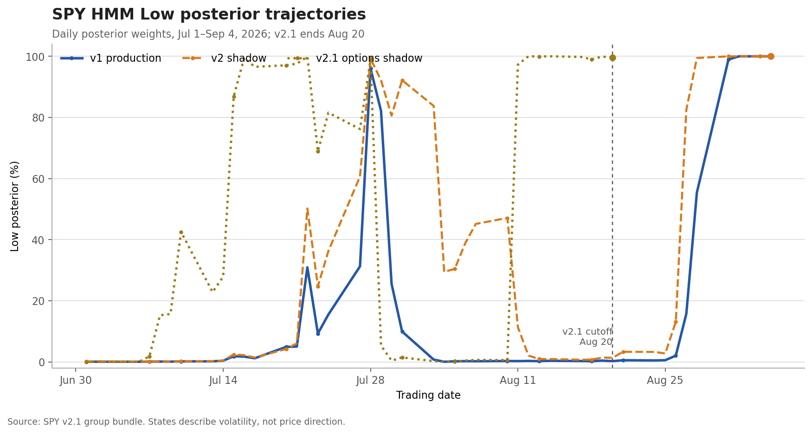

+++
title = "SPY 低波动状态观察｜2026年9月5日"
date = "2026-09-05"
data_as_of = ["2026-09-04","2026-08-20"]
draft = false
description = "观察SPY低波动状态、跨模型一致性与尾部风险。"
series = "SPY HMM模型分析"
categories = ["市场结构"]
tags = []
featured = false
private = false
content_preservation = "verbatim"
source_sha256 = "28fb9f7001d03752a9994975af9ce32d18a3e72fb6d9e92882d2fcbb92bae1b6"
+++
# SPY 低波动状态观察｜2026年9月5日

## Executive Summary

- **生产模型已经完成从 Mid 向 Low Volatility 的切换。** v1 于 8 月 28 日转入 Low，截至 9 月 4 日已连续维持 6 个观测日，最新 Low posterior 为 **99.999%**；normal、t1d、t2d 三种设定全部给出 Low，说明本期正式状态判断具有较强的内部稳健性。
- **市场波动统计与模型状态相互印证。** SPY 的 20 日年化实现波动率降至 **8.10%**，比 60 日的 **12.57%** 低 **4.46 个百分点**；SPY 近一周和近一月分别上涨 **0.11%**、**0.21%**，三个月最大回撤为 **-3.42%**。当前市场更符合价格窄幅变化、短期实现波动显著压缩的环境。
- **v2 已与生产锚同步，v2.1 只能提供较早的时间顺序证据。** v2 于 8 月 27 日转为 Low，最新 Low posterior 同样为 **99.999%**。v2.1 的 Low posterior 为 **99.60%**，但截止日仍为 8 月 20 日，落后 v1 共 11 个交易观测，不能作为 9 月 4 日的同日确认。
- **低波动环境仍包含尾部脆弱性。** VIX 为 **14.53**，较 SPY 20 日实现波动率高 **6.43 个波动率点**。这反映期权市场仍为前瞻不确定性与凸性保护保留溢价。研究层面可降低对“当前已处于高波动状态”的权重，但不应仅凭 Low 标签机械增加风险暴露。

## 短期实现波动显著低于中期基准

**SPY 的价格趋势仍为正，近期路径趋于平稳。** 截至 9 月 4 日，SPY 收于 **770.19**，近一周、近一月、近三个月和年初至今收益分别为 **+0.11%**、**+0.21%**、**+4.43%** 和 **+13.05%**。三个月最大回撤收窄至 **-3.42%**，年初至今最大回撤仍为 **-8.89%**。当前 Low 状态描述的是波动强度，不能由此推导后续价格必然上涨。

下表将短周期指标与中周期基准放在同一口径下比较。20 日实现波动率仅为 60 日水平的 **64.5%**，是本期低波动判断最直接的市场证据。

| 市场指标 | 最新值 | 比较基准与含义 |
|---|---:|---|
| SPY 收盘价 | 770.19 | 2026年9月4日收盘 |
| SPY 近一周收益 | +0.11% | 短期价格近似横盘偏强 |
| SPY 近一月收益 | +0.21% | 月度涨幅有限，未出现明显趋势加速 |
| SPY 近三月收益 | +4.43% | 中期累计收益仍为正 |
| 20 日实现波动率 | 8.10% | 年化；比 60 日低 4.46 个百分点 |
| 60 日实现波动率 | 12.57% | 年化；中期风险基准仍高于短期 |
| VIX | 14.53 | 比 20 日实现波动率高 6.43 个波动率点 |
| VIX 近一月变化 | -0.62 点 / -4.09% | 与生产模型 High posterior 回落方向一致 |

**VIX 与实现波动率之间仍有较宽缓冲。** VIX 约为 20 日实现波动率的 **1.79 倍**。由于 VIX 与历史实现波动率的期限、构造和风险溢价口径不同，该差值只能作为前瞻风险定价的粗略背景，不能直接视为可获得的波动率收益。其实际含义是：现行 realized volatility 很低，但市场没有把未来风险定价压缩到同等程度。

## v1 与 v2 已在八月底收敛到 Low

**本期最重要的模型变化是生产锚完成状态切换。** v1 从 8 月 28 日开始连续 6 个观测日保持 Low；最近 5 行全部为 Low，平均 Low posterior 为 **99.79%**。v2 比 v1 早一个观测日切换，并已连续 7 行保持 Low。两套当前模型的状态标签和概率强度均高度一致。

| 模型 | 角色 | 最新日期 | 当前状态 | Low posterior | Mid posterior | High posterior | 当前状态持续期 |
|---|---|---|---|---:|---:|---:|---:|
| v1 | production anchor | 2026-09-04 | Low | 99.9991% | 0.0008% | <0.0001% | 6 个观测日 |
| v2 | shadow | 2026-09-04 | Low | 99.9990% | 0.0001% | 0.0009% | 7 个观测日 |
| v2.1 | options shadow | 2026-08-20 | Low | 99.6033% | 0.3967% | <0.000001% | 8 个观测日 |

**v1 的替代设定没有改变结论。** normal、t1d 和 t2d 的 Low posterior 均高于 **99.99%**，最近 5 行的 High posterior 变化也全部为负。不同设定对极小尾部权重的估计略有差异，但这些差异不足以改变 Low 状态。

| v1 设定 | Low posterior | Mid posterior | High posterior | 最近 5 行 High 变化 |
|---|---:|---:|---:|---:|
| normal | 99.9991% | 0.0008% | <0.0001% | -0.0261 个百分点 |
| t1d | 99.9913% | 0.0087% | <0.00001% | -0.2276 个百分点 |
| t2d | 99.9945% | 0.0052% | 0.0003% | -0.0729 个百分点 |

上述 posterior 是模型内部对隐状态的相对权重。99.999% 表示当前特征在该模型中高度符合 Low 状态，不能解释为未来市场有 99.999% 的概率保持低波动。

## v2.1 较早转 Low，随后 v1 与 v2 跟进

**三个模型的状态轨迹显示出“影子模型较早转 Low、当前模型随后收敛”的时间顺序。** 图中 v2.1 在 8 月 11 日进入 Low；v2 和 v1 分别在 8 月 27 日与 8 月 28 日完成本轮切换。v2.1 曲线在 8 月 20 日结束，虚线标明其数据截止点。

在三个模型仍可同日比较的 8 月 20 日，v1 与 v2 都是 Mid，而 v2.1 已是 Low。之后 v1、v2 的转变与 v2.1 早期信号方向一致，但样本只有一次事件，且各模型特征维度不同；目前只能把它视为值得继续验证的先后顺序，不能据此认定 v2.1 具有稳定的领先预测能力。

| 2026年8月20日同日比较 | Low posterior | Mid posterior | High posterior | 状态 |
|---|---:|---:|---:|---|
| v1 | 0.245% | 99.700% | 0.055% | Mid |
| v2 | 1.354% | 98.382% | 0.264% | Mid |
| v2.1 | 99.603% | 0.397% | <0.000001% | Low |

**分歧的核心一直位于 Low 与 Mid 之间。** 三个模型在同日样本中都没有给出 High 主导状态，后续 v1 与 v2 又共同转向 Low。这提高了当前低波动判断的可信度，同时也提醒研究人员将“当前状态确认”与“影子模型是否具有领先性”分开评价。

## 风险预算应关注低波动脆弱性

**Low 状态意味着近期风险实现速度较慢，不代表尾部风险消失。** 短期 realized volatility 的显著压缩可使风险预算和压力情景的基准更平稳，但 VIX 相对 20 日实现波动率仍保留约 6.43 个波动率点的缓冲。这个组合通常意味着当前市场平静、未来不确定性仍被期权市场计价。

在研究和风险监控层面，合理做法是把 Low 作为当前波动环境的基线，同时保留状态反转检查。仓位或杠杆若仅依据近期 realized volatility 调整，可能在波动率均值回归时放大损失；数据包没有提供校准后的转移概率或收益回测，因而不能从当前 posterior 推导具体仓位规模。

| 条件情景 | 需要观察的证据 | 对当前结论的影响 |
|---|---|---|
| Low 延续 | v1 与稳健性设定继续为 Low；20 日实现波动率持续低于 60 日；VIX 未连续上行 | 维持低波动基线，重点监控反转风险 |
| 向 Mid 正常化 | v1 的 Mid posterior 连续抬升；20 日实现波动率逐步接近 60 日；v2 同步弱化 Low | 降低对 Low 的置信度，恢复中等波动基线 |
| 向 High 升级 | VIX、20 日实现波动率与多种 v1 设定的 High posterior 同步且持续上升 | 当前 Low 判断被实质削弱，需要重新评估尾部风险 |
| 影子模型重新分歧 | v2.1 恢复更新后转为 Mid 或 High，而 v1/v2 仍为 Low | 正式状态仍以 v1 为准，但跨模型置信度下降 |

## 下一期监控重点

1. **优先确认 v2.1 是否恢复到最新交易日。** 只有时点同步后，才能判断 options shadow 是否继续支持当前 Low 状态。

2. **观察 Low posterior 是否保持，而不只看硬标签。** 若 v1 与 v2 的 Low posterior 连续回落，即使标签尚未改变，也可能意味着状态边界正在重新接近。

3. **联合监控 VIX、20 日实现波动率与 High posterior。** 三者共同上行比任何单一指标的日度跳升更有信息量，也更可能构成对当前判断的有效证伪。

4. **跟踪 implied-realized gap 的来源。** 若 VIX 保持在当前水平而实现波动率继续下降，需要进一步结合期限结构、偏度和已知事件窗口，判断溢价来自常规保险需求还是特定事件风险。

本文所载观点与意见仅代表作者个人立场，仅供一般性的信息与教育参考之用，不构成任何形式的投资建议、理财建议、交易建议或买卖证券的推荐。
读者不应将本文的任何内容视为购买或出售任何金融工具的邀请或要约。 
