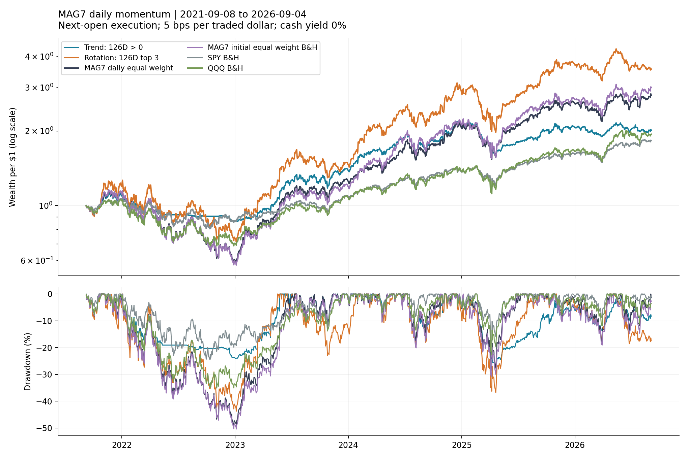
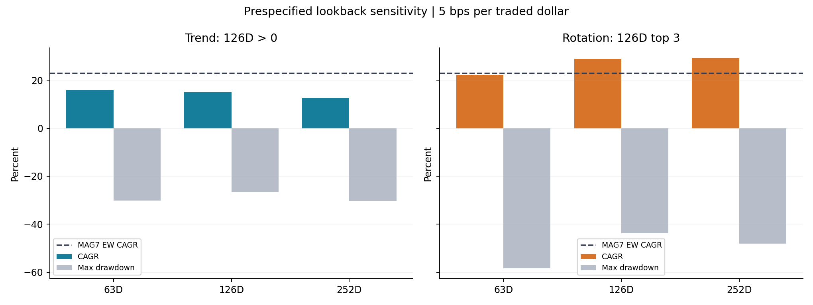
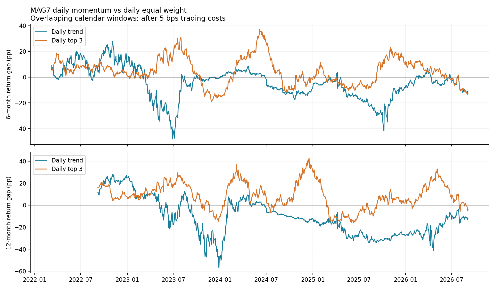
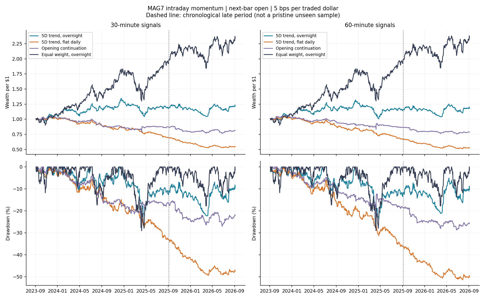
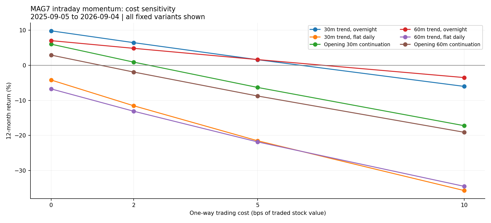

+++
title = "MAG7 策略综合研究：五年日线、近期稳定性与日内可行性（2026-09-08）"
date = "2026-09-08"
data_as_of = "2026-09-04"
draft = false
description = "整合MAG7五年日线动量、近期稳定性与日内实验，比较收益、风险、成本和执行限制。"
series = ""
categories = ["研究方法", "市场结构"]
tags = ["MAG7", "动量", "回测", "交易成本"]
featured = false
private = false
content_preservation = "verbatim"
source_sha256 = "98ed878b20ba539359ea2a34cd28fbff10a046d704dd5e8625f762ce8c5f9b52"
+++

# MAG7 策略综合研究：五年日线、近期稳定性与日内可行性（2026-09-08）

报告日期：2026-09-08｜行情截止：2026-09-04 美东收盘｜美元计价｜固定当前七只股票｜研究完成，实盘执行未验证。

本文整合五年日线回测与近期／日内扩展研究，统一回答三个问题：动量带来了多少收益与风险变化；最近半年、一年是否提示适应性恶化；提高频率能否改善策略。所有实证结果沿用已冻结的输入、参数和已验证结果；本次没有新增回测或根据结果调参。原两份报告及其数据保持原样。

## 1. 策略判断：先管理暴露，再要求主动规则证明价值

**我的建议是：如果基本面、估值和投资期限已经支持持有 MAG7，就以简单、低换手的持有方案作为比较起点；把日线趋势视为需要进一步验证的风险控制工具，把 Top 3 轮动保留为研究候选，暂不部署本轮测试的日内规则。** 五年成绩最好的规则，不一定最适合当前阶段，也不一定提供可重复的超额收益。

| 方向 | 已有证据 | 当前建议 | 尚未解决的问题 |
| --- | --- | --- | --- |
| 简单持有 MAG7 | 初始等权持有五年 CAGR 24.65%，但最大回撤 -50.40% | 已有长期持有理由时，作为主动策略必须比较的基准 | 不是当前买入结论；估值、持仓集中和个人风险承受能力未研究 |
| 日线六个月趋势 | CAGR 15.07%，最大回撤 -26.64%，平均股票暴露 65.17% | 优先研究其降低风险的作用，不能预设提高收益 | 需要与低股票仓位、相同风险预算的简单组合比较 |
| 日线六个月 Top 3 | CAGR 28.90%，最大回撤 -43.74%；近半年落后等权 12.68 个百分点 | 不作为全部 MAG7 仓位的自动轮动规则；暂留研究观察 | 集中、参数敏感、近期相对疲弱，超额收益区间跨 0 |
| 本轮六条 30/60 分钟规则 | 末年没有确认相对匹配基准的稳定优势，多条净亏损 | 暂不部署，不以提高频率补救日线近期落后 | 规则本身、成本和持仓时段均约束收益 |
| 一分钟数据 | 只完成最近 20 日成交延迟敏感性 | 用于执行诊断，不据此产生新的交易信号 | 未验证报价、实际滑点、冲击和成交概率 |

以上是基于本研究的策略层面判断，不是股票买入排名。尤其不能根据 NVDA 历史收益最高就推出现在应超配，也不能因 META、TSLA 的单股趋势历史优于持有，就为它们单独挑选事后最优策略。

## 2. 研究口径：分清信号周期、交易频率与评估窗口

| 研究层次 | 信号 | 交易与估值 | 评估区间 | 能回答的问题 |
| --- | --- | --- | --- | --- |
| 五年日线主研究 | 126 个交易日动量；63/252 日敏感性 | 收盘计算，次日开盘交易，日收盘估值 | 2021-09-08—2026-09-04，1,254 日 | 长期收益、回撤、成本和阶段依赖 |
| 日线近期诊断 | 沿用原 126 日信号 | 沿用连续净值，不重新建仓 | 近 12 月 252 日；近 6 月 128 日 | 当前表现相对历史处于什么位置 |
| 30/60 分钟实验 | 五交易日同一时点趋势，或开盘方向 | 完整 bar 后下一 bar 开盘交易 | 2023-09-05—2026-09-04，754 日 | 六条明确规则的净收益与执行约束 |
| 一分钟检查 | 沿用粗粒度信号 | 成交时点延后 0/1/5 分钟 | 2026-08-10—2026-09-04，20 日 | 对成交时点是否敏感 |

近一年统一为 2025-09-05—2026-09-04；近半年为 2026-03-05—2026-09-04。日线预热从 2020-08-24 起，日内预热从 2023-08-14 起，均不计入评估收益。数据截止沿用原研究冻结时点，不代表此后行情已更新。

**这不是只改变频率的对照实验。** 日线回看六个月，日内回看五日或开盘方向；评估区间也不同。当日清仓还主动放弃尾盘半小时和隔夜。故不能断言“频率提高导致策略失效”，只能判断本轮具体规则没有提供足够的执行依据。

统一股票池为 AAPL、MSFT、NVDA、AMZN、META、GOOGL、TSLA，只做多、无杠杆。日线时间序列动量（TSM）在每股 `C[t]/C[t-126]-1 > 0` 时持有 1/7，否则该份额留现金，不重新分配；横截面动量（CSM）持有同一指标排名前三名，各 1/3，不要求收益为正，全部下跌时仍满仓。信号包含最近一个月，不是跳过最近一个月的 12–1 momentum。

主表均计入按实际股票买卖金额单边 **5 bps** 的假设成本，买入、卖出分别计费，费用从资产中扣除后确定仓位。现金收益 0%，不计税、市场冲击和容量；基准也计费。价格经拆股与分红调整，收益为总回报代理，非实际股息到账与税后再投资账本。CAGR、波动按每年 252 日计算；Sharpe(0%) 为日收益均值／标准差 × √252，**未扣除真实历史无风险利率**。区间收益不年化，回撤包含区间初始本金，期末盯市不强制平仓。

## 3. 五年结果：趋势降低了风险，Top 3 增加了收益与集中度

| 策略 | 累计净收益 | CAGR | 年化波动 | 最大回撤 | Sharpe(0%) | Calmar | 平均股票暴露 |
| --- | --- | --- | --- | --- | --- | --- | --- |
| 时间序列动量 | 101.05% | 15.07% | 18.50% | -26.64% | 0.85 | 0.57 | 65.17% |
| 横截面 Top 3 动量 | 253.73% | 28.90% | 34.25% | -43.74% | 0.91 | 0.66 | 100.00% |
| MAG7 每日等权 | 178.04% | 22.81% | 30.17% | -49.35% | 0.83 | 0.46 | 100.00% |
| MAG7 初始等权买入持有 | 199.38% | 24.65% | 32.15% | -50.40% | 0.85 | 0.49 | 100.00% |
| SPY 买入持有 | 82.67% | 12.87% | 17.21% | -24.50% | 0.79 | 0.53 | 100.00% |
| QQQ 买入持有 | 93.87% | 14.23% | 22.99% | -35.12% | 0.69 | 0.41 | 100.00% |

趋势策略相对每日等权少赚约 7.75 个百分点 CAGR，同时最大回撤绝对幅度减少 22.71 个百分点；平均股票仓位仅 65.17%。这支持“该模型历史上较为防守”，但不能把全部风险改善归功于择时：持有更多现金本身就改变风险。

Top 3 相对每日等权多赚约 6.09 个百分点 CAGR，但波动达到 34.25%、最大回撤仍为 -43.74%。满仓三股各 1/3 是集中下注，不是保护性退出机制。买入持有允许赢家权重漂移，其较高收益也伴随集中度变化，不能直接认定这种权重漂移未来仍有利。

21 日成块、2,000 次配对 bootstrap 下，趋势相对等权的 CAGR 差 95% 区间为 **[-28.41, +11.32]** 个百分点，Top 3 为 **[-7.14, +25.86]**。两者均跨 0，未确认稳定超额收益。区间只是固定样本的探索性估计，不校正事后股票池、多重参数试验或结构变化。

### 3.1 结果有明显阶段依赖

| year | 时间序列动量 | 横截面 Top 3 动量 | MAG7 每日等权 | MAG7 初始等权买入持有 | SPY 买入持有 | QQQ 买入持有 |
| --- | --- | --- | --- | --- | --- | --- |
| 2021 | 9.27% | 19.14% | 11.21% | 11.24% | 5.99% | 4.36% |
| 2022 | -20.83% | -37.51% | -45.55% | -46.28% | -18.18% | -32.58% |
| 2023 | 62.11% | 99.15% | 109.37% | 102.38% | 26.18% | 54.86% |
| 2024 | 49.36% | 93.44% | 61.63% | 74.14% | 24.89% | 25.58% |
| 2025 | -1.45% | 29.19% | 26.33% | 27.23% | 17.72% | 20.77% |
| 2026 | -2.60% | -4.53% | 7.39% | 11.73% | 13.54% | 17.31% |

2021、2026 为部分年度。2022 年趋势下跌 20.83%，小于等权的 45.55%；2023 年反弹阶段却明显落后等权。2025 年趋势为负，2026 年截至研究截止日两条动量规则均为负，等权、SPY 和 QQQ 为正。对这一固定样本，防守与错过上涨同时存在。

| 策略 | 时间段 | CAGR | 段内最大回撤 | Sharpe(0%) |
| --- | --- | --- | --- | --- |
| 时间序列动量 | first_3y | 18.14% | -24.12% | 0.97 |
| 时间序列动量 | last_2y | 10.59% | -26.64% | 0.66 |
| 横截面 Top 3 动量 | first_3y | 28.00% | -43.74% | 0.86 |
| 横截面 Top 3 动量 | last_2y | 30.27% | -36.78% | 1.01 |
| MAG7 每日等权 | first_3y | 16.52% | -49.35% | 0.64 |
| MAG7 每日等权 | last_2y | 32.95% | -28.85% | 1.19 |
| MAG7 初始等权买入持有 | first_3y | 18.21% | -50.40% | 0.67 |
| MAG7 初始等权买入持有 | last_2y | 35.04% | -30.84% | 1.15 |
| SPY 买入持有 | first_3y | 7.80% | -24.50% | 0.51 |
| SPY 买入持有 | last_2y | 20.97% | -18.76% | 1.23 |
| QQQ 买入持有 | first_3y | 6.20% | -35.12% | 0.37 |
| QQQ 买入持有 | last_2y | 27.49% | -22.77% | 1.22 |

`first_3y` 截至 2024-09-06，`last_2y` 从 2024-09-09 起，持仓连续。Top 3 后两年 CAGR 30.27%，仍高于自己的前段，却低于同期等权 32.95%。**策略是否赚钱，与是否值得替代简单持有，是两个不同判断。** 此切分只作阶段诊断，不称真正样本外。

### 3.2 参数与成本不容忽略

| 策略 | 窗口交易日 | CAGR | 最大回撤 | Sharpe(0%) | 年买卖总金额/NAV |
| --- | --- | --- | --- | --- | --- |
| 时间序列动量 | 63 | 15.89% | -30.09% | 0.93 | 15.34 |
| 时间序列动量 | 126 | 15.07% | -26.64% | 0.85 | 9.94 |
| 时间序列动量 | 252 | 12.58% | -30.31% | 0.66 | 8.21 |
| tsm_cash3pct | 126 | 16.27% | -26.44% | 0.91 | 9.94 |
| 横截面 Top 3 动量 | 63 | 22.13% | -58.36% | 0.76 | 34.94 |
| 横截面 Top 3 动量 | 126 | 28.90% | -43.74% | 0.91 | 26.97 |
| 横截面 Top 3 动量 | 252 | 29.20% | -48.00% | 0.91 | 19.83 |
| csm_cash3pct | 126 | 28.90% | -43.74% | 0.91 | 26.97 |

63/126/252 日在原研究中预先固定，不能按本表选最高收益窗口。Top 3 改成 63 日后最大回撤达 -58.36%，说明风险对设定敏感。`cash3pct` 仅假设现金按固定 3% 年化计息，不是实际历史利息；Sharpe 仍以 0% 为比较基准。

| 策略 | 单边成本 bps | CAGR | 累计收益 |
| --- | --- | --- | --- |
| 时间序列动量 | 0 | 15.64% | 106.08% |
| 时间序列动量 | 5 | 15.07% | 101.05% |
| 时间序列动量 | 10 | 14.50% | 96.14% |
| 时间序列动量 | 25 | 12.80% | 82.12% |
| 横截面 Top 3 动量 | 0 | 30.65% | 278.28% |
| 横截面 Top 3 动量 | 5 | 28.90% | 253.73% |
| 横截面 Top 3 动量 | 10 | 27.17% | 230.77% |
| 横截面 Top 3 动量 | 25 | 22.13% | 170.43% |

日线 Top 3 年买卖总额约为净资产的 26.97 倍。单边成本从 5 bps 升至 25 bps 后 CAGR 从 28.90% 降至 22.13%；这显示成本侵蚀，但不能把该值直接和另一成本情景的基准当作严格净超额比较。0 bps 为毛收益；其余成本均为假设情景，并非实测。

## 4. 最近半年、一年：日线仍可研究，独立行情样本不足

| 原日线策略 | 近12个月净收益 | 12个月段内回撤 | 近6个月净收益 | 6个月段内回撤 |
| --- | --- | --- | --- | --- |
| 日线六个月趋势 | 6.38% | -11.47% | 2.35% | -8.30% |
| 日线六个月 Top 3 | 14.15% | -18.57% | 0.55% | -18.57% |
| MAG7 日线每日等权 | 18.26% | -17.70% | 13.22% | -13.60% |
| SPY 持有 | 19.97% | -8.88% | 13.01% | -7.51% |
| QQQ 持有 | 25.59% | -11.96% | 18.00% | -11.22% |

这些窗口从原连续净值截取，保留此前形成的持仓和期间交易成本；半年收益未年化。日线 Top 3 最近半年仅赚 0.55%，等权赚 13.22%，落后约 12.68 个百分点（以未四舍五入数据计算）。趋势最近半年回撤较浅，但收益也明显低于等权。

| 策略 | 月数 | 可比历史窗口数 | 历史收益中位数 | 最近收益百分位 | 最近相对等权差/pp | 相对收益百分位 |
| --- | --- | --- | --- | --- | --- | --- |
| 日线六个月趋势 | 6 | 1002 | 10.29% | 36.63% | -10.87 | 29.34% |
| 日线六个月趋势 | 12 | 751 | 34.86% | 33.69% | -11.88 | 41.68% |
| 日线六个月 Top 3 | 6 | 1002 | 17.76% | 33.93% | -12.68 | 4.29% |
| 日线六个月 Top 3 | 12 | 751 | 53.33% | 28.10% | -4.11 | 19.71% |

最新窗口只与结束日在其开始之前的历史窗口比较，减少最新行情进入参照的重复。历史窗口彼此仍重叠：1,002 个半年窗口不等于 1,002 次独立试验。Top 3 半年相对收益位于第 4.29 百分位，属于较弱的一端；绝对收益位于第 33.93 百分位。因此问题主要是相对持有机会成本，而不只是有没有亏钱。

**126 或 252 个日收益观测并非少到无法回测；不足的是用于证明可重复优势的独立市场情境。** 六个月信号缓慢变化，连续持仓和重叠窗口都不能视为全新的独立决策；七只相关股票也不是七个完全独立市场。把同一年的路径切成更多分钟，只增加观测密度，不自动增加经济周期和有效独立样本。

我会将近 6/12 月用于诊断回撤、相对收益与成本是否偏离预期，同时保留长期证据。第 4.29 百分位不是失效概率，也不意味着即将反转。不能因最近半年差就断言永久失效，也不应因五年结果好而忽略近期落后；此时反复改窗口会进一步消耗未见样本。

## 5. 日内实验：成本和可持仓时段决定了规则是否还有价值

五日趋势比较完整 bar 收盘与五交易日前同一时点收盘，上涨则下一 bar 开盘持有该股 1/7，否则现金。五日前提前收盘而缺少同一时点时，延续最近有效信号。开盘方向规则比较当天开盘至前 30/60 分钟收盘，上涨则下一 bar 开盘入场，其后不反复择时；信号不包括隔夜涨跌。

隔夜变体允许过夜；当日清仓固定在最后半小时开始时卖出，即正常日 15:30、提前收盘日 12:30 美东时间。60 分钟由同一份 30 分钟数据聚合，以 09:30 为起点，最后 30 分钟为短尾，不生成完整小时趋势信号。全部六条规则均展示，未筛选赢家；本轮没有测试小时 Top 3 轮动。

| 日内策略 | 三年 CAGR | 近12个月净收益 | 近6个月净收益 | 12个月年化波动 | 12个月日收盘回撤 | Sharpe(0%) | 平均常规时段股票暴露 |
| --- | --- | --- | --- | --- | --- | --- | --- |
| 30分钟五日趋势／隔夜 | 6.85% | 1.60% | 11.34% | 13.13% | -16.56% | 0.19 | 52.09% |
| 30分钟五日趋势／日内清仓 | -18.26% | -21.54% | -1.33% | 9.78% | -24.59% | -2.43 | 48.08% |
| 开盘30分钟方向／日内清仓 | -6.57% | -6.31% | 0.11% | 8.87% | -13.79% | -0.69 | 41.54% |
| 60分钟五日趋势／隔夜 | 5.83% | 1.64% | 9.39% | 13.16% | -14.96% | 0.19 | 51.93% |
| 60分钟五日趋势／日内清仓 | -19.32% | -21.86% | -3.25% | 9.90% | -24.00% | -2.44 | 47.92% |
| 开盘60分钟方向／日内清仓 | -7.65% | -8.75% | -1.05% | 7.34% | -12.77% | -1.21 | 36.68% |

30/60 分钟隔夜趋势末年净收益约 1.6%，同期各自匹配的等权隔夜基准约 18%。它们近半年有改善，但不能跳过前半年后只展示改善区间。日内清仓五日趋势三年 CAGR 约 -18% 至 -19%，末年约亏 21% 至 22%；开盘方向规则末年净收益也为负。表中常规时段暴露按持仓时长加权，未纳入额外隔夜时长，不能直接当成日线平均仓位的同口径替代指标。

### 5.1 高频下，小成本会反复累积

下表均为最近 12 个月：

| 策略 | 0 bps 毛收益 | 2 bps 净收益 | 5 bps 净收益 | 10 bps 净收益 | 年股票买卖总额/NAV |
| --- | --- | --- | --- | --- | --- |
| 30分钟五日趋势／隔夜 | 9.84% | 6.47% | 1.60% | -6.02% | 155.9× |
| 30分钟五日趋势／日内清仓 | -4.19% | -11.54% | -21.54% | -35.74% | 399.5× |
| 开盘30分钟方向／日内清仓 | 6.04% | 0.91% | -6.31% | -17.23% | 247.7× |
| 60分钟五日趋势／隔夜 | 7.05% | 4.85% | 1.64% | -3.49% | 103.7× |
| 60分钟五日趋势／日内清仓 | -6.73% | -13.10% | -21.86% | -34.53% | 354.0× |
| 开盘60分钟方向／日内清仓 | 2.92% | -1.92% | -8.75% | -19.11% | 240.8× |

换手为买入与卖出金额之和／NAV，一次满仓买入再卖出约为 2 倍。即使单笔成本很小，每年约 104—400 倍的股票交易总额仍会累积显著摩擦。开盘方向零成本下为正、5 bps 后为负；每日清仓的五日趋势零成本下已为负，故不能把失败全部解释为手续费。

### 5.2 少亏不等于产生了择时优势

| 策略 | 前两年 CAGR | 末一年净收益 | 同交易时段持股基准 | 末年 CAGR 差/pp | 95%成块区间/pp |
| --- | --- | --- | --- | --- | --- |
| 30分钟五日趋势／隔夜 | 9.58% | 1.60% | 17.81% | -16.20 | [-38.71, +7.10] |
| 30分钟五日趋势／日内清仓 | -16.56% | -21.54% | -23.12% | +1.58 | [-15.85, +15.55] |
| 开盘30分钟方向／日内清仓 | -6.70% | -6.31% | -19.21% | +12.89 | [-1.37, +20.49] |
| 60分钟五日趋势／隔夜 | 8.00% | 1.64% | 17.98% | -16.34 | [-37.71, +6.35] |
| 60分钟五日趋势／日内清仓 | -18.02% | -21.86% | -23.00% | +1.14 | [-15.41, +14.92] |
| 开盘60分钟方向／日内清仓 | -7.09% | -8.75% | -19.39% | +10.64 | [-2.95, +20.01] |

前段为 2023-09-05—2025-09-04 的 502 日；末段为 2025-09-05—2026-09-04 的 252 日。基准匹配再平衡或入场等待及清仓时刻，也支付相同单边成本，但没有匹配策略的平均股票暴露。相对满仓日内基准少亏，可能来自更多现金和更少交易，不能直接解释为 alpha。

区间按末年日收益配对 moving-block bootstrap，21 日一块，2,000 次，随机种子 20260908；六个区间均跨 0，未作多重检验校正。末一年是时间保留段，但此前已经看过近年日线表现，不能宣称完全未见或真正前瞻验证。本轮支持的判断是**这些固定规则暂不部署**，不外推为所有小时／分钟动量均不可行。

## 6. 分钟数据适合先回答执行问题

最近 20 日的检查保留原粗粒度信号，只把成交移至预定时点、延后 1 分钟或 5 分钟的一分钟开盘价。每个 20 日模拟从现金开始，信号预热沿用长历史，故不等同于三年连续净值的最后 20 日。

| 策略 | 按下一bar开盘 | 延后1分钟 | 延后5分钟 | 1分钟延迟收益差/pp |
| --- | --- | --- | --- | --- |
| 30分钟五日趋势／隔夜 | 0.71% | 0.15% | 0.73% | -0.57 |
| 30分钟五日趋势／日内清仓 | -0.50% | -1.22% | 0.25% | -0.72 |
| 开盘30分钟方向／日内清仓 | 0.84% | 0.57% | 0.77% | -0.27 |
| 60分钟五日趋势／隔夜 | 0.07% | -0.19% | -0.01% | -0.26 |
| 60分钟五日趋势／日内清仓 | -1.12% | -1.53% | -0.47% | -0.41 |
| 开盘60分钟方向／日内清仓 | -0.14% | -0.29% | 0.34% | -0.15 |

对应开盘时刻的一分钟和粗粒度价格一致。延迟有时改善、有时恶化结果，不能据这 20 日挑最佳延迟。该实验不是实测滑点：没有 bid/ask、订单排队、冲击、成交概率和延迟尾部。即使信号只用已完成 bar，紧邻的下一 bar 开盘仍是理想化成交代理，未证明计算与发单后能够拿到该价格。执行状态保留 **execution_unverified**。

## 7. 对 MAG7 股票的具体策略建议

### 7.1 已决定长期持有时，先确定总暴露和单股集中度

本研究没有回答当前估值是否合理，也没有给出七只股票的未来回报排序。因此，低换手持有只能作为已具备投资理由时的起点。五年持有 MAG7 最大回撤约 50%，不能把过去高 CAGR 当成低风险的长期收益承诺。

持仓约束应以全账户为单位：检查直接股票与基金中的重复持仓，以及上涨后权重漂移。FINRA 特别指出，相关资产、赢家权重增长和基金／个股重叠都可能造成集中风险；持有多个代码不等于完成分散。[FINRA：集中风险](https://www.finra.org/investors/insights/concentration-risk) 仓位还应服从用钱期限与承受损失的能力，而不是从回测最优收益反推。[Investor.gov：资产配置](https://www.investor.gov/introduction-investing/getting-started/asset-allocation)

本研究未获取个人账户、资金用途和损失预算，因此不指定核心仓位或战术仓位百分比。历史最大回撤只是一个压力参照，既不是未来上限，也不是止损能够保证的成交损失。

### 7.2 若主要目标是少回撤，优先验证日线趋势是否值得复杂化

日线趋势比日内规则更值得下一步研究，但应把检验问题设为：**在相同事前风险预算下，动态趋势相对简单降低股票仓位，是否改善下行风险、恢复时间和净收益？** 现有回撤改善混合了择时与现金效果，尚不能分离。

可比较固定股票／现金配置、原趋势规则及一个事前明确的低换手版本。不能将全样本平均仓位 65.17% 当成历史时点已知的最佳固定权重；风险匹配参数必须只从先前数据或外部风险预算确定。周／月执行、调仓缓冲和波动控制均属于**尚未测试的新方案**，并不因为听起来合理就已有效。

### 7.3 若目标是跑赢持有，Top 3 需要更高的证据门槛

我不建议依据五年 28.90% CAGR，把全部 MAG7 暴露交给当前 Top 3 自动轮动。它同时面临个股 1/3 集中、持续满仓、成本、参数敏感与近期相对落后。若继续，应保持原规则作研究记录，并用今后未见数据验证；需要的证据是扣成本、匹配风险后的增量价值，而非另找一个近期表现好的窗口。

这也不意味着应根据当前低百分位反向买入或加倍仓位：研究没有测试相对表现触底后的收益预测能力。取消或调整真实仓位还涉及个人税费与持仓计划，本报告未评估这些条件。

### 7.4 对个股保持同一标准，避免事后分配最优策略

| 股票 | 趋势 CAGR | 持有 CAGR | 趋势回撤 | 持有回撤 | 趋势 Sharpe(0%) | 持有 Sharpe(0%) | 趋势暴露 |
| --- | --- | --- | --- | --- | --- | --- | --- |
| AAPL | 2.38% | 15.95% | -39.77% | -33.36% | 0.22 | 0.67 | 70.41% |
| MSFT | 7.23% | 11.72% | -24.55% | -37.15% | 0.49 | 0.53 | 60.21% |
| NVDA | 44.43% | 59.66% | -52.25% | -66.34% | 1.06 | 1.16 | 79.19% |
| AMZN | -2.27% | 8.07% | -44.04% | -55.73% | 0.02 | 0.39 | 60.93% |
| META | 16.49% | 10.40% | -36.73% | -76.62% | 0.70 | 0.45 | 59.57% |
| GOOGL | 7.59% | 18.93% | -32.12% | -44.32% | 0.42 | 0.70 | 70.26% |
| TSLA | 12.29% | 6.90% | -63.20% | -73.63% | 0.48 | 0.41 | 55.66% |

单股趋势是 100% 持股／100% 现金，用于路径比较，不是组合每股 1/7 仓位的收益贡献。趋势相对持有并未一致改善：AAPL 的 CAGR 更低且最大回撤更深；META、TSLA 有相反的历史收益比较，但 TSLA 趋势最大回撤仍达 63.20%。这些异质性反对“对 MAG7 每只股票统一套用动量即可获益”，也不足以支持现在挑出历史受益股单独部署。

## 8. 风险补充：收盘回撤不足以代表全部风险

五年日线尾部与换手：

| 策略 | 最差单日 | 最差 5% 日均收益 | Sortino(0%) | 最长水下交易日 | 年买卖总金额/NAV |
| --- | --- | --- | --- | --- | --- |
| 时间序列动量 | -5.59% | -2.80% | 1.21 | 424 | 9.94 |
| 横截面 Top 3 动量 | -7.80% | -4.48% | 1.39 | 344 | 26.97 |
| MAG7 每日等权 | -7.14% | -4.25% | 1.22 | 410 | 3.37 |
| MAG7 初始等权买入持有 | -7.31% | -4.50% | 1.24 | 413 | 0.20 |
| SPY 买入持有 | -5.85% | -2.47% | 1.15 | 488 | 0.20 |
| QQQ 买入持有 | -6.21% | -3.25% | 1.00 | 493 | 0.20 |

最差 5% 日均收益是样本尾部均值；水下期是未回到此前净值高点的连续交易日。Calmar 为 CAGR／最大回撤绝对值。所有这些数值都不是未来损失上限，日线 OHLC 不能还原组合最深盘中回撤。

日内末一年补充风险：

| 策略 | 末年日收盘回撤 | 末年bar末回撤 | 最差交易日 | 最差5%交易日平均收益 |
| --- | --- | --- | --- | --- |
| 30分钟五日趋势／隔夜 | -16.56% | -17.52% | -2.88% | -1.71% |
| 30分钟五日趋势／日内清仓 | -24.59% | -25.06% | -2.48% | -1.49% |
| 开盘30分钟方向／日内清仓 | -13.79% | -14.03% | -3.54% | -1.47% |
| 60分钟五日趋势／隔夜 | -14.96% | -15.65% | -2.97% | -1.77% |
| 60分钟五日趋势／日内清仓 | -24.00% | -24.00% | -2.40% | -1.59% |
| 开盘60分钟方向／日内清仓 | -12.77% | -12.85% | -3.50% | -1.22% |

bar 末回撤使用 30/60 分钟估值点，可能比每日收盘更深，仍不是逐笔路径最大回撤。平掉隔夜风险同时会改变收益来源，不能默认每日清仓必然形成更好的风险收益组合。

本文所载观点与意见仅代表作者个人立场，仅供一般性的信息与教育参考之用，不构成任何形式的投资建议、理财建议、交易建议或买卖证券的推荐。读者不应将本文的任何内容视为购买或出售任何金融工具的邀请或要约。
