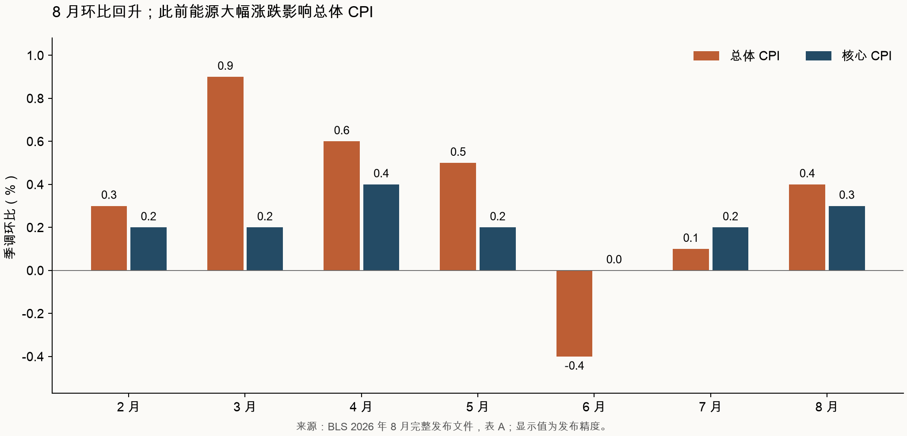
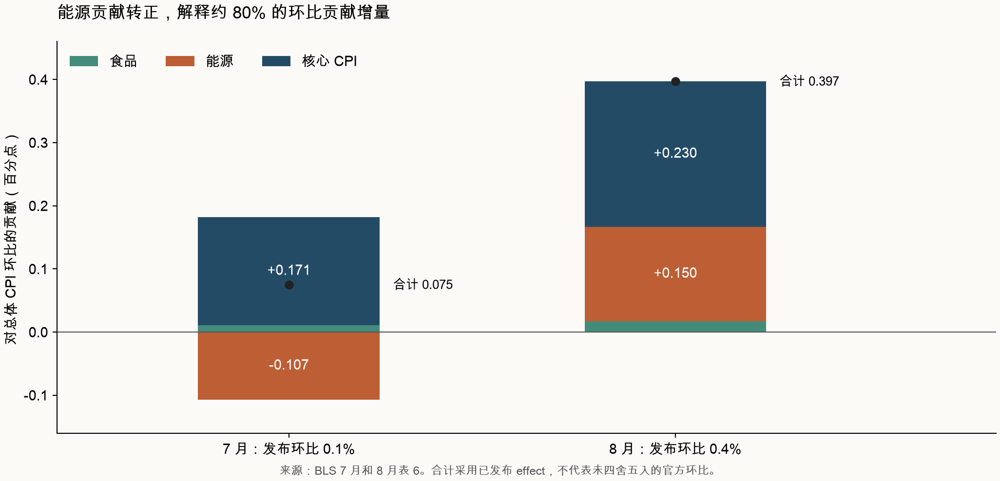
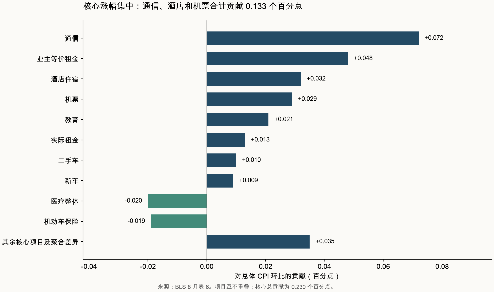

+++
title = "美国2026年8月CPI分析报告：能源反弹与通信跳升，住房内部仍在降温"
date = "2026-09-11"
data_as_of = "2026-09-11"
draft = false
description = "分析美国2026年8月CPI的能源、住房、通信与核心通胀结构，并比较7月读数及短期动量。"
series = ""
categories = ["宏观与政策"]
tags = ["美国", "CPI", "通胀", "美联储"]
featured = false
private = false
content_preservation = "verbatim"
source_sha256 = "71b545fc3ad07600f454c11edf24bd7074e722d8e3ee8f3f7247e1e90a73bfe6"
+++



# 美国2026年8月CPI分析报告：能源反弹与通信跳升，住房内部仍在降温

**数据期：2026 年 8 月｜发布日期：2026 年 9 月 11 日｜发布编号：USDL-26-1496**  
**发布时间：美国东部夏令时 08:30，北京／新加坡时间 20:30｜比较期：2026 年 7 月**

## 核心判断

**8 月美国通胀的实质是：总体价格短期回升，核心通胀动量边际转暖，但涨幅集中在能源、通信和旅行相关价格；实际租金、业主等价租金及核心商品整体仍相对温和。** 这份数据增加了继续观察通胀持续性的必要性，尚不足以确立全面、持续的再通胀。

有五点决定本期应如何理解：

1. **总体环比从 0.1% 升至 0.4%，主要来自能源贡献反转。** 能源对总体环比的贡献从 −0.107 升至 +0.150 个百分点；按已发布贡献值合计计算，约解释本月相对上月增量的 80%。
2. **核心环比从 0.2% 升至 0.3%，确有升温，但集中度很高。** 通信、酒店住宿和机票对总体 CPI 的贡献合计为 +0.133 个百分点，约相当于核心总贡献 +0.230 个百分点的 58%。通信内部，无线电话服务环比达到 5.9%。
3. **住房总项加快，不能直接解释为租金重新加速。** Shelter 环比从 0.1% 升至 0.3%，实际租金和 OER 却均从 0.3% 降至 0.2%；酒店住宿从 −2.8% 反弹至 +2.4%，解释了住房贡献的净增加。
4. **核心同比从 2.5% 降至 2.4%，实际下降幅度比标题显示的小。** 按公开指数点位复算，核心同比约为 2.478%→2.446%，下降约 0.032 个百分点。与此同时，剔除食品、住房和能源的指数同比从 1.9% 升至 2.0%，说明缓解并不均匀。
5. **单月偏热与中期仍较温和可以同时成立。** 用已公布的月度涨幅复利估算，核心近三个月年化约 2.0%，六个月约 2.6%；两者较截至 7 月的约 1.6%、2.4%有所上升，但均低于把单月 0.3%机械延续所得的约 3.7%。这些年化值是近似描述，不是预测。

以上事实、贡献值及计算基础来自 BLS [8 月完整发布文件](https://www.bls.gov/news.release/cpi.htm)的正文、表 A、表 1–3、表 6–7，与[7 月历史完整文件](https://www.bls.gov/news.release/archives/cpi_08122026.htm)逐项对照。

## 1. 资料范围与口径

除标记 **†** 的分项外，环比采用季节调整后数据（SA）；† 表示 BLS 原表明确注明未季调（NSA），不能因为该列位于“季调变化”标题之下就忽略脚注。同比统一采用 NSA。**pp 为百分点**；权重均为 2026 年 7 月相对重要性，占总体 CPI 的比例。贡献值直接使用官方表 6、7 的 effect，不以权重乘一位小数涨幅替代。

报告不纳入未经核验的市场调查预期和发布后价格反应。因此，“升温”“降温”均针对历史数据和结构而言，不代表“超预期”或“低于预期”。

## 2. 总体读数与八大消费类别

| 分项 | 权重 % | 7 月环比 % | 8 月环比 % | 环比变化 pp | 7 月同比 % | 8 月同比 % |
| --- | --- | --- | --- | --- | --- | --- |
| 总体 CPI | 100.000 | 0.1 | 0.4 | +0.3 | 3.4 | 3.4 |
| 核心 CPI | 79.114 | 0.2 | 0.3 | +0.1 | 2.5 | 2.4 |
| 食品 | 13.540 | 0.1 | 0.1 | +0.0 | 3.0 | 2.7 |
| 能源 | 7.347 | -1.5 | 2.1 | +3.6 | 14.7 | 16.3 |
| 核心商品 | 18.842 | 0.2 | 0.1 | -0.1 | 0.8 | 0.7 |
| 核心服务（剔除能源服务） | 60.272 | 0.2 | 0.3 | +0.1 | 3.0 | 3.0 |
| 住房服务（Shelter） | 35.343 | 0.1 | 0.3 | +0.2 | 3.2 | 3.0 |

总体 CPI 同比维持在 3.4%，核心同比降至 2.4%，能源同比则升至 16.3%。这三个数字的组合，说明能源仍显著推高居民看到的总体通胀，而非能源部分的涨幅相对较低。核心商品同比只有 0.7%，核心服务同比为 3.0%，两者仍存在明显差距。[BLS 表 1](https://www.bls.gov/news.release/cpi.t01.htm)

按 BLS 八大消费类别观察，可进一步看清价格变化的分布：

| 分项 | 权重 % | 7 月环比 % | 8 月环比 % | 环比变化 pp | 7 月同比 % | 8 月同比 % |
| --- | --- | --- | --- | --- | --- | --- |
| 食品及饮料 | 14.364 | 0.1 | 0.1 | +0.0 | 2.9 | 2.6 |
| 住房大类（Housing） | 44.198 | 0.1 | 0.2 | +0.1 | 3.3 | 3.1 |
| 服装 | 2.406 | 0.1 | 0.0 | -0.1 | 3.9 | 3.6 |
| 交通运输大类 | 17.060 | -0.5 | 1.2 | +1.7 | 5.8 | 6.2 |
| 医疗整体 | 8.267 | 0.4 | -0.2 | -0.6 | 1.7 | 1.6 |
| 娱乐 | 5.081 | 0.2 | 0.0 | -0.2 | 2.6 | 2.7 |
| 教育及通信 | 5.716 | 0.6 | 1.6 | +1.0 | 0.5 | 2.1 |
| 其他商品及服务 | 2.907 | 0.1 | 0.2 | +0.1 | 4.3 | 4.2 |

八大类中，**4 类环比加快、3 类放缓、1 类持平**。交通运输、教育通信的加速最突出；医疗由涨转跌，服装和娱乐趋平。因此，“本月多个大类上涨”与“各类价格普遍加速”应分别检验。本表只作粗分类观察，不是经过固定权重设计的通胀扩散指数。

这里的 **Housing 权重 44.198%，Shelter 权重 35.343%**。Housing 还包括家庭能源、其他公用事业及家居用品等；Shelter 主要是居住服务。食品、能源、核心商品、核心服务的分析框架，与八大消费类别属于不同切分方式，不可把两张表中的权重重复相加。表 2 也同时包含父级和子级，逐行相加会重复计算。[BLS 完整文件，表 1–3](https://www.bls.gov/news.release/cpi.htm)

## 3. 与上月相比：谁让总体环比从0.1%升至0.4%

### 3.1 环比贡献桥

| 分项 | 7 月贡献 pp | 8 月贡献 pp | 贡献变化 pp |
| --- | --- | --- | --- |
| 食品 | +0.011 | +0.017 | +0.006 |
| 能源 | -0.107 | +0.150 | +0.257 |
| 核心 CPI | +0.171 | +0.230 | +0.059 |

按三大互斥部分的已发布 effect 合计，7 月约为 **0.075** 个百分点，8 月约为 **0.397** 个百分点，增量约 **0.322** 个百分点。这与最终环比分别显示为 0.1%、0.4%一致，但 effect 合计不应当作未四舍五入的官方总体环比。

能源贡献增加 **0.257** 个百分点，约占 0.322 的 **79.8%**；核心贡献增加 **0.059** 个百分点，食品贡献增加 **0.006** 个百分点。**总体升温首先是此前能源拖累消失并转为推动，同时核心部分也有较小的正向变化。**[BLS 8 月表 6](https://www.bls.gov/news.release/cpi.t06.htm)、[7 月历史文件，表 6](https://www.bls.gov/news.release/archives/cpi_08122026.htm)

### 3.2 同比维持3.4%，不代表内部没有变化

| 分项 | 7 月贡献 pp | 8 月贡献 pp | 贡献变化 pp |
| --- | --- | --- | --- |
| 食品 | +0.405 | +0.364 | -0.041 |
| 能源 | +0.982 | +1.080 | +0.098 |
| 核心 CPI | +1.978 | +1.953 | -0.025 |
| 住房服务（Shelter） | +1.125 | +1.078 | -0.047 |

食品、能源、核心三项的同比贡献变化分别约为 **−0.041、+0.098、−0.025** 个百分点，净变化约 **+0.032** 个百分点，与指数点位复算的总体同比轻微上升一致。这里的 Shelter 是核心内部的子项，单列用于分析，不能再加进三大项合计。

8 月能源贡献约 **1.080** 个百分点，Shelter 贡献约 **1.078** 个百分点，两者合计约占总体 3.4%同比涨幅的 **64%**。总体同比的黏性仍与这两类关系密切。与此同时，核心服务同比贡献约从 1.822 变为 1.821 个百分点，基本持平；住房贡献有所下降，被其他核心服务部分抵消。核心同比的缓解没有均匀发生在所有服务行业。[BLS 完整文件，表 7](https://www.bls.gov/news.release/cpi.htm)

## 4. 能源：汽油主导反弹，家庭公用能源并未同步升温

| 分项 | 权重 % | 7 月环比 % | 8 月环比 % | 环比变化 pp | 7 月同比 % | 8 月同比 % |
| --- | --- | --- | --- | --- | --- | --- |
| 能源 | 7.347 | -1.5 | 2.1 | +3.6 | 14.7 | 16.3 |
| 能源商品 | 4.044 | -2.9 | 4.2 | +7.1 | 24.7 | 28.0 |
| 汽油 | 3.770 | -2.9 | 3.9 | +6.8 | 24.6 | 27.4 |
| 燃料油 | 0.107 | -1.7 | 10.1 | +11.8 | 39.1 | 52.0 |
| 能源服务 | 3.303 | 0.3 | -0.4 | -0.7 | 4.3 | 4.0 |
| 电力 | 2.551 | 0.1 | -0.2 | -0.3 | 4.2 | 3.8 |
| 管道天然气 | 0.752 | 0.7 | -1.1 | -1.8 | 4.3 | 4.4 |

**汽油是最重要的单项驱动。** 其权重为 3.770%，8 月季调环比上涨 3.9%，对总体环比贡献约 +0.140 个百分点，约占公布的 0.4%总体涨幅的 35%。相比 7 月的 −0.105 个百分点，汽油贡献改善约 +0.245 个百分点，解释了绝大部分能源贡献反转。

燃料油上涨 10.1%，同比达到 52.0%，视觉上非常醒目，但其权重只有 0.107%，当月贡献约 +0.011 个百分点。判断宏观影响时，涨幅和权重必须同时看。与之相对，电力环比 −0.2%、管道天然气 −1.1%，能源服务合计贡献约 −0.014 个百分点。因此，本月能源压力主要集中于燃料商品，并非所有家庭公用能源价格一起加速。[BLS 表 1](https://www.bls.gov/news.release/cpi.t01.htm)、[表 6](https://www.bls.gov/news.release/cpi.t06.htm)

从路径看，能源经历 3–5 月明显上涨、6–7 月回落、8 月反弹。8 月数据确认了本月价格冲击，但不能单独证明后续每个月都会重复上涨。经济传导上，持续的燃料上涨可能影响运输成本、居民可支配购买力和通胀预期；这是需要后续价格、成本和需求数据验证的机制。本文件无法区分原油供给、炼化利润、分销成本和其他因素各自的因果贡献。

能源应同时追踪两个问题：**价格水平能否回落，以及高价格会否逐步传导至更多商品和服务。** 即使未来环比趋零，本次已经发生的涨价仍可能在一段时间内支撑同比和居民支出压力。

## 5. 住房：酒店反弹抬高总项，实际租金和OER继续放缓

| 分项 | 权重 % | 7 月环比 % | 8 月环比 % | 环比变化 pp | 7 月同比 % | 8 月同比 % |
| --- | --- | --- | --- | --- | --- | --- |
| 住房服务（Shelter） | 35.343 | 0.1 | 0.3 | +0.2 | 3.2 | 3.0 |
| 实际租金 | 7.735 | 0.3 | 0.2 | -0.1 | 2.9 | 2.7 |
| 业主等价租金（OER） | 25.918 | 0.3 | 0.2 | -0.1 | 3.2 | 3.1 |
| 外宿／酒店住宿 | 1.402 | -2.8 | 2.4 | +5.2 | 3.0 | 3.2 |

住房内部的贡献桥尤其重要：

| 分项 | 7 月贡献 pp | 8 月贡献 pp | 贡献变化 pp |
| --- | --- | --- | --- |
| 实际租金 | +0.020 | +0.013 | -0.007 |
| 业主等价租金（OER） | +0.067 | +0.048 | -0.019 |
| 外宿／酒店住宿 | -0.038 | +0.032 | +0.070 |
| 住房服务（Shelter） | +0.049 | +0.093 | +0.044 |

酒店住宿贡献从 **−0.038** 变为 **+0.032** 个百分点，增量 **+0.070**；实际租金和 OER 的贡献合计从 **0.087** 降至 **0.061**，减少 **0.026**。两者抵消后，恰好对应 Shelter 贡献约 **+0.044** 个百分点的净增加，差额在发布精度内闭合。[BLS 两期完整文件，表 6：8 月](https://www.bls.gov/news.release/cpi.htm)、[7 月](https://www.bls.gov/news.release/archives/cpi_08122026.htm)

由此可以得出三层判断：

- **持续性租金压力本月有所缓解。** 实际租金同比从 2.9%降至 2.7%，OER 从 3.2%降至 3.1%，两者环比均降至 0.2%。
- **7 月 Shelter 的低涨幅部分依赖酒店下跌。** 不能把 7 月总项的 0.1%直接外推为租金已经进入稳定的 0.1%增速。
- **8 月 Shelter 的加快也不能直接外推为租金重新升温。** 酒店价格波动与租约重定价的持续性不同，后续需分别观察。

实际租金与 OER 合计权重约 **33.653%**，远大于酒店的 1.402%。但酒店月度变动从 −2.8%到 +2.4%，足以在边际上改变住房总项方向。这是本期最容易被总量数字掩盖的结构差异。

理解住房 CPI 还需要两个统计背景。首先，OER 衡量自有住房提供的居住服务价值，其价格变化主要来自租赁样本；它不是房价指数，也不直接计入按揭利息。租金调查按六个月轮换采样，月度指数并非当月新签租约价格的即时读数。因此，挂牌租金和 CPI 租金短期不一致，并不必然意味着其中一个数据错误。[BLS 租金与租赁等价法说明](https://www.bls.gov/cpi/factsheets/owners-equivalent-rent-and-rent.htm)

其次，BLS 专门说明：2025 年 10 月停摆造成住房采样缺失，当时采用结转填补；到 2026 年 4 月重新采集该面板时，月度变化包含此前缺失采样的补偿影响。**本报告六个月窗口包含今年 4 月，因此不能将其全部解释为近期租赁需求的自然加速。** 8 月三个月窗口不含 4 月，适合与六个月窗口并列观察；本报告未自行为官方指数扣减或重写这段影响。[BLS 关于 2025 年 10 月住房 CPI 填补的研究说明](https://www.bls.gov/opub/mlr/2026/article/counterfactual-imputation-approaches-for-the-housing-component-of-the-october-2025-cpi.htm)

## 6. 食品：总体平稳，居家食品缓解与餐饮黏性并存

| 分项 | 7 月环比 % | 8 月环比 % | 环比变化 pp | 7 月同比 % | 8 月同比 % |
| --- | --- | --- | --- | --- | --- |
| 食品 | 0.1 | 0.1 | +0.0 | 3.0 | 2.7 |
| 居家食品 | -0.1 | 0.0 | +0.1 | 2.7 | 2.2 |
| 外出餐饮 † | 0.3 | 0.3 | +0.0 | 3.4 | 3.4 |
| 谷物及烘焙食品 | 0.2 | 0.0 | -0.2 | 2.7 | 2.6 |
| 肉禽鱼蛋 | -0.7 | 0.1 | +0.8 | 1.9 | 1.1 |
| 乳制品 † | -0.1 | 0.3 | +0.4 | -0.5 | -0.3 |
| 水果蔬菜 | -0.1 | -0.4 | -0.3 | 5.1 | 3.2 |
| 非酒精饮料 | 0.9 | 0.2 | -0.7 | 4.1 | 3.7 |
| 其他居家食品 | 0.0 | 0.1 | +0.1 | 2.5 | 2.4 |

食品整体连续两个月环比上涨 0.1%，同比从 3.0%降至 2.7%。居家食品本月持平，同比从 2.7%降至 2.2%；外出餐饮环比仍为 0.3%，同比仍为 3.4%。**食品价格的缓解主要来自居家消费，外出餐饮保持更高的涨价速度。**[BLS 食品说明及表 2](https://www.bls.gov/news.release/cpi.htm)

六个主要居家食品组中，四组上涨，一组持平，一组下跌。水果蔬菜下降 0.4%，与其他分组的小幅上涨相抵消，所以“居家食品持平”并不表示所有食品均不涨价。

几个细项有助于理解居民体感：

- **鸡蛋**环比从 −0.5%转为 +2.9%，同比仍为 −23.0%。价格相对上月反弹、相对去年仍明显更低，两者并不矛盾。其总体权重仅 0.112%，本月贡献约 +0.003 个百分点，不能把它视为总体 CPI 的主要驱动力。
- **牛肉**环比 −1.0%，同比仍上涨 5.9%；**咖啡**环比 −0.6%，同比仍上涨 6.1%。短期降价与一年累计价格仍偏高可以同时存在。
- **餐饮内部也有差异**：全服务餐饮从 +0.2%升至 +0.4%，有限服务餐饮从 +0.4%降至 0.0%。不能将整体 0.3%解释为餐饮各业态共同加速。

外出餐饮具有劳动和租赁成本暴露，因此其相对黏性具有经济意义；但单独这张价格表无法识别工资、租金、食材和利润率各自的贡献。更稳妥的后续检验是观察餐饮连续数月的涨幅，结合工资、单位劳动成本和实际消费数量，而非从一次价格变动反推需求强弱。

† 本节的外出餐饮、乳制品，以及附表中其他带相应脚注的系列为 NSA；涨幅照录官方口径。[BLS 表 2 脚注](https://www.bls.gov/news.release/cpi.t02.htm)

## 7. 核心商品：汽车小幅走强，广泛商品涨价证据仍有限

| 分项 | 7 月环比 % | 8 月环比 % | 环比变化 pp | 7 月同比 % | 8 月同比 % |
| --- | --- | --- | --- | --- | --- |
| 核心商品 | 0.2 | 0.1 | -0.1 | 0.8 | 0.7 |
| 新车 | 0.1 | 0.3 | +0.2 | 0.5 | 0.6 |
| 二手车 | 0.4 | 0.4 | +0.0 | -1.9 | -2.3 |
| 服装 | 0.1 | 0.0 | -0.1 | 3.9 | 3.6 |
| 家居用品 | 0.1 | 0.0 | -0.1 | 0.8 | 0.6 |
| 家具及床上用品 † | 0.0 | -0.9 | -0.9 | 0.5 | -0.8 |
| 家电 | 0.8 | 1.3 | +0.5 | -1.0 | 0.1 |
| 医疗商品 † | -0.6 | -0.2 | +0.4 | -2.7 | -2.7 |
| 娱乐商品 | 0.6 | 0.0 | -0.6 | 3.1 | 3.1 |

核心商品环比从 0.2%放缓至 0.1%，同比从 0.8%降至 0.7%；其对总体环比的贡献从 +0.037 降至 +0.020 个百分点。**核心商品整体对本月核心 CPI 的加速形成抵消。**

汽车内部，新车环比从 +0.1%升至 +0.3%，二手车连续两个月 +0.4%，两者本月对总体环比合计贡献约 +0.019 个百分点。二手车同比却从 −1.9%变为 −2.3%，表明本月反弹尚未消除此前相对去年的价格下降。这里同样需要区分当月增速、同比和价格水平。

服装、家居用品、娱乐商品本月整体趋平，家具及床上用品下降 0.9%，而家电上涨 1.3%。耐用品总指数在表 3 中环比为 0.0%、同比 −0.3%。这些细节支持“商品压力分散、总体仍较温和”的判断，无法支持“所有商品都在持续涨价”的强结论。[BLS 表 2](https://www.bls.gov/news.release/cpi.t02.htm)、[完整文件表 3、6](https://www.bls.gov/news.release/cpi.htm)

这也不能证明未来商品价格风险已经消失。进口成本、关税、汇率和供应链变化可能存在传导滞后，或暂时由利润率吸收；这些属于候选解释，需要商品层面的成本、数量和价格证据验证。本期 CPI 本身不提供这些因素的因果分解。

## 8. 核心服务：通信跳升最突出，医疗和车险形成抵消

### 8.1 通信、教育及交通服务

| 分项 | 7 月环比 % | 8 月环比 % | 环比变化 pp | 7 月同比 % | 8 月同比 % |
| --- | --- | --- | --- | --- | --- |
| 通信 | 0.6 | 2.3 | +1.7 | -1.2 | 1.1 |
| 无线电话服务 † | 0.6 | 5.9 | +5.3 | -3.6 | 3.2 |
| 互联网服务 † | 0.1 | -0.7 | -0.8 | 3.5 | 1.5 |
| 教育 | 0.5 | 0.8 | +0.3 | 2.7 | 3.3 |
| 学费、其他学杂费及托育 | 0.5 | 0.8 | +0.3 | 2.7 | 3.4 |
| 交通服务 | 0.3 | 0.5 | +0.2 | 2.9 | 2.4 |
| 机票 | 2.2 | 2.7 | +0.5 | 25.5 | 23.4 |
| 汽车保养维修 † | 0.6 | 1.1 | +0.5 | 6.6 | 5.2 |
| 机动车保险 | -0.3 | -0.8 | -0.5 | -4.5 | -5.1 |
| 娱乐服务 | 0.0 | 0.0 | +0.0 | 2.2 | 2.4 |
| 个人护理 | 0.0 | 0.1 | +0.1 | 3.8 | 3.8 |

**通信是本期核心内部最值得跟踪的异常变化。** 通信整体环比从 0.6%升至 2.3%，对总体环比贡献从 +0.019 升至 +0.072 个百分点；无线电话服务本月上涨 5.9%，贡献约 +0.077 个百分点，约相当于核心总贡献的三分之一。无线电话服务的贡献高于通信总项，是因为通信内部还有下跌项目，例如互联网服务环比 −0.7%。二者为父子关系，不能相加。[BLS 表 2、6](https://www.bls.gov/news.release/cpi.htm)

BLS 表 6 将通信和无线电话服务的本月涨幅标为其相应序列的历史最大涨幅。这个标签只描述价格记录，**没有解释涨价原因或证明其会持续**。现有材料不能确认套餐调价、促销变化、样本构成或其他机制分别发挥了多大作用。无线电话服务本身为 NSA，因此也不能仅凭它处于“季调环比”栏目中就将 5.9%认作已剔除季节性的价格变化。

应将两个问题分开：一次较大的价格水平调整，会立即抬高 CPI；未来是否继续推高月度通胀，取决于涨价是否重复或向更多项目扩散。**集中度高意味着持续性需要核实，并不自动意味着涨价是暂时的。**

教育整体环比从 0.5%升至 0.8%，贡献约 +0.021 个百分点。教育是季节调整后的聚合值，不能简单用“开学季”解释掉全部涨幅；同时，价格往往按学期或学年调整，不能把单月 0.8%直接外推成连续十二个月的趋势。

交通服务环比从 0.3%升至 0.5%，其中机票从 2.2%升至 2.7%，汽车保养维修从 0.6%升至 1.1%；机动车保险则从 −0.3%降至 −0.8%。机票同比仍达 23.4%，但低于上月 25.5%。**交通服务内部同时存在涨价与降价，整体涨幅不能替代分项判断。**

通信、酒店、机票三项合计贡献 **0.072 + 0.032 + 0.029 = 0.133** 个百分点，约占核心总贡献 **57.8%**。这些是互不重叠的项目。占比的分母是核心对总体 CPI 的净贡献，因此会受到医疗、车险等负贡献影响；它不是这些项目在“全部上涨项目”中的占比，也不是剔除它们之后的官方核心指数。

### 8.2 医疗与保险：价格缓解有支持，但体感解释需谨慎

| 分项 | 7 月环比 % | 8 月环比 % | 环比变化 pp | 7 月同比 % | 8 月同比 % |
| --- | --- | --- | --- | --- | --- |
| 医疗整体 | 0.4 | -0.2 | -0.6 | 1.7 | 1.6 |
| 医疗服务 | 0.6 | -0.2 | -0.8 | 2.7 | 2.5 |
| 医院服务 † | 0.5 | 0.0 | -0.5 | 5.2 | 5.2 |
| 医生服务 † | 0.2 | 0.0 | -0.2 | 2.4 | 2.0 |
| 牙科服务 † | 0.5 | -0.6 | -1.1 | 5.1 | 5.0 |
| 健康保险 † | -0.2 | -0.5 | -0.3 | -8.0 | -8.5 |
| 医疗商品 † | -0.6 | -0.2 | +0.4 | -2.7 | -2.7 |
| 处方药 † | -0.8 | 0.0 | +0.8 | -3.1 | -2.9 |

医疗整体从环比 +0.4%转为 −0.2%，对总体环比的贡献从 **+0.029** 变为 **−0.020** 个百分点，是核心内部最重要的抵消项之一。牙科服务本月下降，医院服务、医生服务和处方药价格则基本持平。与此同时，医院和牙科同比仍分别上涨 5.2%和 5.0%，不能从单月降温推断医疗价格普遍便宜了。[BLS 正文、表 2、6](https://www.bls.gov/news.release/cpi.htm)

健康保险指数环比 −0.5%、同比 −8.5%，需要特别注意统计含义：BLS 采用基于保险公司保费扣除赔付等项目后留存收益的间接方法，且存在数据滞后。因此，该指数下降不能直接解释为家庭本月续保保费同比下降 8.5%。[BLS 医疗及健康保险计量说明](https://www.bls.gov/cpi/factsheets/medical-care.htm)

机动车保险与健康保险是不同项目，计量方法也不能互相套用。机动车保险指数本月确实继续回落、同比 −5.1%；它对总体环比贡献 −0.019 个百分点。医疗与车险的抵消具有实质意义，但后续若不再下降，其他分项相同的情况下，核心月度读数也可能显得更高。

## 9. 理解8月数据的四个必要检验

### 9.1 同比变化：基数效应与四舍五入共同作用

用本期和上期表 1 的公布指数水平，可以重建两个关键结果：

| 指标 | 7 月公布同比 | 8 月公布同比 | 按公布指数点位复算的 7 月同比 | 复算的 8 月同比 | 实际变化约值 |
| --- | --- | --- | --- | --- | --- |
| 总体 CPI | 3.4% | 3.4% | 3.365% | 3.397% | +0.032 pp |
| 核心 CPI | 2.5% | 2.4% | 2.478% | 2.446% | −0.032 pp |

核心 CPI 的 8 月 NSA 指数为 338.041，7 月为 337.133，2025 年 8 月为 329.970。按指数点位计算，今年 8 月未季调环比约 **0.269%**，去年 8 月约 **0.301%**。今年本月增幅略低于去年同月，因而核心同比下降；但今年 8 月季调环比又高于今年 7 月，因此可以同时出现“核心环比升温”和“核心同比下降”。

计算关系为：

\[
1+\pi_t^{y/y}=(1+\pi_{t-1}^{y/y})\frac{1+m_t^{NSA}}{1+m_{t-12}^{NSA}}
\]

其中各涨幅在公式内使用小数。同比分解必须使用同口径的 NSA 月度变化，不能把 SA 环比直接代入。**“2.5%降到2.4%”是真实的官方显示结果，但不足以表达降温幅度和近期动量的全部信息。**[BLS 8 月表 1](https://www.bls.gov/news.release/cpi.t01.htm)、[7 月历史表 1](https://www.bls.gov/news.release/archives/cpi_08122026.htm)

### 9.2 三个月和六个月动量：方向略暖，窗口差异很大

| 指标 | 截至 7 月：3 个月年化 % | 截至 8 月：3 个月年化 % | 截至 7 月：6 个月年化 % | 截至 8 月：6 个月年化 % |
| --- | --- | --- | --- | --- |
| 总体 CPI | 0.8 | 0.4 | 4.1 | 4.3 |
| 核心 CPI | 1.6 | 2.0 | 2.4 | 2.6 |
| 核心商品 | 0.0 | 0.8 | 0.4 | 0.4 |
| 核心服务（剔除能源服务） | 2.0 | 2.0 | 3.0 | 3.0 |
| 住房服务（Shelter） | 2.0 | 2.0 | 3.2 | 3.5 |

年化方法为：

\[
\pi_{t,k}^{ann}=\left[\prod_{j=0}^{k-1}\left(1+\frac{m_{t-j}}{100}\right)\right]^{12/k}-1
\]

表中再乘 100 转为百分数。8 月三个月窗口为 6–8 月，六个月窗口为 3–8 月；7 月对应 5–7 月、2–7 月。

这些数值使用表 A 已四舍五入至一位小数的月涨幅，**只保留一位小数展示，不能据此判断是否精确达到2%目标**。输入本身的舍入误差会在年化中被放大，核心三个月“约2.0%”尤其不应当作精确门槛。

总体三个月年化约从 0.8%降至 0.4%，尽管 8 月单月明显升温。原因是窗口从 5–7 月换成 6–8 月，移出了总体 +0.5%的 5 月，保留了 −0.4%的 6 月，再加入 +0.4%的 8 月。这是窗口替换的数学结果，不能直接解释为 8 月经济中的价格压力下降。

核心三个月年化约 2.0%、六个月约 2.6%，较前月略有抬升，值得跟踪。核心服务三个月约 2.0%、六个月约 3.0%，按发布精度计算均大致持平。住房六个月窗口还包含前文所述 4 月采样补偿效应，因此需要结合实际租金、OER 和最近三个月一并判断。[BLS 表 A](https://www.bls.gov/news.release/cpi.nr0.htm)

### 9.3 季调与未季调：消费者实际价格变化和研究信号不同

| 分项 | 8 月 NSA 环比 | 8 月 SA 环比 | 含义 |
| --- | --- | --- | --- |
| 汽油 | +2.5% | +3.9% | 实际价格上涨，季调后涨幅更大 |
| 机票 | −0.5% | +2.7% | 实际价格略降，但相对正常季节模式偏强 |
| 服装 | +1.9% | 0.0% | 实际价格上涨，季调后整体持平 |
| 二手车 | 0.0% | +0.4% | 未季调在发布精度下持平，季调后上涨 |

因此，机票季调上涨 2.7%不能直接表述为消费者在 8 月支付的平均机票价格比 7 月高了 2.7%；服装 NSA 上涨也不能直接证明异常涨价。SA 更适合识别偏离正常季节规律的短期趋势，NSA 则用于同比及实际价格变化的相关解释。两者用途不同，不能择取更符合某种观点的一列。[BLS 表 1](https://www.bls.gov/news.release/cpi.t01.htm)、[季调方法说明](https://www.bls.gov/cpi/seasonal-adjustment/questions-and-answers.htm)

### 9.4 剔除住房后的指数，不等同于“非住房核心服务”

| 分项 | 7 月环比 % | 8 月环比 % | 环比变化 pp | 7 月同比 % | 8 月同比 % |
| --- | --- | --- | --- | --- | --- |
| 剔除食品、住房和能源 | 0.3 | 0.3 | +0.0 | 1.9 | 2.0 |
| 剔除住房租赁服务的服务 | 0.2 | 0.3 | +0.1 | 3.0 | 3.1 |

表 3 的“剔除食品、住房和能源”指数环比连续两个月为 0.3%，同比从 1.9%升至 2.0%。它仍包含核心商品，不能直接当作仅含服务的 supercore。另一个“Services less rent of shelter”系列仍含能源服务，且剔除范围与整个 Shelter 并不完全相同，同样不能直接替代非住房核心服务。

本期对非住房核心服务的可靠判断来自细项：通信、教育、机票偏强，医疗与车险抵消，娱乐服务较平稳。构建严格的非住房核心服务指数，需要明确排除项、季调状态、指数水平和权重，不能把几个已四舍五入的总项增速直接相减。[BLS 完整文件，表 2–3](https://www.bls.gov/news.release/cpi.htm)

## 10. 居民体感、地区差异与链式CPI

全国 CPI 是按消费结构加权的平均价格变化，不是每个家庭的个人账单增幅。本月汽油的强劲同比、餐饮的持续上涨，以及医疗部分项目仍高的同比，可能使相关支出占比较高的家庭继续感到明显压力。即使核心通胀下降，过去累计上涨的价格水平也不会自动回到过去。

地区上，东北部与南部同比有所放缓，中西部和西部有所上升：

| 地区 | 7 月同比 % | 8 月同比 % | 8 月 NSA 环比 % |
| --- | --- | --- | --- |
| 东北部 | 4.1 | 3.9 | 0.1 |
| 中西部 | 3.5 | 3.6 | 0.4 |
| 南部 | 3.2 | 3.1 | 0.2 |
| 西部 | 3.0 | 3.2 | 0.5 |

地区数据均为 NSA。部分城市只在奇数月或偶数月发布完整指数，本报告没有把两个月变化错当成单月环比，也没有按不同发布频率混排城市。地区指数样本小于全国，波动和测量误差更大；地区同比差异说明通胀分布不同，不直接表示哪个地区绝对生活成本更高。[BLS 完整文件，表 4](https://www.bls.gov/news.release/cpi.htm)

8 月 CPI-W 同比为 **3.5%**，高于 7 月的 3.4%；C-CPI-U 同比为 **3.3%**，与上月相同。CPI-W 对应城市工资收入者和文职人员的消费群体；C-CPI-U 在最终形式中更充分考虑跨类别替代，且存在后续修订。它们与 CPI-U 的差别具有统计意义，但不能用其中较低的一项证明居民面对的所有生活成本已经同步缓解。[BLS 正文与表 5](https://www.bls.gov/news.release/cpi.htm)

## 11. 对政策与后续研究的含义

**这份数据支持对核心通胀保持观察，同时削弱“单凭2.4%就确认通胀任务完成”的判断。** 支持温和通胀路径的证据是实际租金和 OER 放缓、核心商品仍温和、食品同比下降；需要防范的证据是核心月度动量回升、能源重新上涨，以及通信和部分服务价格跳升。

美联储的长期 2%通胀目标对应 **PCE 价格指数**。CPI 与 PCE 在权重、消费覆盖范围、指数公式及部分价格来源上不同，不能将核心 CPI 的 2.4%直接当作核心 PCE，也不能从本期 CPI 精确推算尚未在本报告中核验的当月 PCE。医疗项目尤其需要注意消费者自付与第三方支付覆盖的差异。[美联储长期目标声明](https://www.federalreserve.gov/monetarypolicy/files/FOMC_LongerRunGoals.pdf)、[BEA 关于 CPI 与 PCE 的差异](https://www.bea.gov/help/faq/555)

后续更有价值的判断方式，是将数据放入可验证的情景：

| 情景 | 需要看到的后续证据 | 对本期判断的修正 |
| --- | --- | --- |
| 集中涨价逐步消退 | 通信和旅行项目不再重复大幅上涨；租金保持温和；能源不再连续推高总项；核心月度涨幅回到更低区间 | 支持核心通胀仍处于温和路径；本月部分压力来自集中价格调整 |
| 价格压力开始扩散 | 核心商品、非住房服务及租金中更多互不重叠的类别连续加快；三个月核心动量持续上升 | 全面再通胀的解释获得更多支持，当前“高度集中”的判断需下调权重 |
| 能源冲击持续、实际消费承压 | 燃料继续上涨，但更广泛的实际消费和就业走弱 | 政策面临通胀与增长之间的权衡，不能简单从总体 CPI 偏高推出单一政策路径 |

这些是条件性情景，不分配缺乏校准依据的概率。涉及债券、美元和股票时，能源持续冲击可能影响通胀补偿，持续性核心服务则更影响政策利率预期；实际市场结果还取决于发布前定价、就业、增长和风险溢价，本报告没有将这类机制写成已发生的行情归因。

后续重点观察五组信息：**通信涨价是否重复；实际租金与 OER 是否继续温和；汽油反弹是否持续及扩散；医疗和车险的负贡献是否延续；PPI/PCE及其他工资、消费数据是否支持相同趋势。** BLS 计划于 **2026 年 10 月 14 日 08:30 ET**发布 9 月 CPI，发布安排以其后续更新为准。[BLS 本次发布预告](https://www.bls.gov/news.release/cpi.nr0.htm)

研究结论用于理解通胀结构及支持进一步分析；投资判断、仓位和执行由使用者决定。
