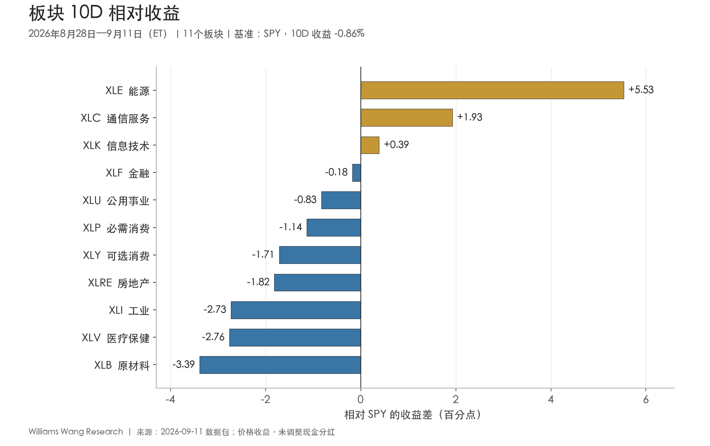
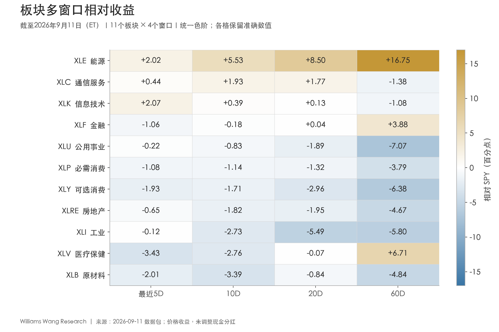
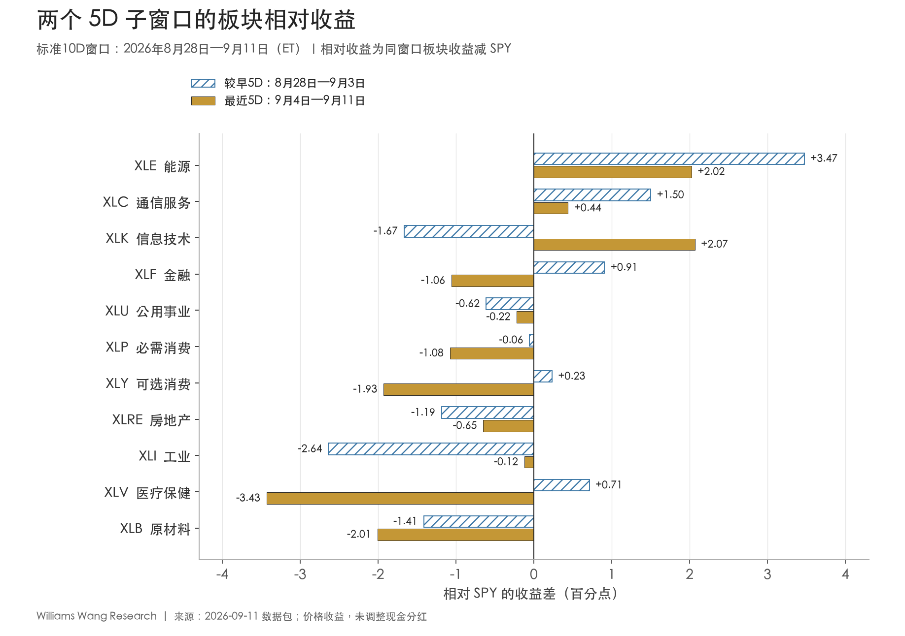

+++
title = "2026年9月11日板块轮动双周复盘：能源领先延续，广度收缩，科技近期修复"
date = "2026-09-12"
data_as_of = ["2026-09-09", "2026-09-10", "2026-09-11"]
draft = false
description = "分析截至9月11日的板块相对表现、市场广度与跨资产分歧。"
series = "市场板块轮动双周复盘"
categories = ["市场结构"]
tags = ["板块轮动", "SPY", "ETF"]
featured = false
private = false
content_preservation = "verbatim"
source_sha256 = "65c1b6c5c4bc76e59c9b5b6a2b315bcf1e9159461d7b60fe9c0204eedbba8910"
source_front_matter_reviewed = true
report_period_et = "2026-08-28 至 2026-09-11"
prepared_at_sgt = "2026-09-12 08:09:50 +08:00"
return_basis = "close-to-close price return; cash distributions not adjusted"
cover = { as_of = "20260911", subtitle = "能源领先延续，广度收缩，科技近期修复" }
+++

# 2026年9月11日板块轮动双周复盘：能源领先延续，广度收缩，科技近期修复

## Executive Summary

- **本期呈现少数板块相对抗跌、整体参与度下降的结构。** 8月28日至9月11日的完整10个交易日内，SPY 下跌0.86%，RSP、IWM 分别下跌2.92%、3.59%；11个板块仅2个上涨、3个跑赢SPY。20D均线上方板块数由8月27日的6个降至期末3个，板块收益中位数为-2.00%。指数跌幅较小，不能代表市场内部普遍稳健。

- **能源是跨窗口一致性最清晰的 leadership，科技则集中在最近5D修复。** XLE 10D上涨4.67%、领先SPY 5.53个百分点，且5D、10D、20D、60D均跑赢基准。XLK 最近5D上涨0.94%、领先2.07个百分点，但完整10D仍下跌0.47%，60D仍落后1.08个百分点；当前证据支持短期修复，尚不足以确认中期趋势全面转强。

- **“周期领先防御”高度依赖能源，不能据此判断广泛的 risk-on。** 周期与防御组合的10D价格收益差为+1.08个百分点；剔除能源并重新等权后变为-0.42个百分点。工业、原材料、可选消费均在10D、20D、60D落后SPY，等权与小盘也持续落后，周期扩张缺少广度确认。

- **商品上涨与利率、信用和波动率压力并存，宏观解释仍需保留分歧。** USO、DBC 10D分别上涨18.95%、6.87%；截至9月10日，2Y、10Y美债收益率较期前分别上升36bp、28bp，HY OAS扩大7bp，VIX上升3.33点。HYG相对LQD仍领先，说明不同代理并非统一指向；报告期内的就业和CPI发布仅提供外部上下文，不能替代因果识别。

## 一、观察窗口与口径

本报告的市场数据截止于**2026年9月11日美股收盘**，数据包生成于同日20:02 ET。本期按最近10个美股交易日计算，收益基准收盘日是8月27日；报告中的“双周”指固定10D观察窗口，不等于两个完整自然周。

| 用途 | 交易日覆盖（ET） | 收益起算的基准收盘日 |
|---|---|---|
| 完整报告期／标准10D | 8月28日—9月11日 | 8月27日 |
| 较早5D | 8月28日—9月3日 | 8月27日 |
| 最近5D | 9月4日—9月11日 | 9月3日 |
| 排名比较期 | 8月14日—8月27日 | 8月13日 |
| 20D／60D背景 | 均截至9月11日 | 分别为8月13日／6月16日 |

以下收益均为收盘到收盘的**价格收益，不调整现金分红**；相对收益是同窗口ETF收益减SPY收益，使用百分点（pp），不是价格比率涨幅。两个5D的绝对收益通过复利衔接为10D，不能直接相加。数据包记录的“上一包截止9月4日”用于运行记录，**不等于本表的排名比较期**；与上一份滚动报告也不是独立样本。

## 二、广度收缩：市值加权跌幅有限，等权与小盘承压更明显

**市场内部的弱势比SPY的跌幅更广泛。** SPY、QQQ完整10D分别下跌0.86%、0.84%，RSP和IWM跌幅则接近3%与3.6%；四个市场代理期末均位于20D均线下方。最近5D，SPY由前段上涨转为下跌1.13%，RSP、IWM分别下跌2.30%、2.08%，表明后段弱势继续向广泛股票参与度传导。

| 市场代理 | 较早5D | 最近5D | 10D | 20D | 60D | 20D均线 |
|---|---|---|---|---|---|---|
| SPY 标普500 | +0.27% | -1.13% | -0.86% | -1.72% | +1.88% | 下方 |
| QQQ 纳斯达克100 | -0.48% | -0.37% | -0.84% | -2.33% | -1.93% | 下方 |
| RSP 标普500等权 | -0.63% | -2.30% | -2.92% | -3.48% | +1.72% | 下方 |
| IWM 罗素2000 | -1.54% | -2.08% | -3.59% | -4.76% | -1.04% | 下方 |

*表注：全部为美元计价ETF价格收益；均线状态以9月11日收盘判断。QQQ相对SPY的10D差距仅约0.02个百分点，不宜赋予实质性的风格领先含义。*

11个板块的10D平均收益为**-1.47%**、中位数为**-2.00%**；剔除XLE，其余10个板块等权平均为**-2.08%**。20D均线上方板块数从8月27日的6个，降至9月3日的5个，再降至9月11日的3个。这一变化直接支持本期广度收缩，不需要借助上一份报告的数值。

**截止日已经出现反弹，这是需要保留的边际反证。** 9月11日SPY、QQQ分别上涨0.88%、0.89%，11个板块中9个上涨；但四个市场代理仍在20D均线下方，单日回升尚未改变5D和10D的整体弱势。下一期应检验这一反弹能否延续并修复广度，不能把完整窗口的承压状态机械外推到下一交易日。

图中能源领先5.53个百分点，通信服务领先1.93个百分点，信息技术仅领先0.39个百分点，其余8个板块落后。最强与最弱板块的收益差为**8.92个百分点**，横截面标准差为**2.43个百分点**（11个板块总体标准差，未年化）。这表明板块表现分化明显；缺少更长历史分布，不能据此给轮动强度贴上经校准的“强／弱”标签。板块ETF数量也不等于个股上涨家数或成分股广度。

## 三、排名重排与领先延续分开看：能源守住第一，医疗和原材料退位

**排名重排主要发生在能源以外的板块，领先者的稳定性不宜由整体排名相关性单独判断。** 本期与8月14日至27日比较期的排名相关系数为0.11，Top-3重合1个，仅XLE保留前三位置；3个板块的排名变化达到至少5位。XLK从第8升至第3，XLV、XLB则各下降8位，分别降至第10、第11。

| 板块 | 比较期→本期排名 | 10D收益 | 10D相对SPY | 20D相对SPY | 60D相对SPY | 20D均线 |
|---|---|---|---|---|---|---|
| XLE 能源 | 1 → 1 | +4.67% | +5.53pp | +8.50pp | +16.75pp | 上方 |
| XLC 通信服务 | 5 → 2 | +1.07% | +1.93pp | +1.77pp | -1.38pp | 上方 |
| XLK 信息技术 | 8 → 3 | -0.47% | +0.39pp | +0.13pp | -1.08pp | 上方 |
| XLF 金融 | 4 → 4 | -1.04% | -0.18pp | +0.04pp | +3.88pp | 下方 |
| XLU 公用事业 | 9 → 5 | -1.69% | -0.83pp | -1.89pp | -7.07pp | 下方 |
| XLP 必需消费 | 7 → 6 | -2.00% | -1.14pp | -1.32pp | -3.79pp | 下方 |
| XLY 可选消费 | 10 → 7 | -2.57% | -1.71pp | -2.96pp | -6.38pp | 下方 |
| XLRE 房地产 | 6 → 8 | -2.68% | -1.82pp | -1.95pp | -4.67pp | 下方 |
| XLI 工业 | 11 → 9 | -3.59% | -2.73pp | -5.49pp | -5.80pp | 下方 |
| XLV 医疗保健 | 2 → 10 | -3.63% | -2.76pp | -0.07pp | +6.71pp | 下方 |
| XLB 原材料 | 3 → 11 | -4.25% | -3.39pp | -0.84pp | -4.84pp | 下方 |

*表注：排名按完整报告期绝对收益排序；“比较期→本期”不是与9月4日上一包的排名比较。相对收益均以pp列示。小于约0.1pp的相对差异对现金分红与价格口径较敏感，不应视为稳健优势。*

**XLE的领先覆盖最完整。** 其20D、60D相对SPY收益分别为+8.50pp、+16.75pp，且两个5D子窗口均上涨并跑赢SPY。不过，最近5D绝对收益从较早5D的+3.74%降至+0.90%，相对领先从+3.47pp收窄至+2.02pp。能源仍然领先，但最近窗口的领先幅度已经收敛。

**XLC表现为短中期相对抗跌，XLK表现为近期修复。** XLC的10D、20D相对收益为+1.93pp、+1.77pp，60D却仍为-1.38pp；最近5D实际下跌0.69%，相对跑赢来自跌幅小于SPY。XLK的20D相对优势只有+0.13pp、60D为-1.08pp，近期回升尚未形成一致的中期领先。

图中XLE是唯一5D、10D、20D、60D全部相对为正的板块；60D跑赢SPY的另外两者为XLF和XLV，但二者最近5D都转弱。20D有4个板块跑赢SPY，其中XLF仅+0.04pp，属于接近持平；不能把“4个跑赢”全部解释为有实质幅度的领先。

**落后板块也存在不同的时间结构。** XLI的20D、60D分别落后5.49pp、5.80pp，近期相对跌幅收窄仍未改变多窗口落后；XLB、XLY、XLRE同样在5D、10D、20D、60D全部落后。XLV虽保留60D的+6.71pp相对优势，但20D已接近零且略为负值，最近5D下跌4.56%，是中期积累被短期回撤明显侵蚀的案例。数据包没有公司盈利、估值或资金流证据，无法进一步判断这些变化由何种行业基本面或交易行为主导。

## 四、两个5D窗口：能源和通信持续领先，科技反转，医疗与金融转弱

**稳定的相对领先者只有XLE和XLC，最近5D新增的相对赢家是XLK。** 较早5D共有5个板块跑赢SPY，最近5D降至3个。相对收益从正转负的有XLF、XLY、XLV；XLK则从负转正。由此可见，最近窗口的科技修复没有伴随普遍的板块扩散。

图中的蓝色斜线条对应8月28日至9月3日，金色实心条对应9月4日至11日，均为相对SPY的收益差。XLE和XLC两段均为正，但相对领先都收窄；XLK从-1.67pp变为+2.07pp，修复最明显。XLV从+0.71pp转为-3.43pp，XLF从+0.91pp转为-1.06pp，XLY从+0.23pp转为-1.93pp，代表前段韧性未能延续。

相对改善也不一定意味着绝对上涨。XLI最近5D仅落后SPY 0.12pp，较早5D却落后2.64pp，看起来改善明显，但自身仍下跌1.25%；XLU的相对落后同样收窄，绝对跌幅却从0.35%扩大至1.35%。因此，后续验证应同时看绝对收益、相对收益和均线位置，不能把“跌得更少”直接写成趋势转强。

## 五、风格与商品：能源主导的分化，尚非广泛周期扩张

**等权、小盘、质量与低波代理均未在完整10D获得相对支撑。** RSP−SPY为-2.06pp，IWM−SPY为-2.73pp；20D差值仍分别为-1.75pp、-3.04pp。Growth−Value的10D为-0.32pp、最近5D为+0.25pp，大型成长相对大型价值也在最近5D回升至+0.85pp。这与科技近期修复一致，但与广泛风险偏好改善仍有距离。

| 代理／定义 | 最近5D | 10D | 20D | 60D |
|---|---|---|---|---|
| 成长−价值（SPYG−SPYV） | +0.25pp | -0.32pp | -1.22pp | -1.26pp |
| 大型成长−大型价值（IWF−IWD） | +0.85pp | -0.21pp | -1.18pp | -5.75pp |
| 等权−市值加权（RSP−SPY） | -1.17pp | -2.06pp | -1.75pp | -0.16pp |
| 小盘−大盘（IWM−SPY） | -0.95pp | -2.73pp | -3.04pp | -2.92pp |
| 动量−市场（MTUM−SPY） | +3.59pp | +1.70pp | -1.20pp | -7.79pp |
| 质量−市场（QUAL−SPY） | -0.32pp | -1.09pp | -1.34pp | -0.75pp |
| 低波−市场（USMV−SPY） | -0.65pp | -1.08pp | +0.37pp | +2.38pp |
| 周期−防御（组合均值差） | +0.96pp | +1.08pp | +0.94pp | +2.10pp |
| 高收益−投资级（HYG−LQD） | +0.07pp | +0.39pp | +0.33pp | +2.34pp |
| 长久期−中久期（TLT−IEF） | -0.08pp | -0.33pp | +0.38pp | -2.45pp |

*表注：均为价格收益差，单位pp。周期组为XLY、XLF、XLI、XLB、XLE等权；防御组为XLP、XLU、XLV等权。它们是混合暴露的叙事代理，不是市场中性、风险标准化或可直接执行的纯因子收益。*

MTUM−SPY最近5D为+3.59pp，10D为+1.70pp，但20D、60D仍分别为-1.20pp、-7.79pp。当前可描述为动量ETF的短期相对修复；本包未包含其历史持仓变化，不能把这一差值归结为本期板块赢家的简单复制，更不能视为动量策略已经得到样本外验证。

**周期／防御判断对能源的纳入十分敏感。** 原周期组10D平均下跌1.35%，防御组平均下跌2.44%，两者相差+1.08pp。剔除能源后，将其余4个周期板块重新等权，周期相对防御的差值变为-0.42pp。两组本身都在下跌，且领先方向会因是否纳入能源而改变；因此，数据支持“能源表现突出”，对“周期板块整体转强”的支持不足。

| 资产代理 | 最近5D | 10D | 20D | 60D |
|---|---|---|---|---|
| USO 原油期货 | +8.84% | +18.95% | +23.69% | +33.93% |
| DBC 广义商品 | +3.19% | +6.87% | +10.75% | +18.21% |
| GLD 黄金 | -2.91% | -5.75% | -0.17% | +0.17% |
| UUP 美元 | +0.14% | +0.11% | -0.46% | +0.43% |

*表注：全部为ETF价格收益。USO、DBC涉及期货持仓、期限结构和换月影响，不能直接等同于原油或商品现货收益。*

USO和DBC在四个窗口均上涨，与能源股相对领先方向一致；但XLB在所有窗口都落后SPY，商品上涨没有普遍传导到原材料股票。GLD 10D下跌5.75%，UUP仅上涨0.11%，这组数据也不支持“所有通胀对冲资产同步上涨”的概括。**可能解释**是能源相关价格压力与利率上行同时作用于不同资产；数据并未识别供给、需求、地缘事件或资金流各自的贡献。

完整窗口的同向表现也不能掩盖截止日的分歧：9月11日USO、DBC分别下跌2.36%、1.90%，XLE却上涨0.42%。这是一日观察，尚不足以确认商品趋势反转，但提示能源股与商品价格的联动需要继续验证。

## 六、利率、信用与波动率：风险环境承压，代理之间仍有分歧

**同日利率数据显示收益率上行、2s10s走平；信用利差与VIX也朝压力增加的方向变化。** 下表的变化起点统一取8月27日，但终点严格使用各序列实际可用日期，不把缺失值前向填充成新的观察。

| 指标 | 8月27日水平 | 最新水平 | 变化 | 最新观察日（ET） |
|---|---|---|---|---|
| 2Y美债收益率 | 4.20% | 4.56% | +36bp | 2026-09-10 |
| 10Y美债收益率 | 4.67% | 4.95% | +28bp | 2026-09-10 |
| 30Y美债收益率 | 5.19% | 5.37% | +18bp | 2026-09-10 |
| 10Y实际收益率 | 2.34% | 2.55% | +21bp | 2026-09-10 |
| 10Y breakeven | 2.33% | 2.36% | +3bp | 2026-09-11 |
| 10Y−2Y曲线利差 | 0.47% | 0.33% | -14bp | 2026-09-11 |
| 10Y−3M曲线利差 | 0.83% | 0.89% | +6bp | 2026-09-11 |
| 高收益债OAS | 2.63% | 2.70% | +7bp | 2026-09-10 |
| 投资级公司债OAS | 0.79% | 0.80% | +1bp | 2026-09-10 |
| VIX | 14.51 | 17.84 | +3.33点 | 2026-09-10 |
| WTI现货 | $84.81 | $97.26 | $+12.45 | 2026-09-09 |

*表注：利率、通胀补偿和OAS的水平单位为%；变化使用bp，1bp=0.01个百分点。VIX使用指数点，WTI使用美元／桶。所有数值取自所给ZIP的FRED快照。*

从8月27日至共同可用终点9月10日，2Y、10Y、30Y收益率分别上升36bp、28bp、18bp，构成前端上行更多的曲线走平；同日10Y−2Y由47bp降至39bp，即收窄8bp。上表独立T10Y2Y序列延伸至9月11日，进一步显示33bp、较起点收窄14bp。**这两个变化的终点不同，不能拿9月10日的单点收益率相减来解释9月11日的曲线值。**

10Y实际收益率截至9月10日上升21bp；对齐同一日期后，10Y breakeven上升7bp，与名义收益率上升28bp在数值上相符。表中截至9月11日的breakeven变化则只有+3bp。这个差异来自终点选择；breakeven还包含风险溢价及流动性等影响，不能当成纯粹的通胀预期，也不能把这一算术对应升级为因果分解。

**债券价格和利差支持“承压”，但HYG−LQD并未同步转负。** TLT和IEF 10D分别下跌2.65%、2.32%，TLT−IEF为-0.33pp；HYG和LQD分别下跌1.68%、2.07%，HYG−LQD却为+0.39pp。与此同时，HY OAS扩大7bp、投资级OAS扩大1bp。不同债券ETF的久期、票息、分红与信用组成不同，高收益ETF相对少跌不能单独证明信用风险偏好增强。

VIX从14.51升至17.84，配合股票广度下降，说明报告期风险环境更受压；本包缺少足够长的历史分位比较，不能据此断言系统性压力或恐慌状态。更重要的是，收益率、OAS和VIX的最新观察止于9月10日，**没有覆盖9月11日CPI公布后的完整收盘反应**。

## 七、下一报告期观察点：先验证领先扩散，再判断结构改变

以下是研究确认条件，不是交易触发器；本文不设仓位、买卖点或收益目标。

| 待验证的问题 | 支持当前判断延续的证据 | 会改变当前判断的证据 |
|---|---|---|
| 能源能否维持领先？ | XLE继续同时保持5D、20D相对优势，商品代理提供方向支持。 | 商品代理回落且XLE相对收益转负，或领先主要由较早窗口残留贡献。 |
| 科技修复能否延伸？ | XLK在后续5D保持绝对与相对收益为正，20D优势扩大，并由其他板块参与确认。 | XLK再次落后SPY、失去20D均线上方位置，20D相对优势仍停留在零附近。 |
| 广度收缩是否停止？ | RSP−SPY、IWM−SPY改善，20D均线上方板块数从当前3/11回升，跑赢SPY者扩散。 | 市值加权指数回升而等权、小盘仍落后，新增领先者仍局限于少数板块。 |
| 周期相对改善是否摆脱能源依赖？ | 剔除能源后的周期／防御差转正，且XLI、XLY、XLB同时改善。 | 周期／防御差仍只在包含能源时为正，非能源周期继续多窗口落后。 |
| 宏观压力是否缓和？ | 更新至相同观察日后，收益率压力、HY OAS和VIX同步缓和，并获得股票广度确认。 | 长端与实际收益率继续上行、OAS扩大、VIX走高，或不同代理持续分歧。 |

下一期还应关注**9月15日至16日FOMC会议**，这是截至本期结束时已知的未来日程，而非本期已经发生的政策结果。会议后需要重新读取利率、信用、波动率与板块数据，不能沿用本包判断市场反应。[来源：美联储2026年会议日历](https://www.federalreserve.gov/monetarypolicy/fomccalendars.htm)。

进一步解释能源与其他板块的分化，需要盈利预期、估值、细分行业和资金流资料；判断这些相对强弱能否产生可执行收益，还需要更长样本、点时数据、风险标准化、交易成本和样本外验证，本报告不作这类外推。

##  免责声明

本文所载观点与意见仅代表作者个人立场，基于所列历史市场数据、宏观快照及已注明的公开来源进行描述性研究，仅供一般性信息与教育参考，不构成任何形式的投资建议、理财建议、交易建议、仓位建议、买卖证券的推荐、收益承诺，亦不构成购买或出售任何金融工具的邀请或要约。历史表现、相对强弱、模型指标和情景条件不代表未来结果；相关性与同期变化不构成因果证明。数据可能存在发布时滞、修订、价格调整及现金分红处理限制。读者应结合自身目标、风险承受能力及其他独立信息作出判断，并自行承担相关决策风险。
