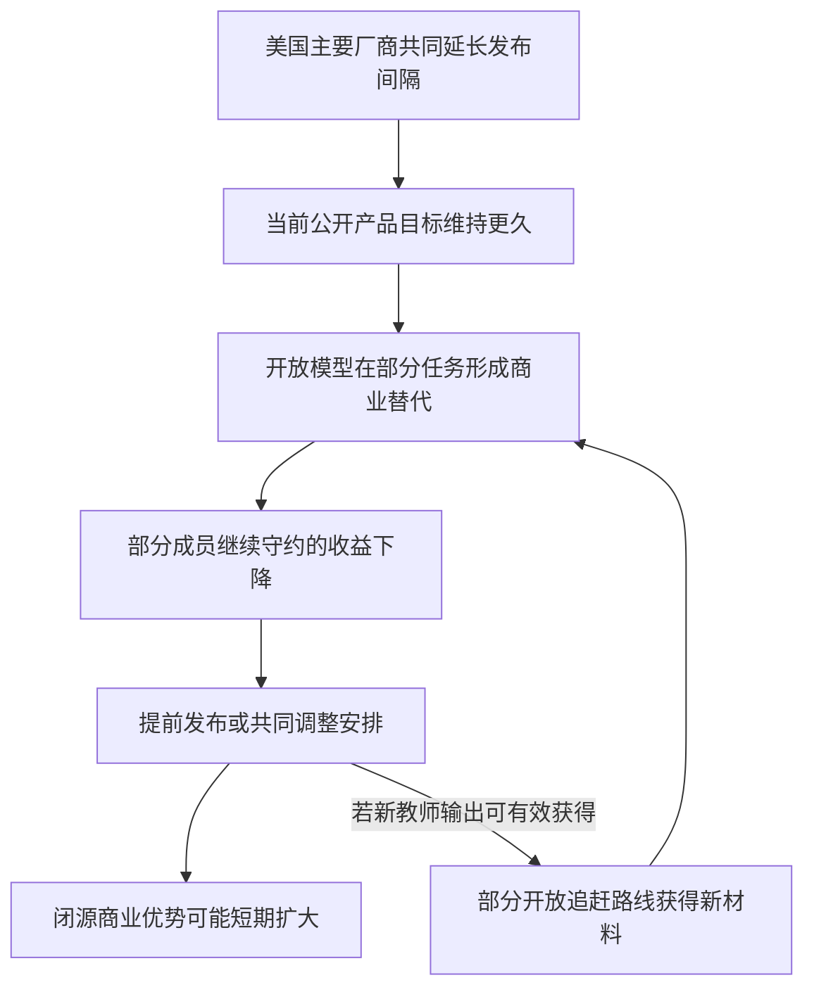

+++
title = "前沿 AI 放慢发布的经济博弈：IPO 窗口、开放模型追赶与联盟稳定性"
date = "2026-09-13"
data_as_of = "2026-09-13"
draft = false
description = "分析前沿AI放慢发布对利润、IPO激励、开放模型追赶及联盟稳定性的条件性影响。"
series = ""
categories = ["科技产业"]
tags = ["AI", "IPO", "开放模型", "博弈"]
featured = false
private = false
content_preservation = "verbatim"
source_sha256 = "1e19e02a0f91198c28193def2790f4667b59f34881c0d953bbd8c0f8c5e9a00f"
+++



# 前沿 AI 放慢发布的经济博弈：IPO 窗口、开放模型追赶与联盟稳定性

研究日期与信息截止日：**2026-09-13（Asia/Singapore）**。研究对象：OpenAI、Anthropic、Google，以及 SpaceX 的 AI 业务；外部竞争重点考察中国开放模型。

本文分析一个条件性命题：**假设主要前沿模型公司共同降低对外发布频率，内部研发投入暂时不减，能否改善财务表现和融资条件，以及这种安排能维持多久。**全文中的“联盟”“守约”“违约”均用于情景推演，不表示已经发现四家公司签署或执行此类协议。

## 核心判断

共同放慢发布具有可以成立的经济动机：延缓现有产品受到的新能力冲击，保留定价和客户关系，并争取商业化消化时间。但这项动机成立，既不要求技术进步停滞，也不足以证明倡议者以财务利益为真实或唯一目的。公开安全主张和商业利益可以同时存在；本报告集中研究后者，未估计安全收益，因而也不构成对倡议全部社会影响的评价。

影响结论的关键在于以下五点。

1. **现有模型的获利期可能延长，企业整体利润未必增加。**如果研发持续、算力承诺仍需支付、客户转向开放模型，或者被延迟的新模型原本能够降低服务成本、创造新需求，较慢发布可能损害利润。应比较同一期间公司的总贡献利润和现金流，不能只比较单代模型的生命周期收入。
2. **IPO 临近会同时增强“维持稳定”和“抢先突破”两种激励。**一家公司的新模型若已成熟，且能够在竞争者反应前影响发行定价，提前发布可能比继续守约更有价值。由此不能推出 Anthropic 一定最守约，也不能仅凭 IPO 时间推定其会违约。
3. **IPO 前突然发布的策略在逻辑上成立，但需要多个时间窗口同时匹配。**新能力必须足够可信，商业价值必须能被投资者识别，对手必须来不及有效回应；两至四周的宣传热度本身不足以完成这条链条。真正相关的节点是发行定价，而非上市敲钟。
4. **中国开放模型既受到放慢发布的影响，也会改变美国公司的守约收益。**较少的新教师模型可能限制部分蒸馏进展；较长的公开产品空窗又会给开放模型争取追赶、降本和进入客户工作流的时间。内部技术差距扩大与公开市场的商业差距缩小，可以同时发生。
5. **联盟的薄弱处在于收益、期限和外部影响不对称。**一家公司可能获得提前发布带来的客户或融资收益，而由更强教师模型引起的后续开放模型竞争，会由多家闭源厂商共同承担。共同放慢能够创造短期收益，并不意味着共同守约具有同等强度的激励。

证据上，公开倡议、上市状态、部分财报和评测结果有可核查来源；统一口径的模型业务盈利、未发布能力、合同约束及各方决策函数仍不完整。

## 1. 明确研究对象：放慢什么，与什么比较

### 1.1 公开倡议与本文假设之间的距离

Amodei 在 2026 年 9 月的文章中提出外部评估、行业协调等措施，也讨论训练算力及内部使用 AI 改进 AI 的限制。OpenAI 9 月 9 日的官方政策文章则讨论在必要时减慢开发或部署。因此，公开主张的范围比“降低新品发布频率”更广，不能将两者直接等同。[Amodei 原文](https://darioamodei.com/post/we-must-pace-the-frontier)，[OpenAI 政策文章](https://openai.com/index/ai-policy-window/)

以下分析有意固定一个较窄情景，以识别发布节奏自身的经济作用：四家共同延长受约束的新能力向外部客户开放的间隔；内部研发预算暂时不变；价格仍由各家独立决定；中国及其他未参与者不受约束。**研发预算不变是建模假设，既不代表实际承诺，也不保证实际研发进度不变。**

IPO 背景同样需要固定日期。Reuters 9 月 4 日援引知情人士称，Anthropic 最早可能在 10 月中旬启动 IPO 营销，安排仍可变动。9 月 12 日报道转述 Altman：OpenAI 不在 2026 年上市。后者不能被进一步当作已经确定 2027 年上市。[Reuters 报道转载](https://www.investing.com/news/stock-market-news/exclusiveanthropic-ipo-launch-shifts-toward-midoctober-sources-say-4890091)，[Altman 的 IPO 表态](https://www.axios.com/2026/09/12/openai-public-ipo-delay-sam-altman)

SpaceX 已于 2026 年 6 月上市；本文使用 SpaceX 的 AI 业务作为 Grok 相关经济利益的分析主体。Google 所属的 Alphabet 与 SpaceX 均需考虑公开市场估值和融资，但这与临近首次发行的激励并不相同。[Nasdaq 上市活动记录](https://www.nasdaq.com/events/spacex-rings-closing-bell)

上述资料支持讨论倡议与融资背景；**它们没有提供四家公司已经达成统一发布限制的证据。**

### 1.2 应当衡量实际交付的能力

发布会次数、模型名称和版本号都不是充分指标。向少量企业客户提前提供强大新能力，可能已经改变市场竞争；公开演示一个无法稳定使用的模型，商业影响则可能很小。

本文将“在约定时间之外，向第三方交付约定受限的新能力”称为实质违约。若内部研发本来允许继续，秘密训练本身不属于这一假设中的违约。降价、提高旧模型配额、改善服务是否触及约定范围，取决于实际条款；即便这些行为不构成违约，也可能削弱共同放慢的利润收益。

评估发布节奏至少要同时记录能力、可获得性、可靠性、单位任务价格和升级幅度。半年一次大幅跃迁与每月一次小幅升级，即使平均能力增长相同，对客户迁移、收入波动和竞争者反应的影响也不同。

### 1.3 需要三个比较基准

| 比较基准 | 要识别的作用 |
|---|---|
| 正常研发、正常发布，同时提供稳定的企业版本 | 客户是否本来就能通过版本选择、兼容接口和迁移安排获得稳定性 |
| 研发投入不变，四家共同慢发布且完全遵守 | 在不引入成员违约的情况下，单独识别较慢发布对收入、成本和外部替代的影响 |
| 共同慢发布，但允许成员重新决策及开放模型反馈 | 识别实际可持续性、提前发布的激励，以及收益能保留多久 |

如果稳定版本、长期支持和更好的迁移机制已经能够解决大部分企业适配成本，那么必须进一步解释：**共同约束发布，相比各家公司自行改善产品管理，额外创造了什么价值。**仅以“客户需要时间消化”为理由，不能证明行业共同放慢是必要条件。

## 2. 财务改善的成立条件：从产品经济寿命到公司利润

### 2.1 有付费需求，仍可能留不下足够利润

“客户愿意付钱，但竞争、推理成本和研发支出使企业留不下足够利润”是一个值得检验的机制。它包含三个不同层次：

- 客户收入能否覆盖服务这些客户的可避免成本，形成正的贡献利润。
- 全部贡献利润能否覆盖维持产品竞争力所需的研发、销售、管理及其他费用。
- 在基础设施投资、长期算力承诺、营运资金和融资成本之后，是否产生足够现金回报。

第一层成立，并不保证后两层成立。尤其当一部分研发是维持竞争地位所必须持续支付的成本时，不能把全部研发都视为未来可以轻易停止的扩张投资。“维持性研发”与“扩张性研发”在这里是经济分析分类，并非公司已经披露的会计分部。

也不能直接把这一机制写成两家实验室当前均无法盈利的事实。Bloomberg 8 月 14 日报道称，Anthropic 向潜在投资者提供的初步资料显示，2026 年第二季度调整后经营利润为正；数据可能修订，也不等于已核验的 GAAP 净利润或自由现金流。[Bloomberg 报道](https://news.bloomberglaw.com/artificial-intelligence/anthropic-revenue-surges-to-over-11-5-billion-in-second-quarter)

更准确的研究问题是：即使当前某一盈利口径为正，在正常竞争和持续必要投入下，资本回报是否足够、是否持久，以及较慢发布能改善其中哪一环。

### 2.2 产品经济寿命可以延长，会计费用不会自动后移

在四家确实共同遵守的前提下，新模型对旧模型造成的竞争性淘汰可能放缓。既包括竞争对手的新产品对现有客户的争夺，也包括自家新品对旧产品的替代。这可以延长旧产品维持溢价的时间。

但有两个关键区别。

**第一，单代模型多卖几个月，不等于公司在同一个年度多赚同样多的钱。**正常发布时，一部分旧模型收入只是转移到了自家新模型；旧版本也未必立即停服。评估应比较同一时间范围内全部版本、产品和客户的总贡献利润，而不是把旧模型生命周期延长后的收入直接当作公司新增收入。“时间乘销售速率”的计算还隐含价格、需求和成本没有变化，现实中这些变量通常会共同调整。

**第二，经济上的过时速度与财务报表上的折旧、摊销不是同一件事。**如果公司一年仍完成四轮内部研发，只把其中一代公开发布，研发支出并不会自动变成一轮。某些内部成果会用于后续研究，另一些可能尚未上市就被新成果替代；必须看整个研发组合如何回收成本。

即使某些开发支出符合资本化条件，其确认、摊销及减值也要依据实际会计政策、可使用状态和可回收性判断。不能仅凭公开发布间隔从三个月变为一年，就把财务费用机械地摊到四倍长的期间。服务器、数据中心的折旧与算力合同支出，也不会因为模型少开几次发布会而自动停止。

因此，较稳健的财务链条是：**竞争性淘汰放缓 → 定价、续约或商业化转化改善 → 增量贡献利润增加 → 在费用与现金支出约束下改善经营表现。**

### 2.3 即使四家都守约，也存在四类抵消因素

其一，价格竞争仍然可以继续。公司可能为了填满预订算力而降价、增加配额或提供更有吸引力的合同条款，分享掉原本希望保留的收益。

其二，新模型可能具有更低的单位任务成本。更少的重试、更短的推理过程或更高的成功率，都可能抵消更强模型的单次调用成本。推迟这种升级，可能使现有产品的成本劣势持续更久。

其三，部分需求需要跨过能力门槛才会出现。对现有模型已经足够好用的任务，稳定版本有利于采用；对仍需大量人工返工的任务，延迟能力提升会延迟收入。客户需求不会统一地随发布变慢而改善。

其四，联盟以外的替代品继续进步。中国开放模型和其他竞争者即使尚未达到最高综合能力，也可能在足够大的可收费任务集合上形成替代。

### 2.4 一个可复核的六个月示例

以下纯为说明阈值，**不代表任何一家公司的实际参数**。将正常发布情景下六个月的相关业务收入设为 100；服务成本中随付费工作量同比变化的部分为收入的 50%；研发及其余固定费用不变。假设较慢发布节省的发布、适配与迁移费用为基准收入的 0.5%。

令 `p` 为相对正常发布基准的有效单价变化，`q` 为同口径付费工作量变化，`c = 50%`，`k = 0.5%`。这里的工作量要求任务组合可比，不能直接用不同模型的原始 token 数替代。

\[
\frac{\Delta OP}{R}
=(1+p)(1+q)-1-cq+k
=p+(1-c+p)q+k
\]

其中，`R` 是基准收入，`ΔOP` 是本示例费用口径下的经营利润增量。

| 六个月情景 | 相对有效单价 `p` | 相对工作量 `q` | 收入 | 可变服务成本 | 经营利润增量，基准收入为 100 |
|---|---:|---:|---:|---:|---:|
| A：定价保留，采用改善 | +6% | +3% | 109.18 | 51.50 | **+8.18** |
| B：定价略好，部分需求流失 | +3% | −5% | 97.85 | 47.50 | **+0.85** |
| C：开放替代与商业停滞压过收益 | −3% | −10% | 87.30 | 45.00 | **−7.20** |

单价高于基准 6%，也可以表现为实际仍降价、但比正常发布情况下少降一些；不意味着假定四家约定提价。三行结果是经营利润增量占基准收入的比例，**不是净利率提高的百分点，更不是自由现金流变化**。

在单价相对改善 3% 的情况下，工作量降幅约达到 **6.60%**，本示例的利润好处便归零。若算力合同在这六个月内不可取消，真正可随业务下降而节省的成本会更少，需求流失的伤害会更大。若延迟的新模型本来能够显著降低服务成本，也需要另外计入机会成本。

这说明经济动机应通过“能保住多少贡献利润”来判断。发布间隔变长本身没有给出利润改善的幅度或方向。

## 3. IPO 窗口：守约与突然发布的双重激励

### 3.1 较近的 IPO 不意味着更低的违约倾向

一家即将上市的公司，可能希望已有产品持续产生收入，降低经营波动，让投资者更容易理解其盈利能力。这会增强维护共同放慢安排的动机。

但同一个发行窗口也可能提高领先技术的即时价值：如果一次发布足以改变投资者对未来增长、客户扩张或研发效率的判断，把这项信息留到 IPO 之后，可能错过更有利的融资条件。

两种激励由相同的时间节点产生。它们的相对强弱取决于公司的具体状态：当前经营表现是否已经足以支持发行，新模型是否准备完成，升级究竟改善还是损害单位经济性，以及对手能多快提供替代产品。

因此，Anthropic 的 IPO 若更近，既可能成为维持安排的受益者，也可能成为某一时点提前发布激励最强的成员。这里能够判断的是**条件如何改变行为**，尚不能据此给公司排出固定概率。

### 3.2 “先倡议放慢，再在 IPO 前推出惊艳模型”需要怎样的因果链

这一策略可以写成以下假设路径：

> 对手因共同安排而推迟交付 → 本公司继续完成研发 → 在发行定价前开放具有商业价值的新能力 → 市场上暂时缺乏同等可用的竞品 → 投资者上调未来现金流预期或降低不确定性折价 → 融资条件改善。

这条路径在经济逻辑上成立，但任何一段断裂，结果都会改变。

首先，应当比较“有共同安排时的提前发布”与“没有共同安排时正常选择 IPO 前发布”。新产品配合融资本来就可能发生。**只有共同安排确实改变了竞争对手的行为或市场预期，才能把额外优势归因于先协调、后提前行动。**

其次，必须存在可以识别的承诺及其适用范围。先公开倡议放慢，之后照常发布，不能单凭这个顺序认定欺骗或违约。另一方面，若协议只限制外部交付，持续内部研发本来就是允许的行为。

再次，“惊艳”必须能够转化为可信的经济信息。更高的综合分数可能有用，但投资者还需要理解它对客户任务、可收费工作量、推理支出、交付可靠性和产品竞争力的意义。产品演示与可规模化交付之间的差距，会直接削弱融资收益。

最后，对手是会预期和反应的参与者。公开的 IPO 时间表，使其有理由准备反制；研发继续进行，也意味着其他公司可能已有接近可用的内部成果。所谓突然发布的优势，取决于对手的实际准备程度，不能假设它们只能从零开始。

### 3.3 两至四周的窗口，主要改变预期

在两至四周内，大型企业通常难以完整走完验证、采购、部署、持续使用与续约反馈。因此，这种发布若影响 IPO，主要渠道是改变未来收入和利润预期；只有能够在当期兑现的订单、使用量或成本改善，才会影响相应期间的实际财务表现。

还需要区分三个时间点：投资者形成初步判断、发行簿记与定价、股票上市交易。若目标是让公司以更优条件出售新股，核心节点是前两个。上市后股价上涨并不自动增加已经完成发行的募集资金。SEC 的 IPO 投资者说明也区分了发行价格、二级市场价格，以及公司发行新股与老股东出售股份所得资金。[SEC：IPO 定价与资金归属](https://www.investor.gov/introduction-investing/general-resources/news-alerts/alerts-bulletins/investor-bulletins-17)

可以用三只“时钟”理解策略的可行性：

- **价值验证时间**：产品从公布到足以改变发行判断，需要多久。
- **对手有效响应时间**：其他闭源厂商从获知发布到提供有竞争力的实际产品，需要多久。
- **开放模型商业替代时间**：开放模型从能力追赶到成为客户可以采购或部署的替代品，需要多久。

更有利的组合，是验证能够及时完成，而后两种冲击尚不足以在定价前抹去优势。这是分析条件，不是充分条件；投资者仍可能提前扣除上市后的竞争影响。

更短的窗口减少对手反应时间，也压缩产品验证和发行准备时间；更长的窗口提供更多使用证据，也暴露更多成本、故障与竞争回应。重大产品变化可能需要纳入发行材料及承销尽调，不能把两至四周视为无需协调的宣传空档，也不应笼统认定 IPO 前不能正常发布产品。

### 3.4 什么状态下，提前发布更可能具有经济吸引力

| 公司和市场状态 | 对 IPO 前提前发布的影响 |
|---|---|
| 现有业务稳定，新模型只提供小幅且昂贵的提升 | 维护经营可预测性更有价值，提前发布的增量收益较弱 |
| 新模型已成熟，能明显扩展可收费任务或降低成本，对手响应较慢 | 领先信息容易转化为发行价值，提前发布的吸引力上升 |
| 新模型能力强，但容量不足或可靠性不稳 | 可能改善增长叙事，也可能恶化交付成本和风险判断 |
| 对手已有可快速部署的同等产品 | 独占窗口缩短，共同安排带来的额外突袭收益下降 |
| 开放替代已侵蚀现有收入 | 继续守约的代价上升，提前发布可能成为防御性选择 |
| IPO 延期、完成或融资需求改变 | 决策依据重新变化，不能沿用发行前的激励排序 |

由此形成一个更准确的判断：**IPO 临近提高的是关键决策的敏感度；究竟推向守约还是提前发布，取决于可兑现的产品优势与继续等待的代价。**

### 3.5 对手反应速度可能比“谁更想背叛”更重要

用一个与公司实际数据无关的简化例子说明。假定剩余合作期为六个月，相对于竞争恢复后的共同基准，守约每月多获得 2 单位收益，累计为 12。若提前发布，在对手响应前每月多获得 4 单位收益，六个月内另有一次性客户收益 2，扣除额外交付成本 1；对手响应后的持续增量收益归零。

若对手一个月便回应，提前发布收益为 `4 × 1 + 2 − 1 = 5`，低于守约的 12。若对手需要三个月，收益变为 `4 × 3 + 2 − 1 = 13`，略高于守约。本例的临界响应时间为 **2.75 个月**。

这里没有纳入融资条款、声誉、法律成本或更复杂的后续合作；其作用只是展示，同一家公司、同一动机，在不同响应速度下可以作出相反选择。用创始人性格替代响应能力、产品准备和收益比较，会丢失最重要的变量。

### 3.6 短期改善可以留下长期融资效果，但不会自动提高估值

即使放慢发布只维持一个季度，也可能减少现金消耗、提高发行成功率，或降低募集同样资金所需的股权稀释。这种融资结果可能延续到合作结束之后。

另作一个纯示例：假设融资前股权估值由 5,000 亿美元提高到 5,500 亿美元，均募集 200 亿美元新资金，忽略费用及其他证券，新增股东所占比例分别约为 **3.85%** 和 **3.51%**。原股东少被稀释约 **0.34 个百分点**。这里的估值提高 10% 是独立假设，绝不是由前述利润示例推导出的预测。

相反，若投资者判断较好利润只是暂停竞争期间的暂时现象，或者放慢发布削弱了增长和技术领先预期，估值可能不升反降。不能将一季度利润增量乘以长期高倍数，再额外加上同一批现金流支持的“融资利好”，重复计算价值。

此外，公司需要的新增资本、早期投资者的退出窗口、员工流动性及创始人的控制权目标可能不一致。分析 IPO 激励时，应查看具体发行结构和治理权利，不能假定所有利益相关者都只追求发行日的最高报价。

## 4. 中国开放模型：受到影响的竞争者，也是改变联盟稳定性的力量

### 4.1 先区分能力追赶与商业替代

本文的“开放模型”主要指可以获得权重、并在相应许可证条件下部署或修改的模型；开放权重不自动等于严格意义上的完整开源。中国公司并非全部采用开放模式，开放模型也不只来自中国。

“中国开放模型与美国前沿模型的差距持续缩小”需要按任务、成本和日期检验，不能当作单调规律。Epoch AI 在 2026 年 5 月发布的研究，估计该年截至 5 月分析期内，领先开放权重模型在其 ECI 指标上平均落后领先闭源模型约四个月。这是历史样本和特定指标下的估计，既不是 9 月的实时差距，也不是中国公司的单独统计。[Epoch AI，2026-05-29](https://epoch.ai/data-insights/open-closed-eci-gap)

商业替代则可以先于最高综合能力追平发生。Artificial Analysis 9 月 7 日的评测中，GLM-5.3-Flash 与 GPT-5.6 Terra（max）的综合分数均为 42，其评测任务的加权平均调用成本分别为 0.25 与 1.40 美元。这个例子支持在一定能力层级上存在显著性价比竞争；它不代表两者每项能力相同，也不代表企业真实工作的总成本或每个成功任务成本具有相同比例。[Artificial Analysis，Intelligence Index v4.3](https://artificialanalysis.ai/articles/artificial-analysis-intelligence-index-v4-3)

一家闭源公司可以继续占据最高能力前沿，同时在大量常规任务上失去收入。因此，联盟需要保护的商业差距，与实验室希望保有的最高技术差距并不完全重合。

### 4.2 蒸馏的作用取决于三个条件

Anthropic 已公开指控部分中国厂商未经授权蒸馏其模型。本文将这类表述视为公司指控；为分析机制，另行接受“有效蒸馏确实存在”的情景假设，不据此认定所有被指控行为，也不把中国模型进步全部归因于蒸馏。[Anthropic 关于蒸馏的声明](https://www.anthropic.com/news/detecting-and-preventing-distillation-attacks)

需要分别估计三个条件：追赶者对外部教师的依赖程度；最新教师输出是否实际可获得；从获得输出到训练、验证并形成商业替代需要多长时间。

这些条件不能用一个“蒸馏成功率”概括。能够观察到新模型的答案，不等于能够获得足量、足质、适合学习的材料；训练出更高分模型，也不等于客户已经完成部署或接受其可靠性。另一方面，已有教师、独立研发、训练方法和工程优化仍可能推动进步，蒸馏也不构成所有模型能力的绝对上限。

因此，单纯减慢公开发布，只会直接减少一部分新能力的对外供给；其对中国进展的最终影响，需要与自主研发和商业化时间共同判断。

### 4.3 三条前沿可以朝不同方向变化

| 应当区分的前沿 | 含义 | 对经济分析的意义 |
|---|---|---|
| 实验室内部前沿 | 公司已经实现、但外部未必可用的能力 | 决定未来发布选择和内部研发优势，外部观察有限 |
| 对客户交付的商业前沿 | 客户实际可以调用、部署并获得服务保障的能力 | 直接决定采购、价格和收入竞争 |
| 可作为教师的输出前沿 | 外部追赶者实际能获得并有效使用的模型输出 | 影响部分追赶路线的速度和成本 |

如果美国公司内部研发继续推进，但延后公开交付，内部技术差距可能扩大。与此同时，中国模型可能逐步达到美国当前在售产品的实用水平，使商业差距缩小。若最新教师输出又被限制，一些追赶路线会受到阻力。

由此，**“闭源实验室领先更多”与“闭源公司的收入受到更大竞争”并不矛盾。**未出售的内部能力通常无法直接阻止客户采购已经足够好用的开放替代品。

### 4.4 放慢发布同时产生负面的学习效应与正面的追赶窗口

对于高度依赖最新教师、独立研发能力较弱的公司，教师更新减少可能拖慢能力提升。若客户又要求接近最高前沿，这种负面影响会较强。

对于已有较强模型、擅长推理优化和企业部署的公司，公开目标更长时间不变，意味着可以用更多时间降低成本、提高可靠性、适配硬件、进入客户工作流。它不必追上尚未公开的模型，便可能获得收入。

| 中国开放生态中的主体 | 较慢发布可能带来的主要收益 | 主要约束 |
|---|---|---|
| 自主研发和工程能力较强的模型公司 | 更长的商业追赶期，积累客户和研发资金 | 必须把技术及客户增长转化为自己能够保留的利润 |
| 对最新外部教师依赖较高的追赶者 | 当前公开目标暂时稳定 | 新教师不足可能使能力追赶慢于商业窗口消耗 |
| 部署商、云服务商和应用公司 | 使用足够好且可控的模型，降低采购与迁移成本 | 集成、运维、硬件利用率和客户获取成本仍可能较高 |

开放模型带来更多使用量，不保证原始模型开发者获得最多利润。价值可能由云平台、部署商、应用公司或终端客户保留。这会反过来影响开发者能否靠商业收入支持下一轮自主研发。

### 4.5 一家美国公司提前发布，会产生先后不同的影响

在发布刚发生时，更强且可用的闭源模型可能扩大商业差距，吸引原本考虑开放模型的客户。对于中国模型公司，这是直接竞争压力；对于发布者，这可能正是抢在 IPO 定价前行动的价值所在。

经过一段时间，如果新模型提供了可获得、可用于学习的有效输出，它又可能降低部分追赶成本。开放模型再结合自身研发和工程工作，可能缩小新形成的差距。

这两种影响发生在不同时间，不能相互替代。短期闭源份额改善不证明开放追赶被长期切断；后期开放模型受益，也不意味着其开发者在整段期间的累计利润一定增加。

更值得重视的是利益分配：**提前发布的客户和融资收益，可能主要由一家获得；更强开放替代品带来的后续竞争损失，可能由多家闭源公司共同承担。**这使单个成员的最优选择与联盟整体的最优选择进一步分离。

在某些任务上，只要一家提供足够强、足够可获得的教师，其他成员继续扣留相近能力的效果就会下降。这个机制不要求四家同时发布，也不意味着一个教师足以复制全部前沿能力。它取决于教师的任务覆盖、输出质量和可获得性。

### 4.6 开放追赶会改变守约收益，而不只是外部背景

一种可能的动态路径如下。箭头表示条件性传导，不代表必然发生。

第一阶段，较慢发布可能使闭源公司保留收入，同时给开放生态消化当前技术的时间。新教师减少则可能拖慢部分追赶者，因此开放替代的实际速度仍待观察。

第二阶段，当开放模型进入足够大的客户任务集合，受冲击成员继续等待的代价上升。原本需要维护的共同利润，可能已被外部竞争侵蚀。

第三阶段，某家公司因融资节点、客户流失或新成果成熟而提前发布，其他成员重新评估自身选择。结果也可能是共同调整安排，而非秘密违约。

第四阶段，若新输出有助于追赶，开放竞争再次加强，形成一轮新的压力。整个过程可能表现为较长空窗与集中发布交替出现，而非稳定的低频节奏。**这不能证明总体发布速度快于从未达成安排的情况，只能说明部分守约的结果不同于完全守约。**

这个反馈还包含一个悖论：开放竞争越强，闭源公司越希望减轻竞争压力；但开放替代越成熟，四家共同守约能够保护的利润可能越少。外部竞争同时增加协调诉求，并削弱协调的可持续收益。

### 4.7 与 IPO 策略的交叉点

IPO 前的发布者最有利的状态，是新能力能及时影响定价，而竞争者回应及开放替代尚不足以抵消其优势。但资本市场可以预期发行之后的追赶，未必愿意把短期领先按长期护城河定价。

反过来，即使四家之间完全互信，开放替代也可能使继续等待失去经济意义。联盟的寿命会受到外部商业差距消耗速度的约束，而不仅取决于成员是否诚实。

只有在外部自主追赶较慢、新教师确实受限、客户迁移困难、现有闭源差异化仍足以收费等条件组合下，较慢发布才更可能同时保护利润并维持合作。单凭“不再提供最新教师”这一条，不能推出开放模型会被压制，更不能推出闭源利润一定改善。

## 5. 四家公司的收益不同，违约倾向必须按状态比较

### 5.1 应当分析公司整体的利益，而不只看模型销售

对 OpenAI 与 Anthropic，模型能力、应用采用和融资条件之间的联系较直接。对 Google 和 SpaceX，模型竞争还与既有业务、分发入口和基础设施收入交织。

Alphabet 的财报将 Google Services 与 Google Cloud 分别列示，部分共享 AI 研发费用列在集团层面。由此不能将 Cloud 利润直接当作 Gemini 独立盈利，也不能只看模型 API 收入来衡量 Google 的发布动机。[Alphabet 2026 年第二季度财报](https://www.sec.gov/Archives/edgar/data/1652044/000165204426000066/googexhibit991q22026.htm)

SpaceX 的 AI 分部包括模型、X 相关业务和基础设施；2026 年第二季度分部收入增长的重要来源是新增云服务，分部经营损益与调整后 EBITDA 的方向也不同。与此同时，Anthropic 已宣布使用 SpaceX 的 Colossus 1 算力。这说明 SpaceX 同时具有模型竞争者与计算供应商身份，AI 分部收入不能全部当作 Grok 的终端客户收入。[SpaceX 2026 年第二季度 10-Q](https://www.sec.gov/Archives/edgar/data/1181412/000162828026052535/spcx-20260630.htm)，[Anthropic 的算力合作公告](https://www.anthropic.com/news/higher-limits-spacex)

下表是基于这些业务关系的条件推断，未使用创始人性格或未经校准的百分比。

| 主体 | 继续守约的主要经济吸引力 | 提前交付新能力的主要触发条件 | 对相对违约倾向的判断 |
|---|---|---|---|
| Anthropic | 维持企业收入与发行准备的稳定性，保留当前产品收益 | IPO 定价前已有可信突破；开放替代侵蚀收入；升级可以降低成本 | 对发行时间与产品成熟度高度敏感，可能从较低迅速转为较高 |
| OpenAI | 改善商业化消化和现金回收，维护已有产品与平台收益 | 竞争对手获得明显产品或融资优势；关键应用需要新能力 | 自身暂不 IPO 仍可能积极回应，不能据此判定守约激励较强 |
| Google | 稳定客户采用、维护现有利润来源，降低部分升级成本 | 新能力关系到搜索、工作流入口或云客户流失 | 既有业务越受到威胁，主动交付的吸引力越大；须看集团净效应 |
| SpaceX 的 AI 业务 | 改善自身模型经济性，保护算力客户的持续需求 | Grok 出现可改变竞争位置的成果；自身客户或入口受到压力 | 模型业务与供应商利益可能相抵，不能预设其一定最先违约 |

几个相对排序只有在条件明确后才有意义：若 Anthropic 的成熟突破能直接改变发行定价，它可能在该窗口具有最强提前发布动机；若新模型尚不成熟而现有经营表现良好，其倾向可能较低。若搜索或云入口受到重大冲击，Google 的集团利益可能压过协调收益。若某家公司根本没有可部署的新成果，则即使违约意愿很强，也缺乏行动能力。

已上市公司同样关心估值、再融资和资本成本。它们也会考虑，帮助竞争者以更优条件筹得大量资金，是否会增强未来的竞争压力。上市状态改变激励的期限和构成，并不消除融资相关激励。

### 5.2 定量比较应先取得分母

第 2 节的模型可以逐家应用，但收入基数必须是**受到发布安排影响的模型及产品业务收入**，并匹配相应客户、成本和期间。Google 的搜索和云业务、SpaceX 的算力服务等相邻业务影响，应在不重复计算的前提下另行加入。

公开披露尚不足以对四家建立完全可比的模型业务损益表。直接将同一利润改善比例乘以四家公司合并收入，会夸大影响，也会掩盖交叉补贴和集团内业务替代。现阶段能够给出条件和敏感性，尚不能据此列出可信的四家利润增量或估值增量。

## 6. 协议落地：范围、激励、供应方与研发反馈

### 6.1 “囚徒困境”提供了一个起点，但不能替代收益分析

如果单方抢先获益、双方同时抢先却让各自收益低于共同等待，就可能出现类似囚徒困境的结构。但仅观察到“都希望别人慢一点”，还不足以证明收益排序符合这一结构。

现实安排同时面临持续互动、私人信息和不同期限。成员未来还要合作、采购和融资，失去信任可能有可计量成本；成员也不知道对手内部模型究竟成熟到什么程度。因此，口头约定不必然立即失败，书面协议也不自动改变提前行动的收益。

更稳健的稳定性条件是：在每一个关键状态下，继续守约的预期价值，至少不低于提前行动、承受对手回应及其他成本后的价值。中国开放模型的追赶，会持续改变这项比较。

### 6.2 相同频率不代表相同牺牲

假设约定每六个月发布一次，刚完成一次领先发布的公司，与即将推出突破的公司，付出的机会成本可能相差很大。开始时间、当前能力位置、在售产品的成熟度、合同周期和内部候选模型库存，都会影响分配结果。

此外，限制模型编号不等于限制竞争能力。新能力可以经由 API、企业预览、应用、工具调用和代理系统进入客户工作流；而降价或增加服务能力，可能在没有新模型的情况下改变市场份额。范围越含糊，观察到的行为越难被一致评价；范围越广，商业协调和法律问题又可能越突出。

四家公司也不覆盖全部相关市场。不同任务、客户群和地区可能面对不同竞争者，未参与者会改变四家共同等待的价值。人数较少有利于理解彼此行为，却不保证对外部竞争拥有足够控制力。

### 6.3 书面、口头与监管安排的经济作用不同

| 安排形式 | 可能提供的作用 | 无法自动解决的问题 |
|---|---|---|
| 口头或公开倡议 | 提供预期参照，形成声誉上的约束 | 范围不明、利益变化、成员是否曾真正承诺 |
| 书面自愿协议 | 更明确地记录范围、期限和各方承诺 | 可执行性、激励不一致、外部替代和法律风险 |
| 具有适用法律依据的公共规则 | 可能覆盖不愿自愿加入的主体，提供公共监督机制 | 覆盖边界、实施成本、跨境竞争及实际效果 |

书面化提高可核查性，同时可能提高谈判和法律成本；口头化减少文字并不会消除经济冲突。不能把“没有书面协议”等同于不存在约束，也不能把“签了协议”等同于必然有效执行。

### 6.4 法律风险取决于实质内容，安全名义不提供自动豁免

从美国竞争法的一般框架看，竞争者之间的限制竞争安排并不以签字文件为唯一形式；另一方面，平行行为本身也不足以证明存在共同约定。FTC 的说明分别讨论了书面、口头或由行为推断的协议，以及其他合作安排需要考察的竞争效果和合理必要性。[FTC：竞争者之间的定价协议](https://www.ftc.gov/advice-guidance/competition-guidance/guide-antitrust-laws/dealings-competitors/price-fixing)，[FTC：其他竞争者合作安排](https://www.ftc.gov/advice-guidance/competition-guidance/guide-antitrust-laws/dealings-competitors/other-agreements-among-competitors)

共同制定合理评测要求，与主要为了保留商业收益而共同限制产品供给，需要分别分析。即使不直接约定价格，安排对产品选择和创新竞争的影响仍值得审查。以安全为目的并不能自动排除竞争法问题，也不能在没有具体条款时直接认定某项安排违法。

Amodei 的倡议本身提出，希望政府为某些协调讨论提供支持或狭窄豁免。这是提出的请求，不代表豁免已经取得。[Amodei 原文的协调部分](https://darioamodei.com/post/we-must-pace-the-frontier)

这项约束与经济激励有直接关系：如果合作收益主要依赖限制竞争，却难以通过合适的法律和监督框架实现，书面承诺就未必能转化为预期中的稳定性。

### 6.5 英伟达的影响通过算力与客户财务传导

对英伟达，更直接的变量是训练、推理和内部研究需要多少算力，客户能否筹资、交付基础设施并履行付款义务。其截至 2026 年 7 月 26 日季度的 10-Q 披露了客户融资约束、信用支持及基础设施相关承诺风险。[NVIDIA 10-Q：客户融资与基础设施风险](https://www.sec.gov/Archives/edgar/data/1045810/000104581026000075/nvda-20260726.htm)

据此可以推导两条方向不同的路径。如果较慢发布帮助客户稳定收入和融资、而内部研究与推理需求持续，英伟达可能从更稳健的客户财务状况中受益。如果较慢发布阻碍新应用、减少推理使用或推迟新增容量投产，则可能削弱其需求。

开放模型也可能一边压低某些闭源厂商的利润，一边扩大行业部署和算力需求。因此，英伟达的利益不等于某两家实验室的模型利润最大化；它作为供应商、投资者或信用支持方的角色，也不使其自然成为联盟的中立执行者。

对模型公司，算力合同与供给能力会改变可选行动：现金压力可能促使其加快商业化，交付约束却可能令其无法有效抢先发布。应将“希望违约”和“有能力违约”分开。

### 6.6 研发不停仍是需要检验的假设，RSI 会改变其经济含义

不愿在竞争中落后，确实使公司有动机继续研发，但预算、人才、算力及治理约束可能迫使实际投入变化。即便预算相同，较少公开使用也可能减少真实任务反馈、失败案例和产品验证；也可能减少部署负担，使更多资源投入内部研究。实际研发速度的净变化不能预先固定为零。

若更强的内部模型能够帮助设计实验、开发代码或评估下一代系统，其经济价值可以在外部发布前产生。这会增强保留内部能力的价值，也可能提高公司储备下一次突破的速度。OpenAI 的 9 月政策文章将 AI 辅助研究加速与完全自主的递归自我改进（recursive self-improvement，RSI）区分开，明确表示后者当时尚未发生；本文没有假定已经出现无限自我加速。[OpenAI 对 RSI 的表述](https://openai.com/index/ai-policy-window/)

同样，研发边际收益并非在所有投入范围内都必然递减。工程瓶颈解除、规模效应和能力门槛可能产生阶段性的回报提高。即使某项性能指标的边际提升变小，也不能直接推出经济回报已经转负；相反，明显的能力进步也不保证公司能够留住商业价值。

所以，“技术完全无法进步”“研发投入的性能回报下降”“能力可以进步但商业利润不足”，是三个不同命题。仅凭共同放慢的倡议，无法在它们之间作出识别。

## 7. 综合情景：将利润、IPO 和开放模型反馈放在同一条路径上

以下情景用于识别结果对条件的依赖，不赋予发生概率，也不把其中任一行视为已经出现的事实。

| 情景 | 成立条件 | 对四家公司的主要含义 | 对中国开放生态及安排稳定性的含义 |
|---|---|---|---|
| **A．完全守约，现有商业差距维持** | 客户采用受益于稳定，定价收益保留；外部替代较慢；延迟升级的机会成本有限 | 相关产品利润和现金回收可能改善；IPO 受益程度取决于改善可信度及持续性 | 强研发企业获得追赶时间，高教师依赖者可能受限；合作收益相对稳定 |
| **B．完全守约，外部替代加速** | 开放模型在重要任务上已经足够好，迁移可行，成本优势能兑现 | 即使没有成员违约，四家的相关收入或利润也可能恶化；彼此降价又会增加压力 | 开放采用增加，但利润归属有差异；成员可能共同缩短间隔或终止安排 |
| **C．IPO 前抢先发布暂时奏效** | 新能力成熟、验证迅速，对手回应较慢，且发行定价仍可调整 | 发布者可能获得客户及融资优势；其余成员要承担市场份额与对手资金实力变化 | 开放模型先承受竞争，之后是否加速追赶取决于教师可获得性和自身研发 |
| **D．抢先发布引发快速回应** | 多家已有成熟内部储备，交付和算力不构成主要限制 | 突袭窗口很短，协调利润快速消失；可能出现集中发布及新增部署支出 | 短期差距重新变化，多个新教师可能增加学习材料；须与正常发布基准比较 |
| **E．商业交付扩大，教师供给仍有限** | 部分新能力可供客户使用，但外部难以获得足量有效学习材料 | 提前交付仍能改变竞争，发布者可能保有更长的商业窗口 | 高教师依赖者受限更明显，自主研发和部署能力的重要性上升；这不等于联盟仍完整守约 |
| **F．融资或基础设施约束突然变化** | IPO 延期、资本成本变化、算力不能按期提供，或现金承诺变重 | 同一家公司可能从等待转向加快商业化，也可能被迫延迟，原有排序失效 | 外部厂商的融资与部署能力同样重要，不能只按美国发布日历推断受益者 |

第 2 节的正负利润结果说明情景 A 与 B 的方向为何可能相反，但其数值不能直接套到本表的任何具体公司。情景 C 与 D 的分界，则主要受第 3 节讨论的验证和响应时间影响。

还要将“能够产生收益”与“收益持续多久”分开。沿用六个月利润增量 8.18 的纯示例，若额外收益均匀形成，而安排仅维持两个月或四个月，随后收益完全消失，累计增量分别约为 **2.73** 和 **5.45**，均以原六个月基准收入 100 为分母。这个计算未包含违约损失、客户延续、发行收益或不均匀的收入形成，只展示持续时间的重要性。

不同观察期也会给出不同评价：

- **0—3 个月**更容易观察到发布时点、价格与配额、发行预期变化；短期热度不能证明长期盈利。
- **3—12 个月**更适合检验客户转化、成本改善、开放替代、续约和竞争回应是否兑现。
- **1—3 年**才更能判断研发反馈、能力储备、生态控制与资本配置是否因较慢发布而改变。

短期利润改善与长期竞争受损可以同时为真；成功完成一次融资，也不证明共同放慢适合作为长期行业制度。

## 8. 如何检验：从行为叙事转向可以证伪的经济命题

### 8.1 原有解释分别能支持到哪一步

| 待检验解释 | 逻辑评价 | 更有识别力的证据与反证 |
|---|---|---|
| 共同放慢可以改善 IPO 前财务 | 有条件成立，须保留贡献利润且不损害更重要的增长来源 | 同口径价格、工作量、贡献利润、研发和现金支出的变化；若收益主要来自费用重分类或供应商补贴，发布节奏的解释力下降 |
| 放慢发布相当于折旧期延长，所以利润必然提高 | 经济寿命类比有用，自动改变报表费用的推论不成立 | 实际会计政策、费用确认与现金支付；全部在研项目的成本及商业回收，而非只看公开模型数量 |
| 技术已无法进步，所以大家共同减速 | 从倡议本身无法推出，证据要求明显更高 | 同口径能力进展、有效训练投入和单位任务成本；可信的新能力进步会削弱“完全停滞”解释，但不自动证明研发回报充足 |
| IPO 越近，越会守约 | 单向判断不成立 | 成熟新产品能否在定价前创造净价值；若存在长响应窗口，IPO 临近也可能增强提前发布激励 |
| IPO 前发布证明此前倡议意在欺骗 | 时间顺序不足以证明意图 | 是否存在明确承诺、对手是否据此改变安排、交付是否超出约定；仍需排除普通产品计划和外部冲击 |
| 减少发布会扼杀中国开放模型 | 对高教师依赖路线可能构成约束，对整个生态方向不确定 | 自主研发、教师可获得性、商业替代时间与收入归属；在少获新教师时仍快速形成商业替代，会削弱这一解释 |
| 书面协议可靠、口头协议必然失败 | 形式无法替代收益与执行分析 | 实际范围、可观察性、可执行性和继续合作价值；外部替代足够强时，两种形式都可能失去经济基础 |

这些解释并不互斥。一家公司可能同时面临较高研发成本、强劲客户需求、融资窗口、真实安全工作和开放竞争。经济分析的任务，是判断每种机制对行为和结果的增量解释，而非从一个现象中选出唯一动机。

### 8.2 最需要补齐的证据

优先级最高的是三组可以互相校验的数据。

**第一组，产品与客户的单位经济性。**按可比任务记录有效单价、成功率、重试、人工介入、付费工作量、客户留存及服务成本。不同模型生成更多 token，不自动意味着客户获得更多价值，也不自动意味着收入质量改善。要看客户按最终成果衡量的总成本，以及供应商真正保留的利润。

**第二组，内部成果到外部交付的时间。**记录模型具备可信能力、开始有限商业使用、普遍可用和实际扩容的时间。它有助于区分研发减速、交付延迟和纯粹宣传节奏变化，也能判断是否确有可用于快速回应的内部储备。未公开信息无法可靠观察时，应保留未知，不能由发布日期倒推出训练完成时间。

**第三组，开放模型的商业替代速度。**既追踪同口径能力和成本，也观察客户采购、部署、路由份额及续约变化。只看排行榜差距，可能低估已经发生的收入替代；只看低 API 标价，也可能忽略运维、可靠性和迁移成本。

IPO 侧则需要把发行价格、募资规模、老股出售、股权稀释、发行后的经营变化分别记录，避免用二级市场热度替代公司融资收益。

### 8.3 观察到利润改善，仍须处理其他解释

发布放缓之后利润上升，可能来自硬件及推理效率改善、客户组合变化、云渠道计价口径、供应商优惠、费用确认时点、季节性或整体需求增长。融资环境变化也可能独立影响估值。

因此，实际研究应在同口径业务层面建立收入、服务成本、固定费用和现金支出的桥梁，再比较不同暴露程度的任务、客户和产品。全行业共同变化时，天然对照组很少，单纯前后比较的因果识别能力有限；需要同时观察竞争没有明显受限的业务和稳定版本等替代策略。

最有价值的反证包括：发布变慢却仍持续降价、开放路由份额上升且客户留存恶化、单位任务成本落后、内部研发开支不减而现金回收没有改善，以及 IPO 投资者未将暂时利润按长期能力定价。这些现象会直接削弱“减慢发布可以保留足够利润”的核心假设。

### 8.4 公司收益、行业价值与客户收益需要分别评价

公司利润增加可能来自减少重复适配和部署浪费，也可能主要来自客户支付了更高价格或更晚获得有价值的新能力。前者可能提高资源使用效率，后者可能主要是价值在客户和供应商之间重新分配。开放模型继续提供有效替代，则可能使更多降本收益由客户和下游应用保留。

同样，行业少出现几次发布会，不能说明训练竞赛已经降温。若企业为了下一次集中发布而继续扩大内部投入，竞争可能只是从公开产品转入未公开研发；对整个行业的资金需求未必下降。

本报告没有获得足以校准四家公司收益函数、内部技术差距和违约概率的数据，也没有估算安全风险变化的社会价值。后续判断应随着单位经济性、发行安排和商业替代证据更新。**最先需要验证的，是共同放慢能否保护一笔足够大、足够持久、且单个成员愿意继续等待的利润。**

本文所载观点与意见仅代表作者个人立场，仅供一般性的信息与教育参考之用，不构成任何形式的投资建议、理财建议、交易建议或买卖证券的推荐。读者不应将本文的任何内容视为购买或出售任何金融工具的邀请或要约。
