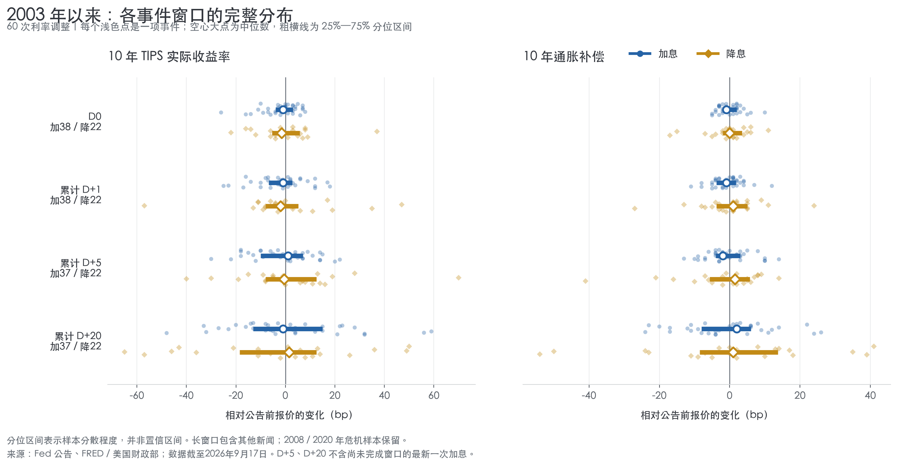
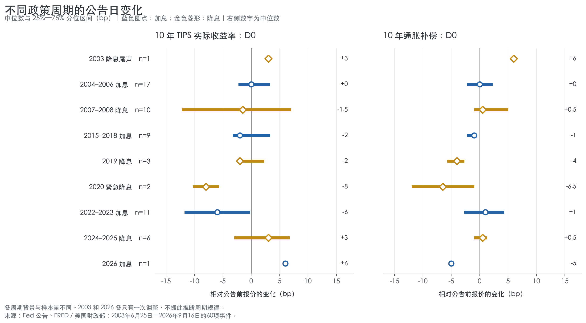
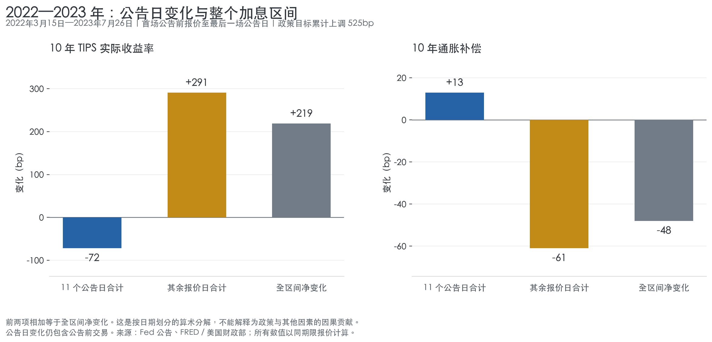

+++
title = "央行调息之后，市场在重新定价什么？"
date = "2026-09-18"
data_as_of = ["2026-09-17", "2026-09-18"]
draft = false
description = "从历史调息样本与美日政策案例，分析实际收益率、通胀补偿及跨资产重新定价。"
series = ""
categories = ["宏观与政策"]
tags = ["央行政策", "实际收益率", "通胀补偿", "跨资产", "日元"]
featured = false
private = false
content_preservation = "verbatim"
source_sha256 = "7948a08739fddf902e5ef5b2763299549974a9fbe189fe9f32e393ab58c9e2aa"
+++



# 央行调息之后，市场在重新定价什么？

实际收益率、通胀补偿与股票、黄金、原油和日元的联动

研究日期：2026 年 9 月 18 日。美国价格与收益率数据截至 9 月 17 日；日本案例考察 9 月 18 日政策公告后的初始反应。事件资料截止 9 月 18 日 07:05 UTC，不代表日本当日最终行情。历史样本覆盖 2003 年 6 月 25 日至 2026 年 9 月 16 日的 60 次美联储调息。

**加息不保证长期实际收益率上升，降息也不保证它下降。央行调整的是当前短期名义政策利率；债券、股票、黄金与汇率的价格，还会回应未来政策路径、增长与通胀前景，以及承担风险所需补偿的变化。** 判断市场反应，必须同时明确政策带来了什么新增信息，以及价格究竟在哪一个时间窗口变化。

2003 年以来的样本没有显示稳定的“调息后反向交易”规律。最近五年，加息公告日十年实际收益率下降的次数较多，但这种下降往往没有延续到后续窗口。2022—2023 年尤其典型：11 个加息公告日的实际收益率变化合计为 −72bp，整个加息区间却净升 219bp。会议当天、会议之后和整个政策周期，回答的是三个不同问题。

2026 年 9 月的美日决议为这一点提供了现实案例：美国股票与黄金在加息公布后的当天下跌，次日才反弹；日本央行加息后，日元在公告初段贬值。两者都要求超越“加息／降息”这个动作标签，但现有证据也不足以把全部变化归结为“政策不确定性消失”。

**先确定时间顺序：美国的反弹发生在次日。**

美联储于 9 月 16 日周三 14:00 EDT 宣布加息 25bp，将联邦基金目标区间提高至 3.75%—4.00%；记者会于 14:30 开始。对应东京时间分别是周四凌晨 03:00 和 03:30。日本央行随后于 9 月 18 日周五 11:54 JST 宣布加息 25bp，政策利率从 1.00% 提至 1.25%，新利率于 9 月 24 日生效。[美联储声明](https://www.federalreserve.gov/newsevents/pressreleases/monetary20260916a.htm)、[发布日程](https://www.federalreserve.gov/newsevents/2026-september.htm)、[日本央行声明，第 1、6 页](https://www.boj.or.jp/en/mopo/mpmdeci/mpr_2026/k260918a.pdf)。

以同一交易时钟上的 ETF 五分钟价格比较，美国市场呈现出两个方向不同的阶段：

| ETF 及代理对象 | 周三决议前至收盘 | 周三收盘至周四开盘 | 周四收盘相对周三收盘 |
| --- | ---: | ---: | ---: |
| SPY：标普 500 | −0.81% | +1.20% | +1.13% |
| QQQ：纳斯达克 100 | −0.77% | +1.59% | +1.72% |
| DIA：道指 | −1.28% | +1.03% | +0.61% |
| GLD：黄金 | −2.04% | +2.18% | +1.67% |
| USO：原油期货敞口 | −0.17% | −1.33% | −0.54% |
| UUP：美元指数期货敞口 | +0.53% | −0.11% | −0.07% |

表中均为价格收益率。“决议前”取 13:55 开始的五分钟 K 线收盘价，“收盘”取 15:55 开始的末根 K 线收盘价，“开盘”取 09:30 K 线开盘价。它们是事件窗口端点，末根 K 线价格不保证等于正式收盘集合竞价价格。QQQ 对应纳斯达克 100，不等于纳斯达克综合指数；USO 是原油期货敞口，UUP 是美元指数期货敞口，分别不能替代现货原油与 USD/JPY。

决议前至当日收盘，股票和黄金下跌、美元代理上涨；次日的股票和黄金反弹，很大一部分已经体现在开盘跳空中。SPY 与 GLD 在周四开盘至收盘反而分别小幅回落约 0.07% 和 0.50%。因此，把次日反弹表述为“加息公布后市场立即上涨”，会把不同信息阶段混为一谈。隔夜窗口也包含油市、其他央行及经济数据等新信息，不能将其中全部变化直接划归美联储。

利率市场也经历了先升后降。这里的“实际收益率”专指市场上的 TIPS（通胀保值国债）实际收益率，不是“当前联邦基金利率减去最近一次 CPI”。通胀补偿（breakeven inflation，简称 BE）则定义为同期限名义国债收益率减去 TIPS 收益率，1bp 等于 0.01 个百分点：

\[
BE_T=y_T^N-y_T^{TIPS},\qquad
\Delta y_T^N=\Delta y_T^{TIPS}+\Delta BE_T.
\]

| 指标 | 9 月 15 日 | 9 月 16 日 | 9 月 17 日 |
| --- | ---: | ---: | ---: |
| 2 年名义收益率 | 4.67% | 4.74% | 4.67% |
| 5 年名义收益率 | 4.83% | 4.86% | 4.78% |
| 10 年名义收益率 | 5.00% | 5.01% | 4.94% |
| 5 年实际收益率 | 2.42% | 2.51% | 2.46% |
| 10 年实际收益率 | 2.62% | 2.68% | 2.61% |
| 5 年通胀补偿 | 2.41% | 2.35% | 2.32% |
| 10 年通胀补偿 | 2.38% | 2.33% | 2.33% |

来源：[美国财政部名义收益率曲线](https://home.treasury.gov/resource-center/data-chart-center/interest-rates/TextView?type=daily_treasury_yield_curve&field_tdr_date_value=2026)、[实际收益率曲线](https://home.treasury.gov/resource-center/data-chart-center/interest-rates/TextView?type=daily_treasury_real_yield_curve&field_tdr_date_value=2026)。均为官方日度固定期限拟合收益率；通胀补偿由同期限差值计算。

9 月 16 日，十年名义收益率变化为 **+1bp＝实际收益率 +6bp＋通胀补偿 −5bp**；9 月 17 日则为 **−7bp＝实际收益率 −7bp＋通胀补偿 0bp**。次日十年名义利率的下降，在这个价格分解中全部落在实际收益率一侧。同期五年通胀补偿另降 3bp，不能据此把十年利率下降也称为“十年通胀预期下降”。

这个分解解决了“哪一项价格发生变化”，尚未解决“为什么变化”。BE 还包含通胀风险补偿与 TIPS 相对流动性等影响；TIPS 收益率也含有期限和流动性补偿。两者均不能直接等同于纯粹的经济预期。

**把时间拉长：近期常见的现象，不等于跨周期规律。**

历史研究选取 2003 年以来的 60 次调息公告：38 次加息、22 次降息。主要观察十年期，以五年期作对照。最近五年定义为 2021 年 9 月 18 日至研究日，其中有 12 次加息和 6 次降息；2021 年没有调息事件。

所有历史变化都需要一个明确基准。D0 指公告后第一个有日度报价的交易日，变化相对于公告前最后一个日度报价；“累计 D+5／D+20”指 D0 之后第 5／20 个报价日，仍相对于同一个公告前基准；“D0 至 D+5／D+20”才是剔除公告日后的后续变化。财政部报价约采集于 15:30 ET，因此 D0 包含公告前交易和公告后的部分交易，不能当作纯粹的即时政策冲击。[财政部利率统计口径](https://home.treasury.gov/policy-issues/financing-the-government/interest-rate-statistics)。

| 样本 | 政策动作 | 次数 | D0 实际收益率中位数 bp | D0 实际收益率反向次数 | D0 通胀补偿中位数 bp |
| --- | ---: | ---: | ---: | ---: | ---: |
| 2003 年以来 | 加息 | 38 | −1 | 20/38 | −1 |
| 2003 年以来 | 降息 | 22 | −1.5 | 10/22 | 0 |
| 最近五年 | 加息 | 12 | −5 | 8/12 | +0.5 |
| 最近五年 | 降息 | 6 | +3 | 4/6 | +0.5 |

表内收益率和补偿均为十年期。反向次数在加息组指实际收益率下降，在降息组指实际收益率上升；不变不计为反向。数据来源为逐次 [FOMC 官方公告](https://www.federalreserve.gov/monetarypolicy/fomccalendars.htm) 与 [FRED DFII10](https://fred.stlouisfed.org/series/DFII10)、[DGS10](https://fred.stlouisfed.org/series/DGS10)、[T10YIE](https://fred.stlouisfed.org/series/T10YIE)，由本文计算。

最近五年，加息公告日实际收益率有 8/12 次下降，降息日有 4/6 次上升。拉长到全部历史，两种政策方向都对应大量正、负变化；全样本加息日中位数为 −1bp，降息日为 −1.5bp。均值分别约为 −1.9bp 和 −0.2bp，也没有构成稳定的方向性规则。频数是这组历史事件的描述，不能直接变成下一次会议的预测概率。

图 1 中每个浅色点是一项事件，大点为中位数，粗线为样本 25%—75% 分位区间，并非置信区间。正负两侧都存在大量事件，较长窗口也包含更多同期信息。2026 年最新一次加息尚未走完 D+5、D+20，因此长窗口加息样本减为 37 次。

**“公告日反向”与“先顺向、再反转”是两种不同路径。**

如果加息当天实际收益率已经下降，它属于公告日反向，并不属于“先上升、后下降”。对后者必须逐次检验，不能通过两组中位数推断。

将“先顺向、再反转”严格定义为：D0 与政策动作同向，随后 D0 至 D+5 的变化与政策动作反向。在全部有完整窗口的事件中，加息有 **6/37 次**符合，降息有 **7/22 次**符合；最近五年分别只有 **1/11 次、2/6 次**。这个定义只要求后续方向反转，尚未要求价格越过公告前水平。若再要求 D+5 的净变化也转到政策动作的反方向，全样本分别降为 **5/37 次、3/22 次**，最近五年为 **0/11 次、1/6 次**。

近期加息样本中更明显的情况恰好是另一条路径：公告日实际收益率先下降，随后回升。以下每格均为十年期“实际收益率变化中位数／通胀补偿变化中位数”，单位 bp：

| 样本与动作 | D0 | 累计 D+5 | 累计 D+20 |
| --- | ---: | ---: | ---: |
| 2003 年以来：加息 | −1 / −1 | +1 / −2 | −1 / +2 |
| 2003 年以来：降息 | −1.5 / 0 | −0.5 / +1.5 | +1.5 / +1 |
| 最近五年：加息 | −5 / +0.5 | +7 / −3 | +12 / −4 |
| 最近五年：降息 | +3 / +0.5 | +9.5 / +1.5 | +6 / −1.5 |

最近五年加息组 D0 有 12 次，D+5、D+20 仅含 2022—2023 年的 11 次；全样本加息组对应为 38、37、37 次。两组降息样本分别保持 6 次、22 次。

在 2022—2023 年这 11 次相同加息事件中，D0 实际收益率中位数为 −6bp，累计 D+5 为 +7bp，累计 D+20 为 +12bp。8 次在公告日下降的事件，有 5 次至 D+5 已经转为相对公告前净上升。逐事件计算的 D0 至 D+5 后续变化中位数为 +11bp；中位数不能相加，这个数字需要单独计算。

2024—2025 年的 6 次降息，D0 至 D+5 实际收益率均上升，但其中 4 次在 D0 就已上升，所以不能全部称为“先降后升”。累计到 D+5，相对公告前是 5 次上升、1 次不变；到 D+20 则为 4 次上升、2 次下降。以“降息意味着债市持续放松”概括这组事件，同样会遗漏重要信息。

通胀补偿的方向证据更弱。近期加息日十年补偿为 6 次上升、1 次不变、5 次下降；降息日为 3 次上升、1 次不变、2 次下降，两组中位数都只有 +0.5bp。尤其考虑日度报价约 1bp 的精度，这不足以支持“加息总能压低通胀预期”或“降息总会抬高通胀预期”。

**政策周期解释了为什么公告日不能代表整个收紧或宽松过程。**

不同周期的背景差异，明显大于“加息还是降息”这一标签能够容纳的信息。2004—2006 年加息日十年实际收益率中位数为 0bp，2015—2018 年为 −2bp，2022—2023 年为 −6bp；降息日则从 2019 年的 −2bp、2020 年的 −8bp，变成 2024—2025 年的 +3bp。小样本阶段仅用于记录，不据此推断稳定规律。

最直观的例子是 2022 年 3 月 15 日至 2023 年 7 月 26 日，即首场加息前报价日至最后一场加息公告日。政策目标累计上调 525bp，十年实际收益率从 −0.69% 升至 1.50%，净升 219bp；十年通胀补偿从 2.84% 降至 2.36%，净降 48bp。

实际收益率的 219bp 净上升，可分为 11 个公告日合计 −72bp 与其余报价日合计 +291bp；通胀补偿的 −48bp，则分为 +13bp 与 −61bp。**这是按日期划分的加法，不是因果贡献分配。** 它说明大量重新定价发生在会议之间，却不能证明其余交易日的全部变动都是“提前定价加息”。通胀、就业、增长、债券供需和其他政策消息也在这些日子影响市场。

期限和特殊时期进一步限制外推。全样本加息日，五年实际收益率中位数为 +0.5bp，而十年为 −1bp；全样本降息日分别为 +2bp 与 −1.5bp。剔除 4 次紧急降息后，18 次常规降息的十年实际收益率在 D0 恰好 9 次上升、9 次下降，中位数为 0bp。长窗口还可能覆盖其他调息：剔除 3 个包含后续调息的降息 D+20 窗口后，其中位数由 +1.5bp 变为 −2bp。这些结果支持保留条件和分组，无法支持一个通用的方向口令。

**未来路径的“水平”与“确定性”，不能相互替代。**

长期实际收益率可以用一个简化的期限结构关系来理解：

\[
y_T^{TIPS}\approx
\text{未来实际短期利率的平均预期}
+\text{实际期限溢价}
+\text{TIPS 流动性等补偿}.
\]

第一项决定市场预计未来实际短端利率平均处在多高的位置；第二、三项反映持有期限风险和相对流动性等所需的价格补偿。这个关系是解释框架，本文没有从数据中估计出各项贡献。[美联储研究：TIPS 收益率与通胀补偿的构成](https://www.federalreserve.gov/econres/notes/feds-notes/tips-from-tips-update-and-discussions-20190521.html)。

政策动作当然重要，尤其当幅度超出预期时。但如果本次加息已经被充分预期，声明、经济预测或记者会使市场预计未来加息更少、维持高利率更短，长期实际收益率仍可能下降。降息也可能伴随对未来宽松幅度的下修，从而使长期实际收益率上升。这里还要同时观察预期通胀：名义政策路径下修，本身并不保证实际政策路径也下修。对当前目标的意外与对未来路径的意外，应分别衡量；既有高频研究也发现，仅用目标利率变化不足以概括公告对资产价格的影响。[Gürkaynak、Sack 与 Swanson：政策动作与声明的资产价格效应](https://www.federalreserve.gov/econres/feds/do-actions-speak-louder-than-words-the-response-of-asset-prices-to-monetary-policy-actions-and-statements.htm)。

“更确定”描述的是可能路径的分散程度，“预期更高／更低”描述的是路径的平均水平。市场可以更确定未来会长期维持高实际利率，也可以更确定未来会降至低实际利率，两者对收益率的含义不同。以下仅是教学假设，不是实际市场估计；流动性项固定为零，并假设确定性提高使实际期限溢价下降：

| 假设情景 | 未来实际短端平均预期 | 实际期限溢价 | 简化的长期实际收益率 |
| --- | ---: | ---: | ---: |
| 原先定价 | 2.0% | 0.3% | 2.3% |
| 更确定将维持较高利率 | 3.0% | 0.1% | 3.1%：上升 |
| 更确定将进入较低利率环境 | 1.0% | 0.1% | 1.1%：下降 |

即使在这个有利于“确定性压低溢价”的例子里，实际收益率仍可上升。更一般地，期限溢价还取决于风险在什么经济状态下兑现、债券的对冲价值与风险承受能力，不能预设它总随不确定性单调变化。因此，只有在**预期路径水平、流动性等其他条件基本不变，而且不确定性下降确实压低了相应溢价**时，“更确定推动实际收益率下降”才是一条成立的局部机制。

历史事件统计没有直接测量未来政策路径的平均预期、预期分散程度或实际期限溢价。它能说明当次调息方向不足以解释价格方向，尚不能据此宣布：“公告后五至二十天，主要由政策不确定性决定实际收益率。”更长窗口容纳的新增信息更多，因果识别反而更困难。

**据此解释股票、黄金、原油与日元：先辨别冲击，再辨别传导。**

对 9 月 17 日美国股票与黄金的共同反弹，实际收益率下降提供了直接的金融条件佐证：黄金不付息，实际收益率下降会降低其相对持有机会成本；股票价值取决于未来现金流与折现率，在盈利预期没有同步恶化的条件下，折现率下降有利于估值。这些方向与当天价格相容，但日度 TIPS 数据无法证明利率先于股金变化，三者也可能共同回应第三项消息。

油价回落提供了另一条相容的传导路径。Reuters 9 月 17 日报道，沙特向亚洲炼厂提供更多经阿曼近海转运的原油货源，市场据此缓解部分供应中断担忧。当日 Brent、WTI 期货结算分别下跌约 0.95%、0.50%。这是对新增供应安排和担忧缓解的报道，不代表运输能力已全面恢复。[Reuters 油市报道](https://za.investing.com/news/commodities-news/oil-prices-extend-losses-as-fears-of-middle-east-supply-disruptions-ease-4467793)。

如果油价下降源于供应压力缓解，它可能减轻企业成本和消费者负担，也可能降低通胀上冲与被迫进一步收紧的尾部风险，从而同时影响盈利预期、利率与风险补偿。如果下降源于需求衰退，盈利恶化则可能压过折现率利好，股票未必上涨。因此，“油跌、股涨、金涨”可以由一组共同消息与传导链条形成，不需要假设三者分别对应独立原因。油价通过利率传导的影响，也不能再与一份独立的“利率贡献”重复相加。

油价解释仍有反证：9 月 16 日 FOMC 公布前，USO 相对前一日收盘已跌约 3.36%，SPY、GLD 同期却分别上涨约 0.38%、1.47%；政策信息公布后，股金仍转跌。这说明油价回落无法覆盖所有政策信息的作用。9 月 17 日十年通胀补偿又保持不变，也不支持把整场反弹写成“油跌带来长期通胀预期全面下降”。

“不确定性消失”同样需要具体证据。Cboe VIX 在 9 月 15—17 日收盘分别为 17.20、17.71、15.44，决议当日反而上升，次日才回落。VIX 衡量股票期权所反映的预期波动，含风险补偿等影响，既不等于货币政策路径的不确定性，也不等于股票风险溢价本身。它的回落与反弹相容，不能单独证明政策确定性提高是起因，更不能确认空头回补或交易商被迫买入。[Cboe VIX 日度数据](https://cdn.cboe.com/api/global/us_indices/daily_prices/VIX_History.csv)。

同样，不能仅凭次日上涨就把本次会议定性为“鸽派加息”。9 月 SEP 中，2026、2027 年末政策利率中位数均为 4.1%，高于 6 月的 3.8%、3.6%。这是官员条件预测相对上次预测的变化，既不是承诺，也不是相对会前市场定价的意外。缺少同步利率期货或隔夜指数掉期（OIS）数据，就不能准确判断市场原先预期了多少。[美联储 9 月经济预测](https://www.federalreserve.gov/monetarypolicy/fomcprojtabl20260916.htm)。

日本央行案例则把相对预期的问题呈现在汇率上。25bp 加息事前已广为预期，委员会以 7—2 通过；声明仍保留继续加息的方向，并认为金融条件保持宽松。因此，“市场认为新增信息没有预想中强硬”是一种合理解释，但“两票反对意味着承诺停止加息”不符合声明内容。[日本央行声明](https://www.boj.or.jp/en/mopo/mpmdeci/mpr_2026/k260918a.pdf)、[Reuters 决议反应报道](https://www.aol.com/articles/investors-react-boj-raising-interest-032308000.html)。

五分钟 USD/JPY 指示性报价中，东京时间 11:45 标记的 K 线收盘约为 156.172，11:55 为 156.639，12:25 为 156.939。公告于 11:54 发布，报价跳升与公告时间吻合；USD/JPY 上升表示一美元兑换更多日元，即日元贬值。这些价格支持方向与时序，没有提供可成交买卖报价或订单流证据。[Yahoo USD/JPY 报价页面](https://finance.yahoo.com/quote/JPY=X/)。

按美联储目标区间中点计算，两场会议之前的政策利差为 3.625%−1.00%＝2.625%；日本新利率生效后，双方已宣布利率对应的利差为 3.875%−1.25%＝2.625%。双方各加 25bp，没有机械地缩小两场会议前后的静态政策利差；日本新利率尚未生效，也不能把这个计算写成当天已执行的利差。现货汇率还取决于未来整条相对利率路径、风险补偿和资金配置，静态减法本身无法预测方向。

若要确认“后续路径相对偏鸽”这一解释，需要看到公告前后日元 OIS 或利率期货的重定价。若预期的美日短端利差明显收窄、日元却持续走弱，就需要更多资金流与仓位证据。油价下降对日本进口成本还有改善作用，方向上可能支持日元，也提醒研究者保留相反机制。

实际收益率回落、股票上涨、黄金上涨和油价下跌，可以共同反映某些压力的缓解，却不自动意味着进入新一轮宽松周期。9 月 17 日十年实际收益率为 2.61%，仍高于 9 月 8 日的 2.43%。更有用的研究顺序是：先锁定信息窗口，再衡量相对事前预期的变化，随后区分实际收益率、通胀补偿与风险补偿，最后检查其他资产是否提供一致证据及反证。

本文用于宏观与市场机制研究，不构成针对任何读者的个性化投资建议；所列历史频数和情景示例均不构成交易规则。
