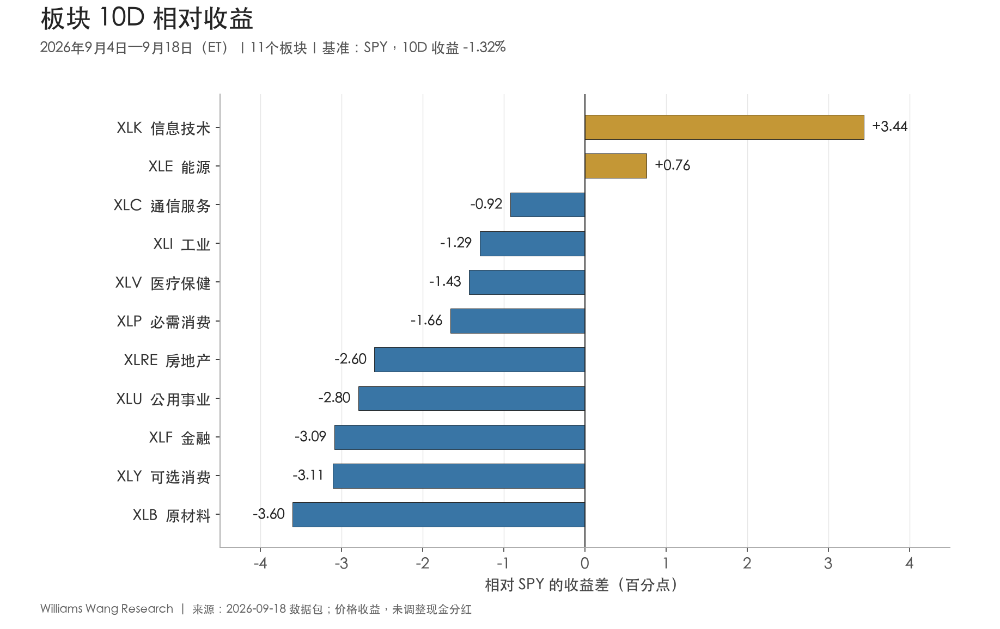
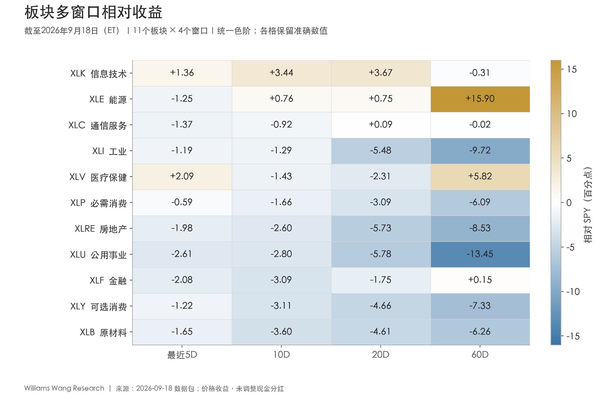
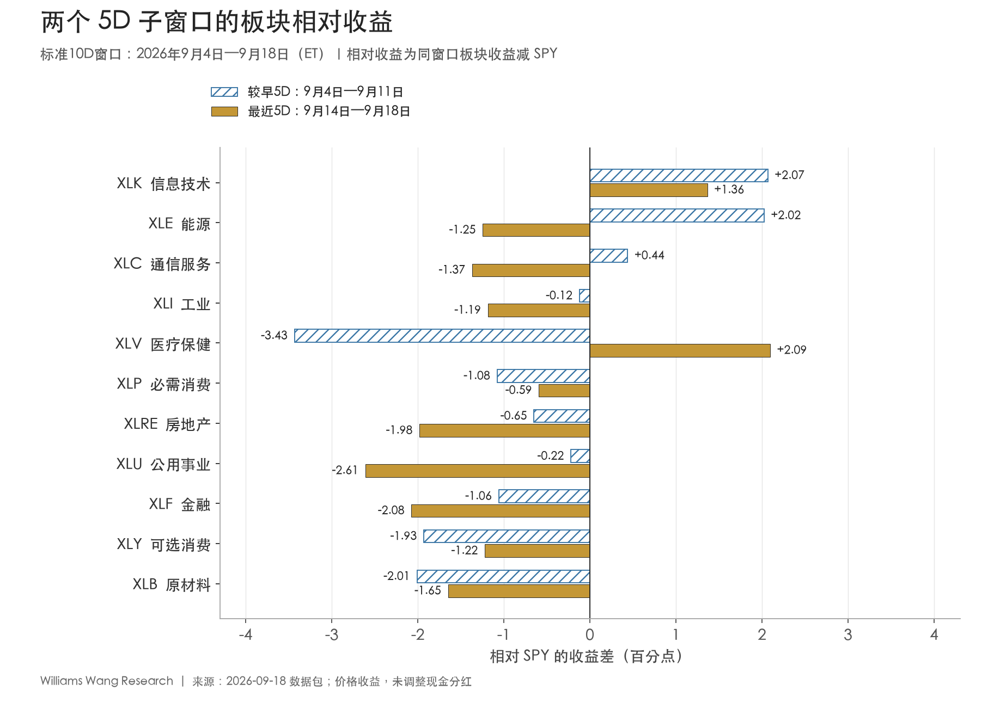

+++
title = "2026年9月18日板块轮动双周复盘：科技领涨，能源降温，广度继续收缩"
date = "2026-09-19"
data_as_of = ["2026-09-15", "2026-09-17", "2026-09-18"]
draft = false
description = "复盘截至9月18日的板块轮动、科技领先、能源降温与市场广度。"
series = "市场板块轮动双周复盘"
categories = ["市场结构", "宏观与政策"]
tags = ["板块轮动", "ETF", "市场广度"]
featured = false
private = false
content_preservation = "verbatim"
source_sha256 = "991f2c59bf5db1c5775b262e2c415189c2424fafa591dfbc341b2d7253fa6789"
source_front_matter_reviewed = true
report_period_et = "2026-09-04 至 2026-09-18"
prepared_date_sgt = "2026-09-19"
return_basis = "close-to-close price return; cash distributions not adjusted"
[cover]
as_of = "20260918"
subtitle = "科技领涨，能源降温，广度继续收缩"
+++

# 2026年9月18日板块轮动双周复盘：科技领涨，能源降温，广度继续收缩

## Executive Summary

- **科技成为本期唯一上涨板块，指数之间的分化扩大。** 完整10D内，XLK上涨2.12%，领先SPY 3.44个百分点；QQQ上涨0.61%，SPY下跌1.32%，等权RSP与小盘IWM分别下跌3.44%、3.78%。科技和成长代理表现突出，尚未伴随广泛股票参与度改善。

- **板块广度继续收缩，排名靠前并不意味着趋势转强。** 11个板块只有1个上涨、2个跑赢SPY；20D均线上方板块由9月3日的5个，降至9月11日的3个，再降至9月18日的2个。板块平均收益为-2.80%，中位数为-2.98%；工业排名从第11升至第4，仍在5D、10D、20D和60D全部落后SPY。

- **能源的完整窗口抗跌掩盖了近期降温，医疗修复尚不足以构成防御板块普涨。** XLE完整10D仅下跌0.56%、领先SPY 0.76个百分点，但最近5D下跌1.44%、落后1.25个百分点；XLV最近5D上涨1.90%，而XLU下跌2.80%。持续两个5D跑赢SPY的板块仅XLK，leader延续与局部反弹需要分别判断。

- **利率、信用和波动率提供混合确认，宏观事件不能代替价格证据。** 相对9月3日，2Y收益率截至9月17日上升33bp，HY OAS扩大5bp；但最近一段10Y、30Y收益率分别下降2bp、6bp，VIX回落0.40点，长久期债券相对改善。完整10D承压与近期局部缓和并存，现有证据不足以确认广泛的risk-on切换。

## 一、观察窗口与收益口径

本报告以**2026年9月18日美股收盘**为股票观察终点。 报告覆盖最近10个美股交易日，不按两个完整自然周替代；市场和宏观数值均以用户提供的数据包为准，外部检索仅补充事件背景。

| 用途 | 覆盖交易日（ET） | 收益基准收盘日 |
|---|---|---|
| 完整报告期／10D | 9月4日—9月18日 | 9月3日 |
| 较早5D | 9月4日—9月11日 | 9月3日 |
| 最近5D | 9月14日—9月18日 | 9月11日 |
| 排名比较期 | 8月21日—9月3日 | 8月20日 |
| 20D／60D背景 | 均截至9月18日 | 分别为8月20日／6月24日 |

所有ETF收益为美元计价的收盘到收盘**价格收益，不调整现金分红**。相对收益为同窗口ETF收益减SPY收益，单位为百分点（pp），不是总回报，也不是价格比率涨幅。两个5D的绝对收益以复利衔接成10D；不能将两个子窗口收益简单相加。

## 二、科技与成长表现突出，等权和小盘没有同步修复

**本期首先体现为参与度不均，而非整体市场企稳。** QQQ在完整10D上涨0.61%，最近5D上涨0.98%，期末已在20D均线上方；SPY完整10D下跌1.32%，最近5D仍小幅下跌0.19%。RSP和IWM在前后两个5D均下跌，期末均在20D均线下方，广度没有跟随QQQ改善。

| 市场代理 | 较早5D | 最近5D | 10D | 20D | 60D | 20D均线 |
|---|---|---|---|---|---|---|
| SPY 标普500 | -1.13% | -0.19% | -1.32% | +0.05% | +4.06% | 下方 |
| QQQ 纳斯达克100 | -0.37% | +0.98% | +0.61% | +1.56% | +1.61% | 上方 |
| RSP 标普500等权 | -2.30% | -1.17% | -3.44% | -3.54% | +1.00% | 下方 |
| IWM 罗素2000 | -2.08% | -1.74% | -3.78% | -4.58% | -4.27% | 下方 |

*表注：全部为价格收益；20D均线状态以9月18日收盘判断。SPY的20D价格收益接近零，并不意味着它已站上20D均线，两者比较基准不同。*

RSP−SPY的10D、20D收益差分别为-2.12pp、-3.59pp；IWM−SPY分别为-2.46pp、-4.63pp，60D更落后8.32pp。最近5D差距仍在扩大，分别为-0.97pp、-1.54pp。因而，当前不能用市值加权指数的韧性来代表广泛股票的状态。

11个板块的10D平均收益为**-2.80%**、中位数为**-2.98%**；剔除排名第一的XLK，其他10个板块平均下跌**3.29%**。20D均线上方的板块数由期前5个，经5D分界时的3个，降到期末2个，仅剩XLK与XLE。这里的广度是板块ETF层面的统计，不等于成分股上涨家数。

图中只有XLK和XLE跑赢SPY，第三名XLC也落后0.92pp。最强与最弱板块的收益差为**7.04pp**，横截面标准差为**1.96个百分点**（11个板块总体标准差，未年化）。这些数值说明分化与上涨覆盖有限；没有更长历史分布，不能据此赋予经校准的“强轮动”或“弱轮动”等标签。

截止日的表现延续了这种集中：9月18日SPY微涨0.05%、QQQ上涨0.72%，RSP和IWM分别下跌0.39%、0.49%，11个板块中只有3个上涨。单日数据不足以预测下一交易日，但也没有提供本期结束时广度已普遍修复的证据。

## 三、科技的20D领先得到确认，60D仍有缺口；能源由延续转为降温

**XLK是短期持续性最清晰的leader，但不同时间尺度仍未完全统一。** 其10D上涨2.12%、领先SPY 3.44pp，20D上涨3.72%、领先3.67pp；60D虽上涨3.75%，仍落后SPY 0.31pp。因此，证据已超出单个5D反弹，支持短中期相对改善，但还不能概括成所有窗口一致的领先。

| 板块 | 比较期→本期排名 | 10D收益 | 10D相对SPY | 20D相对SPY | 60D相对SPY | 20D均线 |
|---|---|---|---|---|---|---|
| XLK 信息技术 | 3 → 1 | +2.12% | +3.44pp | +3.67pp | -0.31pp | 上方 |
| XLE 能源 | 4 → 2 | -0.56% | +0.76pp | +0.75pp | +15.90pp | 上方 |
| XLC 通信服务 | 2 → 3 | -2.24% | -0.92pp | +0.09pp | -0.02pp | 下方 |
| XLI 工业 | 11 → 4 | -2.61% | -1.29pp | -5.48pp | -9.72pp | 下方 |
| XLV 医疗保健 | 5 → 5 | -2.75% | -1.43pp | -2.31pp | +5.82pp | 下方 |
| XLP 必需消费 | 7 → 6 | -2.98% | -1.66pp | -3.09pp | -6.09pp | 下方 |
| XLRE 房地产 | 10 → 7 | -3.91% | -2.60pp | -5.73pp | -8.53pp | 下方 |
| XLU 公用事业 | 9 → 8 | -4.11% | -2.80pp | -5.78pp | -13.45pp | 下方 |
| XLF 金融 | 1 → 9 | -4.41% | -3.09pp | -1.75pp | +0.15pp | 下方 |
| XLY 可选消费 | 8 → 10 | -4.43% | -3.11pp | -4.66pp | -7.33pp | 下方 |
| XLB 原材料 | 6 → 11 | -4.92% | -3.60pp | -4.61pp | -6.26pp | 下方 |

*表注：排名按完整10D绝对收益排序；“比较期→本期”对应8月21日至9月3日与9月4日至18日。相对收益以pp列示；小幅差异可能对分红和价格调整口径敏感。*

**XLE完整10D仍相对抗跌，最近5D的路径却已改变。** 较早5D上涨0.90%、领先SPY 2.02pp，最近5D转为下跌1.44%、落后1.25pp。它仍在20D均线上方，20D、60D相对收益为+0.75pp、+15.90pp，说明中期积累尚在；但10D第2名主要保留了前段的相对优势，不能把这个排名当作最近一周仍在领涨。

XLC排第3，但自身10D下跌2.24%，最近5D落后SPY 1.37pp，20D相对优势也只有+0.09pp，60D近乎持平、略为负值。它的“前三”更多反映其他板块跌得更深，不能与XLK的绝对上涨并列解释。

图中没有任何板块在5D、10D、20D、60D四个窗口全部跑赢SPY。20D跑赢者为XLK、XLE和XLC；其中XLC接近零。60D跑赢者为XLE、XLV、XLF，而XLF仅领先0.15pp，且近期落后。长期积累与近期leader的错位表明，当前仍是选择性轮动，尚未形成跨窗口一致的广泛趋势。

**金融和原材料是本期较明确的弱势观察对象，工业的排名改善则容易误读。** XLF从比较期第1降至第9，10D下跌4.41%、落后SPY 3.09pp；XLB从第6降至第11，10D下跌4.92%、落后3.60pp。XLI从第11升至第4，但10D仍下跌2.61%，20D和60D分别落后SPY 5.48pp和9.72pp，最近5D相对落后反而由前段的0.12pp扩大到1.19pp。排名上升只说明相对其他板块的位置变了，不能单独证明趋势好转。

## 四、排名重排与5D延续性：科技持续，医疗反弹，能源和通信转弱

**总体排名有重排，但延续性集中在单一板块。** 本期与等长比较期的排名相关系数为0.26，Top-3重合2个，为XLK和XLC；3个板块排名移动至少5位，分别是XLF下降8位、XLI上升7位、XLB下降5位。Top-3重合度描述相邻10D区间的排序，不能替代两个5D内部路径的持续性检验。

较早5D有3个板块跑赢SPY，最近5D降至2个；持续两段跑赢者仅XLK。最近5D的另一个相对赢家是XLV，其相对收益由前段-3.43pp回升至+2.09pp；XLE、XLC则从正相对收益转负。

图中的蓝色斜线条为9月4日至11日，金色实心条为9月14日至18日。XLK两段绝对收益分别为+0.94%、+1.17%，相对领先分别为+2.07pp、+1.36pp；它持续上涨，但相对SPY的领先幅度有所收窄。不能把绝对收益上升与相对优势扩大混为一谈。

**XLV的修复幅度最大，但目前仍是局部反弹。** 较早5D下跌4.56%，最近5D上涨1.90%，使完整10D仍下跌2.75%；20D相对收益为-2.31pp，且收盘仍在20D均线下方。同期XLU最近5D下跌2.80%、落后SPY 2.61pp，XLRE下跌2.18%、落后1.98pp。医疗反弹没有扩展为公用事业、必需消费等防御板块的共同上涨。

XLP、XLY、XLB最近5D的相对跌幅有所收窄，但两个子窗口都落后SPY；XLF、XLRE、XLU的相对落后则扩大。后续需要分别验证“持续领先”“从低位修复”和“跌幅收窄”，不能将三种状态都归为趋势反转。

## 五、成长与动量领先，周期和防御都缺少广泛支撑

**成长风格的相对优势比整体市场广度更清晰。** SPYG−SPYV在最近5D为+2.04pp、10D为+2.27pp、20D为+2.99pp；IWF−IWD最近5D为+2.12pp、10D为+2.94pp。这与科技领涨方向相容，但不构成科技收益由某个纯风格因子驱动的证明。

| 代理／定义 | 最近5D | 10D | 20D | 60D |
|---|---|---|---|---|
| 成长−价值（SPYG−SPYV） | +2.04pp | +2.27pp | +2.99pp | +2.55pp |
| 大型成长−大型价值（IWF−IWD） | +2.12pp | +2.94pp | +3.04pp | -1.32pp |
| 等权−市值加权（RSP−SPY） | -0.97pp | -2.12pp | -3.59pp | -3.06pp |
| 小盘−大盘（IWM−SPY） | -1.54pp | -2.46pp | -4.63pp | -8.32pp |
| 动量−市场（MTUM−SPY） | +1.12pp | +4.73pp | +1.43pp | -9.77pp |
| 质量−市场（QUAL−SPY） | +0.10pp | -0.22pp | -1.08pp | -0.85pp |
| 低波−市场（USMV−SPY） | -1.21pp | -1.83pp | -2.11pp | -0.11pp |
| 周期−防御（组合均值差） | -1.11pp | -0.11pp | +0.58pp | +3.12pp |
| 高收益−投资级（HYG−LQD） | -0.17pp | -0.10pp | -0.01pp | +2.66pp |
| 长久期−中久期（TLT−IEF） | +0.63pp | +0.54pp | +0.98pp | -2.93pp |

*表注：全部为同窗口价格收益差，单位pp。周期组为XLY、XLF、XLI、XLB、XLE等权；防御组为XLP、XLU、XLV等权。所有代理混合了行业、规模、估值、久期或信用暴露，未经风险标准化。*

MTUM−SPY的10D相对收益达到+4.73pp，MTUM自身上涨3.41%；20D也领先1.43pp，但60D仍落后9.77pp。当前可描述为动量ETF近期修复和相对领先，不能将其提升为已验证的动量策略收益，更不能在缺少持仓数据时断言由哪几个板块贡献。

质量代理QUAL−SPY在最近5D仅略为正值，10D仍为-0.22pp；低波USMV−SPY的5D、10D分别为-1.21pp、-1.83pp。**行情没有形成“成长上涨、其余防御资产普遍托底”的整齐结构。**

周期组10D平均下跌3.39%，防御组平均下跌3.28%，差值仅-0.11pp。剔除XLE后，将其余四个周期板块重新等权，周期相对防御的差值降至-0.81pp；最近5D原周期／防御差为-1.11pp。能源仍对完整窗口的周期组相对表现有支持，但非能源周期没有提供扩张确认，两组绝对收益也都为负。

| 商品／跨资产代理 | 最近5D | 10D | 20D | 60D |
|---|---|---|---|---|
| USO 原油期货 | -0.26% | +8.56% | +14.65% | +45.12% |
| DBC 广义商品 | +0.06% | +3.25% | +6.08% | +24.76% |
| GLD 黄金 | +0.80% | -2.13% | -3.32% | +9.72% |
| UUP 美元 | +1.00% | +1.14% | +1.50% | -0.70% |

*表注：均为ETF价格收益。USO、DBC包含期货期限结构和换月影响，不等同于现货商品收益；UUP、GLD也不应被当作对宏观变量的无误差测量。*

**商品的完整10D涨幅集中在较早5D。** USO前段上涨8.84%，最近5D下跌0.26%；DBC前段上涨3.19%，最近5D仅上涨0.06%。这与能源股最近5D转弱方向相容，说明商品与能源的边际动能已经不同于完整窗口的高涨幅。

UUP最近5D上涨1.00%，GLD同期回升0.80%，但GLD完整10D仍下跌2.13%。美元和黄金在短窗口同涨，无法简单归纳为单一的risk-on或risk-off叙事。WTI现货的最新观察仅到9月15日，仍高于期前；不能用这个较早终点否认截至9月18日商品ETF的后段降温。

## 六、利率曲线继续走平，长端与VIX近期缓和，高收益信用未确认

**完整报告期的利率压力与最近一段的长端缓和同时存在。** 下表以9月3日为期前基准，并另列相对9月11日的变化；后一列严格截至各指标的最新可用日，不能统一称为完整5D宏观变化。

| 指标 | 9月3日水平 | 最新水平 | 较9月3日 | 较9月11日 | 最新观察日 |
|---|---|---|---|---|---|
| 2Y美债收益率 | 4.34% | 4.67% | +33bp | +4bp | 2026-09-17 |
| 10Y美债收益率 | 4.77% | 4.94% | +17bp | -2bp | 2026-09-17 |
| 30Y美债收益率 | 5.25% | 5.29% | +4bp | -6bp | 2026-09-17 |
| 10Y实际收益率 | 2.42% | 2.61% | +19bp | +1bp | 2026-09-17 |
| 10Y breakeven | 2.35% | 2.33% | -2bp | -3bp | 2026-09-18 |
| 10Y−2Y曲线利差 | 0.43% | 0.25% | -18bp | -8bp | 2026-09-18 |
| 10Y−3M曲线利差 | 0.88% | 0.87% | -1bp | -2bp | 2026-09-18 |
| 高收益债OAS | 2.65% | 2.70% | +5bp | +5bp | 2026-09-17 |
| 投资级公司债OAS | 0.81% | 0.78% | -3bp | -2bp | 2026-09-17 |
| VIX | 14.32 | 15.44 | +1.12点 | -0.40点 | 2026-09-17 |
| WTI现货 | $92.55 | $107.02 | $+14.47 | $+5.75 | 2026-09-15 |

*表注：利率、breakeven、OAS水平用%；变化用bp，1bp=0.01个百分点。VIX用指数点，WTI用美元／桶。两个基准日在本包中均有真实观测；所有终值保留各自日期。*

**前端上行更多，最近一段长端开始回落。** 从9月3日至共同终点9月17日，2Y、10Y、30Y收益率分别上升33bp、17bp、4bp；从9月11日至17日，则分别变化+4bp、-2bp、-6bp。完整窗口呈收益率上行并走平，后段则是前端上行与长端回落并存，不能概括成所有期限继续同向上升。

同日对齐至9月17日，10Y−2Y为27bp，相对期前43bp收窄16bp；表中独立T10Y2Y序列延伸至9月18日为25bp、收窄18bp。差异来自观察终点，不是两套数据互相否定。10Y实际收益率同期上升19bp，10Y breakeven下降2bp，与名义10Y上升17bp在算术上相符；breakeven还包含风险溢价及流动性因素，不能据此声称“纯通胀预期”下降了同样幅度。

TLT最近5D上涨0.41%，IEF下跌0.22%，长／中久期价格收益差为+0.63pp，与近期长端相对缓和方向相容。但完整10D两者仍分别下跌0.98%、1.53%，长债相对抗跌并不等于整个报告期已实现正收益。

**信用市场存在层次分化。** 截至9月17日，HY OAS相对9月3日和9月11日均扩大5bp；投资级OAS分别收窄3bp、2bp。HYG−LQD的10D、最近5D分别为-0.10pp、-0.17pp，方向上与高收益信用没有同步改善相容，但幅度较小，也受两只ETF久期、票息和分红差异影响。

VIX较9月3日上升1.12点，较9月11日下降0.40点。这是本期风险压力出现局部缓和的证据；结合HY OAS扩大、股票广度低迷，尚不足以确认全面的风险偏好回升。收益率、信用和VIX的终点均早于股票终点一天，WTI更早；报告没有把这些快照表述为9月18日的同步收盘状态。

## 七、外部上下文：CPI、零售和FOMC为背景，价格归因仍需验证

**本期已发生的政策事件与前端利率压力方向相容，但不是对所有资产路径的完整解释。** 下列事件均在9月4日至18日发布；月度统计所属月份与发布时间不同。

| 发布日（ET） | 官方已核实信息 | 对本期解释的边界 |
|---|---|---|
| 9月4日 | BLS公布8月非农就业增加16.2万人，失业率为4.1%。 | 为劳动力市场提供背景；没有一致预期与日内识别，不能直接称为利率变化的原因。 |
| 9月11日 | BLS公布8月CPI环比+0.4%、同比+3.4%；核心CPI环比+0.3%、同比+2.4%。 | 总体价格压力与核心同比降温并存，解释证据混杂；不能用单一数据给全部板块贴宏观标签。 |
| 9月16日 | 美国人口普查局公布8月零售和餐饮销售环比+1.2%、同比+6.0%，数据经季节、节假日和交易日调整，但未剔除价格变化。 | 这是名义销售，不能直接解释为实际消费量同比增长6%；XLY仍明显落后，宏观总量与股票定价并不一一对应。 |
| 9月16日 | 美联储将联邦基金利率目标区间上调25bp至3.75%—4.00%。 | 是已发生的政策事实，与前端收益率上行方向相容；不能将整个10D变化都归因于会议，更不能预设市场对此是意外反应。 |

来源：[BLS就业报告，9月4日](https://www.bls.gov/news.release/empsit.htm)、[BLS CPI报告，9月11日](https://www.bls.gov/news.release/cpi.htm)、[美国人口普查局零售发布，9月16日](https://www.census.gov/retail/sales.html)、[美联储FOMC声明，9月16日](https://www.federalreserve.gov/newsevents/pressreleases/monetary20260916a.htm)。本次已读取官方页面；BLS和人口普查局链接为当前发布页，后续可能更新。

**可以提出的解释是：政策与前端利率压力没有阻止科技及成长的选择性领先，而长端和VIX近期缓和也没有传导成股票广度的普遍改善。** 这仍是跨资产证据的组合解读。本包缺少行业盈利预期、估值变化、资金流和事件预期差，无法识别科技强势究竟由盈利、配置、风险溢价或其他机制主导；也不能将公用事业和房地产的下跌简单归因于本期名义长端利率变化。

## 八、下一期观察：验证科技延续、能源降温与广度能否扩散

以下为研究确认条件，不是买卖触发器。

| 观察问题 | 支持当前判断延续的证据 | 会促使重新评估的证据 |
|---|---|---|
| 科技能否保持leader？ | XLK后续5D仍有正绝对及相对收益，20D优势保持，60D缺口逐步收窄。 | XLK相对收益转负、失去20D均线上方位置，或20D优势迅速回吐。 |
| 领先能否扩展到更广市场？ | RSP−SPY、IWM−SPY改善，20D均线上方板块数从2/11回升，并出现更多持续相对赢家。 | QQQ、XLK保持韧性，而等权、小盘与多数板块继续落后。 |
| 能源是降温还是重新走弱？ | XLE后续5D恢复相对领先，商品ETF后段重新增强，并由更新后的现货数据支持。 | XLE继续落后SPY，20D相对优势消失，商品代理同步转弱。 |
| 医疗修复是否能延续？ | XLV恢复20D均线上方位置，20D相对缺口收窄，反弹不局限于一个5D。 | 最近5D涨幅回吐、20D相对表现继续恶化；其他防御板块仍无改善。 |
| 近期宏观缓和能否获得信用确认？ | 在同日对齐的数据上，HY OAS停止扩大，VIX保持缓和，并伴随广度修复。 | 长端／VIX的缓和仍只局限于部分资产，高收益信用与股票广度持续弱势。 |

后续宏观判断应先把利率、OAS、VIX与WTI更新至相容的观察日，再讨论政策后的延续性。对本期科技领先是否具有可预测性，需要更长历史、风险标准化、交易成本及样本外检验；这不由本报告的排名与收益差直接推出。

## 免责声明

本文所载观点与意见仅代表作者个人立场，基于所列历史市场数据、宏观快照及已注明的公开来源进行描述性研究，仅供一般性信息与教育参考，不构成任何形式的投资建议、理财建议、交易建议、仓位建议、买卖证券的推荐或收益承诺，亦不构成购买或出售任何金融工具的邀请或要约。历史表现、相对强弱、模型指标和情景条件不代表未来结果；相关性与同期变化不构成因果证明。数据可能存在发布时滞、修订、价格调整及现金分红处理限制。读者应结合自身目标、风险承受能力及其他独立信息作出判断，并自行承担相关决策风险。
