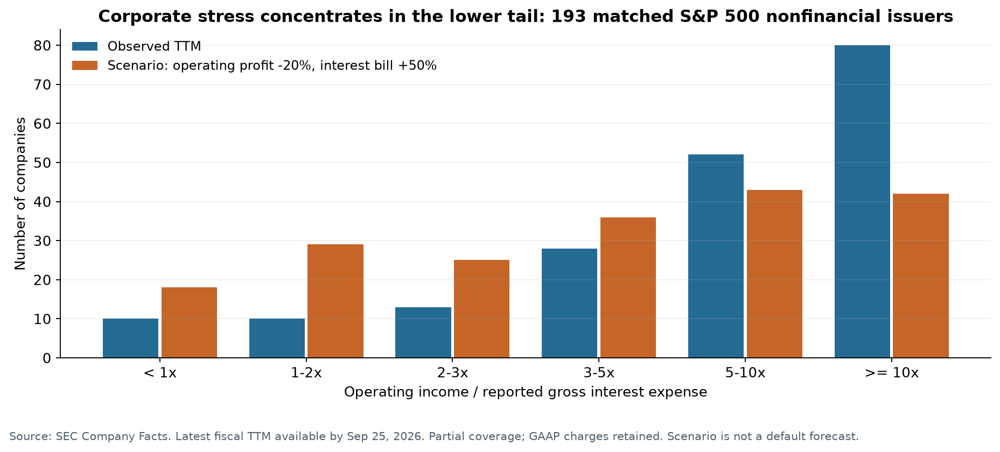
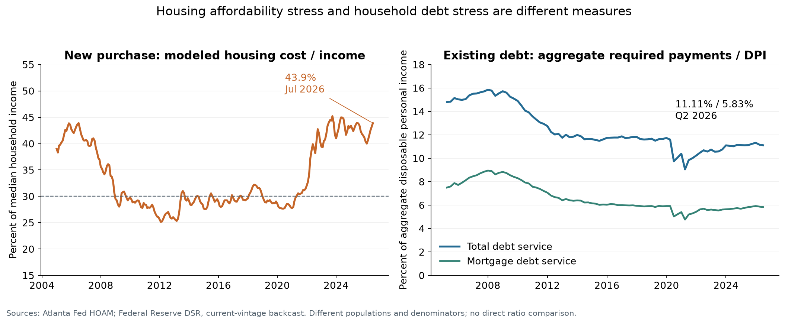
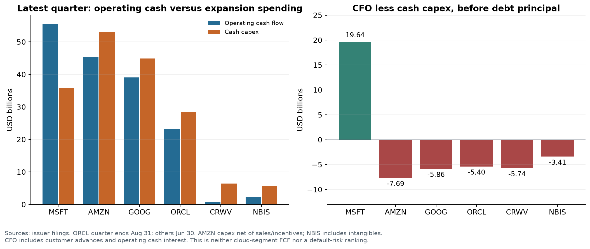

+++
title = "美国高利率的部门压力与传染链条"
date = "2026-09-25"
data_as_of = ["2026-06-30", "2026-07-31", "2026-08-31", "2026-09-23", "2026-09-24", "2026-09-25"]
data_as_of_note = "各序列保留各自观测日；国债曲线截至9月24日，SOFR及债券收益率截至9月23日，企业披露与研究核查截至9月25日，家庭、住房和商业地产指标分别保留季度或月度时点。"
draft = false
description = "研究高利率对美国企业、住房、AI云、商业地产与信贷中介的不同压力，以及向国债曲线传导的条件。"
series = ""
categories = ["宏观与政策", "公司研究"]
tags = ["美国利率", "国债收益率曲线", "企业信用", "住房", "AI基础设施", "商业地产"]
featured = false
private = false
content_preservation = "verbatim"
source_sha256 = "386598ef5d829aff569d21e0fdcb831ad33572a0ddcbed45af18599a679393a2"
+++



# 美国高利率的部门压力与传染链条

研究日期：2026年9月25日（Asia/Singapore）  
市场基准：美国财政部9月24日收盘曲线；其他序列保留各自最新观测日。  
研究范围：企业、家庭住房、AI云基础设施、商业地产与信贷中介；讨论未来数月到两年的传导，并连接收益率曲线。暂不讨论黄金、具体交易和仓位。

## 1. 当前证据支持什么判断

**当前美国经济更接近“压力分布不均、在融资和投资决策上先发生调整”，尚无充分证据支持“整个企业与家庭部门已经接近共同的利率承受极限”。**

最值得区分的三种“先出问题”是：

| 问题类型 | 当前最值得关注的对象 | 最可能先发生的变化 |
|---|---|---|
| 最先改变行为 | 新购房者、开发商、需要新增融资的投资项目 | 放弃或推迟交易、提高优惠、缩减或延后资本开支 |
| 最容易出现信用损失 | 经营与抵押物同时恶化、临近到期的部分商业地产；低覆盖倍数的杠杆借款人 | 注资续贷、延长到期、PIK、重组、处置抵押物 |
| 最可能放大冲击 | 风险暴露集中的银行、非银信贷机构，以及有杠杆和流动性约束的投资者 | 收紧新贷款、追加抵押、资产出售、跨市场去杠杆 |

这是一份有条件的脆弱性排序，不是违约概率排名。**能否持续取得资金、何时需要还本，以及收入和抵押物如何变化，往往比“10年国债是否超过5%”更接近真正的约束。**

本次实证的四个主要发现：

1. **大型非金融上市公司的中位数仍有较厚的利息覆盖，但尾部明显脆弱。**193家可匹配完整四季度数据的标普500非金融公司，经营利润/报告利息费用中位数为7.92倍；20家低于2倍。假设经营利润下降20%、利息费用增加50%，低于2倍的公司增加到47家。这里的50%是利息账单的假设增幅，不能直接理解成加息50bp。
2. **住房压力主要集中在新增购房能力，存量家庭总体偿债负担尚未回到2006—2007年的水平。**2026年7月，Atlanta Fed模型中的中位住房成本约占中位家庭收入43.88%；2026Q2美国家庭总体债务偿付/可支配收入为11.11%，2007Q4为15.85%。两个指标覆盖的群体和分母不同，必须分别解释。
3. **AI需要重点研究扩张融资，而不能只看能否付利息。**微软、亚马逊、Alphabet的经营利润/报告利息费用仍高；亚马逊和Alphabet最新季度的经营现金流已经不足以覆盖当期现金资本开支。Oracle、CoreWeave、Nebius还需要仔细拆解客户预付款、股权融资和债务提款。
4. **融资渠道目前仍然开放，这是“即将发生普遍融资危机”的重要反证。**CoreWeave于9月22日完成42亿美元可转债融资；Nebius于8月24日完成57.5亿美元可转债融资。银行业二季度贷款余额和存款也继续增长。融资依赖确实存在，但不能把它直接写成融资已经中断。

上述计算与来源在下文逐项展开。企业筛查为**G2：有可复核结果，但覆盖不完整、会计口径仍有限制**；官方曲线和家庭指标的已发布观测为**G3**；跨部门传染顺序和未来曲线路径为**G1—G2条件推断**，没有校准违约概率或利率方向概率。

## 2. “现在利率很高”究竟是哪一层高

| 指标 | 最新核实值 | 观测日 | 对谁更直接 |
|---|---:|---|---|
| 2年期国债 | 4.87% | 9月24日 | 中短期政策预期、部分融资定价 |
| 5年期国债 | 5.03% | 9月24日 | 中期债券、项目融资与资产估值 |
| 10年期国债 | 5.18% | 9月24日 | 长期融资、房贷与折现率 |
| 30年期国债 | 5.47% | 9月24日 | 长久期资产、养老金和保险负债匹配 |
| 10年TIPS实际收益率 | 2.85% | 9月24日 | 长期实际折现与实际期限风险定价 |
| SOFR | 3.87% | 9月23日 | 与SOFR挂钩的浮息贷款；实际重置还取决于期限、合同和对冲 |
| 有效联邦基金利率 | 3.88% | 9月23日 | 当前隔夜政策利率环境 |
| Freddie Mac 30年固定房贷 | 7.03% | 9月24日当周 | 符合调查条件的新申请房贷；非所有家庭实际票息 |
| ICE BofA BBB公司债有效收益率 / OAS | 6.01% / 0.95% | 9月23日 | 投资级融资环境的市场参照 |
| ICE BofA高收益债有效收益率 / OAS | 7.68% / 2.73% | 9月23日 | 高收益发行人的市场参照 |

来源：[财政部名义曲线](https://home.treasury.gov/resource-center/data-chart-center/interest-rates/TextView?field_tdr_date_value=2026&type=daily_treasury_yield_curve)、[实际曲线](https://home.treasury.gov/resource-center/data-chart-center/interest-rates/TextView?field_tdr_date_value=2026&type=daily_treasury_real_yield_curve)、[FRED SOFR](https://fred.stlouisfed.org/series/SOFR)、[EFFR](https://fred.stlouisfed.org/series/EFFR)、[BBB有效收益率](https://fred.stlouisfed.org/series/BAMLC0A4CBBBEY)、[HY有效收益率](https://fred.stlouisfed.org/series/BAMLH0A0HYM2EY)、[BBB OAS](https://fred.stlouisfed.org/series/BAMLC0A4CBBB)、[HY OAS](https://fred.stlouisfed.org/series/BAMLH0A0HYM2)、[Freddie Mac](https://www.freddiemac.com/pmms)。指数有效收益率不等于某家公司的新发债成交利率，也不是存量债务平均票息。

**一个容易忽略的事实是：当前长端收益率很高，但SOFR和当前政策利率并没有处于2023年的高度。**长端上升会立即改变新项目的折现与融资报价；存量固定债务的现金利息要等到再融资才变化。浮息借款人的直接负担主要跟随合同基准，不能把10年收益率的每一个基点都加到它的账单上。

对最近行情也需要保留窗口差异：

| 起止日 | 2Y变化 | 5Y变化 | 10Y变化 | 30Y变化 | 10Y实际收益率变化 | 10Y−2Y利差变化 |
|---|---:|---:|---:|---:|---:|---:|
| 9月10日→24日 | +31bp | +28bp | +23bp | +10bp | +30bp | −8bp |
| 9月17日→24日 | +20bp | +25bp | +24bp | +18bp | +24bp | +4bp |
| 9月22日→24日 | +16bp | +20bp | +22bp | +18bp | +22bp | +6bp |

因此，两周窗口可称bear flatten；最近一周的2s10s略有bear steepening。9月23日10Y单日上涨15bp、实际收益率上涨13bp。这些是曲线观测，尚不能识别卖空交易、政策预期和期限溢价各自的因果贡献。

实际收益率也不是“纯粹的未来实际短期利率预期”：

$$
y^{TIPS}_{n}\approx \frac{1}{n}\sum_{t=1}^{n}E[r_t]+TP^{real}_{n}+L^{TIPS}_{n}.
$$

这里最后一项概括TIPS流动性等定价影响。即使实际收益率贡献了大部分名义收益率上涨，也不能仅凭这一点判定究竟是预期短期利率还是实际期限溢价上升。本次部门研究没有取得完整OIS远期和同日模型分解，因而不能据此证明“市场高估了加息持续时间”。

## 3. 企业：用利润检验付息能力，再单独检验到期融资

### 3.1 实际覆盖范围与指标

以9月23日SPY持仓核对指数股票，503个股票类别按CIK合并为500家公司；剔除76家GICS金融公司，余下424家非金融公司。向SEC取得全体424家的Company Facts，再逐家公司匹配经营利润与利息费用期间。金融公司的融资成本同时也是业务成本，不适合混入这个ICR筛查。[SPY官方持仓](https://www.ssga.com/us/en/institutional/library-content/products/fund-data/etfs/us/holdings-daily-us-en-spy.xlsx)、[SEC XBRL接口说明](https://www.sec.gov/search-filings/edgar-application-programming-interfaces)。CIK及行业分类另用[成分映射表](https://en.wikipedia.org/wiki/List_of_S%26P_500_companies)核对，未用其提供财务值。

本研究的筛查指标为：

$$
ICR_{op}=\frac{\text{Operating income}}{\text{报告利息费用}}.
$$

采用Operating income，可以避免非经营性投资重估收益把偿债能力抬高。它与某些评级机构、银行契约或Fed定义的EBIT/interest并不完全一致，资本化利息和租赁的分类也会影响可比性。

- 最新季度：215家公司；期间结束日介于5月10日与8月31日，使用各公司当时最新披露财政季度，非统一自然季度。
- 完整TTM：193家公司，约为424家非金融公司的45.5%；由直接披露的全年或连续四个相邻季度组成。
- 有同日可识别债务余额、可做额外利率敏感性的TTM子样本：110家。
- 仅使用截至9月25日已经提交的10-K/10-Q等事实。缺失值不设为零；不使用过时的可匹配季度冒充最新季度；存在未解决标准标签冲突的观测不进入主样本。

**这不是完整标普500普查，更不是美国全部企业的随机样本。**标准标签未覆盖的公司、采用自定义标签的公司、私人企业和小企业均可能具有不同风险。财报中的一次性减值、重组和股票薪酬未统一调整，所以低ICR是核查起点，不能直接等同现金违约。

### 3.2 已观察到的承受能力

| 样本 | 中位数ICR | 第10百分位ICR | 合计经营利润/合计利息 | ICR<1 | ICR<2 | ICR<3 |
|---|---:|---:|---:|---:|---:|---:|
| 最新季度，215家 | 9.13x | 1.92x | 11.24x | 9 | 23 | 31 |
| TTM，193家 | 7.92x | 1.98x | 10.83x | 10 | 20 | 33 |

两个分布特征同时成立：中位公司距离经营利润不能覆盖报告利息仍较远；低覆盖的尾部已经存在。合计比率又高于中位数，说明直接使用“标普整体利润÷整体利息”会进一步掩盖分布。

193家公司按行业拆分后，TTM中位数在信息技术约13.75倍、公用事业约2.55倍、房地产约3.09倍。但后两者具有不同资本密集度、监管收入机制与折旧特征，**不能仅按这三个数字排列违约风险**。各行业样本数差异较大，完整分布保存在数据表。

作为更广泛、但不同口径的对照，Fed对公开非金融公司的统计显示，2025Q4全体中位ICR约2.76倍，非投资级公司约1.82倍。它排除了低杠杆、低利息支付公司，并采用不同EBIT口径；不能把它与本研究7.92倍拼成时间序列。它说明标普大型公司样本之外的尾部同样值得研究。[Fed金融稳定报告及图2.6](https://www.federalreserve.gov/publications/2026-may-financial-stability-report-borrowing.htm)、[可下载数据表](https://www.federalreserve.gov/publications/2026-may-financial-stability-report-accessibility-tables.htm)。

### 3.3 压力测试：利润与融资同时恶化，尾部扩张更明显

对193家公司使用相同的会计压力参数，亏损公司按亏损绝对值进一步恶化处理：

$$
ICR^{stress}_i=\frac{OI_i-d|OI_i|}{I_i(1+g)}.
$$

| 情景假设 | 中位ICR | ICR<1 | ICR<2 | ICR<2占样本 |
|---|---:|---:|---:|---:|
| 已披露基线 | 7.92x | 10 | 20 | 10.4% |
| 经营利润恶化10%，利息增加25% | 5.70x | 11 | 33 | 17.1% |
| 经营利润恶化20%，利息增加50% | 4.22x | 18 | 47 | 24.4% |
| 经营利润恶化30%，利息增加50% | 3.69x | 21 | 58 | 30.1% |

这些参数是透明敏感性，未通过宏观模型校准，既不是基准预测，也不是违约概率。ICR为1或2只是诊断阈值，并非统一债务契约。负ICR的绝对大小也不宜作为亏损企业信用质量的排序依据。

把利率直接映射到企业时，应改用：

$$
\Delta I_i\approx D^{repricing}_i\Delta r_i,
\qquad
\Delta r_i=\Delta benchmark_i+\Delta spread_i.
$$

110家有可识别债务的子样本，**假设一半该债务在评估期内重定价**：

| 假设 | 中位ICR | ICR<2数量 |
|---|---:|---:|
| 原始数据，未施加冲击 | 8.85x | 12 |
| 全部融资成本上移100bp，利润不变 | 8.03x | 14 |
| 全部融资成本上移200bp，利润不变 | 7.17x | 16 |
| 上移100bp，同时利润恶化20% | 6.42x | 19 |
| 上移200bp，同时利润恶化20% | 5.74x | 21 |

“一半重定价”不是已核实的一年到期比例。数据中的债务主要为可识别账面借款，排除租赁，可能遗漏未单独披露的短期借款；利率上行后存款利息收入增加也未抵扣。这张表的用途是区分**纯融资价格冲击**与**经营和融资联动冲击**，不能把表中100bp加在10Y收益率上就得到违约临界点。

非线性可以进一步拆开。假设收入100、随收入变化的成本60、固定成本25，则经营利润15；利息5后税前利润10。收入下降10%、利息增至7时，经营利润降到11，税前利润只有4，较原来下降60%。这是经营杠杆与财务杠杆放大百分比变化。更强的非线性来自跨越阈值后：评级、抵押率或授信发生跳变，导致融资量骤减，企业被迫削减投资和就业，再压低供应商收入。示例数字用于解释机制，不代表样本公司的实际成本结构。

## 4. 家庭与住房：新购房者先被排除，存量违约通常还需要收入冲击

### 4.1 实际住房负担已经很重

Atlanta Fed的HOAM以模型化中位住房成本和中位家庭收入衡量购房能力，成本包含本息、税费、保险等；指数100对应成本占收入30%。2026年7月：

| 指标 | 数值 | 性质 |
|---|---:|---|
| 住房成本/中位家庭收入 | 43.88% | 官方发布模型结果 |
| 负担能力指数 | 68.38 | 官方发布模型结果 |
| 隐含中位家庭年收入 | 86,490美元 | 根据官方收入差额与差额百分比反算 |
| 隐含月度住房成本 | 3,162美元 | 同一模型口径反算 |
| 按精确30%成本占比计算的所需年收入 | 126,499美元 | 由发布的成本占比和隐含收入反算 |

保持住房成本不变，模型中的收入需要增加46.26%才能达到精确30%标准；保持收入不变，总住房成本需要下降31.63%。**这不是预测房价必须下跌31.63%**：成本还取决于贷款额、利率、首付、税费和保险。30%也是该指标的负担能力标准，不是自动违约线。原下载表的指数与成本占比在30%恒等关系上有约0.01%的相对差异，本研究保留源值，逆向计算直接使用成本占比，详见复现说明。[Atlanta Fed HOAM与方法](https://www.atlantafed.org/research-and-data/data/home-ownership-affordability-monitor)、[全国原始数据](https://www.atlantafed.org/-/media/Project/Atlanta/FRBA/Documents/research-and-data/data/hoam/HOAM_US_Affordability_Index.xlsx)。

地区差异同样大。2026年7月，同一模型中Atlanta约38.4%、Dallas约45.2%、Miami-Fort Lauderdale约60.1%、New York约67.5%、Los Angeles约84.5%。这是“中位收入家庭购买中位住房”的模型值，**不代表当地已经买房的家庭实际支付了这样的收入比例**。[都市区数据](https://www.atlantafed.org/-/media/Project/Atlanta/FRBA/Documents/research-and-data/data/hoam/HOAM_CBSA_Data.xlsx)。

### 4.2 存量家庭的账单是另一幅图景

2026Q2，总体债务偿付/可支配收入为11.11%，其中房贷5.83%、消费债务5.28%；2007Q4分别为15.85%、8.95%、6.89%。这些是总体收入加权的宏观比率，包含未借款家庭的收入，不能代表中位借款人的DTI。本研究全部历史值来自同一版Fed重建序列，未拼接旧方法数据。[Fed DSR](https://www.federalreserve.gov/releases/DSR/)、[口径说明](https://www.federalreserve.gov/releases/DSR/about.htm)。

固定利率房贷给存量借款人提供了现金流缓冲：市场房贷从6%到7%不会自动改变其旧合同本息。先变化的可能是卖房、换房和耐用品消费。若失业、工时减少、税费保险上涨或其他浮息负担同时出现，存量家庭才更容易从“减少消费”进入“逾期”。

纽约联储2026Q2数据显示，进入严重逾期的年化流量，信用卡约6.97%、汽车贷款3.00%、房贷1.52%；房贷较一年前1.29%上升。**这是严重逾期转入率，不是余额中有这么多已经违约**，也不能把该变化完全归因于利率。该期报告还提示房贷余额变化受报告缺口影响，因此本研究不把余额下降当作家庭主动去杠杆的证据。[纽约联储Q2家庭债务报告](https://www.newyorkfed.org/newsevents/news/research/2026/20260811)。

### 4.3 多高才会明显改变行为

一个透明的月供情景：贷款40万美元、30年等额本息、年收入10万美元、房产税和保险合计每月600美元；后者和贷款、收入均为情景假设，不是全国中位数。

| 合同利率 | 月本息 | 含假设税险月支出 | 占收入 | 若收入再降10% |
|---|---:|---:|---:|---:|
| 旧固定合同3.00% | 1,686美元 | 2,286美元 | 27.4% | 30.5% |
| 新合同6.03% | 2,406美元 | 3,006美元 | 36.1% | 40.1% |
| 新合同7.03% | 2,669美元 | 3,269美元 | 39.2% | 43.6% |
| 新合同8.03% | 2,943美元 | 3,543美元 | 42.5% | 47.2% |
| 新合同9.03% | 3,227美元 | 3,827美元 | 45.9% | 51.0% |

若该家庭坚持总住房支出不超过收入30%，在其他假设不变时，7.03%对应可承担贷款本金约28.47万美元；8.03%降到25.82万美元，减少约9.3%。市场可以通过降低购买预算、不买或增加首付来调整，并不需要先发生破产。

对住房链条，更值得提前观察的是成交、开发商优惠、开工、建筑就业与拖欠的顺序。NAHB九月调查HMI为32，38%的建筑商降价，66%使用销售激励，表明行为调整已经发生；该调查本身不能识别利率的独立贡献。[NAHB HMI](https://www.nahb.org/news-and-economics/housing-economics/indices/housing-market-index)。

对MBS还存在另一条传导：固定房贷保护借款人的同时，把久期和提前还款风险留给持有人。利率上升、提前还款下降，可能延长MBS久期，进而引发卖出国债或pay-fixed套保。这是可以放大短期利率波动的机制；本次没有取得相关交易和对冲规模，不能据此认定它已经解释了这轮上涨。机构MBS的信用保障也不消除市场价格、久期和融资风险。

## 5. AI云：付息能力、扩张现金缺口与融资渠道需要分开研究

### 5.1 六家公司的最新季度对照

以下金额均为**十亿美元（USD bn）**。除Oracle截至8月31日的财政季度外，其余截至6月30日；均为集团合并数据，**不是Azure、AWS或Google Cloud独立项目的现金流**。

| 公司 | 经营利润 | 报告利息费用 | 经营利润/利息 | CFO | 现金CapEx | CFO−现金CapEx | 季末现金及等价物 |
|---|---:|---:|---:|---:|---:|---:|---:|
| Microsoft | 40.603 | 0.839 | 48.39x | 55.441 | 35.802 | +19.639 | 20.935 |
| Amazon | 27.461 | 1.314 | 20.90x | 45.387 | 53.076 | −7.689 | 78.213 |
| Alphabet | 40.770 | 1.278 | 31.90x | 39.069 | 44.924 | −5.855 | 55.911 |
| Oracle | 6.728 | 1.428 | 4.71x | 23.103 | 28.499 | −5.396 | 36.369 |
| CoreWeave | −0.049 | 0.640 | 经营亏损 | 0.679 | 6.422 | −5.743 | 5.524 |
| Nebius | −0.1759 | 0.1191 | 经营亏损 | 2.2461 | 5.6574 | −3.4113 | 8.0421 |

来源：[Microsoft 10-K](https://www.sec.gov/Archives/edgar/data/789019/000119312526323660/msft-20260630.htm)及[Q4现金流](https://www.microsoft.com/en-us/investor/earnings/fy-2026-q4/press-release-webcast)、[Amazon 10-Q](https://www.sec.gov/Archives/edgar/data/1018724/000101872426000026/amzn-20260630.htm)、[Alphabet 10-Q](https://www.sec.gov/Archives/edgar/data/1652044/000165204426000071/goog-20260630.htm)、[Oracle 10-Q](https://www.sec.gov/Archives/edgar/data/1341439/000119312526389274/orcl-20260831.htm)、[CoreWeave 10-Q](https://www.sec.gov/Archives/edgar/data/1769628/000176962826000366/crwv-20260630.htm)及[季度现金流](https://investors.coreweave.com/news/news-details/2026/CoreWeave-Reports-Strong-Second-Quarter-2026-Results/default.aspx)、[Nebius季度财务报表](https://www.sec.gov/Archives/edgar/data/1513845/000110465926094568/tm2622968d1_ex99-1.htm)。

口径说明：Amazon现金CapEx净额扣除了设备出售收入与激励；Nebius包括无形资产购买。Microsoft季度利息由全年减九个月取得；Alphabet季度CFO、CapEx由半年减一季度取得。CoreWeave使用其报告的interest expense, net，其中还包含客户融资和租赁的推算利息，不能当作现金利息或直接与其他公司的纯债券票息比较。各公司资本化利息处理也会影响报告费用。

**CFO中已经扣除归入经营现金流的付息，不能再减一次。**表中也尚未扣除借款还本、融资租赁本金、股息和其他投资，因此CFO−现金CapEx不是完整债务偿付余量。季末现金剔除了单列受限现金；短期投资与有价证券未加进这一列。

### 5.2 大型云公司承受得住利息，不代表扩张没有约束

Microsoft FY2026经营现金流182.935，现金CapEx115.948，再扣融资租赁本金3.101后仍为63.886；季末现金与短期投资合计76.843。未来一个财政年度到期债务本金9.250，远小于上述全年历史现金生成。这支持较强的付息与滚续缓冲，但全年现金流不是明年的承诺，采购和建设义务也需要占用资金。[Microsoft 10-K，现金流及Debt、Leases附注](https://www.sec.gov/Archives/edgar/data/789019/000119312526323660/msft-20260630.htm)。

Amazon上半年CFO71.419、净现金CapEx96.310；再扣融资租赁本金0.863和其他融资义务本金0.174后，差额约−25.928。Alphabet上半年CFO−现金CapEx为+4.261，扣融资租赁本金0.840后约+3.421，最新单季度则为负。两者都有大量现金和证券，但**扩张支出正在消耗经营现金之外的资金**。证券中可能包含有市场价格风险的资产，不能全部视作无风险现金。[Amazon 10-Q](https://www.sec.gov/Archives/edgar/data/1018724/000101872426000026/amzn-20260630.htm)、[Alphabet 10-Q](https://www.sec.gov/Archives/edgar/data/1652044/000165204426000071/goog-20260630.htm)。

若对最新季度施加“经营利润下降20%、报告利息增加50%”的纯会计压力，Microsoft、Amazon、Alphabet的覆盖倍数仍分别约25.81、11.15、17.01；Oracle约2.51。这个结果支持前三者的直接付息缓冲较强，**不证明新增AI投资一定有足够回报**。对它们，先出现的变化更可能是项目排序、回购、发债、合作融资和资本开支节奏。

另一个归因问题也很重要：利息增加可能源于借款规模扩大。Amazon长期债务面值从2025年末68.836增至2026年6月132.995；Alphabet从49.085增至101.085。仅看到利息费用上升，不能将其全部归因于市场加息。

### 5.3 Oracle：预付款与股权发行是实际缓冲，也揭示了融资依赖

Oracle最新季度CFO23.103包含11.363的、具有重大融资成分的客户预付款。机械剔除此项后，CFO为11.740，CFO−现金CapEx变成−16.759，显著大于报告口径的−5.396。同时，公司该季度通过ATM取得净股权资金19.909，足以解释为什么大额资本开支和还本仍可继续。[Oracle季度现金流与预付款说明](https://www.sec.gov/Archives/edgar/data/1341439/000119312526389274/orcl-20260831.htm)。

剔除预付款只是衡量现金流时点依赖的敏感性，不是对GAAP现金流的纠错，也不是“正常化现金流”的唯一答案。客户提前付款是真实资金；相应的未来交付成本和收入兑现不能忽略。更早的预警是预付款速度下降、建设开支仍必须支付、交付延期或资本市场融资变难，而不是单看季度EPS。

### 5.4 CoreWeave与Nebius：扩张资金的连续性比单个利率数字更关键

CoreWeave Q2调整后EBITDA1.510明显高于其经营利润，但当期现金CapEx6.422；折旧加回不能消除持续设备投资需求。上半年现金利息0.982中，0.176资本化，归入CFO的利息为0.806。若把全部0.982再从已报告CFO中扣除，会发生重复扣减。[CoreWeave 10-Q](https://www.sec.gov/Archives/edgar/data/1769628/000176962826000366/crwv-20260630.htm)。

该公司披露，按6月末浮息债务余额衡量，基准利率变化100bp，对三个月和六个月利息的敏感度分别约0.030和0.061。与Q2的CFO−现金CapEx缺口5.743相比，**直接再上升100bp的存量浮息账单不是最大现金变量**。这不表示利率不重要：信用利差、抵押率、借款可得性、新投资回报率和客户融资能力，都可能出现更大的二阶影响。

Nebius上半年CFO4.5041，其中递延收入变动贡献4.3950；在该项变动之前的CFO约0.1091。其上半年现金CapEx8.1303。这个拆分显示预收款对扩张资金的重要性，同时不能将所有递延收入变化都简单等同当期新签合同现金。Q2与H1的时点结构不同，单季度数字不适合直接年化为稳定“烧钱速度”。[Nebius现金流报表](https://www.sec.gov/Archives/edgar/data/1513845/000110465926094568/tm2622968d1_ex99-1.htm)。

两家公司的后续融资必须纳入判断：

| 公司及事件 | 已核实状态 | 研究含义 |
|---|---|---|
| CoreWeave，8月DDTL 5.5 | 26亿美元额度，Term SOFR+550bp；Q2报告后续事项披露已提款12亿美元 | 额度与已提款不同；存在资金渠道，但融资价格及担保约束重要 |
| CoreWeave，9月22日可转债 | 已完成42亿美元、票息2.875%、2033年到期；扣初始承销折让后41.370亿美元，另支付capped call成本5.662亿美元 | 扣上述两项后约35.708亿美元、尚未扣其他发行费用；不能用42亿美元总额直接加到可用现金 |
| CoreWeave，9月ATM | 授权最多出售3,500万股 | 融资选择权，不等于这些股票已经卖出并收到现金 |
| Nebius，7月担保贷款 | 7.75亿美元，SOFR+250bp，2030年到期，依托已部署GPU和投资级客户合同现金流 | 特定资产与客户信用显著影响融资成本 |
| Nebius，8月24日可转债 | 已完成57.5亿美元总本金：34.5亿美元票息0.50%、23亿美元票息4.50%；另有8亿美元旧可转债换股 | 增强融资缓冲，产生新增债务和潜在稀释；不是6月末财务表已经包含的现金 |

来源：[CoreWeave 8月8-K](https://www.sec.gov/Archives/edgar/data/1769628/000176962826000357/crwv-20260807.htm)、[9月22日完成融资8-K](https://www.sec.gov/Archives/edgar/data/1769628/000176962826000432/crwv-20260917.htm)、[ATM公告](https://investors.coreweave.com/news/news-details/2026/CoreWeave-Announces-At-the-Market-Offering-Program/default.aspx)、[Nebius担保融资](https://nebius.com/newsroom/nebius-raises-775-million-in-first-secured-debt-financing-to-accelerate-global-buildout)、[Nebius可转债完成公告](https://nebius.com/newsroom/nebius-group-announces-closing-of-private-offering-of-convertible-senior-notes-with-aggregate-gross-proceeds-of-approximately-5-75-billion)。

这些融资与普通公司债不能只比较票息。可转债给投资者转换权，低现金票息对应的经济成本包括股权选择权；capped call又需要现金。资产贷款则取决于抵押物、客户信用、期限与担保。以9月23日隔夜SOFR3.87%做粗略示意，+250bp与+550bp分别是6.37%和9.37%，但这**不是Term SOFR合同当日的精确执行利率**，更不是两家集团的综合融资成本。

作为大公司的对照，Amazon在2026年3月发行美元债的票息范围为3.85%—6.05%，Alphabet2026年美元债为3.70%—5.75%；它们跨越很宽的到期范围，且在不同发行日定价，不能与九月一笔五年贷款直接做信用利差比较。CoreWeave此前普通美元票据9.625%—9.750%的票息，则清楚说明同一公司不同融资工具的价格差异。[Amazon债务附注](https://www.sec.gov/Archives/edgar/data/1018724/000101872426000026/amzn-20260630.htm)、[Alphabet债务附注](https://www.sec.gov/Archives/edgar/data/1652044/000165204426000071/goog-20260630.htm)、[CoreWeave债务附注](https://www.sec.gov/Archives/edgar/data/1769628/000176962826000366/crwv-20260630.htm)。

### 5.5 怎样才算接近“扛不住”

更实用的阈值是一段时间内的现金缺口：

$$
G_h=\text{必须支付的现金CapEx}_h+\text{到期本金}_h+\text{其他必要现金支出}_h
-\text{可用现金}_0-\text{已扣现金利息的CFO}_h-\text{可实际提取融资}_h.
$$

只有在列项互不重叠、受限现金已排除、信用额度确实满足提款条件时，这个式子才有意义。若$G_h>0$且企业无法进一步缩支、融资或出售资产，就需要重组资本结构；正经营利润或正EBITDA均不能单独排除这种风险。

本次取得了部分到期和融资条款，但没有六家公司的完整项目交付表、不可撤销CapEx分月表和全部提款契约，因此**不报“还能活几个月”或统一国债收益率破产线**。例如CoreWeave截至6月末的债务本金表是“2026剩余时间4.413、2027自然年6.184”，不能把后者误读为未来滚动12个月，再与新融资机械相减。

一个纯现金敏感性示例：若CFO下降20%、当期现金CapEx增加10%，CoreWeave季度CFO−CapEx缺口增加约0.778，Oracle增加约7.471。两项变化均远大于单纯给某笔存量贷款增加少量利息的影响。其原因可能是建设超支、回款推迟或需求变化；本测试没有给这些机制赋予发生概率。

在这六家公司中，**CoreWeave最值得优先追踪融资连续性与交付节奏，Nebius同样敏感但近期融资增强了缓冲，Oracle居于高强度扩张与较强存量业务之间，三家大型综合云集团的直接付息能力相对更强。**这是多指标条件判断，不能仅按上述现金缺口金额或负利润数值排序，更不能代表全部AI基础设施企业。

## 6. 商业地产与私人信贷：更接近已有压力与再融资断点

商业地产中，经营现金流、抵押物价值和续贷容量可能同时下降。Trepp的2026年8月样本显示，CMBS总体逾期率7.85%，办公物业12.00%，部分新增逾期来自到期未能清偿。总体当月下降1bp，说明也有修复和展期，不能简单表述成整个CRE持续单边恶化。CMBS只是商业地产融资的一部分。[Trepp八月报告](https://www.trepp.com/trepptalk/overall-cmbs-delinquency-rate-decreased-in-august-2026)。

MBA按2025年末存量统计，2026年计划到期商业及多户住房贷款约8,750亿美元，占17%；2027年约6,520亿美元。**8,750亿美元是全年安排，不是9月25日往后尚待到期的金额**，其间偿还、展期和重组都可能改变真实余量。[MBA到期调查](https://www.mba.org/news-and-research/newsroom/news/2026/02/09/17-percent-of-commercial-and-multifamily-mortgage-balances-to-mature-in-2026)。

一个抵押融资断点的教学例子：原资产NOI为5、资本化率5%，价值100，旧债65。新贷款人要求LTV不超过60%、DSCR不低于1.25，且假设interest-only：

$$
D_{new}\leq\min\left(0.60\frac{NOI}{cap\ rate},\frac{NOI}{1.25r_{loan}}\right).
$$

| 情景假设 | 新资产估值 | LTV允许债务 | DSCR允许债务 | 对旧债65的现金补足缺口 |
|---|---:|---:|---:|---:|
| NOI=5，cap rate=6.25%，新贷款7% | 80.0 | 48.0 | 57.1 | 17.0 |
| NOI=4.5，cap rate=6.25%，新贷款9% | 72.0 | 43.2 | 40.0 | 25.0 |

即使原借款人仍支付得起利息，也可能没有17或25的现金完成到期续贷。NOI下降和抵押率收紧共同作用，会使压力突然显现。表中LTV、DSCR与利率是示例参数，不是对全部CRE贷款契约的估计。

私人信贷需要同样保留两面证据。Lincoln Q2样本的规模加权契约违约率从3.1%降至2.7%；但原始放款时没有PIK、后来加入PIK的贷款占比由5.9%升至6.2%。后者反映现金支付让步，不能与法律违约率相加，也不能将其全部视作即将损失本金。[Lincoln Q2私人市场报告](https://investors.lincolninternational.com/2026-08-13-The-Lincoln-Private-Market-Index-Earnings-Growth-Drove-a-Q2-Rebound%2C-While-Private-Markets-Became-More-Selective)。

因此，更值得优先排查的是“已经低覆盖、依赖浮息、利润承压、缺少新增股本、临近到期”的借款人交集。小企业或私人借款人整体并非同一个风险等级；本次没有覆盖它们的完整公司财务面板，不能给出全体的精确风险比例。

## 7. 谁先承担损失，怎样才会发生传染

| 起点 | 先承担压力的主体 | 可能传染到哪里 | 必须满足的条件 | 可以阻断的缓冲 |
|---|---|---|---|---|
| 办公楼等项目无法续贷 | 股东补充资本；随后为贷款人和证券化结构中的损失承担层 | 银行/CMBS/地产债权基金→新信贷→中小企业与就业 | 损失对持有人的资本或流动性足够大，且集中度高 | 股东注资、重组展期、足够拨备资本、分散持有 |
| 杠杆企业现金付息不足 | 股东削减分红、增资；贷款人接受PIK或减记 | BDC/私人债权基金→融资银行、保险投资者→其他借款人 | 借款人损失与基金杠杆、额度收缩或赎回压力叠加 | 封闭期资金、低杠杆、契约保护、充分现金 |
| 新云项目交付或融资受阻 | 项目/公司股东、直接贷款人、相关担保方 | GPU与服务器供应商、数据中心建设、电力工程；也可能影响直接债权人 | 订单削减造成供应商收入损失；金融传染则需要具体债权、担保或流动性关系 | 客户预付款、有效担保、可转移设备、替代客户、可撤销扩张 |
| 新购房需求下滑 | 经纪、开发商及相关消费链利润 | 建筑就业→家庭收入→消费与贷款表现 | 持续低成交传导到收入和就业 | 固定房贷、存量净值、流动储蓄、建商激励 |
| 杠杆持仓面对保证金或抵押要求 | 基金及融资中介的流动性 | 国债、MBS与其他可出售资产 | 杠杆、期限错配、保证金和市场深度同时恶化 | 对冲、现金、期限资金、做市资产负债表与流动性工具 |

“供应商客户很多”“同样投AI”不足以构成金融传染链。必须区分：**直接债权或担保损失、订单及收入传导、共同抵押物价格变化、共同融资来源收缩**。某GPU厂商提供设备或持有股权，并不自动承担云公司的全部债务；某些无追索项目债务也不能自动穿透到全部集团资产，需逐笔检查担保和例外条款。

私人信贷基金也不等同银行。Fed指出，传统封闭期基金的资金通常锁定；部分永续BDC和interval funds有有限赎回安排，2026Q1赎回压力增加，但当时仍可管理。把所有私人信贷都画成即时挤兑会高估传染速度。[Fed资金风险与私人信贷专题](https://www.federalreserve.gov/publications/2026-may-financial-stability-report-funding-risks.htm)。

当前对“银行已经发生全面信贷紧缩”的反证包括：FDIC二季度全行业净利润901亿美元、存款环比增长0.8%、贷款增长1.8%，资产质量指标总体改善；July SLOOS中，非农非住宅与多户住宅贷款标准反而有所放松，开发及建设贷款标准基本不变。这些是滞后的季度信息，不能排除九月之后恶化，但足以限制当前结论的强度。[FDIC Q2公告](https://content.govdelivery.com/accounts/USFDIC/bulletins/426aa10)、[July SLOOS](https://www.federalreserve.gov/data/sloos/sloos-202607.htm)。

**传播的关键是损失有没有改变中介继续提供信用的能力。**如果损失主要由有能力承受的股权资本、长期锁定资本或分散债权人吸收，资产价格可以下跌、个别企业可以重组，而宏观信贷仍继续扩张。

## 8. 时间与历史：当前没出问题，可能是有缓冲，也可能是尚未重置

以下时间是观察窗口，不是统计估计的统一传导时滞：

| 窗口 | 更早可见的调整 | 需要关注的累积风险 |
|---|---|---|
| 数日到数周 | 新房贷/债券报价、MBS和基金对冲、项目审批、保证金与抵押要求 | 市场波动是否触发流动性约束 |
| 1—4个季度 | 浮息重置、利率对冲到期、续贷、资本开支和招聘调整 | 原本低息债务滚入更高成本、收入开始变弱 |
| 1—2年及更长 | 分散的债务到期、楼宇租约与企业投资收益兑现 | 再融资缺口、需求下降和资产重估是否互相强化 |

高息持续时间尤其重要。相同峰值维持一个月或两年，会覆盖截然不同数量的再融资和投资决策。反过来，即使国债收益率开始下降，借款人也可能因信用利差上升或抵押物贬值而继续恶化。

历史比较说明不能只按票面数字寻找“极限”：

| 比较时点 | 10Y名义/实际收益率 | 30年房贷 | HOAM模型住房成本/收入 | 家庭总偿债率 |
|---|---|---:|---:|---:|
| 2006年6月 / Q2 | 月均5.11% / 2.53% | 月均6.68% | 43.67% | Q2 15.04% |
| 2023年10月 / Q4 | 月均4.80% / 2.41% | 月均7.62% | 45.21% | Q4 11.10% |
| 本次最新可得 | 9月24日5.18% / 2.85% | 9月24日当周7.03% | 7月43.88% | Q2 11.11% |

历史利率取对应月份原始日/周观测均值，家庭债务取注明季度；当前一行也保留不同发布日期，没有把季度值伪装成九月实时数据。数据来自前述FRED、Atlanta Fed和Fed DSR。房贷调查方法在2022年发生变化，历史比较适合用于宏观背景，不应据此做精密同分布事件研究。

2006年与今天都可以出现约5%的10Y，但家庭债务偿付占比不同；2023年的房贷曾更高，而当前长期实际收益率更高。资本结构、存量合同、现金缓冲、资产价格和收入共同决定后果。本研究没有把少数历史时点当作因果识别或利率择时回测。

还要保留受益方：净现金持有者取得更多利息收入；部分养老金和保险机构可以在资产负债匹配与新钱再投资上受益；一些借款人可用增发、减回购和出售资产分散调整成本。但存在衍生品保证金或短期负债的机构，账面长期受益也可能与短期流动性压力并存。上述为机制，不是对全行业当期净收益的量化。

## 9. 这些结果如何更新对国债曲线的判断

本次结果支持提高对“高利率持续后压低边际需求与投资”的重视程度；**仍不足以证明利率已经见顶，或把未来降息的幅度和时间直接算出来**。利率价格反映未来路径，部门财报反映过去一个季度或一年，中间有显著时间差。

| 后续情景 | 需要看到的证据 | 对曲线的条件性含义 |
|---|---|---|
| 需求和投资放缓、通胀同步缓和 | 住房与资本开支减速扩展到就业，工资/服务价格降温 | 预期政策利率下修；常见bull steepening，但长端降幅还取决于期限溢价 |
| 盈利和名义收入维持、融资仍畅通 | 低覆盖尾部未扩散，新融资完成、交付与现金回款跟上 | 对利率回落的基本面压力较弱；高收益率可以持续 |
| 增长放缓、通胀仍黏性较强 | 就业/利润变差，同时价格预期或能源传导未缓和 | 短端降息受限，长端风险溢价可能上升，不能把信用恶化等同整条曲线下行 |
| 局部信用问题扩为中介约束 | 贷款标准持续收紧、基金融资受限、融资成本和可得性一起恶化 | 初期可能被迫卖出国债等流动资产；其后才可能由避险、增长和政策预期推动收益率回落——flight to quality! |
| 仓位和流动性引起的短期超调消退 | 需要repo、基差、市场深度、保证金和订单流等证据 | 可以很快反转，未必等待经济部门实际违约；本次未验证这一路径 |

对“市场高估了加息幅度与持续时间”的直觉，一个可检验的版本是：

> 在当前融资条件持续的情况下，住房、到期再融资与AI资本开支的边际调整，将在未来数个季度压低需求和就业；若通胀也因此缓和，政策路径应较当前远期定价更低。

这个命题仍缺两块关键证据：**当前远期曲线究竟已经计入多少加息/维持时间，以及部门调整会多快传导到就业和通胀。**公司付得起利息不否定需求会下降；个别公司扛不住，也不足以证明整体政策应立即转向。财政供给、期限溢价和海外需求等因素亦可能使长期收益率维持高位，本次未建立其完整模型。

更有价值的后续核验顺序是：

| 跟踪对象 | 当前锚点 | 哪种新信息会提高对风险扩散的判断 | 哪种信息会削弱它 |
|---|---|---|---|
| 企业尾部覆盖和现金利息 | 本次TTM样本20/193低于2x | 同口径可比公司中低覆盖扩散，且剔除重大非现金因素后仍差 | 利润改善、实收现金增加、低覆盖减少 |
| 房地产续贷 | CMBS办公逾期12%，实际到期缺口需逐笔核实 | 到期失败、DSCR和抵押估值同步恶化，展期依赖上升 | 实际现金清偿、出租和NOI改善、补充股本 |
| 家庭收入而非仅房贷报价 | 总偿债率11.11%，新购房成本占比43.88% | 就业和收入变弱，房贷严重逾期转入率继续扩散 | 收入增长抵消成本、成交恢复且拖欠稳定 |
| AI融资与交付 | 已有新融资，部分公司CapEx明显超过CFO | 客户预付款放慢、提款条件无法满足、交付延期而支出刚性 | 交付转为实收现金、融资期限延长、资金缺口下降 |
| 银行/非银的信用供给 | Q2银行仍扩表，SLOOS未显示全面收紧 | 同时出现损失、资本/流动性约束和新放贷减少 | 损失可吸收、贷款标准稳定、资本继续补充 |
| 政策路径与通胀 | 尚未完成同日OIS/远期路径分解 | 实际活动和价格数据共同支持比远期曲线更快的降温 | 需求与价格韧性持续，市场预期获数据确认 |

这些指标的作用是把直觉变成可证伪的研究命题。未经校准的数值警戒线、单次数据或某位投资人的公开看法，都不宜替代持续的现金流与融资证据。

本文所载观点与意见仅代表作者个人立场，仅供一般性的信息与教育参考之用，不构成任何形式的投资建议、理财建议、交易建议或买卖证券的推荐。
读者不应将本文的任何内容视为购买或出售任何金融工具的邀请或要约。 

