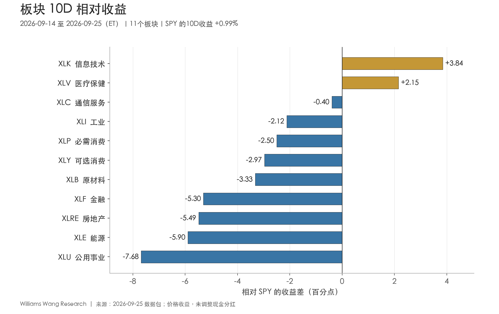
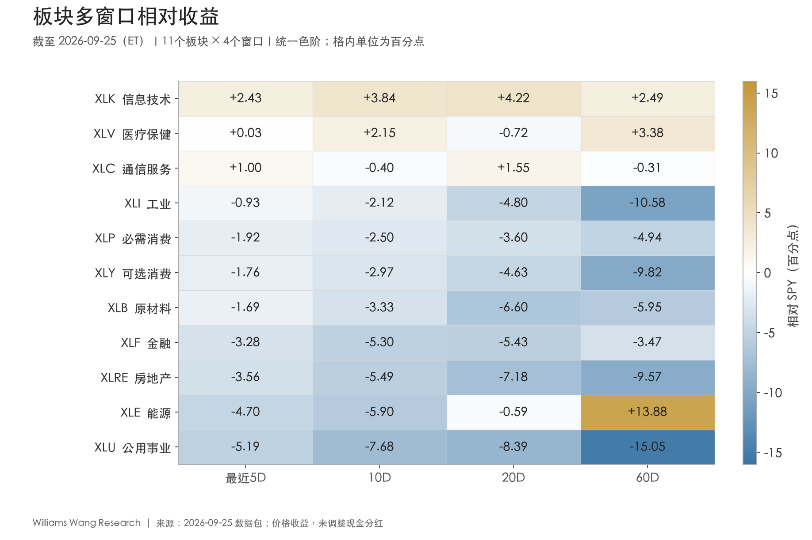
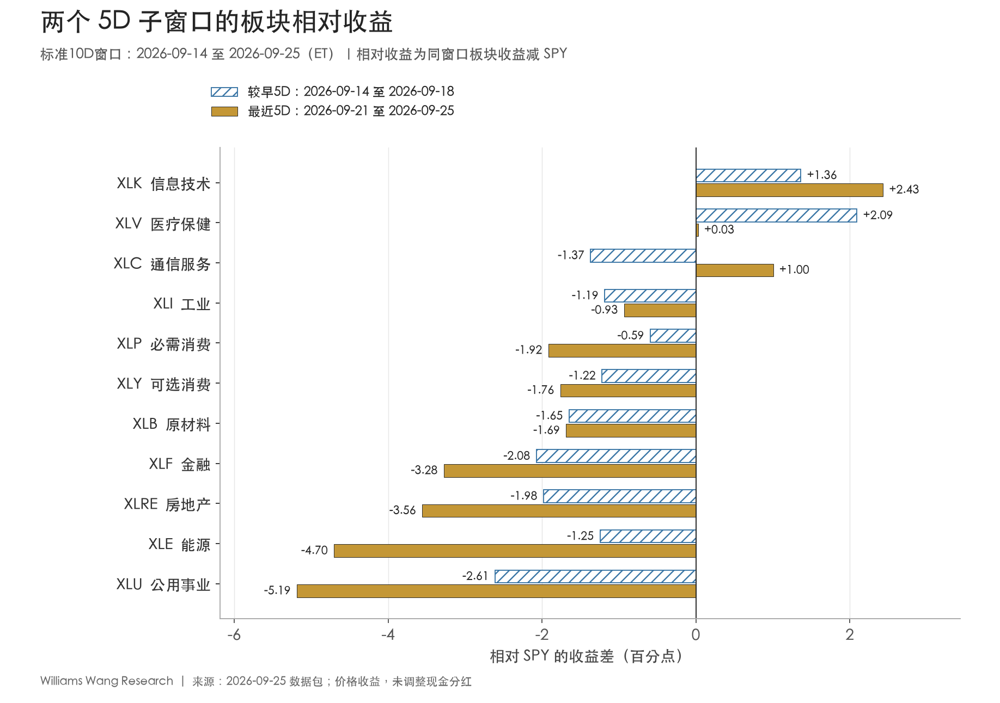

+++
title = "2026年9月25日板块轮动双周复盘：科技领先延续，市场参与面仍窄"
date = "2026-09-26"
data_as_of = "2026-09-25"
data_as_of_note = "ETF价格观察截至9月25日；国债收益率和信用利差主要截至9月24日，VIX及WTI现货截至9月22日，正文逐项列明。"
draft = false
description = "复盘9月14日至25日的板块轮动、科技领先与市场参与面，并核对利率和信用背景。"
series = "市场板块轮动双周复盘"
categories = ["市场结构", "宏观与政策"]
tags = ["板块轮动", "ETF", "市场广度"]
featured = false
private = false
content_preservation = "verbatim"
source_sha256 = "0ff6743b502280dd9290fa71e0e76d0bd86b1ef076843720c3994241683e9c30"
source_front_matter_reviewed = true
author = "Williams Wang Research"
report_period = "2026-09-14 至 2026-09-25 ET"
created_at = "2026-09-26T12:18:07.928820+08:00"
source_package = "2026-09-25_sector_rotation_biweekly.zip"
return_basis = "close-to-close price return; dividends not adjusted"
+++

# 2026年9月25日板块轮动双周复盘：科技领先延续，市场参与面仍窄

## Executive Summary

- **SPY回升尚未获得广泛参与确认。** 9月14—25日，SPY上涨0.99%，QQQ上涨4.25%，但RSP下跌1.49%、IWM下跌2.35%。11个板块中仅2个跑赢SPY、3个上涨、3个站上20日均线。板块收益中位数为−1.98%，指数方向与典型板块的表现仍有明显分歧。
- **科技是本期最完整的leadership，医疗与通信各有限制。** XLK上涨4.83%，在5D、10D、20D、60D均跑赢SPY；XLV上涨3.14%，但最近5D的相对收益已从较早5D的+2.09个百分点收窄至+0.03个百分点；XLC最近5D转为跑赢，整个10D仍落后0.40个百分点。不能把前三名视为同等持续的领先者。
- **排名重排明显，仍不足以证明资金广泛流向其他板块。** 与前一个不重叠10D相比，排名相关系数为−0.12，4个板块变动至少5位；能源从第1降至第10，医疗从第10升至第2。但Top 3仍重合2席，工业升至第4时10D收益仍为负。轮动变化与breadth不足同时存在。
- **跨资产确认混杂，利率与信用约束仍在。** 9月11—24日，10Y名义、实际收益率分别上升22bp、25bp，高收益债OAS扩大15bp；美元代理截至9月25日的10D收益为+2.14%。VIX回落只观察到9月22日，不能据此断言期末风险全面下降。下一期重点是科技优势能否延续、通信修复能否扩散，以及等权、小盘和信用能否跟进。

## 一、观察窗口与比较口径

**本报告使用指定的9月25日数据包，以美东交易日为锚。** 包内标准窗口和报告事件窗口均为9月14—25日，共10个交易日；收益以9月11日收盘为起点。“双周”表示滚动10个交易日，不能按两周自然日简单切分。

| 用途 | 交易日范围（ET） | 收益基准收盘日 | 使用方式 |
| --- | --- | --- | --- |
| 本报告／标准10D | 2026-09-14—2026-09-25 | 2026-09-11 | 板块表现及本期事件覆盖 |
| 较早5D | 2026-09-14—2026-09-18 | 2026-09-11 | 与最近5D比较持续性 |
| 最近5D | 2026-09-21—2026-09-25 | 2026-09-18 | 检查近期延续、衰减与反转 |
| 等长比较期 | 2026-08-28—2026-09-11 | 2026-08-27 | 计算名次变化和rank turnover |
| 历史价格覆盖 | 2026-07-01—2026-09-25，61个交易日 | 60D收益基准为2026-07-01 | 支撑20D／60D背景和均线复核 |

全文ETF回报均为未调整现金分红的收盘价收益；相对收益是同窗口ETF收益减SPY收益，单位为百分点（pp）。两个5D的绝对收益按复利连接，不直接相加。排名改善是名次变化，不能等同于绝对上涨、资金净流入或可执行alpha。

## 二、指数回升，但板块参与面仍窄

**市值加权和成长方向的回升快于等权与小盘，尚不足以支持全面risk-on的判断。** SPY最近5D由较早5D的−0.19%转为+1.19%，QQQ由+0.98%升至+3.23%；RSP和IWM最近5D跌幅虽收窄，仍分别下跌0.33%和0.63%。

| 市场代理 | 较早5D | 最近5D | 10D | 20D | 60D |
| --- | --- | --- | --- | --- | --- |
| SPY | -0.19% | +1.19% | +0.99% | +0.12% | +3.52% |
| QQQ | +0.98% | +3.23% | +4.25% | +3.37% | +2.79% |
| RSP | -1.17% | -0.33% | -1.49% | -4.36% | -0.76% |
| IWM | -1.74% | -0.63% | -2.35% | -5.86% | -5.70% |

本期板块收益的最高与最低差为**11.52个百分点**，横截面标准差为**3.33个百分点**；前者由XLK的+4.83%与XLU的−6.69%形成。这个差距同时包含少数板块走强和尾部下跌，不能只解释为“机会增加”。11个板块的简单平均收益为−1.71%，中位数为−1.98%，剔除科技后的均值为−2.36%。这些等权统计用于刻画横截面，不是SPY的收益贡献拆分。

图中只有科技、医疗位于零轴右侧。跑赢SPY的板块在20D窗口也是2/11，在60D窗口为3/11；不同窗口的成员并不相同。20日均线以上的板块数从9月11日的3个降至9月18日的2个，期末回到3个，分别为XLK、XLV、XLC。**当前改善主要集中于这三个板块，尚未扩展到多数行业。**

也有需要保留的反证：最近5D绝对上涨板块数由较早5D的2个增至4个，跑赢SPY的数量由2个增至3个；9月25日单日有8个板块上涨。不过，最近5D的板块平均收益仍为−0.59%，单日回升尚未改变10D参与面。下期若这种扩散延续到完整5D，同时RSP和IWM相对收益改善，才有理由上调对参与面的评价。

## 三、科技领先更完整，医疗、通信及能源处于不同阶段

**科技的相对优势获得跨窗口确认，其他重点板块仍有明显的时间尺度冲突。** 下表按本期10D收益排序；“比较期名次”来自8月28日—9月11日，与最近5D排名无关。

| 板块 | 比较期名次→本期 | 10D价格收益 | 10D相对SPY（pp） | 20D相对（pp） | 60D相对（pp） |
| --- | --- | --- | --- | --- | --- |
| XLK 信息技术 | 3→1 | +4.83% | +3.84 | +4.22 | +2.49 |
| XLV 医疗保健 | 10→2 | +3.14% | +2.15 | -0.72 | +3.38 |
| XLC 通信服务 | 2→3 | +0.60% | -0.40 | +1.55 | -0.31 |
| XLI 工业 | 9→4 | -1.13% | -2.12 | -4.80 | -10.58 |
| XLP 必需消费 | 6→5 | -1.51% | -2.50 | -3.60 | -4.94 |
| XLY 可选消费 | 7→6 | -1.98% | -2.97 | -4.63 | -9.82 |
| XLB 原材料 | 11→7 | -2.33% | -3.33 | -6.60 | -5.95 |
| XLF 金融 | 4→8 | -4.31% | -5.30 | -5.43 | -3.47 |
| XLRE 房地产 | 8→9 | -4.50% | -5.49 | -7.18 | -9.57 |
| XLE 能源 | 1→10 | -4.91% | -5.90 | -0.59 | +13.88 |
| XLU 公用事业 | 5→11 | -6.69% | -7.68 | -8.39 | -15.05 |

**XLK：当前证据最一致的领先板块。** 10D相对SPY为+3.84个百分点，20D和60D分别为+4.22和+2.49个百分点；它是唯一在全部四个窗口均跑赢的板块。最近5D绝对收益+3.62%、相对收益+2.43个百分点，较早5D相对优势为+1.36个百分点，领先仍在扩大。这里只确认价格层面的持续性；包内没有盈利修正、成分股贡献或资金流，不能据此将表现归因为AI盈利兑现或机构增配。

**XLV：10D修复突出，最近5D已接近跟随市场。** 医疗从第10升至第2，10D跑赢2.15个百分点，60D也跑赢3.38个百分点；但20D仍落后0.72个百分点。两个5D均跑赢在数学上成立，最近一个窗口的优势仅约0.03个百分点，且未调整分红，经济意义有限。“持续跑赢”这一布尔标签不能掩盖优势已经大幅收窄。

**XLC：近期相对反转，完整10D尚未转为领先。** 较早5D绝对收益−1.56%、相对收益−1.37个百分点，最近5D转为+2.19%和+1.00个百分点。20D相对收益为+1.55个百分点，但10D、60D分别为−0.40和−0.31个百分点；9月25日单日还下跌0.63%。下一期需要检验反转持续性，暂不把它与XLK同等看待。

**XLE：中期积累的涨幅尚在，短期领导地位已丢失。** 能源10D下跌4.91%，名次从第1降至第10；最近5D落后SPY4.70个百分点。但60D仍上涨17.40%、跑赢13.88个百分点，说明当前是较长窗口累计涨幅背景下的短期回撤。20D相对收益已转负至−0.59个百分点，中期优势正在受到侵蚀，仍不能仅凭这次回撤断言中期趋势结束。

**XLU、XLRE和XLF的弱势更具持续性。** 三者10D分别下跌6.69%、4.50%和4.31%，全部四个窗口均落后SPY；最近5D的相对落后又进一步扩大。工业、必需消费、可选消费和原材料同样在四个窗口均落后，共有7个板块呈现这一特征。利率背景与部分利率敏感行业承压相容，但行业差异不能由利率单一因素解释。

## 四、排名重排与两个5D的迁移：区分换位、补涨和延续

**本期确有大幅换位，但排名改善并不等同于新leadership形成。** 本期与前一等长10D的Spearman排名相关为−0.12；XLV上升8位、XLI上升5位，XLE下降9位、XLU下降6位。四个板块的绝对名次变化至少5位，但这个阈值只是描述性统计，没有经过历史显著性校准。

Top 3从比较期的XLE、XLC、XLK变为XLK、XLV、XLC，重合2席。科技与通信仍居前，医疗替代能源；与此同时，工业从第9升至第4，10D却仍下跌1.13%、落后SPY2.12个百分点。工业的名次上升主要说明相对其他落后板块更抗跌，尚不足以认定新的超额收益来源。

两个不重叠5D给出更清晰的迁移路径：

- **延续并扩大：XLK。** 相对SPY从+1.36扩大到+2.43个百分点；绝对上涨和相对领先同时增强。
- **仍为正但显著衰减：XLV。** 相对收益从+2.09降至+0.03个百分点，近期相对领先幅度很小。
- **由负转正：XLC。** 从−1.37转为+1.00个百分点，是本期两个5D之间唯一由相对落后转为跑赢的板块。
- **尾部继续走弱：XLU、XLE、XLRE、XLF。** 相对收益分别由−2.61、−1.25、−1.98、−2.08个百分点降至−5.19、−4.70、−3.56、−3.28个百分点。即使SPY最近5D上涨，这些板块也未跟进。

较早与最近5D收益差只描述两个区间的表现变化，不是统计意义上的趋势“加速度”。当前更有价值的跟踪问题是：科技之外，通信能否连续跑赢，以及医疗能否恢复有实质幅度的相对优势。

## 五、风格与跨资产：成长占优，防御和信用不能合并解读

**成长、动量占优与等权、小盘落后相互印证；“防御领先”则对分组成员非常敏感。** 下表均为两个代理的同窗口价格收益之差，单位为百分点。

| 代理 | 定义 | 最近5D | 10D | 20D | 60D |
| --- | --- | --- | --- | --- | --- |
| 成长-价值 | SPYG-SPYV | +2.09 | +4.14 | +3.78 | +2.72 |
| 大盘成长-大盘价值 | IWF-IWD | +2.70 | +4.83 | +4.58 | -0.19 |
| 等权-市值加权 | RSP-SPY | -1.51 | -2.48 | -4.49 | -4.28 |
| 小盘-大盘 | IWM-SPY | -1.81 | -3.34 | -5.98 | -9.23 |
| 动量-市场 | MTUM-SPY | +1.68 | +2.83 | +4.57 | -6.45 |
| 质量-市场 | QUAL-SPY | +0.47 | +0.58 | -0.54 | -1.33 |
| 低波-市场 | USMV-SPY | -1.29 | -2.49 | -3.53 | -1.86 |
| 周期-防御 | 五板块均值-三板块均值 | -0.11 | -1.25 | -0.17 | +2.35 |
| 高收益债-投资级债 | HYG-LQD | +0.30 | +0.13 | +0.52 | +2.41 |
| 长久期-中期国债 | TLT-IEF | -1.38 | -0.76 | -1.07 | -2.91 |

SPYG-SPYV在全部四个窗口为正；IWF-IWD最近10D领先4.83个百分点，但60D仍为−0.19个百分点，说明“大盘成长优势已在所有尺度确立”还说得过满。MTUM相对SPY的5D、10D、20D优势明显，60D仍落后6.45个百分点，也应按近期修复解释。QUAL的10D优势为0.58个百分点，20D和60D仍为负；单个质量代理尚不能支持全面的质量风格切换。

周期组按XLY、XLF、XLI、XLB、XLE简单平均，防御组按XLP、XLU、XLV简单平均。10D两组分别下跌2.93%和1.69%，周期落后1.25个百分点；但防御组内部医疗上涨、公用事业大跌，方向并不一致。**敏感性检查：剔除医疗后，余下两项防御代理的均值为−4.10%，周期组反而领先1.17个百分点。** 因此不宜把组均值写成全面防御偏好。即使仅剔除周期组中的能源，周期仍落后完整防御组0.75个百分点，说明周期疲弱也不只来自能源一项。这些剔除统计用于检查解释稳健性，不替换原始固定口径。

美元、黄金和商品代理提供另一组背景：

| 跨资产代理 | 最近5D | 10D | 20D | 60D |
| --- | --- | --- | --- | --- |
| UUP | +1.13% | +2.14% | +2.25% | +0.56% |
| GLD | -2.10% | -1.32% | -6.99% | +6.06% |
| USO | -3.69% | -3.94% | +14.27% | +43.86% |
| DBC | -1.15% | -1.09% | +5.70% | +23.33% |

美元代理UUP最近5D和10D均上涨，黄金GLD分别下跌2.10%和1.32%，与实际收益率上行的方向相容；GLD的60D收益仍为正，短期承压不应直接外推为中期转弱。USO最近10D下跌3.94%，但20D、60D仍上涨14.27%和43.86%；DBC也呈短期回撤、中期仍正的结构。这与能源板块短弱长强的时间特征相近，却不构成严格同步或因果检验。

UUP是美元相关基金代理；USO、DBC涉及期货曲线和展期影响，不能分别当作美元指数、WTI现货或现货商品组合的精确变化。风格差值同样不是剔除了行业、规模、久期等暴露的纯因子收益。

## 六、Rates、credit与volatility：先对齐日期，再判断确认程度

**利率上行是本期明确的约束，高收益信用和滞后的VIX给出不同方向的信号。** 下表保留每项实际观察日。“较9月18日”是从该日到最新观测的变化，部分序列未覆盖整个最近5D，不能称为统一5D变化。

| 指标 | 9月11日 | 最新值 | 实际观察日（ET） | 较9月11日 | 较9月18日 |
| --- | --- | --- | --- | --- | --- |
| 2Y美债收益率 | 4.63% | 4.87% | 2026-09-24 | +24bp | +11bp |
| 10Y美债收益率 | 4.96% | 5.18% | 2026-09-24 | +22bp | +17bp |
| 30Y美债收益率 | 5.35% | 5.47% | 2026-09-24 | +12bp | +13bp |
| 10Y-2Y利差 | 0.33% | 0.36% | 2026-09-25 | +3bp | +11bp |
| 10Y-3M利差 | 0.89% | 0.93% | 2026-09-25 | +4bp | +6bp |
| 10Y实际收益率 | 2.60% | 2.85% | 2026-09-24 | +25bp | +17bp |
| 10Y盈亏平衡通胀率 | 2.36% | 2.34% | 2026-09-25 | -2bp | +1bp |
| 高收益债OAS | 2.65% | 2.80% | 2026-09-24 | +15bp | +12bp |
| 投资级债OAS | 0.80% | 0.79% | 2026-09-24 | -1bp | +2bp |
| VIX | 15.84点 | 14.21点 | 2026-09-22 | -1.63点 | -0.60点 |
| WTI现货 | 101.27美元/桶 | 96.41美元/桶 | 2026-09-22 | -4.86美元/桶 | -5.03美元/桶 |

**利率：整体10D背景与后半段的曲线方向不同。** 同步截至9月24日，2Y、10Y、30Y收益率较9月11日分别上升24bp、22bp、12bp；2s10s利差由33bp收窄到31bp，表现为收益率上行、曲线小幅走平。若只看9月18—24日，2Y升11bp、10Y升17bp，2s10s反而从25bp扩大到31bp，后半段呈陡峭化。包内T10Y2Y已更新到9月25日的36bp，较9月11日扩大3bp；其终点比国债单腿晚一天，不能用9月24日的5.18%减4.87%去复核9月25日的36bp，也不能把两个口径强行合并。

同一截止日9月24日，10Y实际收益率从2.60%升至2.85%，增加25bp；T10YIE为2.33%，较9月11日下降3bp。名义10Y的22bp升幅在这组同步数据中主要对应实际利率上行。9月25日T10YIE更新到2.34%，若直接与9月24日实际利率相加，会产生日期错配。盈亏平衡通胀率还含风险溢价和流动性因素，不能把它直接等同于纯通胀预期。

TLT最近5D下跌2.31%，IEF下跌0.93%，长久期落后1.38个百分点；10D长久期也落后0.76个百分点。长债与XLU、XLRE承压、UUP上涨，在方向上与利率约束相容。但科技同时走强，说明一个“降息交易”或“实际利率决定全部成长股表现”的单因素叙事都不足以概括本期。

**信用：HYG相对LQD略好，不代表信用风险下降。** HYG、LQD的10D价格收益分别为−0.89%和−1.02%，差值为+0.13个百分点；同期高收益债OAS从265bp升至280bp，而投资级OAS从80bp降至79bp。两只ETF的久期、构成和分配现金不同，相对价格表现不能替代OAS。尤其投资级OAS虽较9月11日小幅收窄，较9月18日已扩大2bp；高收益OAS后半段扩大12bp，信用层面的确认并不支持全面risk-on。

**波动率：只能确认到9月22日的回落。** VIX由9月11日的15.84降至14.21，但包内没有9月23—25日观测，因此无法判断其是否确认了期末股票反弹。WTI现货同样只到9月22日，较9月11日下跌4.86美元/桶。二者都属于截至各自日期的背景，不能补写为9月25日收盘值。

## 七、外部上下文：政策收紧与实体数据分化并存

以下只纳入**本期9月14—25日已发布**且已核对的一手信息；发布日期与经济数据所属月份分开列示。ETF和宏观市场序列仍以用户数据包为准。没有使用市场共识预测，也不据此判断“超预期”或“低于预期”。

| 发布日（ET） | 已核对的外部事实 | 与本地数据的关系及解释边界 |
| --- | --- | --- |
| 9月16日 | FOMC将联邦基金目标区间上调25bp至3.75%—4.00%，声明指出通胀仍然偏高。[美联储声明](https://www.federalreserve.gov/newsevents/pressreleases/monetary20260916a.htm) | 为本期利率上行提供相关政策背景；不能仅凭日期重合把10D板块差异全部归因于该决定。 |
| 9月16日 | 8月零售与餐饮销售环比+1.2%、同比+6.0%；数据经季节调整，但未调整价格变化。[Census零售报告](https://www.census.gov/retail/sales.html) | 名义消费仍有韧性，同时XLY在本地10D下跌1.98%。宏观销售与可选消费ETF并非同一口径，不能用销售数据保证板块盈利或股价改善。 |
| 9月18日 | 8月工业产出环比持平，制造业产出下降0.3%，产能利用率为76.3%。[美联储G.17](https://www.federalreserve.gov/releases/g17/Current/) | 与“所有周期环节都在同步加速”的说法不符；与工业、原材料股偏弱相容，但不识别具体股价驱动。 |
| 9月24日 | 8月新建独栋住宅销售季调年率为68.4万套，环比+6.4%，公布的误差范围为±19.5个百分点；库存月数为8.5个月。[Census新屋销售](https://www.census.gov/construction/nrs/current/index.html) | 环比估计的不确定区间包含零，单月点估计不能确认住房需求趋势反转；XLRE也不是纯住宅开发商组合，不能机械对应。 |

**解释证据混杂。** 名义消费韧性、政策收紧、制造业环比走弱及住房统计不确定性同时存在，足以支持“实体表现分化、利率约束未消失”的背景描述，无法证明科技领涨、医疗修复或能源回撤的具体贡献来源。包内没有公司层面的盈利与新闻归因证据，本报告不补造行业催化剂。

本期没有纳入8月PCE结果。按已核对的BEA日程，8月个人收入与支出以及二季度GDP第三次估计安排在**9月30日8:30 ET**发布，属于下一观察期的事件风险，不是本期已知结果。[BEA发布日程](https://www.bea.gov/news/schedule/full)

## 八、下一报告期观察点

**下一期优先检验领先能否扩散，以及信用是否停止与股指背离。** 下列条件用于安排复盘，不代表经过回测的预测阈值，也不构成交易或仓位指令。

| 观察问题 | 本期起点 | 有助于确认的变化 | 需要下调判断的证据 |
| --- | --- | --- | --- |
| 科技能否保持领先 | XLK四窗口均跑赢，最近5D相对+2.43pp | 后续完整5D继续跑赢，20D均线与中期相对表现保持一致 | 最近5D相对转负，且中期优势或均线状态同步恶化 |
| 通信、医疗能否成为第二条持续主线 | XLC刚完成5D相对反转；XLV最近5D仅+0.03pp | XLC连续跑赢并改善完整10D；XLV恢复明显大于接近零的优势，20D落后收窄 | XLC反转失效，或医疗开始持续落后 |
| 参与面能否扩散到等权和小盘 | RSP、IWM最近5D均落后，20日均线上方仅3/11 | 跑赢与均线上方板块数从当前水平持续增加，RSP／IWM相对收益同步改善 | 扩散只停留在单日上涨，完整5D再次收窄 |
| 利率、信用能否提供更一致的背景 | 同步10Y 5.18%、实际利率2.85%；HY OAS 280bp | 实际利率停止上行，高收益OAS收窄，并获得更新后的VIX观测确认 | 实际利率与高收益OAS继续上升；不能以旧VIX抵消新压力 |
| 能源回撤是否继续侵蚀中期领先 | XLE最近5D相对−4.70pp，60D仍+13.88pp | 能源5D相对修复且20D重新改善；USO／现货在同步日期提供支持 | XLE继续落后且20D、60D优势同步下降 |

日程层面跟踪9月30日的PCE、收入支出和GDP更新；解读时先看公布值、修订与实际可用的市场反应，再讨论是否改变本期框架。对任何单一宏观结果，都不能提前赋予确定的板块方向。

## 免责声明

本报告仅供信息交流、研究与教育参考，不构成任何投资、交易、资产配置或其他专业建议，也不构成对任何证券或金融产品的买卖要约、推荐或收益承诺。报告依据指定时点的数据与公开资料撰写，相关数据可能存在误差、延迟或后续修订；历史表现、相对强弱及情景观察均不代表未来结果。读者应结合自身情况独立核实信息、评估风险并作出决定，投资判断、仓位安排与实际执行由读者自行负责。
