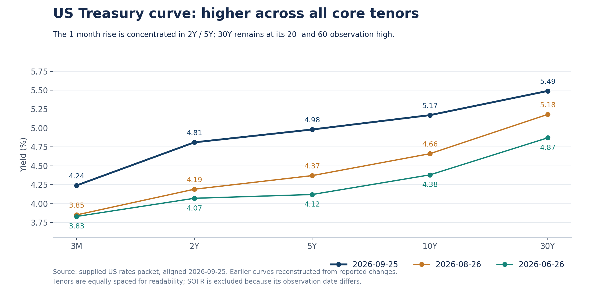
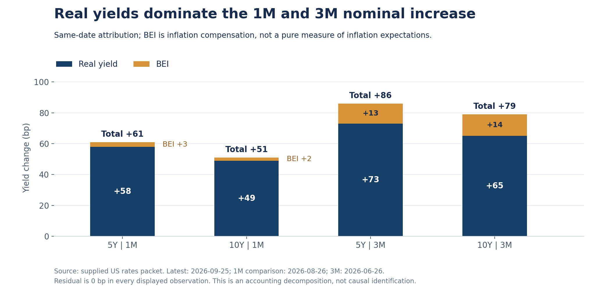

+++
title = "美国利率期限结构分析｜2026年9月27日"
date = "2026-09-27"
data_as_of = ["2026-09-24", "2026-09-25"]
data_as_of_note = "核心Treasury曲线、实际利率及MOVE为9月25日；SOFR实际观察日为9月24日。"
draft = false
description = "分析美国国债曲线的期限形态、实际利率与通胀补偿归因，以及MOVE和长端压力。"
series = "利率期限结构分析"
categories = ["宏观与政策", "市场结构"]
tags = ["美国国债", "收益率曲线", "实际利率", "BEI", "MOVE", "SOFR"]
featured = false
private = false
content_preservation = "verbatim"
source_sha256 = "780f001253c71a7f1e7dd1b2e5e3647fa7d4183912890f958d84af18021da2f1"
+++

# 美国利率期限结构分析｜2026年9月27日

**实际利率主导中期上行，最新一日出现期限分化，长端压力仍在**

报告日期：2026年9月27日（Asia/Singapore）。核心 Treasury 曲线对齐日：2026年9月25日；SOFR 实际观测日：2026年9月24日。数据依据为本期 US rates packet，收益率水平单位为 %，收益率变化、利差及蝶式结构单位为 bp；MOVE 变化另以指数点表示。

## 1. Executive Summary

- **中期主线是实际利率主导的 level 上移，曲线形态随窗口与区段变化。** 2Y/5Y/10Y 的一个月 level 为 +58bp、slope 为 -11bp，表现为 bear flattening；三个月 level 为 +79.67bp，5Y 上行86bp、超过2Y与10Y，belly 相对两翼上移更明显。一个月5Y、10Y实际利率分别上行58bp、49bp，解释了对应名义利率升幅的大部分。
- **最新一日是2Y—10Y bull steepening，扩展至30Y则属于 mixed / twist steepening。** 2Y、5Y、10Y分别下行6bp、5bp、1bp，30Y却上行2bp；三点分解为 level -4bp、slope +5bp、curvature -3bp。按这套算术口径，slope 的显示幅度略大于 level；这一天的回落尚不能确认月度上行趋势已逆转。
- **最近一周重新转向 bear steepening，但较长窗口的斜率仍分化。** 一周10Y、30Y分别上行16bp、15bp，高于2Y的5bp；10Y-2Y扩大11bp。当前10Y-3M为93bp、处于5年84.2%分位，距离20及60观察值高点仅2bp；30Y-5Y为51bp，虽单日扩大7bp，一个月仍收窄30bp。
- **长端与波动率尚未给出全面缓和的确认。** 30Y为5.49%，处于20及60观察值高点；10Y为5.17%，距对应高点仅1bp。MOVE为96.00，单日下降8.58个指数点，但一周、一个月仍分别上升15.36、26.56点；其1年分位为96.4%，5年分位为42.6%，说明相对近一年偏高，却不能据此称为五年极端压力。

## 2. Curve Snapshot

**核心曲线保持正斜率，2Y至10Y的单日回落与30Y上行并存。** 9月25日，收益率从3M的4.24%递增至30Y的5.49%；SOFR为3.88%，但其日期是9月24日，应作为单独的隔夜资金参考，不与当日Treasury构造同步利差。

| 期限 | 当前收益率 | 实际观测日 | 1D | 1W | 1M | 3M |
|:--|--:|:--:|--:|--:|--:|--:|
| SOFR | 3.88% | 2026-09-24 | +1bp | +3bp | +22bp | +26bp |
| 3M | 4.24% | 2026-09-25 | 0bp | +10bp | +39bp | +41bp |
| 2Y | 4.81% | 2026-09-25 | -6bp | +5bp | +62bp | +74bp |
| 5Y | 4.98% | 2026-09-25 | -5bp | +12bp | +61bp | +86bp |
| 10Y | 5.17% | 2026-09-25 | -1bp | +16bp | +51bp | +79bp |
| 30Y | 5.49% | 2026-09-25 | +2bp | +15bp | +31bp | +62bp |

*来源：`latestCurve.points`。Treasury的1D、1W、1M、3M比较日依次为2026-09-24、2026-09-18、2026-08-26、2026-06-26；SOFR依次为2026-09-23、2026-09-17、2026-08-25、2026-06-26。窗口名称沿用packet，以这些实际比较日为准。*

一个月内五个Treasury核心期限全部上行，其中2Y与5Y升幅分别为62bp、61bp，30Y仅上行31bp，压力中心位于front-end至belly。三个月则由5Y的86bp升幅领跑，10Y上行79bp、30Y上行62bp，说明这一窗口也存在belly相对上移。最近一周的压力重心有所后移：10Y和30Y升幅接近，均超过2Y，构成bear steepening。最新一日，2Y与5Y的回落较大，但30Y继续上行，全曲线没有同步rally。

*图1：历史曲线由当期水平减去packet对应窗口变化复算；横轴为等距期限标签，不代表期限长度等比例。剔除日期不同的SOFR。*

滚动位置表明，最新一日的回落幅度仍然有限。2Y与5Y分别低于20及60观察值高点6bp、5bp，10Y只低1bp；30Y的5.49%就是这两个窗口的高点。3M为4.24%，同样持平于两个窗口高点。SOFR的3.88%也处于自身20及60观察值高点，但它描述的是截至9月24日的资金利率状态。以上观察值窗口不应直接改写为自然月或自然季度。

## 3. Spreads and Butterflies

**当前斜率的关键特征是短期重新走陡，同时保留明显的跨区段差异。** 10Y-2Y已从近期低位反弹，但未突破20观察值上界；10Y-3M靠近局部高点；30Y-5Y虽然反弹，一个月和三个月累计仍在收窄。

| 结构 | 当前 | 1D | 1W | 1M | 3M | 5年分位 | 20观察值区间 | 60观察值区间 |
|:--|--:|--:|--:|--:|--:|--:|:--:|:--:|
| 10Y-2Y | +36bp | +5bp | +11bp | -11bp | +5bp | 63.3% | 20至43bp | 20至53bp |
| 10Y-3M | +93bp | -1bp | +6bp | +12bp | +38bp | 84.2% | 79至95bp | 61至95bp |
| 30Y-5Y | +51bp | +7bp | +3bp | -30bp | -24bp | 61.3% | 41至76bp | 41至93bp |
| 5Y-2Y | +17bp | +1bp | +7bp | -1bp | +12bp | 80.1% | 7至19bp | 7至20bp |
| 2s5s10s belly fly | -2bp | -3bp | +3bp | +9bp | +19bp | 80.2% | -11至+2bp | -20至+2bp |
| 5s10s30s belly fly | -13bp | +1bp | +5bp | +10bp | +10bp | 68.0% | -24至-13bp | -27至-13bp |

*来源：`spreadsAndButterflies.items`。Butterfly convention统一为 `2 * belly - short - long`；分位与滚动区间使用packet统计，区间均以bp计。*

10Y-2Y当前36bp，较20观察值低点20bp高16bp，距离该窗口高点43bp仍有7bp。其一周扩大11bp并未完全抵消一个月的累计收窄，不能据此把月度走势重写为持续走陡。10Y-3M为93bp，距离20及60观察值高点95bp均只有2bp，且一个月、三个月分别扩大12bp、38bp；更靠近现金端的斜率与2s10s并不一致。

30Y-5Y当前51bp，高于9月23日的20及60观察值低点41bp，但仍远低于两个窗口的高点。它单日扩大7bp，来自30Y上行2bp与5Y下行5bp的组合；这与前期5Y上行更快形成的中期趋平可以同时成立。5Y-2Y为17bp，距20观察值高点19bp仅2bp、距60观察值高点20bp为3bp，表明5Y相对2Y的收益率差仍偏高。

**两项fly显示，belly的绝对位置与近期变化需要分开判断。** 2s5s10s为-2bp，意味着5Y收益率低于2Y与10Y两翼简单平均值1bp；但fly三个月上升19bp、一个月上升9bp，说明5Y相对两翼的收益率已明显上移，即相对cheapening。最新一日fly下降3bp，是对这一变化的部分回撤。其5年80.2%分位与20/60观察值高点+2bp共同提供历史位置参照，尚不能视为已越过近期上界。

5s10s30s为-13bp，意味着10Y收益率低于5Y与30Y两翼简单平均值6.5bp；它在1D、1W、1M、3M均上升，当前已经达到20及60观察值高点。这表示10Y相对这组两翼的收益率持续上移，尽管fly绝对值仍为负。上述rich/cheap仅描述yield-space的相对位置，未经过久期、凸性或资金成本调整，不构成债券估值结论或可执行组合信号。

## 4. Three-Factor Decomposition

本报告采用2Y/5Y/10Y的desk-style算术分解，令各期限在相同窗口的收益率变化为Δy：

- `Level = (Δy2Y + Δy5Y + Δy10Y) / 3`
- `Slope = Δy10Y - Δy2Y`
- `Curvature-Convexity = 2 × Δy5Y - Δy2Y - Δy10Y`

| 窗口 | 2Y / 5Y / 10Y变化 | Level | Slope | Curvature | 结构判断 |
|:--|:--:|--:|--:|--:|:--|
| 1D | -6 / -5 / -1bp | -4.00bp | +5bp | -3bp | 2Y—10Y bull steepening；加入30Y后为mixed / twist steepening |
| 1W | +5 / +12 / +16bp | +11.00bp | +11bp | +3bp | level与slope显示幅度相当的bear steepening |
| 1M | +62 / +61 / +51bp | +58.00bp | -11bp | +9bp | level主导的bear flattening，2Y/5Y上行较多 |
| 3M | +74 / +86 / +79bp | +79.67bp | +5bp | +19bp | level主导；2s10s小幅走陡，5Y相对两翼上移 |

*来源：`factorDecomposition.windows`；已根据底层期限变化复算，3M level按两位小数呈现。*

**一个月和三个月最稳定的共同点是level上移；slope方向并不稳定。** 一个月2Y上行62bp，高于10Y的51bp，因此2s10s趋平；三个月10Y上行79bp，略高于2Y的74bp，因此2s10s小幅走陡。与此同时，三个月30Y-5Y收窄24bp，说明把整条曲线概括为同方向steepening会丢失重要信息。

Curvature在一个月与三个月分别为+9bp、+19bp，与5Y相对两翼上移一致。最新一日curvature转为-3bp，只代表当日belly相对表现回撤，尚未推翻较长窗口状态。该分解**不是PCA**，三个算术量的尺度不同，显示幅度不能解释为风险贡献比例或方差解释度；其中“Convexity”沿用字段名称，不是债券价格对收益率的二阶敏感度测量，也无法单独证明发生了凸性对冲流。

## 5. Real Rates / Inflation Compensation / MOVE

**同日分解支持“实际利率主导中期名义收益率上行”的描述。** 截至9月25日，5Y与10Y的BEI均为2.34%，但实际收益率分别为2.64%、2.83%，对应名义收益率4.98%、5.17%。

| 期限 | Nominal | TIPS real yield | BEI | 同日观测日期 |
|:--|--:|--:|--:|:--:|
| 5Y | 4.98% | 2.64% | 2.34% | 2026-09-25 |
| 10Y | 5.17% | 2.83% | 2.34% | 2026-09-25 |

名义值来自Treasury CMT，实际值来自Treasury Real CMT，BEI由两者同日相减得到。每个窗口采用nominal、real与BEI的同日交集。

| 期限 | 窗口 | 名义收益率变化 | Real贡献 | BEI贡献 | Residual |
|:--:|:--:|--:|--:|--:|--:|
| 5Y | 1D | -5bp | -6bp | +1bp | 0bp |
| 5Y | 1W | +12bp | +9bp | +3bp | 0bp |
| 5Y | 1M | +61bp | +58bp | +3bp | 0bp |
| 5Y | 3M | +86bp | +73bp | +13bp | 0bp |
| 10Y | 1D | -1bp | -2bp | +1bp | 0bp |
| 10Y | 1W | +16bp | +15bp | +1bp | 0bp |
| 10Y | 1M | +51bp | +49bp | +2bp | 0bp |
| 10Y | 3M | +79bp | +65bp | +14bp | 0bp |

*来源：`realRatesInflationCompensation.latest`与`moveAttribution.items`。最新日及四个比较日均与Treasury主表一致；每组记录的共同历史观测数为2,123。*

*图2：一个月与三个月的同日名义收益率变化拆分，柱内为实际利率与BEI贡献，柱顶为合计，单位bp。*

一个月内，5Y的61bp升幅中有58bp来自real，10Y的51bp中有49bp来自real；三个月对应real贡献为73bp、65bp，BEI贡献为13bp、14bp。BEI在较长窗口确有上行，但规模小于real，因而不能把本轮变化主要解释为通胀补偿上升。最新一日，5Y与10Y的real分别下降6bp、2bp，BEI各上升1bp，名义利率下行来自实际利率回落，通胀补偿反而形成小幅抵消。

八组归因residual均为0bp，`largeResiduals`为空，未触发packet所述“超过2bp需特别解释”的阈值。由于BEI本身主要由nominal减real生成，零残差首先说明代数与日期一致，不能当成经济因果模型得到验证。BEI是inflation compensation，可能包含通胀风险溢价、流动性与技术因素；real yield也无法单独区分预期实际短端利率和实际期限溢价。因此，数据支持实际利率条件趋紧的描述，具体宏观原因**需要额外数据确认**。

**MOVE提供的是较高的近期波动背景 。** 9月25日MOVE为96.00；1D、1W、1M、3M变化分别为-8.58、+15.36、+26.56、+29.21个指数点。这些值不是bp，也不是收益率变化百分比。单日下降与2Y—10Y回落同时出现，但一周及中期波动背景仍高于比较日。1年96.4%分位与5年42.6%分位差异较大，应表述为“相对近一年偏高”，避免泛化为长期极端状态。 

## 6. Heatmap / Move Concentration

**最近五个观测日内，最大的上行集中在9月23日的中间期限；9月25日出现分区段回落。** 9月21日至25日的摘要中，3Y、5Y、7Y均在9月23日上行16bp，10Y上行15bp、2Y上行14bp。最大的下行是9月25日2Y下降6bp；摘要还列出9月21日10Y、20Y、30Y分别下降5bp，以及9月22日2Y下降5bp。这些是窗口内的单日极值，不是五日累计变化。

| Packet区段 | 9月25日平均变化 | 上行 / 下行 / 持平 | 包内观测数量 |
|:--|--:|:--:|--:|
| Front-end | 0.00bp | 3 / 4 / 1 | 8 |
| Belly | -4.67bp | 0 / 3 / 0 | 3 |
| Long-end | +0.67bp | 2 / 1 / 0 | 3 |

*来源：`heatmapSummary.latestDayBreadth`。区段沿用packet，未附逐个期限的成员映射，因此不根据上述聚合值反推区段边界。*

Front-end平均为零，实际包含上涨和下跌的抵消，不能写成“前端没有变化”；belly三项全部下降，long-end则两项上行、一项下降。结合核心曲线，最新一日更接近期限分化中的belly rally与长端相对承压，不能写成全曲线同步下行。

最近20观察值的平均绝对日变化中，2Y为5.35bp、3Y为5.30bp、5Y为4.90bp、7Y为4.60bp、10Y为4.00bp，均高于30Y的3.30bp。波动活跃度集中在2Y至7Y，与一个月2Y/5Y累计上行较多相呼应；不过平均绝对变化只衡量变动幅度，不区分方向，也不是久期调整后的损益风险。30Y虽然日常bp波动较小，最新收益率仍位于局部高点，两者并不矛盾。

## 7. Trading Desk Interpretation

**当前更适合被理解为中期收益率大幅上移后的短期结构调整。** 一个月与三个月的level仍显著为正，最近一周又出现10Y/30Y领先2Y的bear steepening，随后最新一日2Y/5Y回落、30Y继续上行。可确认的是压力在期限之间重新分布；单日bull steepening尚不足以支持全面宽松重定价的解释。

**Policy path重定价是候选解释之一，但packet不能识别其大小与方向。** 月度2Y上行62bp，3M上行39bp，SOFR自身窗口上行22bp，说明从现金端到中短端的水平都比各自比较日更高；不过SOFR日期与比较日均不同，不能将这些差额直接量化成加息预期。packet缺少OIS、联邦基金期货与政策事件背景，policy path解释**需要额外数据确认**。

**Term premium压力值得关注，但没有得到独立测量。** 30Y在2Y/5Y回落的当日仍上行，10Y/30Y在一周窗口的升幅较大，且长期端保持在滚动高位；这些事实与长端所需补偿抬升的情景相容。然而一个月30Y涨幅低于2Y/5Y，30Y-5Y收窄30bp，不支持把全部窗口都归结为超长端期限溢价冲击。packet缺少期限溢价模型、发行与拍卖、投资者流量等证据，相关原因**需要额外数据确认**。

**Belly相对重定价有直接证据，凸性对冲机制没有。** 三个月2s5s10s上升19bp，一周上升3bp，说明5Y相对两翼的收益率上移；单日下降3bp显示部分回撤。5s10s30s则升至两个滚动窗口高点。fly与curvature能够描述曲线局部形变，但包内没有MBS、期权、仓位或实际对冲流数据，不能据此推定某类投资者正在进行convexity hedging。

后续监测的优先顺序是：先看5Y/10Y实际收益率的回落是否从单日延续到周度，再看30Y是否跟随回落；随后观察10Y-2Y的回升和30Y-5Y的反弹是否持续，以及两项fly能否回到近期区间内部。MOVE需要与这些曲线变化联合观察，才能区分短暂缓和与波动背景的持续改善。

## 8. What Would Change My View

以下条件均可用后续同口径packet验证，是研究判断的更新条件，不代表价格目标或交易触发规则。

1. **单日rally扩展为更广泛、持续的周度回落。** 若2Y/5Y继续下降，10Y与30Y也转为周度下行，并离开当前滚动高位，则“局部调整、长端仍承压”的判断应下调。若只有2Y下降而30Y持续上行，反而会强化期限分化判断。
2. **高位斜率出现有持续性的区间突破。** 10Y-3M目前93bp，若后续超过本期20及60观察值高点95bp，同时10Y-2Y超过本期20观察值高点43bp，且由10Y上行带动，则最近一周的bear steepening证据会增强；若斜率扩大来自短端下行，其含义需重新区分。95bp与43bp只是本期历史参照。
3. **Belly相对重定价发生反转或进一步扩大。** 若2s5s10s在周度也转为下降，且5s10s30s离开当前-13bp的滚动高点向下回落，则中间期限相对cheapening的证据减弱；若前者超过本期+2bp高点、后者继续上升，则需要提高对belly相对压力的关注。
4. **名义利率的主导贡献由real转向BEI。** 若后续同日周度或月度归因中，5Y、10Y的BEI贡献持续超过real，且residual保持可接受，则当前“real-led”描述应改变；若real持续回落而BEI基本稳定，则实际利率条件的中期趋紧需要重新评估。
5. **波动环境或数据同步性出现实质变化。** 若MOVE的周度变化也转负、1年分位持续回落，同时长端收益率脱离高位，才更支持压力缓和；若MOVE重新抬升并伴长端上行，则最新一日的波动回落解释应弱化。后续SOFR更新也需单独核对，不能由滞后值推断9月25日的资金状态；若核心来源转为stale或alignment audit转为CHECK，应先降低结论置信度。

## 结论

截至2026年9月25日，美国国债曲线的中期主线仍是实际利率主导的收益率上移：月度压力集中在2Y/5Y，最近一周转向10Y/30Y相对承压，最新一日再出现中短端回落与30Y上行并存。下一次判断更新应重点看实际利率回落能否持续并扩散至长端，以及高位斜率、belly fly和MOVE是否共同缓和。在这些变化出现之前，现有证据更支持高位环境中的结构调整，尚不足以确认全面转向。
