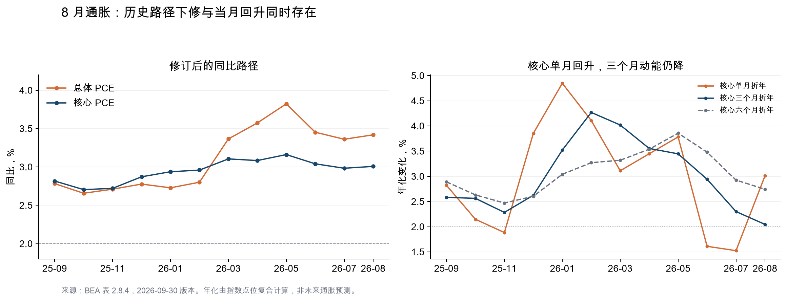
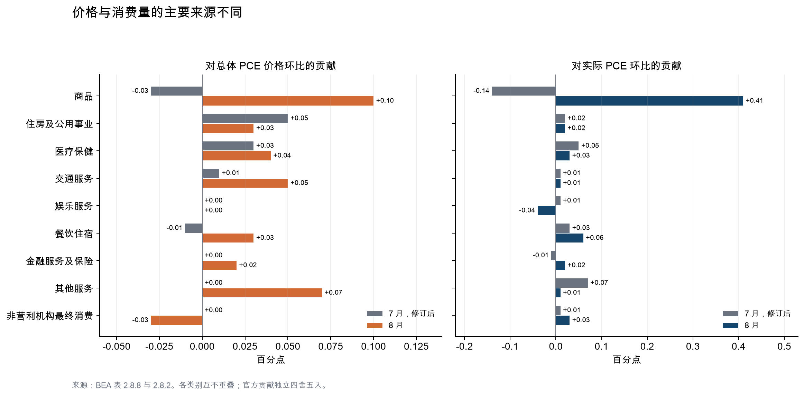
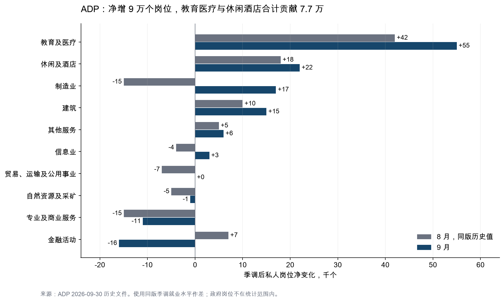

+++
title = "美国8月PCE与9月ADP联合分析：年度修订、分项动能与消费韧性"
date = "2026-09-30"
data_as_of = "2026-09-30"
data_as_of_note = "证据截至9月30日发布版；PCE、收入与支出观察期为8月，ADP观察期为9月。"
draft = false
description = "结合年度修订、PCE分项与ADP就业结构，分析8月通胀、消费韧性和9月私人就业变化。"
series = ""
categories = ["宏观与政策"]
tags = ["PCE", "ADP", "美国经济", "通胀", "就业"]
featured = false
private = false
content_preservation = "verbatim"
source_sha256 = "7ee23d8e30d72fb6afc70402a539dc4cf6e4303b7678502c7442be9196bc9a95"
+++

# 美国8月PCE与9月ADP联合分析：年度修订、分项动能与消费韧性

**报告日期：2026年9月30日｜研究对象：当日美东时间上午公布的8月PCE、个人收入与支出，以及9月ADP私人就业数据。**

**核心判断：修订后的历史通胀走势比此前公布的更温和，但8月价格涨幅与消费量均较7月回升，9月私人就业也从低位回升。核心通胀近三个月的平均涨幅继续回落，但非住房服务价格的单月反弹说明，通胀回到2%目标的过程仍不平稳。**

本次数据最容易被误读的地方，是年度修订。7月总体PCE同比由3.7%下修至3.4%，核心同比由3.3%下修至3.0%；8月公布值恰好为3.4%和3.0%。**按公布的一位小数口径，两项同比相对修订后7月均持平，不能把新值与旧前值之间的0.3个百分点差额，解释成8月当月出现的降温。**按指数点位重算，两项同比实际上都略有上升。与此同时，实际消费环比增长0.6%、储蓄率下降、ADP净增9万个私人岗位，显示总需求和就业尚有支撑，但收入增速和就业行业分布不足以支持“全面加速”的判断。[BEA本期发布](https://www.bea.gov/news/2026/personal-income-and-outlays-august-2026)、[BEA上期发布](https://www.bea.gov/news/2026/personal-income-and-outlays-july-2026)、[ADP本期发布](https://mediacenter.adp.com/2026-09-30-ADP-National-Employment-Report-Private-Sector-Employment-Increased-by-90,000-Jobs-in-September)

## 一、发布时点、数据范围与阅读口径

PCE反映8月的消费和价格变化，ADP提供时间上更近的9月就业信号。结合两者，可以观察购买力与需求能否延续，但不能将它们视为同月数据，更不能直接据此建立因果关系。ADP就业参考期是包含每月12日的那一周，薪酬指标的观察窗口另有定义。[ADP发布时间与上期说明](https://mediacenter.adp.com/2026-09-02-ADP-National-Employment-Report-Private-Sector-Employment-Increased-by-38,000-Jobs-in-August)、[ADP方法说明](https://adpemploymentreport.com/)

本报告使用以下口径：

- **月度比较全部优先采用9月30日同一版数据。**8月26日BEA和9月2日ADP的历史发布，仅用于明确标注的修订对照及各月薪酬披露比较。
- PCE环比为季节调整后的月度涨幅，不是年化增速。同比为与上年同月相比；额外计算的三个月、六个月年化值会明确标注。
- “名义PCE”是支出金额，“实际PCE”是剔除价格影响后的消费量，“PCE价格指数”是通胀指标，三者分别讨论。
- BEA金额水平及其月间差额通常以**季调年率（SAAR）**列示。下文金额统一注明为“十亿美元、SAAR”；例如支出增加190.8，并不表示8月单月未经年化的实际支出增加了1,908亿美元。
- 分项“涨幅”以百分比计，“对总体涨幅的贡献”以百分点计。主要分项贡献直接采用BEA表2.8.8和2.8.2，不以固定权重估算替代链式指数的正式分解。

**证据充分度：**本期及上期比较、主要分项、收入储蓄与ADP岗位数据达到G3：已获取官方发布、数据表和历史文件，并完成交叉核对。对涨价原因、未来持续性和政策反应的判断属于G2条件性分析；本报告不包含尚未公布的9月BLS非农结果，也没有核验统一市场预期样本或当日上午的完整资产价格反应，因此不据此认定数据“超预期”，也不解释当日行情的成因。

## 二、本期与上期对比：先剥离年度修订

### 2.1 关键指标对照

| 指标 | 7月上次公布值 | 7月本次修订值 | 8月本期值 |
| --- | ---: | ---: | ---: |
| 总体PCE价格，环比 | 0.2% | 0.1% | 0.3% |
| 核心PCE价格，环比 | 0.2% | 0.1% | 0.2% |
| 总体PCE价格，同比 | 3.7% | 3.4% | 3.4% |
| 核心PCE价格，同比 | 3.3% | 3.0% | 3.0% |
| 名义个人收入，环比 | 0.4% | 0.3% | 0.2% |
| 名义可支配收入，环比 | 0.5% | 0.4% | 0.3% |
| 实际可支配收入，环比 | 0.4% | 0.3% | 0.0% |
| 名义PCE，环比 | 0.2% | 0.1% | 0.9% |
| 实际PCE，环比 | 0.0% | 0.1% | 0.6% |
| 个人储蓄率，水平 | 3.0% | 4.6% | 4.1% |

来源：[BEA 8月发布及完整PDF](https://www.bea.gov/sites/default/files/2026-09/pi0826.pdf)、[7月原始发布](https://www.bea.gov/news/2026/personal-income-and-outlays-july-2026)、[9月30日历史比较表](https://www.bea.gov/sites/default/files/2026-09/pi0826-hist.xlsx)、[BEA NIPA第2部分数据表](https://apps.bea.gov/national/Release/XLS/Survey/Section2All_xls.xlsx)。月度增速和同比保留官方一位小数；储蓄率为水平。

这张表需要分三个层面阅读。

**第一，历史通胀压力被下调。**7月总体与核心同比各下修0.3个百分点，说明此前据旧数据形成的判断需要调整。这是对历史经济状态的重新估计，具有经济意义，但不代表8月当月通胀又下降了同样幅度。

**第二，8月的月度价格动能回升。**总体PCE环比从修订后的0.1%升至0.3%，核心从0.1%升至0.2%。直接比较上期原始值与本期值，会掩盖核心环比涨幅实际上有所加快这一点。

**第三，家庭储蓄的起点和当月方向也应分开。**7月储蓄率从3.0%上修至4.6%，上调1.6个百分点；8月降至4.1%。若把旧7月3.0%与新8月4.1%直接比较，就会错误地得到“储蓄率改善”的结论。同一版数据表明：历史储蓄率高于先前估计，但8月储蓄流量减少。

BEA本次年度更新的修订起点为2021年1月。2026年一季度工资薪金纳入QCEW资料，4—7月工资薪金也纳入修订后的CES资料，Medicaid福利估计使用了更新资料。这些是官方列出的收入修订来源；不能进一步断言，价格同比下修完全由其中某一项造成。[BEA本期技术说明](https://www.bea.gov/news/2026/personal-income-and-outlays-august-2026)

### 2.2 公布值的舍入，隐藏了多少变化

根据BEA公布至三位小数的价格指数重算：

| 指标 | 7月，同版指数重算 | 8月，同版指数重算 | 解释 |
| --- | ---: | ---: | --- |
| 总体PCE环比 | 0.050% | 0.310% | 7月接近0.1%公布档位的下沿，8月回升较明显 |
| 核心PCE环比 | 0.126% | 0.247% | 8月虽公布为0.2%，但接近0.25%的舍入分界 |
| 总体PCE同比 | 3.362% | 3.419% | 两个月均公布为3.4%，细看略升 |
| 核心PCE同比 | 2.983% | 3.008% | 两个月均公布为3.0%，细看略升 |

这里的额外精度来自**已公布指数点位的重算**，不是取得了BEA未舍入的底层数据。这些重算值有助于辨别变化方向，但最后一位小数不代表相应的测量精度。[BEA表2.8.4](https://apps.bea.gov/national/Release/XLS/Survey/Section2All_xls.xlsx)

同比也受基数影响。同一版指数下，2025年8月总体与核心环比分别约为0.255%和0.224%，低于2026年8月约0.310%和0.247%的涨幅；旧月份退出同比窗口后，同比因此略有上行。**同比在一位小数上持平，并不等于本月涨价动能没有变化。**

### 2.3 单月回升与三个月趋势改善并存

| 指标 | 7月三个月年化 | 8月三个月年化 | 8月六个月年化 | 8月单月年化 | 8月同比 |
| --- | ---: | ---: | ---: | ---: | ---: |
| 总体PCE | 1.54% | 1.03% | 3.57% | 3.79% | 3.42% |
| 核心PCE | 2.30% | 2.05% | 2.74% | 3.01% | 3.01% |
| 非住房非能源服务 | 2.75% | 2.33% | 3.20% | 4.39% | 3.46% |
| 住房 | 3.20% | 2.70% | 3.60% | 2.25% | 2.99% |
| Market-based core PCE | 2.26% | 2.41% | 2.81% | 3.48% | 3.03% |

来源及计算：[BEA表2.8.4](https://apps.bea.gov/national/Release/XLS/Survey/Section2All_xls.xlsx)。短期年化使用指数复合计算：8月三个月年化使用5月与8月指数，六个月年化使用2月与8月指数；7月三个月年化使用4月与7月指数。

核心PCE三个月年化从7月的约2.30%降至8月的约2.05%，这是支持近期通胀趋缓的证据。但8月核心单月涨幅年化约为3.01%，高于三个月平均；非住房、非能源服务单月涨幅年化约为4.39%。因此，近几个月的平均走势有所改善，但最后一个月的回升仍需留意。

总体三个月年化约1.03%，也明显受益于6月能源价格回落，不宜据此直接外推未来整体通胀。另一个交叉检验是**market-based core PCE**：8月环比约0.286%，公布口径为0.3%，其三个月年化约2.41%，高于完整核心PCE的2.05%。该指标排除了大部分无可直接观察价格的估算交易及非营利机构最终消费，可从不同覆盖范围提供补充观察，但不意味着它比正式PCE“更真实”。[BEA market-based PCE定义](https://www.bea.gov/help/faq/83)

## 三、PCE分项：哪些在推高价格，哪些在缓和压力

### 3.1 主要类别的涨幅与贡献

| 类别 | 7月价格环比 | 8月价格环比 | 7月对总体贡献，百分点 | 8月对总体贡献，百分点 |
| --- | ---: | ---: | ---: | ---: |
| **商品** | -0.1% | 0.3% | -0.03 | +0.10 |
| **耐用品** | 0.4% | 0.1% | +0.04 | +0.01 |
| 汽车及零部件 | 0.4% | 0.0% | +0.01 | 0.00 |
| 家具及家用耐用设备 | -0.9% | 0.0% | -0.02 | 0.00 |
| 娱乐商品及车辆 | 1.2% | 0.4% | +0.04 | +0.01 |
| 其他耐用品 | 0.6% | -0.3% | +0.01 | 0.00 |
| **非耐用品** | -0.4% | 0.5% | -0.07 | +0.09 |
| 居家食品及饮料 | -0.1% | 0.0% | -0.01 | 0.00 |
| 服装鞋类 | -0.1% | 0.2% | 0.00 | 0.00 |
| 汽油及其他能源商品 | -2.7% | 4.4% | -0.06 | +0.09 |
| 其他非耐用品 | 0.0% | -0.1% | 0.00 | -0.01 |
| **服务** | 0.1% | 0.3% | +0.08 | +0.21 |
| 住房及公用事业 | 0.3% | 0.1% | +0.05 | +0.03 |
| 医疗保健 | 0.2% | 0.2% | +0.03 | +0.04 |
| 交通服务 | 0.1% | 1.4% | +0.01 | +0.05 |
| 娱乐服务 | 0.0% | 0.0% | 0.00 | 0.00 |
| 餐饮住宿 | -0.1% | 0.5% | -0.01 | +0.03 |
| 金融服务及保险 | 0.0% | 0.2% | 0.00 | +0.02 |
| 其他服务 | 0.0% | 0.9% | 0.00 | +0.07 |
| 非营利机构最终消费 | 0.1% | -0.9% | 0.00 | -0.03 |

来源：[BEA表2.8.7、2.8.8](https://apps.bea.gov/national/Release/XLS/Survey/Section2All_xls.xlsx)。粗体为汇总项，不能再与其子项相加；各项独立舍入，分项合计可能与汇总项有0.01个百分点左右的差异。0.0%或0.00个百分点表示按该精度舍入，不保证底层变化严格为零。

8月商品对总体价格环比的贡献约0.10个百分点，服务贡献约0.21个百分点。相对7月，二者的贡献各增加约0.13个百分点，与指数重算的总体环比加快约0.26个百分点一致。**只把本月回升归结为油价，会遗漏服务价格的变化。**

### 3.2 能源：汽油反弹显著，公用事业价格并未同步上涨

汽油及其他能源商品价格环比从7月的-2.7%转为8月的+4.4%，对总体通胀的贡献从-0.06变为+0.09个百分点，贡献变化约+0.15个百分点，是总体环比回升的重要来源。全部能源商品与服务价格环比从-1.4%转为+2.3%，同比约16.85%，说明即使此前出现回落，能源价格仍明显高于一年前。

但能源内部存在分化：8月电价约下降0.21%，天然气服务价格约下降1.14%，部分抵消了能源商品上涨。因此，“油价带动能源回升”比“所有居民能源成本同步上涨”更符合本期数据。这里能够确认的是零售消费价格的变化。本报告未单独识别原油、炼厂利润、税费和供应扰动的影响，因此不能认定某个地缘事件是已获证实的唯一原因。[BEA主要分项及详细价格表2.4.4U](https://apps.bea.gov/national/Release/XLS/Underlying/Section2All_xls.xlsx)

汽油及其他能源商品的名义支出增加约20.9十亿美元、SAAR，实际消费量环比却约为0.0%。这部分支出增加主要体现价格变化，相较于“汽油需求大幅增长”，更值得关注的是这部分支出对居民其他消费的挤压风险。

### 3.3 耐用品：价格温和，消费量反弹

耐用品价格环比从0.4%降至0.1%，对总体价格的贡献从0.04降至0.01个百分点。汽车及零部件、家具及家用耐用设备的价格在官方一位小数口径下均为0.0%；娱乐商品及车辆价格仍涨0.4%，其他耐用品则下降0.3%。

与此同时，耐用品实际消费增长1.9%，汽车及零部件实际消费增长2.6%。这说明本月商品需求改善的同时，价格涨幅仍可保持温和，不能仅凭消费支出增长就认定商品通胀全面重燃。是否涉及促销、购买时点提前或此前疲弱后的正常回补，需要额外数据；本期PCE本身不能识别这些机制。[BEA表2.8.1、2.8.7](https://apps.bea.gov/national/Release/XLS/Survey/Section2All_xls.xlsx)

居家食品及饮料价格约持平，实际消费增长0.7%；其他非耐用品价格下降0.1%，实际消费增长1.5%。这些分项并不支持“需求全面过热”的判断。

### 3.4 住房：本月确有缓和，但不能与住宿混为一谈

住房价格环比由0.3%降至0.2%；按指数重算，约从0.259%降至0.186%。其中，租户实际租金约上涨0.174%，自有住房估算租金约上涨0.190%，均较7月放缓。住房同比约2.99%。

“住房及公用事业”这个更宽的类别环比上涨0.1%，低于单独住房，部分原因是电力和天然气服务价格下降。酒店住宿计入餐饮住宿，不属于这里的住房租金。因此，8月可以同时出现住房通胀放缓与住宿价格反弹，两者并不冲突。

当期数据可以确认，住房项缓和了通胀压力。对未来几个月的判断仍要结合新签租约、存量租约的更新速度和官方抽样；本报告没有用即时市场租金直接替代PCE住房口径。[BEA表2.8.4、2.8.7](https://apps.bea.gov/national/Release/XLS/Survey/Section2All_xls.xlsx)、[详细住房价格表](https://apps.bea.gov/national/Release/XLS/Underlying/Section2All_xls.xlsx)

### 3.5 医疗：总体温和，医院服务较突出

医疗保健价格环比为0.2%，按公布精度与7月相同，对总体PCE价格涨幅贡献约0.04个百分点。详细指数显示，医院服务环比约0.49%，高于7月约0.11%；医生服务仅约0.07%。可见，医疗服务内部的价格变化并不同步。

PCE包含雇主、政府等第三方代家庭支付的医疗消费，不能只用居民自付费用或CPI医疗分项来替代。以7月名义消费金额衡量，医疗保健约占总体PCE的17.4%，即使涨幅不大，也可能对总指数产生可见影响；这个占比仅用于说明规模，不是固定的Fisher指数权重。[BEA详细数据](https://apps.bea.gov/national/Release/XLS/Underlying/Section2All_xls.xlsx)、[BEA关于PCE覆盖范围的说明](https://www.bea.gov/help/faq/1009)

### 3.6 交通与餐饮住宿：服务通胀回升的重要来源

交通服务价格环比从0.1%升至1.4%，对总体PCE价格贡献由0.01升至0.05个百分点。航空运输约上涨3.15%，机动车维修约上涨1.08%，汽车租赁约上涨2.20%。其中，航空等分项波动较大，对单月数字影响显著，但本报告没有足够证据把这些涨幅等同于长期趋势。

餐饮住宿价格环比从-0.1%转为+0.5%，对总体贡献由-0.01转为+0.03个百分点。进一步拆分可以看到：购买的餐食与饮料价格约上涨0.21%，较7月约0.31%放慢；住宿价格则从约-2.49%反弹至+2.21%，其中酒店及汽车旅馆上涨约2.69%。**该大类涨幅加快，很大程度上来自住宿价格反弹，不能据此认定餐饮价格普遍加速。**住宿指数8月仍略低于6月，也说明环比反弹不应机械年化外推。[BEA详细价格表2.4.4U](https://apps.bea.gov/national/Release/XLS/Underlying/Section2All_xls.xlsx)

### 3.7 其他服务：通信需要单独识别

其他服务价格环比由0.0%升至0.9%，对总体PCE价格贡献约0.07个百分点，在服务的主要类别中贡献最大。该大类并不等于同质的“日常人工服务”，其中还包含通信、教育、专业服务等。

通信价格约上涨2.11%，其中电信服务约上涨4.05%、移动电话服务约上涨4.30%；互联网接入价格反而约下降0.70%。教育服务上涨约0.67%，专业及其他服务上涨约1.26%。这表明服务价格回升涉及多个类别，但涨幅仍明显集中于部分项目。

移动电话服务8月虽环比明显上涨，同比仍约为-0.18%。这一反差提醒我们：一次较大的环比上涨，不必然意味着持续高通胀已经形成。它是否反映资费、促销变化、质量调整或其他因素，需要更细资料；本报告不把其中一种解释当作已验证事实。[BEA详细价格表2.4.4U](https://apps.bea.gov/national/Release/XLS/Underlying/Section2All_xls.xlsx)

### 3.8 非营利机构、market-based PCE与“超级核心”

非营利机构最终消费价格环比约下降0.9%，对总体PCE价格涨幅的贡献约为-0.03个百分点。这个项目反映非营利机构提供服务的净支出核算，不能理解成消费者普遍享受到同幅度的零售降价。完整服务价格上涨0.3%，家庭服务消费价格上涨0.4%，二者的差异也反映出这一核算项的影响。[BEA表2.8.7、2.8.8](https://apps.bea.gov/national/Release/XLS/Survey/Section2All_xls.xlsx)、[BEA非营利机构消费定义](https://www.bea.gov/help/faq/1009)

本报告所称**非住房、非能源服务**，使用BEA的“PCE services excluding energy and housing”：8月约上涨0.359%，官方公布为0.4%，高于7月约0.068%。它包含餐饮服务；“核心PCE排除食品”主要指居家食品及饮料，并不把餐馆消费一并剔除。另一个指标“PCE excluding food, energy, and housing”仍包含非食品能源商品，两者不能混用。[BEA表2.8.7及脚注](https://apps.bea.gov/national/Release/XLS/Survey/Section2All_xls.xlsx)

判断通胀能否持续，需要同时考虑两点：能源和少数波动较大的服务分项解释了本月反弹的相当一部分；医疗、维修、教育与专业服务等分项又说明，不能把全部压力归为单一油价冲击。是否持续扩散，要观察随后数月的分项涨幅及其贡献，而不能只看单月的总体与核心数值。

## 四、消费、收入与储蓄：增长强度和可持续性分开看

### 4.1 实际消费反弹主要来自商品

| 类别 | 7月实际消费环比 | 8月实际消费环比 | 8月对实际PCE贡献，百分点 | 8月名义支出增量 |
| --- | ---: | ---: | ---: | ---: |
| **商品** | -0.5% | 1.3% | +0.41 | +114.1 |
| **耐用品** | -1.1% | 1.9% | +0.21 | +47.9 |
| 汽车及零部件 | -0.8% | 2.6% | +0.09 | +20.1 |
| **非耐用品** | -0.1% | 1.0% | +0.20 | +66.2 |
| 居家食品及饮料 | -0.1% | 0.7% | +0.05 | +11.6 |
| 汽油及其他能源商品 | 0.3% | 0.0% | 0.00 | +20.9 |
| 其他非耐用品 | -0.3% | 1.5% | +0.12 | +24.7 |
| **服务** | 0.3% | 0.2% | +0.14 | +76.7 |
| 住房及公用事业 | 0.1% | 0.1% | +0.02 | +10.3 |
| 医疗保健 | 0.3% | 0.2% | +0.03 | +15.1 |
| 交通服务 | 0.4% | 0.2% | +0.01 | +12.6 |
| 娱乐服务 | 0.2% | -1.1% | -0.04 | -10.3 |
| 餐饮住宿 | 0.4% | 0.8% | +0.06 | +20.6 |
| 金融服务及保险 | -0.1% | 0.3% | +0.02 | +8.5 |
| 其他服务 | 0.9% | 0.2% | +0.01 | +18.7 |
| 非营利机构最终消费 | 0.3% | 1.0% | +0.03 | +1.1 |

来源：[BEA表2.8.1、2.8.2、2.8.5](https://apps.bea.gov/national/Release/XLS/Survey/Section2All_xls.xlsx)。金额列为十亿美元、SAAR；粗体商品与服务为汇总项，不与其子项重复相加。

8月实际PCE按指数水平计算增长约0.550%，公布为0.6%；商品贡献约0.41个百分点，约占整体增长的四分之三。耐用品和非耐用品实际消费分别增长1.9%和1.0%，说明反弹并不限于汽车。

不过，服务实际消费增速由7月0.3%放慢至0.2%，对总体实际消费增长的贡献由0.19降至0.14个百分点；医疗实际消费增速也有所放慢，娱乐服务实际消费下降1.1%。因此，**总体消费增长加快主要来自商品消费反弹，服务消费并未同步全面加速。**

名义消费增加190.8十亿美元、SAAR，其中商品增加114.1、服务增加76.7。支出增加包含价格与数量两方面变化；不能把名义支出增量直接当作通胀贡献。下图把两者分别呈现。

### 4.2 收入仍增长，但实际购买力当月几乎没有改善

8月个人收入增长0.2%，可支配收入增长0.3%，均较7月放慢。员工报酬和政府社会福利仍是主要增量来源。

| 收入来源或扣减项 | 8月对个人收入增量的贡献，十亿美元、SAAR |
| --- | ---: |
| 员工报酬 | +47.7 |
| 业主收入 | +5.7 |
| 租金收入 | +0.9 |
| 资产收入 | +3.4 |
| 政府社会福利 | +22.9 |
| 企业等其他经常转移收入（净额） | -8.5 |
| 减：政府社会保险缴款 | -5.5 |
| **个人收入合计** | +66.6 |

来源：[BEA表2.6](https://apps.bea.gov/national/Release/XLS/Survey/Section2All_xls.xlsx)。这是个人收入增量的核算分解；政府社会保险缴款为扣减项。各行保留一位小数，可能有舍入差。

个人当期税收下降约1.9十亿美元、SAAR，使可支配收入增量略高于个人收入增量。扣除价格影响后，实际可支配收入环比约-0.027%，官方舍入为0.0%；人均实际可支配收入约下降0.054%。实际个人收入剔除当期转移收入后也小幅下降约0.077%。这些指标共同说明，本月消费量明显反弹，实际收入却没有同步加速。

从同比看，实际PCE增长约2.57%，实际可支配收入增长约1.30%。这并不意味着消费即将收缩，但消费能否延续，更需要结合资产收入、财富效应、信用和储蓄行为来判断。总量资料不能识别具体收入群体的承压程度。[BEA表2.6、2.8.6](https://apps.bea.gov/national/Release/XLS/Survey/Section2All_xls.xlsx)

### 4.3 储蓄率下滑意味着什么

同版数据下，7月个人储蓄为1,112.4十亿美元、SAAR，8月为990.2，减少122.1；储蓄率从4.6%降至4.1%。对应的会计关系是：

> 可支配收入增加约68.6，个人总支出增加约190.7，个人储蓄因此减少约122.1。以上单位均为十亿美元、SAAR。

个人总支出除PCE外还包括个人利息支付和经常转移支付，因此其190.7与PCE的190.8不完全相同。按会计增量计算，储蓄减少约相当于总支出增量的64%。这说明当月支出增长加快，在会计上有较大部分对应于储蓄流量下降，不能进一步解释为“64%的消费靠新增负债”，也不能据此推算家庭已经消耗了多少存款余额。

**储蓄是流量，财富是存量。**储蓄率下降既可能对应信心改善后的支出增加，也可能对应收入承压后的被动调整；现有总量数据不足以区分这两种行为。年度修订提高了此前估计的储蓄水平，但本月储蓄流量下降，仍是判断后续消费能否持续时需要跟踪的约束。[BEA本期历史比较表](https://www.bea.gov/sites/default/files/2026-09/pi0826-hist.xlsx)、[表2.6](https://apps.bea.gov/national/Release/XLS/Survey/Section2All_xls.xlsx)

## 五、9月ADP：岗位净增修复，行业分布仍不均衡

### 5.1 总量、历史修订与近期趋势

9月私人部门岗位净增90千个，8月由此前公布的38千个下修至36千个，因此本月较修订后上月多增54千个。9月发布开始纳入BLS于8月28日公布的2026年一季度QCEW资料；报告中的历史分项比较统一使用9月30日下载文件，避免把旧分项与新总量拼接。[ADP本期发布](https://mediacenter.adp.com/2026-09-30-ADP-National-Employment-Report-Private-Sector-Employment-Increased-by-90,000-Jobs-in-September)

| 月份 | 4月 | 5月 | 6月 | 7月 | 8月 | 9月 |
| --- | ---: | ---: | ---: | ---: | ---: | ---: |
| 季调私人岗位净变化 | +105 | +122 | +95 | +44 | +36 | +90 |

来源：[ADP 9月30日历史数据文件](https://adpemploymentreport.com/artifacts/us_ner/20260930/ADP_NER_history.zip)。表内为同版季调就业水平的月间差，单位为千个岗位。同版7月为44千个，亦不同于9月2日发布中的46千个。

7—9月平均每月净增约56.7千个，仍低于4—6月约107.3千个。9月反弹缓解了对就业“持续逐月恶化”的担忧，但单月回升尚不足以确认就业进入新的广泛加速阶段。ADP在本期声明中将其评价为较强报告，这属于发布方判断；研究上仍须结合行业、规模与后续BLS数据检验。

### 5.2 行业：教育医疗和休闲酒店贡献集中

| 行业 | 8月净变化，千个 | 9月净变化，千个 | 较上月多增/少增，千个 |
| --- | ---: | ---: | ---: |
| 自然资源及采矿 | -5 | -1 | +4 |
| 建筑 | +10 | +15 | +5 |
| 制造业 | -15 | +17 | +32 |
| 贸易、运输及公用事业 | -7 | 0 | +7 |
| 信息业 | -4 | +3 | +7 |
| 金融活动 | +7 | -16 | -23 |
| 专业及商业服务 | -15 | -11 | +4 |
| 教育及医疗 | +42 | +55 | +13 |
| 休闲及酒店 | +18 | +22 | +4 |
| 其他服务 | +5 | +6 | +1 |
| **私人部门合计** | +36 | +90 | +54 |

来源：[ADP同版历史文件](https://adpemploymentreport.com/artifacts/us_ner/20260930/ADP_NER_history.zip)、[9月发布](https://mediacenter.adp.com/2026-09-30-ADP-National-Employment-Report-Private-Sector-Employment-Increased-by-90,000-Jobs-in-September)。变化均为净岗位变化，不能等同于新招聘总量或裁员总量。

要理解9万个岗位的净增量，还需看三个结构特征。

**一是净增长仍较集中。**教育医疗增加55千个、休闲酒店增加22千个，合计77千个，相当于总净增的约85.6%。这是占“净增量”的比重；其他行业存在减员，因而不能解读为全部新招聘中有85.6%发生在这两个行业。服务业总净增59千个，剔除这两类后，其余服务行业合计仍净减18千个。

**二是制造业改善。**制造业从8月净减15千个转为9月净增17千个，变化达32千个，是月度总量改善的重要来源；建筑业仍净增15千个。商品生产部门合计净增31千个。

**三是金融与专业商业服务仍弱。**金融活动净减16千个，专业及商业服务净减11千个，贸易、运输及公用事业整体持平。这些数据并不支持“企业用工需求全面增强”的判断。ADP大类无法进一步识别白领职业、AI替代或具体企业成本调整，不能仅凭这两项负值确认某一种叙事。

### 5.3 企业规模与地区

| 经营单位规模 | 8月净变化，千个 | 9月净变化，千个 |
| --- | ---: | ---: |
| **小型：1—49人** | +8 | +23 |
| 1—19人 | +22 | +18 |
| 20—49人 | -14 | +5 |
| **中型：50—499人** | -8 | +54 |
| 50—249人 | -3 | +18 |
| 250—499人 | -5 | +36 |
| **大型：500人及以上** | +34 | +14 |

来源：[ADP同版历史文件](https://adpemploymentreport.com/artifacts/us_ner/20260930/ADP_NER_history.zip)。单位为千个岗位，规模指经营单位（establishment）。历史就业水平按千位列示，作差后本表8月分组合计34、总量36，9月分组合计91、总量90。此类小幅差异与舍入精度相容；保留公布值的计算结果，不人为填平，也也不据此认定未舍入数据存在相同差距。

9月中型经营单位成为主要净增来源，尤其250—499人组增加36千个；20—49人组从负增长转正，反弹不完全依赖大型雇主。大型经营单位净增14千个，低于8月约34千个。按地区，东北部增加56千个、中西部5千个、南部11千个、西部17千个，岗位净增长仍集中在部分地区；地区分组合计与全国总量也有舍入差。[ADP地区与规模分项](https://mediacenter.adp.com/2026-09-30-ADP-National-Employment-Report-Private-Sector-Employment-Increased-by-90,000-Jobs-in-September)

### 5.4 薪酬：base pay与gross pay必须分开

ADP自8月数据发布起扩展薪酬统计，同时披露基础薪酬与总薪酬。基础薪酬取自合同工资率；总薪酬还包含奖金、佣金、小费等收入，因此，判断持续工资压力和当期收入时，两者提供的信息不同。

| 同一劳动者同比薪酬变化的中位数 | 8月 | 9月 | 变化 |
| --- | ---: | ---: | ---: |
| 全体劳动者：基础薪酬 | 3.2% | 3.2% | 持平 |
| 留职者：基础薪酬 | 3.0% | 3.0% | 持平 |
| 换职者：基础薪酬 | 4.7% | 4.8% | +0.1个百分点 |
| 全体劳动者：总薪酬 | 4.7% | 4.7% | 持平 |
| 留职者：总薪酬 | 4.4% | 4.4% | 持平 |
| 换职者：总薪酬 | 7.3% | 7.3% | 持平 |

来源：[ADP 8月发布与口径更新](https://mediacenter.adp.com/2026-09-02-ADP-National-Employment-Report-Private-Sector-Employment-Increased-by-38,000-Jobs-in-August)、[9月发布](https://mediacenter.adp.com/2026-09-30-ADP-National-Employment-Report-Private-Sector-Employment-Increased-by-90,000-Jobs-in-September)。两列采用各月发布中的同名口径；不将未核验的后续薪酬修订混入。

多数薪酬指标稳定，换职者基础薪酬略升。这支持“就业反弹尚未伴随薪酬普遍再加速”的判断，也没有显示工资增速突然大幅下滑。总薪酬增速高于基础薪酬增速，说明评估当期家庭收入时应关注更广的报酬来源；两者之差不能直接当作奖金对工资增长的贡献，因为二者分别是不同薪酬口径下的分布统计量。

这些数据是匹配劳动者的同比薪酬变化中位数，不是BLS平均时薪，也不是全经济工资总额。尤其不能直接用“9月ADP工资增速减去8月PCE同比”计算全美家庭实际收入：月份、覆盖对象、统计量与权重均不同。判断工资是否会持续推动通胀，还需要生产率、单位劳动成本、工时和利润率等证据。

## 六、PCE与ADP合并后，能够支持怎样的经济判断

### 6.1 需求有韧性，支撑来源需要继续验证

8月实际消费较强、9月私人就业净增回升，两者共同削弱了“需求和就业同时快速收缩”的解释。餐饮住宿实际消费增长0.8%，随后ADP休闲酒店净增22千个，方向上也相互呼应。

但8月实际可支配收入基本持平，储蓄流量下降；ADP三个月平均岗位增长仍偏低，服务岗位增量又集中于少数行业。因此，目前证据更支持这样的判断：**消费和就业表现出韧性，增长基础仍有分化。**能否延续，取决于就业数量、报酬和实际购买力能否共同改善。

### 6.2 服务价格与就业分项只能交叉验证，不能一一对应

| 观察组合 | 可以支持的解释 | 当前不能证明的结论 |
| --- | --- | --- |
| 医疗消费继续增长，ADP教育医疗岗位增加 | 相关服务需求和用工仍有支撑 | 新增就业直接导致医院价格上涨；ADP教育医疗全都属于医疗 |
| 餐饮住宿消费增长，休闲酒店岗位增加 | 部分线下服务需求仍有韧性 | 所有餐饮价格都在加速；PCE与ADP类别完全一致 |
| 商品实际消费反弹，制造业就业由负转正 | 两项数据在方向上有所改善 | 美国制造业已进入新周期；消费商品全部由本土生产 |
| 金融服务价格上涨，金融岗位减少 | 价格和岗位数量可以由不同因素驱动 | 通胀只由就业数量决定；金融行业整体利润已恶化 |

以上只是从经济机制出发的解释，尚未完成因果识别。PCE按消费产品分类，ADP按雇主行业分类；一家公司生产的服务可能进入不同消费类别，消费者购买的商品也可能来自进口。

### 6.3 通胀的“水平”“近期趋势”“边际变化”给出不同信号

- **水平：**核心PCE同比约3.0%，总体约3.4%，仍高于2%的总体PCE长期目标；能源同比尤其高。
- **近期趋势：**核心三个月年化约2.05%，六个月年化约2.74%，较此前改善。
- **边际变化：**8月核心环比约0.247%，非住房非能源服务约0.359%，均高于7月；market-based core也有所上升。

这三个层面并不冲突。若只看同比旧值与新值，会高估本月降温；若只看服务单月反弹，又会忽略过去几个月的改善。后续判断的关键，是通信、航空和住宿的波动消退后，其他服务类别是否仍维持较高涨幅。

## 七、政策与资产含义：在9月加息背景下理解

### 7.1 对美联储的含义

美联储已于2026年9月16日加息25个基点，将联邦基金利率目标区间上调至3.75%—4.00%，并强调通胀仍偏高。因此，本次数据需要放在刚刚加息的背景下解读，不能套用未经核实的“降息周期继续推进”前提。[9月16日FOMC声明](https://www.federalreserve.gov/newsevents/pressreleases/monetary20260916a.htm)

这组数据对政策的影响并非单向：历史通胀下修、核心三个月动能改善，削弱了仅凭此前通胀走势继续追加紧缩的理由；实际消费反弹、就业净增恢复、非住房服务单月涨幅提高，则削弱了立即转向宽松的必要性。

**本报告认为：这组数据支持继续观察，尚不足以单独决定下一次是加息、维持利率还是降息。**若核心与非住房服务的较高月度涨幅持续，紧缩压力会重新增强；若波动分项回落且工资、收入和就业进一步放缓，暂停追加紧缩的理由会更充分。

还有一个时间顺序限制：8月PCE发生在9月16日加息之前；9月ADP就业主要参考包含12日的那一周，同样不能用于检验此次加息后的就业效果。据今天的数据宣称“9月加息已经奏效”，不符合这一时间顺序。[ADP统计说明](https://adpemploymentreport.com/)

### 7.2 对主要资产的条件性含义

| 资产或风险因子 | 较有利的条件 | 相反方向的条件 |
| --- | --- | --- |
| 美债前端 | 历史修订和后续温和核心通胀降低追加加息预期 | 非住房服务继续偏强、就业进一步改善，推高政策利率路径 |
| 美债长端 | 通胀预期下降且实际增长放缓 | 实际消费韧性、能源风险或期限溢价上升；前端缓和不保证长端同步下行 |
| 美股整体 | 通胀改善能够与实际需求和盈利增长并存 | 实际收入追不上支出，随后消费放缓；或更高利率压缩估值 |
| 消费与服务相关行业 | 持续的消费量增长、相对稳定的投入成本 | 能源与人工成本上升、储蓄率下降、需求增长集中于少数类别 |
| 美元与黄金 | 美元对相对政策路径敏感，黄金通常受实际利率与美元共同影响 | 通胀、增长、避险和国际利差可能相互抵消，单个PCE值不能确定方向 |

本表描述传导机制，不是对当日涨跌的事实陈述。PCE、ADP、同日其他宏观信息以及发布前仓位都可能影响行情；缺少事前预期、带时间戳的行情数据，也未控制其他新闻的影响，就不能把市场变化全部归因于某一份报告。

## 八、后续最值得跟踪的验证点

| 待验证问题 | 后续观察 | 支持当前判断的结果 | 会改变判断的结果 |
| --- | --- | --- | --- |
| ADP反弹能否代表更广就业改善 | BLS私人非农、行业扩散、工时、失业率、参与率及修订 | 就业改善扩展到更多私人行业，工时和劳动收入保持稳定 | 就业增量集中、工时下降或历史数据明显下修 |
| 服务反弹是否只是有限类别波动 | 随后PCE通信、航空、住宿、医疗、维修、教育等分项 | 波动项回落，其他服务未持续扩散 | 多个服务类别连续维持较高月度涨幅 |
| 核心通胀能否稳定接近目标 | 三个月与六个月年化、market-based core | 改善延续，且不依赖少数负贡献项 | 三个月年化重新抬升，market-based core持续偏强 |
| 消费能否得到收入支持 | 实际DPI、工资总额、储蓄率与信用资料 | 实际收入跟上消费，储蓄率趋稳 | 实际收入持续停滞而支出继续靠降低储蓄维持 |
| 能源冲击是否继续扩散 | 消费端汽油、公用事业、运输服务及后续预期指标 | 能源价格稳定，间接影响有限 | 零售能源再涨并伴随更多服务提价 |

按当前官方日历，接下来依次关注：

- **10月2日08:30 ET：**9月BLS就业报告。
- **10月14日08:30 ET、10月15日08:30 ET：**9月CPI和PPI。
- **10月27—28日：**下一次FOMC会议。
- **10月29日08:30 ET：**9月个人收入与支出及PCE。
- **10月30日08:30 ET：**三季度Employment Cost Index。

来源：[BLS 10月发布日历](https://www.bls.gov/schedule/2026/10_sched.htm)、[美联储货币政策日历](https://www.federalreserve.gov/monetarypolicy.htm)、[BEA下次发布时间](https://www.bea.gov/news/2026/personal-income-and-outlays-august-2026)。**按这些日程，9月PCE在10月FOMC会议之后发布**，不能把它视为会前已知信息；届时决策者可获得的其他价格、就业资料仍然重要。

