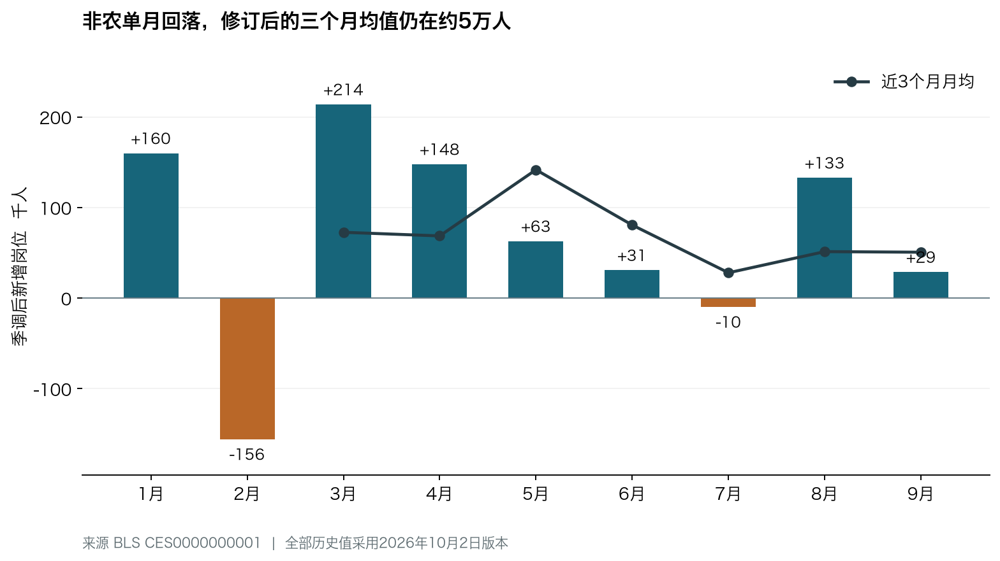
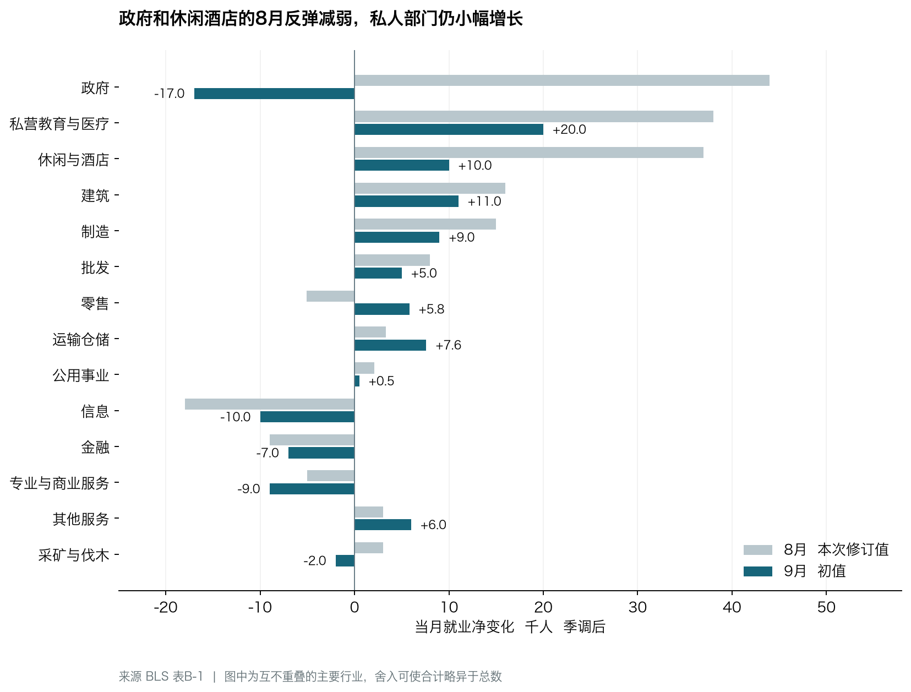
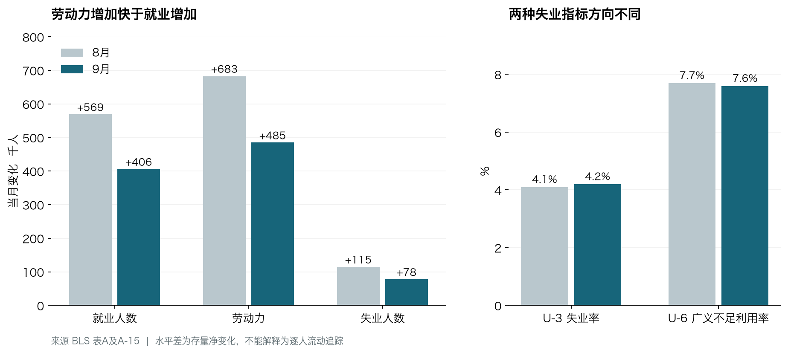

+++
title = "美国2026年9月非农就业与失业率分析"
date = "2026-10-02"
data_as_of = "2026-10-02"
data_as_of_note = "主体统计参考期为2026年9月；官方于10月2日08:30 EDT发布，研究信息截至10月2日21:05 SGT；8月与9月主体比较采用同一发布版本。"
draft = false
description = "比较9月非农、失业率与修订后的8月数据，分析行业广度、劳动力供给、工资工时及未来一至三个月的条件情景。"
series = ""
categories = ["宏观与政策"]
tags = ["非农就业", "失业率", "BLS", "工资", "美联储"]
featured = false
private = false
content_preservation = "verbatim"
source_sha256 = "a0beaa4e3ada9cfc75e0b003452f915026edac0abf71db0d2480a4c9f077dfab"
+++

# 美国2026年9月非农就业与失业率分析

**报告日期：2026年10月2日。官方发布：10月2日08:30 EDT，即新加坡时间20:30。研究截止：2026年10月2日 21:05 SGT。**

**核心判断：美国劳动力市场仍处于低招聘、低裁员的脆弱平衡。9月企业新增岗位、招聘广度和工资动能偏弱，8月反弹的强度也被下修；家庭调查则显示就业与劳动参与同时增加，尚不足以确认经济已转入广泛裁员和就业收缩。政策上，这份报告增加了等待后续数据的理由，但单凭它仍不能推导美联储立即转向降息。**

9月非农净增 **2.9万人**，低于同版8月的 **13.3万人**；7—8月合计下修 **6.0万人**。私人部门9月增加 **4.6万人**，政府减少 **1.7万人**。私人部门就业扩散指数从57.6降至49.0，说明增长广度收窄。另一方面，家庭就业增加 **40.6万人**、劳动力增加 **48.5万人**，失业率由4.1%升至4.2%，U-6却由7.7%降至7.6%。这组组合数据要求把企业招聘、劳动力供给和失业质量分别分析。[BLS本期完整PDF](https://www.bls.gov/news.release/pdf/empsit.pdf)、[企业调查汇总表B](https://www.bls.gov/news.release/empsit.b.htm)、[家庭调查汇总表A](https://www.bls.gov/news.release/empsit.a.htm)、[表A-15](https://www.bls.gov/news.release/empsit.t15.htm)

本文所有8月与9月的主体比较，优先使用**10月2日同一版数据**；9月4日旧版仅用于修订对照。CES统计岗位，CPS统计就业人数，两者不直接相加或互相替代。除另行注明外，月度就业比较均为季节调整后数据，表内人数单位为**千人**；1千人等于0.1万人。

## 本次发布和修订后的8月比较

下表中的“8月同版值”已包含本次修订，避免把9月初值与8月旧初值混在一起。百分率的变化以百分点衡量，岗位增量与人数水平分别注明。

| 指标 | 单位 | 8月同版值 | 9月初值 | 变化解读 |
| --- | --- | --- | --- | --- |
| 非农岗位净增 | 千人 | +133 | +29 | 减少104 |
| 私人部门岗位净增 | 千人 | +89 | +46 | 减少43 |
| 政府岗位净增 | 千人 | +44 | -17 | 减少61 |
| 商品生产部门岗位净增 | 千人 | +34 | +18 | 减少16 |
| 私人服务业岗位净增 | 千人 | +55 | +28 | 减少27 |
| 失业率 U-3 | % | 4.1 | 4.2 | +0.1个百分点 |
| 劳动参与率 | % | 61.6 | 61.8 | +0.2个百分点 |
| 就业人口比 | % | 59.1 | 59.2 | +0.1个百分点 |
| U-6 劳动力不足利用率 | % | 7.7 | 7.6 | -0.1个百分点 |
| 私人部门平均时薪 | 美元 | 37.76 | 37.81 | +0.05美元 |
| 平均时薪环比 | % | 0.3 | 0.1 | 工资动能放缓 |
| 平均时薪同比 | % | 3.1 | 3.0 | -0.1个百分点 |
| 私人部门平均周工时 | 小时 | 34.4 | 34.4 | 持平 |
| 私人总工时指数环比 | % | 0.4 | 0.0 | 工作量增长停滞 |
| 私人总工资指数环比 | % | 0.7 | 0.2 | 名义劳动收入增量放缓 |
| 私人部门就业扩散指数 | 指数 | 57.6 | 49.0 | 下降8.6点 |
| 制造业就业扩散指数 | 指数 | 63.9 | 46.5 | 下降17.4点 |

来源：[BLS表A](https://www.bls.gov/news.release/empsit.a.htm)、[表B](https://www.bls.gov/news.release/empsit.b.htm)、[表A-15](https://www.bls.gov/news.release/empsit.t15.htm)、[完整PDF第3、5页](https://www.bls.gov/news.release/pdf/empsit.pdf)。工资环比与同比采用官方一位小数展示口径；工时、工资指数的0.0%表示该展示精度下持平，不保证未舍入变化严格等于零。

**本月偏弱的证据，集中在净招聘、行业广度和收入动能；大规模裁员的证据仍不足。**BLS新闻稿将非农、失业率和各主要行业的月度变化总体描述为“变化不大”。本文讨论点估计的经济方向，不把每个小变动都解释成统计显著的趋势。

## 修订和趋势如何改变判断

### 修订压力主要落在私人服务业

单位为千人。下表“上次公布”指9月4日版本，“本次公布”指10月2日版本。

| 类别 | 7月 上次 → 本次 | 8月 上次 → 本次 | 两月合计修订 |
| --- | --- | --- | --- |
| 非农合计 | +21 → -10 | +162 → +133 | -60 |
| 私人部门 | +71 → +28 | +127 → +89 | -81 |
| 商品生产 | +29 → +35 | +41 → +34 | -1 |
| 私人服务业 | +42 → -7 | +86 → +55 | -80 |
| 政府 | -50 → -38 | +35 → +44 | +21 |

私人部门两月合计下修8.1万人，其中私人服务业下修8.0万人；政府两月合计上修2.1万人，抵消了部分拖累。这比仅看非农合计下修6万人更有信息量：**此前对市场化服务需求的估计偏强，是本次需要修正的主要判断。**这些是普通月度修订，包含补报资料和季调重估，不能直接解释成企业在9月额外裁掉了6万人。[本期PDF修订说明](https://www.bls.gov/news.release/pdf/empsit.pdf)、[BLS官方原始序列接口](https://api.bls.gov/publicAPI/v2/timeseries/data/CES0000000001?startyear=2025&endyear=2026)

### 三个月趋势仍弱 但没有在同版数据中进一步急跌

单位为千人每月。8月窗口为6—8月，9月窗口为7—9月，均采用10月2日版本。

| 类别 | 截至8月的三个月月均 | 截至9月的三个月月均 | 截至9月的六个月月均 |
| --- | --- | --- | --- |
| 非农合计 | 51.3 | 50.7 | 65.7 |
| 私人部门 | 47.7 | 54.3 | 66.7 |
| 商品生产 | 27.7 | 29.0 | 18.3 |
| 私人服务业 | 20.0 | 25.3 | 48.3 |
| 政府 | 3.7 | -3.7 | -1.0 |

修订后，非农三个月月均从5.13万人变为5.07万人，基本持平；私人部门三个月月均反而从4.77万人升至5.43万人，因为9月私人新增就业高于移出窗口的6月。9月4日当时公布的非农三个月均值约7.13万人，如直接与现在的5.07万人比较，会把**历史修订和新增一个月的信息**混为一谈。

今年1—9月非农累计增加61.2万人，月均6.8万人。数据支持“增长速度低、8月反弹未延续”，尚不支持仅凭9月2.9万人就认定增速正在连续加速下滑。来源：[BLS表B](https://www.bls.gov/news.release/empsit.b.htm)及本次冻结的官方API序列，自行计算。

## 各行业就业与上月同类比较

### 主要行业

单位为千人。最右列是“9月净增减－8月净增减”，衡量增长速度的变化。前四行为汇总，后续行业不可再与这些汇总重复相加。

| 行业 | 8月净增减 | 9月净增减 | 增速变化 |
| --- | --- | --- | --- |
| 非农合计 | +133.0 | +29.0 | -104.0 |
| 私人部门 | +89.0 | +46.0 | -43.0 |
| 商品生产 | +34.0 | +18.0 | -16.0 |
| 私人服务业 | +55.0 | +28.0 | -27.0 |
| 采矿与伐木 | +3.0 | -2.0 | -5.0 |
| 建筑 | +16.0 | +11.0 | -5.0 |
| 制造 | +15.0 | +9.0 | -6.0 |
| 批发 | +8.0 | +5.0 | -3.0 |
| 零售 | -5.1 | +5.8 | +10.9 |
| 运输与仓储 | +3.3 | +7.6 | +4.3 |
| 公用事业 | +2.1 | +0.5 | -1.6 |
| 信息 | -18.0 | -10.0 | +8.0 |
| 金融 | -9.0 | -7.0 | +2.0 |
| 专业与商业服务 | -5.0 | -9.0 | -4.0 |
| 私营教育与医疗社服 | +38.0 | +20.0 | -18.0 |
| 休闲与酒店 | +37.0 | +10.0 | -27.0 |
| 其他服务 | +3.0 | +6.0 | +3.0 |
| 政府 | +44.0 | -17.0 | -61.0 |

来源：[BLS表B-1](https://www.bls.gov/news.release/empsit.t17.htm)。分行业与汇总项存在公布精度差异，分项合计可能略有舍入差。

相对8月，非农增量少了10.4万人，其中政府贡献6.1万人，约占减速的 **58.7%**；私人部门贡献4.3万人。再往下看，地方政府教育和餐饮两项合计贡献7.41万人的月际减速，约占 **71.3%**。这说明8月的特殊集中度对9月表观回落有很大影响。

但不能把弱点全部归为教育季调：剔除餐饮与地方政府教育后，非农净增仍由8月的4.99万人降至9月的2.00万人；同时扩散指数跌破50，显示招聘缺乏广度。这一剔除仅为集中度敏感性分析，不是BLS正式“核心非农”指标，也不证明这些行业的实际贡献应被忽略。

### 建筑和制造仍增长 但内部并不一致

建筑增加1.1万人，较8月的1.6万人放缓。非住宅专业承包商增加1.23万人，超过建筑行业净增量；住宅专业承包商减少0.79万人，抵消部分增长。制造业增加0.9万人，机械和塑料橡胶仍有贡献，增长广度却明显收窄。

| 细分行业 千人 | 8月净增减 | 9月净增减 |
| --- | --- | --- |
| 非住宅专业承包商 | +6.1 | +12.3 |
| 住宅专业承包商 | +2.6 | -7.9 |
| 住宅建筑施工 | +5.3 | +3.0 |
| 机械制造 | +5.0 | +4.5 |
| 塑料与橡胶制品 | +0.4 | +4.6 |
| 金属制品制造 | +6.8 | -0.9 |
| 汽车及零部件 | -7.3 | +1.6 |
| 半导体及其他电子元件 | +1.5 | +1.2 |

制造业扩散指数从63.9降至46.5，同时总岗位仍增加，说明净岗位增长与行业覆盖面可以背离。扩散指数按细行业方向计数，并不按就业规模加权，不能把46.5解读成制造业就业人数减少46.5%。非住宅建设与机械需求仍有支撑，但这些大类无法单独识别数据中心投资；也无法仅凭信息或软件服务就业下降，证明AI已经造成某种规模的岗位替代。[表B-1](https://www.bls.gov/news.release/empsit.t17.htm)、[表B及扩散指数定义](https://www.bls.gov/news.release/empsit.b.htm)

### 专业服务 信息和金融仍是市场化需求的薄弱环节

| 细分行业 千人 | 8月净增减 | 9月净增减 |
| --- | --- | --- |
| 专业科学与技术服务 | +1.3 | +6.4 |
| 临时帮助服务 | +0.2 | -10.9 |
| 计算机系统设计 | -2.2 | -4.4 |
| 建筑工程设计服务 | +2.9 | +5.8 |
| 计算基础设施与数据处理托管 | -5.7 | -1.6 |
| 出版 | -5.6 | -4.0 |
| 信贷中介及相关业务 | -4.3 | -4.6 |
| 保险及相关业务 | -5.1 | -2.3 |
| 仓储 | -2.6 | -4.1 |

专业与商业服务减少0.9万人，其中临时帮助服务减少1.09万人，专业科学与技术服务增加0.64万人形成部分抵消。因此，不能把整个专业服务部门都描述为同幅度萎缩。临时用工通常比长期雇佣调整灵活，其转弱是未来招聘需要警惕的信号，但单月下降仍可能受行业结构、用工方式和样本波动影响。

信息业和金融业分别减少1.0万、0.7万人，虽比8月的降幅小，仍未转为增长。仓储岗位也继续下降。综合这些指标，对企业招聘意愿应保持谨慎，不能由制造与非住宅建筑的局部韧性推导出私人需求全面加速。[表B-1](https://www.bls.gov/news.release/empsit.t17.htm)

### 医疗仍提供支撑 护理和居家医疗回落

| 细分行业 千人 | 8月净增减 | 9月净增减 |
| --- | --- | --- |
| 医疗 | +24.4 | +16.7 |
| 门诊医疗服务 | +11.2 | +13.4 |
| 医院 | +11.4 | +12.0 |
| 居家医疗服务 | +11.8 | -2.3 |
| 护理与住宿照护机构 | +1.8 | -8.7 |
| 社会援助 | +10.7 | +6.3 |
| 个人与家庭服务 | +8.7 | +10.5 |
| 私营教育 | +3.5 | -3.2 |

医疗与社会援助合计增加2.30万人，占私人部门净增4.60万人的 **50.0%**。剔除两者后，私人就业仍增长2.30万人，说明需求尚有扩张，但增量较薄。医院与门诊医疗的增长，被护理机构和居家医疗的下降部分抵消；不能把医疗简单视为各子行业同步强劲。表中医疗、门诊医疗与居家医疗存在包含关系，不能重复相加。[表B-1](https://www.bls.gov/news.release/empsit.t17.htm)

### 休闲餐饮与政府教育解释了大部分单月落差

| 细分行业 千人 | 8月净增减 | 9月净增减 |
| --- | --- | --- |
| 餐饮与酒吧 | +33.8 | +10.8 |
| 住宿 | +6.7 | -3.6 |
| 艺术娱乐与休闲 | -3.8 | +2.5 |
| 联邦政府 | -3.0 | -1.0 |
| 州政府 | -7.0 | -3.0 |
| 地方政府 | +54.0 | -13.0 |
| 地方政府教育 | +49.3 | -1.8 |
| 地方政府非教育 | +4.5 | -10.6 |

这里需要区分两个问题：**8月到9月的增长速度为何下降**，以及**9月政府岗位本身减在哪里**。地方教育由增加4.93万人转为减少0.18万人，解释了较大的月际落差；但9月地方政府岗位减少，更多来自非教育部门减少1.06万人。把本月政府下降全部归结为教师岗位，会遗漏这一点。

未经季调的地方政府教育岗位9月实际比8月增加72.31万人，季调后却减少0.18万人。这符合开学月份必须扣除通常季节性招聘的逻辑。季调净下降不能被解读为9月实际开除了相同数量的教师；与此同时，也没有证据把这次季调调整认定为统计错误。餐饮未经季调减少14.84万人、季调后增加1.08万人，同样体现旺季结束后的正常季节性差异。[表B-1的NSA与SA两组列](https://www.bls.gov/news.release/empsit.t17.htm)

## 失业率上升的来源和就业质量

### 劳动力供给回升快于就业人数

下表为CPS家庭调查的季调人数水平，单位为千人。

| 项目 | 8月水平 | 9月水平 | 月度变化 |
| --- | --- | --- | --- |
| 劳动力 | 169,777 | 170,262 | +485 |
| 就业人数 | 162,746 | 163,152 | +406 |
| 失业人数 | 7,031 | 7,109 | +78 |
| 非劳动力人口 | 105,638 | 105,292 | -346 |

家庭就业增加40.6万人，劳动力增加48.5万人，失业人数增加7.8万人，三者之间约0.1万人的差异来自公布精度。非劳动力人口下降34.6万人、参与率上升，表明劳动力供给也在恢复。这与“企业大量裁员导致就业人数净下降”的表征不同，但仍说明新增就业未完全吸收增加的劳动力。[表A-1](https://www.bls.gov/news.release/empsit.t01.htm)

按已公布人数重算，失业率约从 **4.141%升至4.175%**，实际点估计差约0.034个百分点，经一位小数舍入后显示为4.1%到4.2%。额外小数只用于理解舍入，不代表获得了未舍入微观数据。BLS也将本月失业率描述为变化不大。

必须保留两项限制：第一，这些是群体存量的净变化，无法据此逐人判断新增劳动力从哪里来；第二，CES与CPS样本、统计对象和范围不同，2.9万岗位与40.6万就业人数的差额不是可直接解释的“漏统计”。本期PDF的FAQ给出的月度变化显著性参考量级约为CES12.2万人、CPS65万人，两个headline点估计都低于该量级。因此，趋势、广度与修订比单月点估计更可靠。[本期PDF第6页FAQ和第8至9页技术说明](https://www.bls.gov/news.release/pdf/empsit.pdf)

### 失业原因与持续时间

单位为千人；长期失业占比和失业时长另行注明。

| 类别 | 8月 | 9月 | 变化 |
| --- | --- | --- | --- |
| 失去工作或临时工作结束 | 3,245 | 3,200 | -45 |
| 主动离职后失业 | 914 | 741 | -173 |
| 重新进入劳动力市场的失业者 | 2,137 | 2,289 | +152 |
| 首次进入劳动力市场的失业者 | 702 | 818 | +116 |
| 失业27周及以上 | 1,930 | 1,944 | +14 |
| 经济原因兼职 | 4,390 | 4,501 | +111 |
| 边缘依附劳动力 | 1,704 | 1,468 | -236 |
| 灰心劳动者 | 441 | 414 | -27 |

失去工作或临时工作结束者减少4.5万人，永久性失去工作者也由177.7万降至175.0万；重新进入和首次进入劳动力市场的失业者分别增加15.2万和11.6万。方向上，更符合“进入和重新求职的压力增加”，而不是裁员存量大幅上升。各失业原因分别季调，不能强行把其变化相加还原总失业人数。[表A-11](https://www.bls.gov/news.release/empsit.t11.htm)

长期失业人数由193.0万增至194.4万，占比27.0%升至27.1%，整体近于持平。失业时长中位数从11.4周升至11.5周，平均数从26.3周降至24.8周，不能只挑其中一个指标断言再就业速度全面改善或恶化。[表A-12](https://www.bls.gov/news.release/empsit.t12.htm)

U-6下降也不等于就业质量所有方面改善：经济原因兼职增加11.1万人，而边缘依附劳动力减少23.6万人，后者对U-6下降有重要影响。现有存量表不能识别这23.6万人是否都找到了工作、恢复求职或改变了求职意愿。[表A](https://www.bls.gov/news.release/empsit.a.htm)、[表A-15及其定义](https://www.bls.gov/news.release/empsit.t15.htm)

| 就业形式 千人 | 8月 | 9月 | 变化 |
| --- | --- | --- | --- |
| 通常全职就业 | 134,288 | 134,376 | +88 |
| 通常兼职就业 | 28,541 | 28,746 | +205 |
| 同时拥有多份工作 | 8,805 | 8,986 | +181 |
| 非公司制自雇 | 9,548 | 9,522 | -26 |

通常全职就业仅增加8.8万人，通常兼职增加20.5万人；多份工作持有者增加18.1万人，其占就业人数比例由5.4%升至5.5%。这提醒我们，家庭就业的增加不能全部解释成稳定全职岗位改善。但兼职包含自愿选择，多份工作者也不能直接等同于财务困境。全职、兼职各自季调，二者变化不必精确加总为CPS总就业变化；多份工作者与前两类重叠。[本期PDF第20页表A-9](https://www.bls.gov/news.release/pdf/empsit.pdf)

### 人口和学历群体分化

以下均为季调失业率，单位为%。学历组限25岁及以上，不能直接与全部16岁及以上人口作同口径加总。

| 群体 | 8月 | 9月 | 变化 百分点 |
| --- | --- | --- | --- |
| 成年男性 | 4.0 | 3.9 | -0.1 |
| 成年女性 | 3.5 | 3.6 | +0.1 |
| 16至19岁 | 14.1 | 14.5 | +0.4 |
| 白人 | 3.7 | 3.6 | -0.1 |
| 黑人 | 6.0 | 7.0 | +1.0 |
| 亚裔 | 3.2 | 2.9 | -0.3 |
| 西班牙裔或拉丁裔 | 4.8 | 4.7 | -0.1 |
| 未完成高中 | 4.7 | 4.3 | -0.4 |
| 高中毕业未上大学 | 4.4 | 4.4 | +0.0 |
| 部分大学教育或副学士 | 3.7 | 3.6 | -0.1 |
| 本科及以上 | 2.7 | 2.5 | -0.2 |

最明显的分化是黑人失业率由6.0%升至7.0%，BLS正文也明确指出其上升；其他若干群体有所下降。本科及以上失业率由2.7%降至2.5%，不能据此推出所有白领岗位都改善，也不能从信息行业岗位减少反推出全部高学历人群失业恶化。族群、年龄和学历分类存在交叉，少数群体样本波动较大，需要后续月份确认。[表A](https://www.bls.gov/news.release/empsit.a.htm)、[表A-4](https://www.bls.gov/news.release/empsit.t04.htm)、[本期PDF正文](https://www.bls.gov/news.release/pdf/empsit.pdf)

## 工资 工时和消费传导

### 工资率和总劳动收入的增速同时放缓

全体私人雇员平均时薪37.81美元，较8月37.76美元上升0.05美元；根据公布至美分的水平重算，环比约0.132%，同比约3.025%，与官方0.1%和3.0%的展示值一致。近三个月时薪增速年化约2.36%，算法为6月至9月时薪比值的四次方减一。

生产和非管理雇员平均时薪由32.53美元升至32.60美元，环比约0.215%，同比约3.30%。其增长仍快于全体雇员，说明工资压力并非均匀消失。平均时薪还受行业和人员构成影响，不等于同一名雇员的加薪幅度。

来源：[BLS官方工资序列接口](https://api.bls.gov/publicAPI/v2/timeseries/data/CES0500000003?startyear=2025&endyear=2026)、[本期PDF第3页及表B-3、B-8](https://www.bls.gov/news.release/pdf/empsit.pdf)。

平均周工时维持34.4小时，总工时指数环比由0.4%降至0.0%，总工资指数环比由0.7%降至0.2%。相对于8月，9月劳动收入对新增消费的支持减弱。**这会降低需求继续加速的把握，但不能直接推算9月实际消费下降**：实际购买力还取决于9月物价、税收转移、财产收入和储蓄行为。[表B](https://www.bls.gov/news.release/empsit.b.htm)

### 行业工资和工时仍有明显分化

| 行业 | 8月时薪 美元 | 9月时薪 美元 | 9月时薪环比 | 8月 → 9月周工时 |
| --- | --- | --- | --- | --- |
| 建筑 | 41.64 | 41.69 | +0.12% | 39.4 → 39.2 |
| 制造 | 36.90 | 36.92 | +0.05% | 40.6 → 40.6 |
| 零售 | 26.38 | 26.38 | +0.00% | 30.2 → 30.6 |
| 信息 | 55.58 | 56.08 | +0.90% | 37.1 → 36.9 |
| 金融 | 49.81 | 49.75 | -0.12% | 37.6 → 37.5 |
| 专业与商业服务 | 45.81 | 46.03 | +0.48% | 36.8 → 36.7 |
| 私营教育与医疗社服 | 36.39 | 36.44 | +0.14% | 32.7 → 32.7 |
| 休闲与酒店 | 23.76 | 23.90 | +0.59% | 25.4 → 25.5 |

信息、专业商业服务和休闲酒店的时薪仍分别环比增长约0.90%、0.48%和0.59%；其中信息与专业商业服务岗位下降，人员构成变化可能影响均值。建筑时薪略升，但周工时由39.4降至39.2，平均周薪反而由1,640.62美元降至1,634.25美元。零售时薪持平，工时增加却提升周薪。因而，消费和通胀分析需要同时观察工资率、人数和工时，不能只看0.1%的总时薪涨幅。[本期PDF第33页表B-3](https://www.bls.gov/news.release/pdf/empsit.pdf)、[表B-2](https://www.bls.gov/news.release/empsit.t18.htm)

## 与其他已公布数据的交叉核验

以下数据的参考期不同，作用是检查经济图景是否相容，不能拼接成同一个月的因果分解。

| 证据及参考期 | 已核验的结果 | 对9月就业判断的意义 |
| --- | --- | --- |
| ADP 9月私人就业 | +9.0万人；8月同版为+3.6万人 | 仍增长，但方向上比BLS私人就业更乐观 |
| JOLTS 8月 | 职位空缺约710万；招聘520万；主动离职310万；裁员解雇160万 | 招聘率3.3%、主动离职率1.9%、裁员率1.0%，符合低流动性格局 |
| 初请失业金 截至9月26日当周 | 19.7万；四周均值20.0万 | 尚无广泛裁员急升的交叉信号 |
| 续请失业金 截至9月19日当周 | 170.1万；前周修订值171.2万 | 领取失业金的存量未见突然积累 |
| PCE及收入消费 8月 | 总体PCE同比3.4%；核心3.0%；实际消费环比+0.6%；实际可支配收入约持平 | 需求此前有韧性，通胀仍高于目标；9月收入动能放缓是后续风险 |

来源：[ADP 9月发布](https://mediacenter.adp.com/2026-09-30-ADP-National-Employment-Report-Private-Sector-Employment-Increased-by-90,000-Jobs-in-September)、[BLS 8月JOLTS](https://www.bls.gov/news.release/jolts.nr0.htm)、[10月1日劳工部失业金原始PDF](https://www.dol.gov/ui/data.pdf)、[BEA 8月收入与支出](https://www.bea.gov/news/2026/personal-income-and-outlays-august-2026)。

ADP和BLS都测量私人就业，但样本、估计与季调方法不同。ADP的9万不能直接替代BLS的4.6万，更不能拿它与含政府的2.9万作完全同口径比较。两者在专业商业服务、金融岗位偏弱方面较一致；在制造业和教育医疗的增量强度上存在差异，需要保留这种不确定性。

初请较低也不能证明求职容易：初请主要反映新发生的失业保险申请，而长期失业和低招聘率反映找到下一份工作的困难。8月JOLTS只是滞后背景，不能据此声称已经核实9月招聘和裁员流量。

## 未来一至三个月的前瞻判断

### 基准判断是低速扩张 供需平衡仍脆弱

**研究判断：接下来一至三个月，更有依据的工作假设是私人就业保持低速增长、裁员维持相对克制，工资增长逐步放缓；持续、广泛的招聘再加速尚缺乏证据。**依据是私人三个月月均仍为正、家庭就业与劳动参与回升、初请及永久性失去工作者未走坏；主要下行风险来自招聘扩散指数低于50、临时用工减少和私人服务业历史数据下修。

这一判断有两个关键条件。其一，劳动力重新进入市场的速度不能长期明显超过企业吸纳速度，否则失业率可能继续缓升，即使净岗位仍小幅增加。其二，低招聘不能扩展成更明显的裁员；在就业增量本就不厚的环境下，新增裁员的缓冲空间有限。当前数据尚未证明劳动力回升会持续，也不能把两个月的参与率改善外推为长期趋势。

### 工资对通胀的压力缓和 但服务通胀仍需单独确认

时薪近三个月年化约2.36%、参与率回升和总工资增长放缓，对未来劳动成本和需求驱动的通胀构成缓和方向。传导通常有滞后，且时薪不包含全部福利成本；单位劳动成本还取决于劳动生产率。因此，不能把工资增速直接当作未来核心PCE增速。

8月核心PCE同比仍为3.0%，部分服务行业9月时薪增速也较快。如果能源、住房或其他非工资成本维持压力，通胀可能在就业偏弱时仍下降缓慢。研究上应同时检查后续CPI/PCE服务分项、季度ECI和生产率，判断工资缓和能否转化为实际的成本与价格缓和。[BEA本期PCE](https://www.bea.gov/news/2026/personal-income-and-outlays-august-2026)、[BLS本期工资与工时](https://www.bls.gov/news.release/pdf/empsit.pdf)

### 对美联储的含义是更有理由等待后续数据

9月16日FOMC刚将联邦基金目标区间上调25个基点至 **3.75%—4.00%**，其声明强调通胀仍高。这个背景决定了本次就业数据的主要政策含义：它降低了仅凭就业韧性继续加息的说服力，但尚未形成强迫立即降息的就业紧急状况。后续通胀若同步走弱，等待和暂停进一步加息的理由会加强；若价格压力不退，就业低增也可能与较高利率并存。这是政策反应的条件性推断，不是已经核验的市场定价或下一次会议预测。[9月16日FOMC声明](https://www.federalreserve.gov/newsevents/pressreleases/monetary20260916a.htm)

还需注意因果顺序：CPS参考周包含9月12日，CES参考工资期也围绕12日，主要参考时点早于9月16日的加息。不能把本月就业放缓直接归因于那次刚发生的加息；更早的金融条件、行业需求和其他因素才是需要检验的解释。[本期PDF的参考期说明](https://www.bls.gov/news.release/pdf/empsit.pdf)

### 情景和证伪条件

下表是研究情景，未赋予未经校准的概率，也不是精确点预测。判断依赖指标组合及持续性，不以单一阈值自动触发交易。

| 情景 | 未来可观察的组合 | 研究含义 |
| --- | --- | --- |
| 低速扩张延续 | 私人岗位三个月均值维持正值；初请不持续上升；就业人口比稳定；工资继续温和 | 招聘偏弱但裁员受控，消费支持减弱，政策更有理由等待 |
| 需求进一步恶化 | 私人岗位连续走弱或转负；扩散指数持续低于50；临时用工和总工时同步下行；初请与永久性失去工作人数抬升 | 低招聘向裁员扩散，增长下行风险显著加大，宽松诉求增强 |
| 重新加速或通胀黏性增强 | 市场化服务业招聘广泛恢复；总工时回升；工资动能再加快；服务价格仍偏强 | 本月弱点可能暂时，继续紧缩的风险重新上升 |
| 供给恢复快于需求吸纳 | 参与率继续上行；家庭就业增加但慢于劳动力；失业率缓升而裁员未显著扩大 | 属于劳动力吸收问题，不能仅凭失业率上升就确认衰退 |

对资产的含义也应保持条件性。如果后续通胀配合下行，前端利率面临的加息压力可能缓和；长期美债还受通胀补偿、期限溢价和财政供给影响，不能保证与短端同幅度变化。股票同时面临折现率下降的潜在支持和盈利增速走弱的压力；信用与周期性行业更需要确认裁员、工时和收入是否继续恶化。本报告没有做发布前后资产价格事件研究，不把这些机制写成已发生的市场反应。

## 后续验证重点

1. **先看修订和私人需求。**下一次发布重点核对9月2.9万及8月13.3万如何修订，以及私人服务业是否再次下修。BLS已安排10月就业报告于11月6日08:30美东时间发布；届时为EST，对应新加坡时间21:30。
2. **看招聘疲弱是否演变为裁员。**同时追踪初请及续请四周均值、永久性失去工作人数、JOLTS招聘与裁员率。只看初请或只看headline均不足够。
3. **看行业增长广度。**私人扩散指数能否回到50以上并持续，临时用工能否止跌，信息、金融与专业商业服务是否从减少岗位转向稳定。
4. **看收入而不仅是工资率。**平均周工时、总工时和总工资指数能否恢复增长；全职岗位改善是否增强；经济原因兼职是否继续上升。
5. **看供给和通胀能否共同改善。**参与率回升若伴随就业人口比提升、工资温和且服务通胀放缓，才更有利于持续的非衰退降温。若参与率上升而就业吸收停滞，则失业率仍可能缓慢上行。

发布时间来源：[本期PDF第3页的下次发布安排](https://www.bls.gov/news.release/pdf/empsit.pdf)。以上观察条件属于研究跟踪框架，尚未检验为可交易信号。

本文所载观点与意见仅代表作者个人立场，仅供一般性的信息与教育参考之用，不构成任何形式的投资建议、理财建议、交易建议或买卖证券的推荐。读者不应将本文的任何内容视为购买或出售任何金融工具的邀请或要约。

