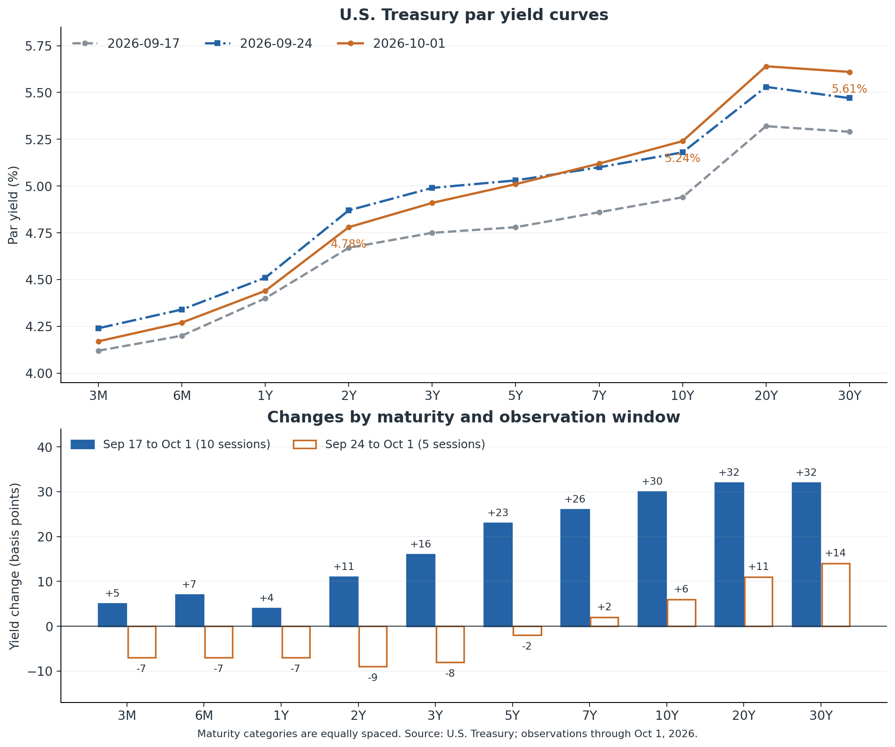
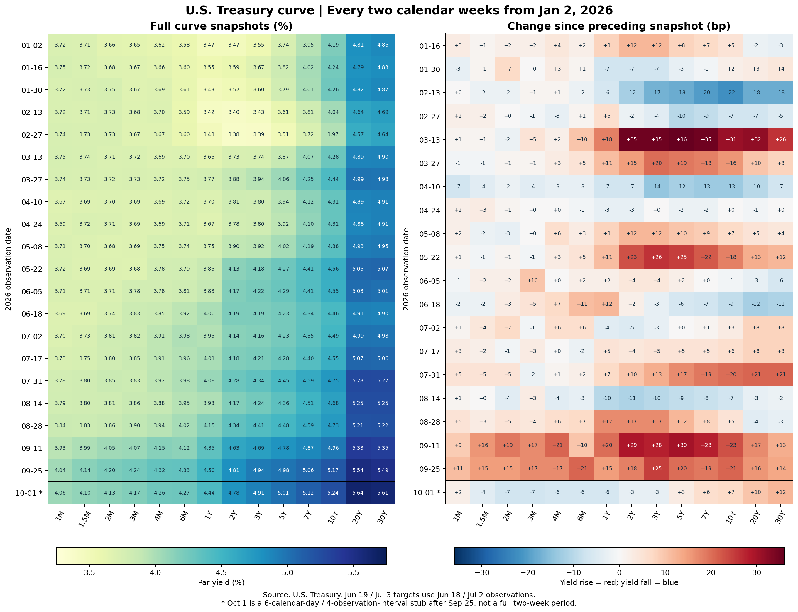
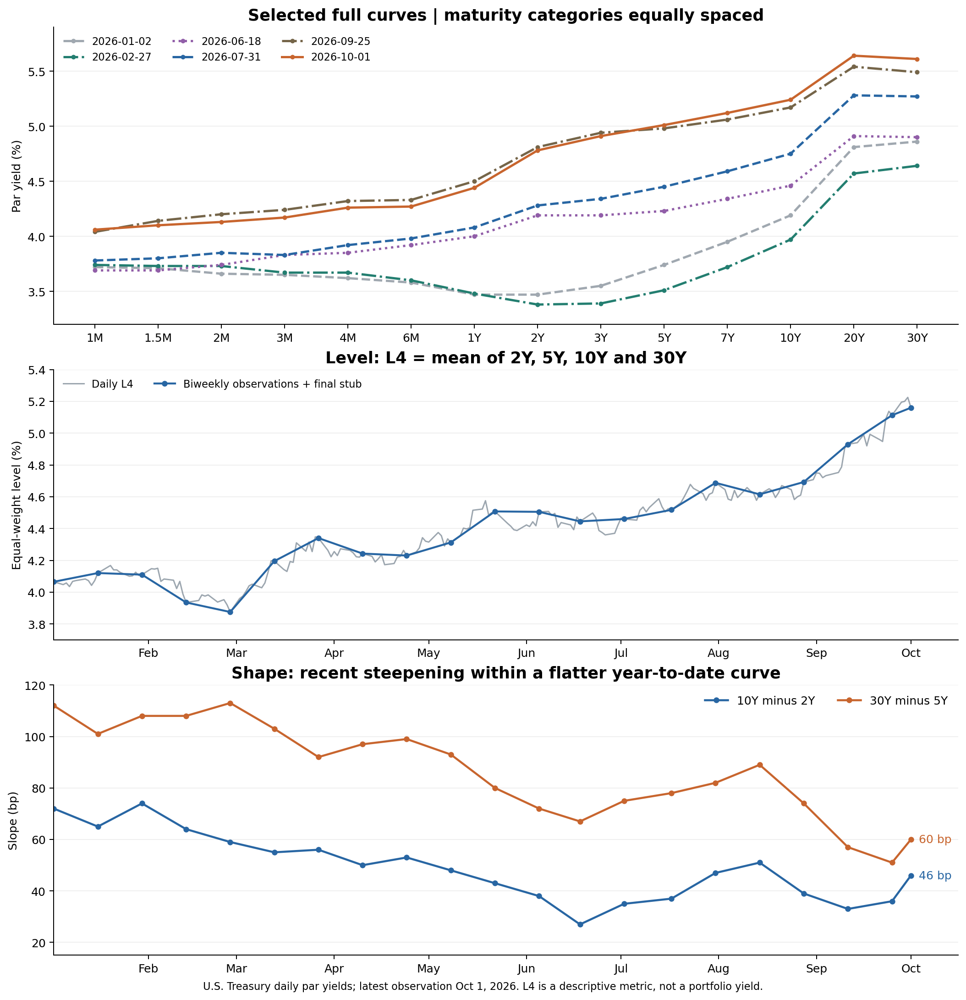
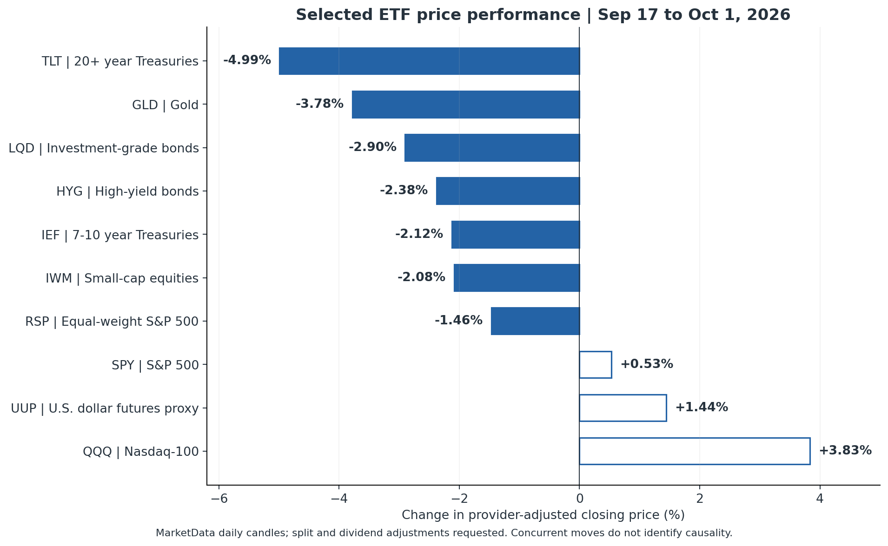
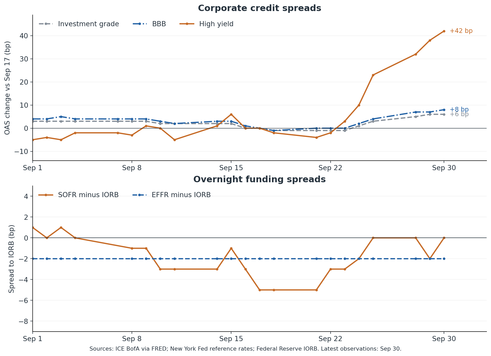
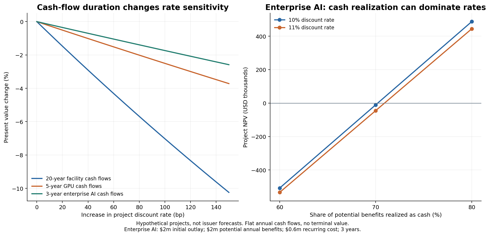

+++
title = "美债曲线双周演变与 AI 产业压力测试"
date = "2026-10-02"
data_as_of = ["2026-09-30", "2026-10-01"]
data_as_of_note = "市场主数据截至美国10月1日，信用与隔夜资金原生观察截至9月30日；不含10月2日美国就业数据。"
draft = false
description = "观察美债曲线全年双周变化、近期信用与资金条件，并以条件压力测试分析AI项目融资和现金回收。"
series = "利率期限结构分析"
categories = ["宏观与政策", "科技产业"]
tags = ["美债", "收益率曲线", "AI", "信用", "压力测试"]
featured = false
private = false
content_preservation = "verbatim"
source_sha256 = "df60f869e0ee22c4f74a2a6d73ca51cffd8e4c6a87486fad627825df615377ac"
+++

# 美债曲线双周演变与 AI 产业压力测试

## 核心结论

**今年的主线是收益率显著抬升、中段涨幅领先；最近两周才出现长端相对更强的上行。**1 月 2 日至 10 月 1 日，2、5、10、30 年期分别上升 **131、127、105、75 bp**。10Y−2Y 从 72 bp 缩至 46 bp，30Y−5Y 从 112 bp 缩至 60 bp；但 10Y−3M 反而扩大。因此，“曲线变陡还是变平”必须指明期限段，不能用最近两周代表全年。[财政部日度曲线](https://home.treasury.gov/resource-center/data-chart-center/interest-rates/TextView?type=daily_treasury_yield_curve&field_tdr_date_value=2026)

**最近一周确实是短中端下降、长端上升，但“平均水平上涨”并非所有口径都成立。**2、5、10、30 年等权平均上升 2.25 bp；加入 3 个月和 1 年后，六期限平均下降 0.83 bp；全部 14 个公布期限等权平均下降 1.00 bp。最近两周则各期限均上涨，三个均值均上升。报告分别展示水平、斜率和各期限原值。

**进一步上行的经济冲击，取决于谁需要在什么期限重新融资。**整体上行同时抬高浮息借款、新债融资和投资门槛；在相同平均升幅下，长端涨得更多，会把额外压力集中到长周期项目、房贷和远期现金流估值。短期浮息融资的冲击可以相对小一些。曲线更陡并不意味着所有企业都比平行上行时更差。

**AI 链条最值得警惕的是“资金先投入、现金后回收”的错配。**数据中心建筑和供电资产、GPU 设备、云运营、软件、企业应用的寿命与资金来源不同。外部融资依赖较高、交付尚未完成、价格已锁定而融资成本未锁定的项目更脆弱；大型平台的缓冲通常来自其他业务现金流、现金储备和资本配置弹性，但不能据此忽略其新增项目回报。

**企业应用方的关键不是把国债涨幅直接乘到 AI 预算上，而是核实 AI 是否创造可兑现的净现金收益。**在本文的三年假设项目中，折现率从 10% 升至 11%，NPV 从 48.7 万美元降至 44.4 万美元；可兑现收益比例从 80% 降至 70%，即使折现率不变，NPV 已降至 −1.1 万美元。利率上升会强化项目筛选，但回本快的降本、风控和存量资产提效项目可能获得更高优先级。

以上公司事实和经济机制不证明最近两周已经导致 AI 订单取消或企业违约。第四节保留已观察到的价格、房贷、信用与资金事实；第五、六节把未来压力明确写成条件情景。

## 一、研究时点与比较口径

**报告日期为 2026 年 10 月 2 日；沿用新加坡时间上午确定的信息截止范围；市场主锚点为美国 10 月 1 日。**信息集包括 10 月 1 日美国交易日及已发布数据，不包含美国 10 月 2 日 08:30、即新加坡时间当日 20:30 才计划公布的 9 月非农就业结果。[BLS 发布日历](https://www.bls.gov/schedule/2026/10_sched_list.htm)

- **两周窗口：**9 月 17 日至 10 月 1 日，共 10 个美国国债观察日间隔。
- **一周窗口：**9 月 24 日至 10 月 1 日，共 5 个观察日间隔。
- **信用与隔夜资金数据：**最新原生观察日为 9 月 30 日，单独标注，未补成 10 月 1 日的数据。
- **单位：**收益率以百分比表示，变化以基点表示；1 个基点为 0.01 个百分点。美元金额注明十亿美元或万亿美元，避免把周均余额与单日余额混用。

名义与实际国债曲线、官方房贷调查及资金操作事实达到 **G3**：本次已检查来源、日期、字段和必要的一致性。ETF 表现、历史分位和期限溢价分析为 **G2**：分别受单一行情供应商、历史快照和模型覆盖日期限制。全年曲线描述同样达到 G3。公司分析为 G2：核心财报与融资披露已经核验，但未建立每家公司完整的对冲、到期、合同和项目现金流模型。压力测试为显式假设下的已执行计算，其计算可复核，参数不是经验估计。对资产价格的因果归属、未来曲线和实体经济影响，属于有证据约束的条件性分析，数据检查通过不等于因果关系成立。

## 二、曲线如何变化：最近两周与年初以来的双周观察

### 2.1 长端上行与短端回落同时存在

| 期限 | 9 月 17 日 | 9 月 24 日 | 10 月 1 日 | 两周变化 | 一周变化 |
| --- | ---: | ---: | ---: | ---: | ---: |
| 3 个月 | 4.12% | 4.24% | 4.17% | +5 bp | −7 bp |
| 2 年 | 4.67% | 4.87% | 4.78% | +11 bp | −9 bp |
| 5 年 | 4.78% | 5.03% | 5.01% | +23 bp | −2 bp |
| 10 年 | 4.94% | 5.18% | 5.24% | +30 bp | +6 bp |
| 20 年 | 5.32% | 5.53% | 5.64% | +32 bp | +11 bp |
| 30 年 | 5.29% | 5.47% | 5.61% | +32 bp | +14 bp |

来源及计算：财政部日度 par yield curve，同期限、同观察日比较。该曲线由市场报价拟合，属于固定期限基准，不是某一只债券的实际成交收益率。[数据与定义](https://home.treasury.gov/resource-center/data-chart-center/interest-rates/TextView?type=daily_treasury_yield_curve&field_tdr_date_value=2026)

两周窗口体现了**收益率上行且长端涨幅更大的熊市陡峭化**。10Y−2Y 从 27 bp 扩大至 **46 bp**，5s30s 从 51 bp 扩大至 **60 bp**，10Y−3M 从 82 bp 扩大至 **107 bp**。最近一周则是短中端下降、长端继续上升的曲线扭转，不能用一个统一方向描述全部期限。

10 月 1 日这一天，2 年、5 年、10 年、30 年期分别较前一日下降 10、8、5、3 bp。10 年期由 9 月 30 日的 5.29% 回落至 5.24%，30 年期由 5.64% 回落至 5.61%。**最新一天已经出现反弹，但它尚未抵消两周内长端的累计损失。**

下图将曲线水平与不同窗口的变化分开显示。其重要含义是：后续即使短端继续回落，长期房贷、企业项目融资和长久期资产仍可能面对较高的贴现率。

### 2.2 “剧烈”主要适用于两周长端，不能泛化为历史极端事件

用 `interest_term` 的历史国债数据计算，并将比较样本截止在本轮窗口之前的 9 月 16 日：本次 10 年期两周 +30 bp，处于历史 10 个观察日有符号变化的 **96.8 分位**；30 年期 +32 bp，约处于 **97.9 分位**。若比较涨跌的绝对幅度，则分别为 **93.6、95.8 分位**。这支持“长端两周上行较少见”的描述。

但最近一周 10 年期 +6 bp 的有符号变化仅处于约 72.4 分位，30 年期 +14 bp 约处于 90.6 分位。**因此，两周的长端冲击比最近一周的全曲线冲击更准确。**

上述分位是描述性统计：10 年期比较窗口从 2005 年起，30 年期因序列恢复时间从 2006 年起；有效两周窗口分别为 5,421、5,145 个，且彼此重叠。它们不是独立事件样本，也不代表未来反转概率。历史数据沿用本地快照，本次重点交叉核验了 2026 年数据，未对全部历史逐日重取。

### 2.3 从 1 月起每隔两周观察：保留全部曲线，不把节假日补成新数据

以 **2026 年 1 月 2 日**为起点，每隔 **14 个日历日**设置观察日；如当天无财政部报价，取此前最近的真实观察日。6 月 19 日使用 6 月 18 日，7 月 3 日使用 7 月 2 日。最后追加 10 月 1 日，故共有 **21 个快照：19 个完整双周区间，加最后一个不足双周的区间**。末段 9 月 25 日至 10 月 1 日只有 6 个日历日、4 个观察日间隔，单独标为“短段”。

定义描述性水平指标 **L4 =（2Y＋5Y＋10Y＋30Y）/4**。这是等权算术平均，不是持仓加权收益率、可投资指数、曲线第一主成分，也不代表所有企业的融资利率。期限原值和变化保留在 CSV 中；所有年份为 2026，收益率为 %，变化及利差为 bp。

| 真实观察日 | 3M | 2Y | 5Y | 10Y | 30Y | L4 | ΔL4 | 10Y−2Y |
| --- | ---: | ---: | ---: | ---: | ---: | ---: | ---: | ---: |
| 01-02 | 3.65 | 3.47 | 3.74 | 4.19 | 4.86 | 4.0650 | — | 72 |
| 01-16 | 3.67 | 3.59 | 3.82 | 4.24 | 4.83 | 4.1200 | +5.50 | 65 |
| 01-30 | 3.67 | 3.52 | 3.79 | 4.26 | 4.87 | 4.1100 | -1.00 | 74 |
| 02-13 | 3.68 | 3.40 | 3.61 | 4.04 | 4.69 | 3.9350 | -17.50 | 64 |
| 02-27 | 3.67 | 3.38 | 3.51 | 3.97 | 4.64 | 3.8750 | -6.00 | 59 |
| 03-13 | 3.72 | 3.73 | 3.87 | 4.28 | 4.90 | 4.1950 | +32.00 | 55 |
| 03-27 | 3.73 | 3.88 | 4.06 | 4.44 | 4.98 | 4.3400 | +14.50 | 56 |
| 04-10 | 3.69 | 3.81 | 3.94 | 4.31 | 4.91 | 4.2425 | -9.75 | 50 |
| 04-24 | 3.69 | 3.78 | 3.92 | 4.31 | 4.91 | 4.2300 | -1.25 | 53 |
| 05-08 | 3.69 | 3.90 | 4.02 | 4.38 | 4.95 | 4.3125 | +8.25 | 48 |
| 05-22 | 3.68 | 4.13 | 4.27 | 4.56 | 5.07 | 4.5075 | +19.50 | 43 |
| 06-05 | 3.78 | 4.17 | 4.29 | 4.55 | 5.01 | 4.5050 | -0.25 | 38 |
| 06-18 | 3.83 | 4.19 | 4.23 | 4.46 | 4.90 | 4.4450 | -6.00 | 27 |
| 07-02 | 3.82 | 4.14 | 4.23 | 4.49 | 4.98 | 4.4600 | +1.50 | 35 |
| 07-17 | 3.85 | 4.18 | 4.28 | 4.55 | 5.06 | 4.5175 | +5.75 | 37 |
| 07-31 | 3.83 | 4.28 | 4.45 | 4.75 | 5.27 | 4.6875 | +17.00 | 47 |
| 08-14 | 3.86 | 4.17 | 4.36 | 4.68 | 5.25 | 4.6150 | -7.25 | 51 |
| 08-28 | 3.90 | 4.34 | 4.48 | 4.73 | 5.22 | 4.6925 | +7.75 | 39 |
| 09-11 | 4.07 | 4.63 | 4.78 | 4.96 | 5.35 | 4.9300 | +23.75 | 33 |
| 09-25 | 4.24 | 4.81 | 4.98 | 5.17 | 5.49 | 5.1125 | +18.25 | 36 |
| 10-01（短段） | 4.17 | 4.78 | 5.01 | 5.24 | 5.61 | 5.1600 | +4.75 | 46 |

表中 ΔL4 相对上一行，首行无前期；“短段”不能与完整双周幅度直接当作同等时间窗口比较。表内 L4 保留四位小数，以便复算微小变化。完整数据包含从 1 个月到 30 年的全部 14 个期限。

左图显示各期曲线水平，右图显示相对上一期的变化；红色为收益率上升、蓝色为下降。两幅图分别标注观察日期，右图不包含首个基准日；粗线下方均为最后一个短段。图形与表格采用财政部原生观察，未用插值制造新的交易日。[财政部原始数据](https://home.treasury.gov/resource-center/data-chart-center/interest-rates/TextView?type=daily_treasury_yield_curve&field_tdr_date_value=2026)

### 2.4 全年的变化可以分为五段，不能理解成持续的单向熊陡

| 阶段：按双周端点描述 | 可复核的变化 | 对曲线状态的含义 |
| --- | --- | --- |
| 1 月初—2 月底 | L4 从 4.0650% 降至 3.8750%；10Y 从 4.19% 降至 3.97% | 年初首先经历收益率回落；2 月 27 日是本表双周观察点中的 L4 低点，并非对全部日度低点的声明 |
| 2 月底—5 月下旬 | L4 升至 4.5075%；其中 2 月 27 日—3 月 13 日一次上升 32.00 bp | 中段领涨，2s10s 从 59 bp 缩至 43 bp；本次固定双周网格中，3 月这一段比 9 月任一完整区间的 L4 升幅更大 |
| 5 月下旬—6 月下旬 | L4 至 6 月 18 日降至 4.4450%；2s10s 缩至 27 bp | 长端回落、2 年期仍略升，形成局部扭转；收益率水平与斜率不必同向 |
| 6 月下旬—8 月下旬 | L4 从 4.4450% 升至 4.6925%，途中回撤；2s10s 从 27 bp 回到 39 bp | 7 月出现长端相对更强的上行，但 8 月下半月又是中短端涨得更多 |
| 8 月下旬—10 月 1 日 | L4 再升 46.75 bp 至 5.1600%；2s10s 最后为 46 bp | 先是短中端压力较强，随后长端压力增加；最近走势不能替代全年路径 |

这里只描述收益率，不将每次变化分别归因于某个新闻。固定双周抽样会隐藏期内极值，下一图同时展示日度 L4 作为补充。

### 2.5 “平均上涨”和“变陡”都要检查定义

| 描述性指标 | 1 月 2 日—10 月 1 日 | 最近两周：9 月 17 日—10 月 1 日 | 最近一周：9 月 24 日—10 月 1 日 |
| --- | ---: | ---: | ---: |
| L4：2、5、10、30 年等权平均变化 | +109.50 bp | +24.00 bp | +2.25 bp |
| L6：3 个月、1、2、5、10、30 年等权平均变化 | +97.83 bp | +17.50 bp | −0.83 bp |
| L14：全部公布期限等权平均变化 | +84.00 bp | +15.29 bp | −1.00 bp |
| 10Y−2Y 的变化 | −26 bp | +19 bp | +15 bp |
| 30Y−5Y 的变化 | −52 bp | +9 bp | +16 bp |
| 10Y−3M 的变化 | +53 bp | +25 bp | +13 bp |

L14 包含多个相距很近的票据期限，因而短端获得较多权重；它并不比 L4 更“客观”。**对最新一周，最稳妥的表述是“短中端下行、长端上行，2s10s 与 5s30s 均变陡”；不能不加定义地说整条曲线平均上涨。**

即使是同一个双周区间，不同期限段也可能方向不同。例如 9 月 11—25 日，2s10s 扩大 3 bp，5s30s 却缩小 6 bp。判断行业影响时，应看它实际依赖的融资期限，而不只看“熊陡”标签。

### 2.6 全年实际收益率也明显上升，但这仍不是驱动的因果分解

1 月 2 日至 10 月 1 日，5、10、30 年名义收益率分别上升 127、105、75 bp；同期限实际收益率分别上升 **119、94、68 bp**，名义减实际的补偿分别扩大 8、11、7 bp。全年和最近两周都显示实际收益率部分上升较多。项目面对的实际资本门槛因此值得关注，但不能把该部分全称为“美联储预期加息”，也不能全部称为“期限溢价”。[财政部名义曲线](https://home.treasury.gov/resource-center/data-chart-center/interest-rates/TextView?type=daily_treasury_yield_curve&field_tdr_date_value=2026)、[财政部实际曲线](https://home.treasury.gov/resource-center/data-chart-center/interest-rates/TextView?type=daily_treasury_real_yield_curve&field_tdr_date_value=2026)

## 三、当前状态的关键：实际收益率上升占据主要算术变化

**对后续影响最重要的区别，是这轮长端上行并非主要表现为同期限通胀补偿大幅抬升。**在同日财政部名义与 TIPS 实际曲线中，10 年期名义收益率两周上升 30 bp，其中实际收益率上升 27 bp，名义减实际的通胀补偿扩大 3 bp。

| 期限 | 10 月 1 日名义收益率 | 10 月 1 日实际收益率 | 名义减实际 | 两周名义变化 | 实际部分变化 | 通胀补偿变化 |
| --- | ---: | ---: | ---: | ---: | ---: | ---: |
| 5 年 | 5.01% | 2.65% | 2.36% | +23 bp | +19 bp | +4 bp |
| 10 年 | 5.24% | 2.88% | 2.36% | +30 bp | +27 bp | +3 bp |
| 30 年 | 5.61% | 3.31% | 2.30% | +32 bp | +27 bp | +5 bp |

来源：本次获取的同日[财政部名义曲线](https://home.treasury.gov/resource-center/data-chart-center/interest-rates/TextView?type=daily_treasury_yield_curve&field_tdr_date_value=2026)与[实际曲线](https://home.treasury.gov/resource-center/data-chart-center/interest-rates/TextView?type=daily_treasury_real_yield_curve&field_tdr_date_value=2026)。通胀补偿为两条 par 曲线的同期限差，不等于纯粹的预期通胀，也不是严格的零息通胀远期。

这表明，企业项目、住房以及远期现金流资产面对的实际贴现环境有所收紧。**“实际部分占 27/30”只是恒等式下的算术拆分，不能解释为已识别出 90% 的经济原因。**TIPS 实际收益率也包含实际期限溢价和流动性因素；其上升可能与预期实际短率、增长前景、风险补偿或交易因素有关。

进一步的期限溢价证据有限。FRED 的 Kim–Wright 10 年零息债期限溢价估计，在 9 月 17 日至 25 日由 0.9396% 升至 1.0203%，约 **+8.1 bp**；但本次可获得值止于 9 月 25 日，不能解释 9 月 28 日之后的变化。该模型的零息债口径也不能与财政部 par yield 直接相减后宣称得到精确的政策预期贡献。纽约联储页面取得的 ACM 图表序列为月末频率、止于 8 月，因此没有用它填补本轮日度缺口。[Kim–Wright 序列与模型说明](https://fred.stlouisfed.org/series/THREEFYTP10)、[ACM 数据说明](https://www.newyorkfed.org/research/data_indicators/term-premia-tabs)

政策背景同样需要保持时间顺序：美联储 9 月 16 日已将联邦基金目标区间上调 25 bp 至 **3.75%—4.00%**，9 月 17 日起 IORB 为 3.90%。本报告两周起点已经位于政策调整之后，不能把这两周的全部变化再机械归给一次加息。9 月 30 日公布的 8 月核心 PCE 同比为 3.0%，实际消费环比增长 0.6%，既保留了通胀约束，也不支持已经出现显著需求崩塌的判断；这些数据本身并未识别本轮债市行情的具体驱动。[FOMC 声明](https://www.federalreserve.gov/newsevents/pressreleases/monetary20260916a.htm)、[操作说明](https://www.federalreserve.gov/newsevents/pressreleases/monetary20260916a1.htm)、[BEA 8 月 PCE 发布](https://www.bea.gov/news/2026/personal-income-and-outlays-august-2026)

## 四、已经观察到的后果，以及证据尚未支持的结论

### 4.1 长久期资产损失已经发生，股票市场呈现明显分化

下表使用本次重新获取的 MarketData 日线，统一比较 9 月 17 日、9 月 24 日与 10 月 1 日。请求显式开启拆股和分红调整，收益计算为供应商调整后收盘价之比减一；它不是个人账户实际盈亏，也没有逐笔核验基金分配与再投资。

| 市场代理 | 对应资产 | 两周变化 | 一周变化 |
| --- | --- | ---: | ---: |
| TLT | 20 年以上美国国债 | **−4.99%** | −2.17% |
| IEF | 7—10 年美国国债 | −2.12% | −0.42% |
| LQD | 投资级企业债 | −2.90% | −1.01% |
| HYG | 高收益企业债 | −2.38% | −1.34% |
| GLD | 黄金 | −3.78% | −2.14% |
| UUP | 美元期货组合代理 | +1.44% | +0.35% |
| IWM | 美国小盘股 | −2.08% | −0.77% |
| RSP | 等权重标普 500 | −1.46% | −0.41% |
| SPY | 市值加权标普 500 | +0.53% | −0.32% |
| QQQ | 纳斯达克 100 | **+3.83%** | +0.34% |

数据来源及复权规则：[MarketData 日线接口](https://www.marketdata.app/docs/api/stocks/candles/)。UUP 不是美元指数 DXY 的点位，也不是联储广义美元指数；各 ETF 同时受持仓、分红、费用及其他市场因素影响。

长债跌幅大于中期国债，符合较高久期放大利率变化影响的定价机制。企业债同时承受基准利率和信用利差变化，不能把 LQD、HYG 的损失全部归给国债收益率。黄金下跌和美元代理上涨，与实际利率及美元传导机制相容，但没有独立事件识别，不能判定各因素贡献了多少。

**股票表现提供了重要反证：高利率冲击没有压倒所有盈利与行业预期。**QQQ 两周上涨约 3.83%，SPY 小幅上涨，而小盘和等权指数下跌。这支持“市场表现分化、广度偏弱”的描述；现金流、融资依赖与行业盈利预期是可能解释，但仅凭十个交易日的收益不能确认其中哪一项主导。

下图将同一窗口的资产代理并列，便于区分已发生的损失与泛化的风险叙事。长债和黄金的跌幅不能被当作科技股必然下跌的证据。

### 4.2 房贷利率和申请量已经变化，存量家庭违约尚不能据此推断

Freddie Mac 的 30 年固定房贷调查利率由 9 月 17 日的 **6.95%**、9 月 24 日的 **7.03%**，升至 10 月 1 日的 **7.28%**：两周上升 33 bp，最近一周上升 25 bp。这是面向符合调查条件的新申请人的融资价格变化。[Freddie Mac 10 月 1 日发布](https://freddiemac.gcs-web.com/news-releases/news-release-details/mortgage-rates-average-728/)、[完整调查序列](https://fred.stlouisfed.org/series/MORTGAGE30US)

以**假设的 50 万美元、30 年等额本息贷款**衡量，不含税费和保险：月供由约 **3,310 美元**升至 **3,421 美元**，增加约 **111 美元、3.36%**。若月供预算不变，可借本金减少约 **3.25%**。这一计算说明新增购房者的边际约束，不能套用于已经锁定固定利率的全部家庭。

数量方面，MBA 9 月 30 日发布、统计至 9 月 25 日的一周数据显示：经季节调整的总申请量环比下降 **6%**，购房申请下降 **4%**，再融资指数下降 **9%**。MBA 同期 30 年合规贷款合同利率为 7.30%，前周为 7.12%；该调查的窗口、贷款条件与点数口径不同，不能与 Freddie Mac 的 7.28% 当作同日同条件报价。[MBA 周度调查](https://www.mba.org/news-and-research/newsroom/news/2026/09/30/mortgage-applications-decrease-in-latest-mba-weekly-survey)

**“融资更贵、申请更少”已经有证据；“本轮上行已导致房价大跌或家庭违约激增”没有得到验证。**申请量还受季节、供给与贷款结构影响，MBA 对利率影响的解释具有经济合理性，但本报告没有将其升级为排除了其他因素的因果估计。对房屋成交、开工、房价和违约的影响需要后续月份的数据。

### 4.3 企业债开始承受额外信用溢价，高收益部分恶化更快

信用数据最新到 9 月 30 日，以下窗口明确为 **9 月 17 日至 30 日**，没有将其延伸成 10 月 1 日结果。OAS 为期权调整利差，衡量相对基准曲线的额外风险补偿；指数有效收益率则用于观察整体融资定价环境。

| 指标 | 9 月 17 日 | 9 月 30 日 | 变化 |
| --- | ---: | ---: | ---: |
| 投资级 OAS | 78 bp | 84 bp | +6 bp |
| BBB OAS | 95 bp | 103 bp | +8 bp |
| 高收益 OAS | 270 bp | **312 bp** | **+42 bp** |
| 投资级指数有效收益率 | 5.66% | 6.02% | +36 bp |
| BBB 指数有效收益率 | 5.84% | **6.22%** | **+38 bp** |
| 高收益指数有效收益率 | 7.46% | **8.16%** | **+70 bp** |

来源：ICE BofA，经 FRED 获取；[投资级 OAS](https://fred.stlouisfed.org/series/BAMLC0A0CM)、[BBB OAS](https://fred.stlouisfed.org/series/BAMLC0A4CBBB)、[高收益 OAS](https://fred.stlouisfed.org/series/BAMLH0A0HYM2)、[投资级有效收益率](https://fred.stlouisfed.org/series/BAMLC0A0CMEY)、[BBB 有效收益率](https://fred.stlouisfed.org/series/BAMLC0A4CBBBEY)、[高收益有效收益率](https://fred.stlouisfed.org/series/BAMLH0A0HYM2EY)。

高收益 OAS 的 42 bp 扩大中，32 bp 发生于 9 月 24 日之后，表明最近几个交易日信用风险补偿的增量变化值得重视。企业面临的约束已经不只来自无风险基准；信用较弱、近期需要再融资的主体，会比高信用、现金充足的主体承受更大的边际压力。

不过，312 bp 在本次可取得、截至本轮前的近三年高收益 OAS 样本中约处于 58.1 分位；投资级 84 bp 约处于 49.3 分位。**变化方向值得警惕，绝对水平本身尚不足以定义信用危机。**由于 FRED 当前相关 ICE 序列仅提供最近三年，报告没有使用缺失的 2008 年或 2020 年数据拼接“危机分位”。

指数收益率不是某家企业已完成新发债的票息，利差也不是违约概率。本报告没有系统核实这两周的企业新券簿记、融资取消、契约修改或实际违约事件，因此确认到“可观察的市场融资条件收紧”为止。也不能把 10 年国债变化与某个 OAS 简单相加，精确还原企业债指数收益率：期限结构、成分权重和期权因素均不同。

### 4.4 资金市场有季末波动，尚未观察到持续失序

判断流动性是否失灵，需要同时检查资金价格、央行工具使用与资产负债表口径。以下证据与“全面资金荒”的解释并不一致：

| 观察项 | 本次核验结果 | 能支持的判断 |
| --- | --- | --- |
| SOFR 与 IORB | 9 月 30 日均为 3.90%，利差 0 bp | 隔夜国债融资基准没有明显脱离准备金利率 |
| EFFR 与 IORB | 9 月 30 日为 3.88% 与 3.90%，利差 −2 bp | 联邦基金市场仍靠近政策锚 |
| 站立回购操作 SRP | 9 月 30 日两场合计接受 12 亿美元；10 月 1 日两场均为 0 | 季末有工具使用，尚未见连续扩大 |
| 国内 ON RRP | 9 月 30 日为 115.39 亿美元；10 月 1 日为 3.50 亿美元 | 季末跳动明显，单日读数不宜外推 |
| 准备金周均余额 | 截至 9 月 30 日一周为 2.948 万亿美元，较前周增加约 179 亿美元 | 周平均回升，不能代表季末单日状态 |
| 9 月 30 日单日准备金 | 2.882 万亿美元 | 明显低于周均，仍应关注季末之后的恢复情况 |

来源：[纽约联储参考利率](https://www.newyorkfed.org/markets/reference-rates)、[回购操作逐笔结果](https://markets.newyorkfed.org/api/rp/results/search.json?startDate=2026-09-01&endDate=2026-10-01&operationTypes=Repo)、[ON RRP 结果](https://markets.newyorkfed.org/api/rp/results/search.json?startDate=2026-09-01&endDate=2026-10-01&operationTypes=Reverse%20Repo)、[10 月 1 日 H.4.1](https://www.federalreserve.gov/releases/h41/20261001/)、[WRESBAL 周均口径](https://fred.stlouisfed.org/series/WRESBAL)。国内 ON RRP 与 H.4.1 含其他账户的全部逆回购负债不是同一个总量。

这里有两个容易误判的地方。第一，**WRESBAL 是截至周三的周均值**，尽管数据标签写着 9 月 30 日，也不能把 2.948 万亿美元称作当天收盘水平。TGA 同样存在差别：WTREGEN 周均为 9,486.74 亿美元，而 9 月 30 日单日为 9,840.46 亿美元。第二，项目的“联储资产−TGA−RRP”合成指标混合了不同频率，不能不检查窗口就当作可交易资金或准备金的严格恒等式。[WTREGEN 定义](https://fred.stlouisfed.org/series/WTREGEN)、[H.4.1 原表](https://www.federalreserve.gov/releases/h41/20261001/)

当前美联储操作框架也与机械的持续缩表叙事不同。9 月操作文件要求到期国债本金全部滚续、机构证券本金再投资于国库券，并在适当时通过购买短期国债维持充裕准备金。纽约联储 9 月 22 日说明，最近两个购买期暂停准备金管理购买，与预计准备金供给较高及资金市场保持充裕有关。**暂停这类购买不能自动解释成正在主动压缩全部资产负债表。**[政策操作说明](https://www.federalreserve.gov/newsevents/pressreleases/monetary20260916a1.htm)、[纽约联储准备金说明](https://www.newyorkfed.org/newsevents/speeches/2026/per260922)

下图对照企业信用风险补偿与隔夜资金利差。前者近期上升更明显，后者仍靠近政策锚；这正是当前应区分“融资条件收紧”与“市场融资失灵”的理由。稳定的隔夜利率仍不能排除某些机构、抵押品或双边融资渠道承压。

### 4.5 哪些“后果”目前不能写成事实

现有证据没有确认：大型机构被迫清仓导致本轮行情、国债基差交易正在广泛崩溃、银行出现系统性存款流失、企业融资窗口全面关闭，以及本轮冲击已导致消费衰退或广泛违约。

对杠杆交易尤其需要谨慎。持有国债现券、同时做空期货的相对价值头寸，其方向性久期可能已被较大程度对冲。收益率上行并不直接等于该组合发生同等幅度亏损；风险更可能来自基差、保证金、回购展期、抵押品折扣和对冲不完全。没有头寸和融资证据时，不能从长债下跌反推出强制平仓已经发生。[纽约联储回购市场结构说明](https://tellerwindow.newyorkfed.org/2026/09/01/a-framework-for-understanding-the-u-s-treasury-repo-market/)

## 五、压力测试与曲线自身的反馈：把水平、斜率和经济原因分开

### 5.1 两个问题需要两组冲击，且要有“相同平均升幅”的对照

以下均以 10 月 1 日曲线为基准，表示**假设冲击，非点位预测或概率判断**。第一组回答各期限一起上行；第二组回答短端也上行、但比长端少。为剥离平均升幅的差异，P75 与 S75 的 L4 都上升 75 bp。

| 情景 | 2Y 变化 | 5Y 变化 | 10Y 变化 | 30Y 变化 | L4 变化 | 2s10s 变化 | 另行假设的 SOFR 变化 |
| --- | ---: | ---: | ---: | ---: | ---: | ---: | ---: |
| P50：平行上行 | +50 | +50 | +50 | +50 | +50 | 0 | +50 |
| P75：等水平对照 | +75 | +75 | +75 | +75 | +75 | 0 | +75 |
| S75：长端涨得更多 | +25 | +50 | +100 | +125 | +75 | +75 | +25 |
| P100：更强的平行冲击 | +100 | +100 | +100 | +100 | +100 | 0 | +100 |

所有变化单位为 bp。P50、P75、P100 将其余国债期限同样平移；S75 只指定所需关键期限，不假装估计了一整条远期曲线。**SOFR 是独立的政策/短率假设，不能由 2 年或 10 年国债的变化机械推出。**如果现实是长债上涨而 SOFR 不变，存量浮息贷款的即时基准冲击应改为零。

P75 之后，2、5、10、30 年分别为 **5.53%、5.76%、5.99%、6.36%**；S75 之后分别为 **5.03%、5.51%、6.24%、6.86%**。两者 L4 都为 5.91%，但 2s10s 分别为 46、121 bp。S75 相对 P75，在四个期限上的差为 −50、−25、+25、+50 bp，四点平均为零，因而可以用来观察额外斜率变化的作用。

基准测试先固定信用利差、预期经营现金流、资产数量和风险溢价；第六节再单独增加信用和需求冲击。不能将“国债 +100 bp”“贷款 +100 bp”和“公司全部债务利息 +100 bp”当成同一件事。

### 5.2 同样的曲线上涨，可以来自三种经济环境

| 上涨来源：条件假设 | 分母：贴现/融资 | 分子：企业现金流 | 对 AI 链条的净含义 |
| --- | --- | --- | --- |
| 实际需求或生产率前景改善，均衡实际利率提高 | 更贵 | 收入、使用量、项目回报可能同时提高 | 有真实增量需求的供应商可能消化融资成本；不能仅凭利率上升判定盈利下降 |
| 通胀重新抬升，政策需要更紧 | 名义融资变贵 | 可提价收入上升，但工资、电力、设备与建设成本也可能上升 | 判断净现金流的定价权和成本转嫁；名义收入增长不等于实际回报改善 |
| 长期风险补偿或国债供给吸收压力提高 | 长期融资与估值先受压 | 未必有对应的经营改善 | 对长周期建设、长期固定报价合同和高终值权重估值更不利 |

本报告的静态压力测试接近第三行的“成本先变、现金流暂不变”实验，但没有认定第三行就是本轮行情的唯一原因。名义长率可近似理解为未来名义短率的平均预期，加期限风险补偿；实际应用还受工具、期限、拟合和流动性影响。财政部 par 曲线不能直接拿来完成严格的零息预期分解。

### 5.3 整体继续上行后，曲线会怎样反馈

**第一步是改变边际决策，随后才是宏观数据。**新增房贷、浮息贷款重设、新项目审批和到期续贷首先承压；固定息存量债、提前融资、对冲和高现金余额形成缓冲。企业可能先缩短投资回收期、延后没有客户承诺的建设，再减少订单、招聘和支出。只有这些调整足够广泛，才会压低总需求及通胀，并推动政策路径下修。

这会产生三条不同路径：若增长与通胀一起降温，2—5 年可先下降，长端跟随，出现牛市陡峭化的可能性增加；若增长减速但通胀仍黏，短端下行有限，长端风险补偿可能继续偏高；若增长比预期更强，融资约束没有明显压低现金流，短中端还可能再上行，之前的熊陡转为熊平。**“利率足够高会压需求”是机制，缺少调整速度与规模时，它不能提供利率见顶日期。**

债券买方也有反馈：更高收益率吸引新配置，帮助吸收供给；同时，已有持仓的账面损失、风险限额和保证金可能压低短期承接能力。保险、养老金持有长期负债，可以与依赖短期融资的持有人作出完全不同的选择。

### 5.4 长端涨得更多时，容易形成“短期融资较稳、长期投资变贵”的分化

相对 P75，S75 对短期浮息融资更温和，对 10—30 年现金流定价更严厉。企业可以选择缩短债务期限，暂时减少利息；但这会增加未来续贷次数、利率重设风险和流动性储备需要。用短债给长期数据中心供电、土地和建筑融资，可能把当期成本问题转成未来展期问题。

长期项目被推迟后，又可能反过来降低未来增长和短率预期，使短端比长端更容易回落。若财政供给、通胀不确定性或久期承接仍是约束，曲线可以继续变陡。只有私人融资利率、实际长期收益率和风险补偿一起下降，才更支持广泛的金融条件缓和。

信用恶化还会打断这种反馈。例如国债下降 50 bp，但企业新债信用利差扩大 100 bp，企业总融资成本仍上升 50 bp。届时“国债反弹”与“企业融资继续恶化”可以同时发生。若先发生抵押品折价和现金争夺，长债甚至可能在压力初期继续被出售；目前没有足够证据认定这一过程已广泛发生。

### 5.5 AI 本身也可能反过来影响利率，不能只把它当被动受压的一方

AI 建设在短期增加电力、设备、施工与融资需求，可能支撑投资和实际利率；其生产率收益若尚未兑现，这部分需求未必立刻降低通胀。中期如果 AI 提高单位投入产出、降低服务成本，可以缓和部分价格压力；但生产率与投资机会改善也可能提高均衡实际利率。**生产率提高不保证长期名义国债收益率单向下降。**

反过来，若最终客户付费不足，平台减少尚未启动的建设，硬件和施工订单先放缓，再传到就业与融资需求。对国债的方向仍取决于同时发生的通胀、财政供给和信用风险变化。这些是条件机制，本文没有估计 AI 对美国总投资、通胀或中性利率的净贡献。

| 未来验证路径 | 需要同时看到什么 | 曲线推断的边界 |
| --- | --- | --- |
| 有序降温 | 实际需求、就业、通胀动能回落；信用利差稳定 | 支持政策路径下修，但长端下降幅度仍取决于风险补偿 |
| 长端额外压力延续 | 短端相对稳定，长端实际收益率、拍卖吸收或期限溢价共同走坏 | 支持熊陡机制；单次拍卖或单个模型值不够 |
| 增长抵消融资冲击 | 订单转现金、利用率、利润率和投资回报持续改善 | 削弱“高利率必然压垮 AI 投资”的判断，也可能支撑更高实际利率 |
| 信用向融资数量扩散 | 信用利差扩大、融资被缩减、抵押条件收紧、项目验收/付款延迟共同出现 | 才足以把一般成本压力升级为信用传导；不能仅凭股价下跌认定 |

## 六、落实到行业与 AI 企业：先识别现金流，再测融资与经营的交互

### 6.1 先区分四类利率暴露，避免把国债涨幅乘上全部债务

对一个既有借款又有现金的企业，当期净利息变化可近似写为：

`未对冲浮息本金 × 短率变化 × 生效时间比例`

`＋本期实际发行/再融资本金 ×（匹配期限基准变化＋信用利差变化）× 生效时间比例`

`－可重定价现金资产 × 收益率变化 × 生效时间比例`。

既有固定息债若不续贷，票息通常不立刻变化；但其市值会变。新融资还受发行费用、折价、担保、契约、抵押率和可获得额度影响。新租约的资本成本可以提高，旧的固定租约不因此自动重定价。利率互换、上限条款与资本化利息也会改变财报和现金流传导。

一个**假设**的 10 亿美元借款结构：6 亿未对冲浮息、3 亿当天新发五年固定债、1 亿既有固定债，信用利差不变、不计税盾和现金利息收入。P75 下新增年化利息为 **675 万美元**；S75 下为 **300 万美元**。这说明平均升幅一样，偏短期融资的主体在熊陡情景下可以相对少受冲击。上述数值是假设完整一年生效，不是下一季度费用。

现金流估值则是另一套问题。本文对项目使用未扣融资成本的经营现金流和项目折现率；不会先在现金流扣利息、再通过 WACC 将同一融资效应扣一次。项目门槛随相关国债基准一比一变动，只是明确的敏感性假设，实际 WACC 还取决于股债权重、税、股权风险溢价和信用条件。

### 6.2 云平台与 AI 云：同样扩建，内部资金缓冲差别很大

以下是已披露期间的公司整体现金流，单位 **十亿美元**。Microsoft、Amazon、Alphabet、CoreWeave、Nebius 为 2026 年 4—6 月；Oracle 为截至 8 月 31 日的财季。现金 CapEx 定义按各公司原表保留，**不能把它们全部称为 AI 支出，也不能直接用不同季度金额给公司排序**。

| 公司 | CFO | 现金 CapEx | CFO−现金 CapEx | 研究重点 |
| --- | ---: | ---: | ---: | --- |
| Microsoft | 55.441 | 35.802 | +19.639 | 既有业务现金流与新项目回报分开 |
| Amazon | 45.387 | 53.076 | -7.689 | 现金投入节奏、租赁与未来承诺 |
| Alphabet | 39.069 | 44.924 | -5.855 | 现金储备、云现金回报与支出节奏 |
| Oracle | 23.103 | 28.499 | -5.396 | 客户预付款和交付融资 |
| CoreWeave | 0.679 | 6.422 | -5.743 | 项目借款、提款条件和本金偿还 |
| Nebius | 2.246 | 5.657 | -3.411 | 预付款、后续融资和投产现金流 |

Microsoft、Alphabet 的季度值在必要时由年度/半年减去前期累计值获得；Amazon 现金 CapEx 净扣相关资产出售与激励。CoreWeave 的单季现金流直接取[公司 Q2 业绩表](https://investors.coreweave.com/news/news-details/2026/CoreWeave-Reports-Strong-Second-Quarter-2026-Results/default.aspx)，其他来源见下列各公司财报链接。CFO 已包含按其会计政策计入经营活动的现金利息，不能再扣一次。表中差额没有完整扣除融资租赁本金、并购、股东分配和债务到期额，不是最终可供股东使用的现金。

**Microsoft：直接付息压力与新增项目回报应分开。**FY2026 全年 CFO 为 182.935、现金 CapEx 为 115.948，进一步扣除融资租赁本金 3.101 后，余额为 63.886 十亿美元，尚未扣股东分配、并购等用途。已有业务现金流提供缓冲；利率再涨首先提高边际数据中心、算力采购和长期租赁的门槛，并影响远期盈利估值。自有资金也有机会成本，但其融资链条与依赖每轮外部借款的运营商不同。[Microsoft FY2026 10-K](https://www.sec.gov/Archives/edgar/data/789019/000119312526323660/msft-20260630.htm)

**Amazon 与 Alphabet：经营盈利强，不等于本期扩张无需外部资金。**两者 4—6 月 CFO 减现金 CapEx 分别为 −7.689、−5.855 十亿美元。季度营运资金、投资节奏与现有现金资产会影响融资需要；该差额不能用于计算“还能撑几个月”。应跟踪现金 CapEx 与新租赁合计承诺、订单兑现和云业务利润，而不是仅比较会计债务余额。[Amazon 10-Q](https://www.sec.gov/Archives/edgar/data/1018724/000101872426000026/amzn-20260630.htm)、[Alphabet 10-Q](https://www.sec.gov/Archives/edgar/data/1652044/000165204426000071/goog-20260630.htm)

**Oracle：客户预付款能够缓冲利率，却同时增加未来交付责任。**本财季 CFO 23.103 中，来自具有重大融资成分的客户预付款对应递延收入增加 11.363；若仅剔除这项时点性资金，CFO 减现金 CapEx 从 −5.396 变为 −16.759 十亿美元。这是资金来源敏感性，不是说预付款无效，也不是“修正后的真实利润”。高利率环境下，预付款可以减少银行融资需要；若付款与验收进度错配，施工和设备仍需垫资。还要观察预付合同隐含价格让利与未来毛利，不能把有订单、有预收款直接等同于项目经济回报已确认。[Oracle FY2027 Q1 10-Q，现金流量表及融资成分说明](https://www.sec.gov/Archives/edgar/data/1341439/000119312526389274/orcl-20260831.htm)

**CoreWeave：真正的敏感点是融资结构、交付触发条件与后续提款。**6 月末披露的 DDTL 4.0 同时存在浮息借款和固定息借款，后者在提款时按约定国债组合基准定价；其本金偿付安排也与特定交付日期相关。公司披露按 6 月末浮息债务余额，利率变化 100 bp，对一个三个月期间利息费用的敏感性约 3,000 万美元。线性缩放后，P75 与 S75 对应约 **2,250 万、750 万美元**，但仅沿用旧余额和原披露方法；不能当作未来季度预测，也不能自行认定已经净除所有对冲。[CoreWeave 10-Q，Debt 与 Market Risk](https://www.sec.gov/Archives/edgar/data/1769628/000176962826000366/crwv-20260630.htm)

在新增项目上，即使利息冲击可承受，如果贷款可提款额度减少、客户验收推迟，所需股本也可能明显增加。反证同样重要：CoreWeave 已于 9 月 22 日完成 **42 亿美元、票息 2.875%、2033 年到期**的可转债融资。这增加资金来源，不能再把 6 月末现金缺口写成当前即将违约；低票息也不等于免费资本，可转债还包含股权期权价值和潜在摊薄。[完成融资的 8-K](https://www.sec.gov/Archives/edgar/data/1769628/000176962826000432/crwv-20260917.htm)

**Nebius：先看预收款和后续融资，再看 CFO 表面增速。**2026 上半年 CFO 4.5041 十亿美元，其中递延收入增加 4.3950；机械剔除该营运资金变动后，余额为 0.1091。预付款是真实资金，但不能假定每半年重复获得同等流入。8 月 24 日完成的 **57.5 亿美元**可转债融资形成额外缓冲，其中两组票息为 0.50% 和 4.50%。下一步要核实新增资金使用、投产回款与潜在摊薄，而不是只把负 CFO−CapEx 当成流动性结论。[Q2 报表](https://www.sec.gov/Archives/edgar/data/1513845/000110465926094568/tm2622968d1_ex99-1.htm)、[可转债完成公告](https://nebius.com/newsroom/nebius-group-announces-closing-of-private-offering-of-convertible-senior-notes-with-aggregate-gross-proceeds-of-approximately-5-75-billion)

### 6.3 数据中心建筑与电力：长周期现金流、长债和建设期垫资相互作用

数据中心不能只当成一组 GPU。土地、建筑、变电站和供电接入的寿命通常比计算设备长，建设期先发生资金投入，租金或容量费需要等通电、安装与验收。若长期收入价格已锁定、新借款尚未锁定，融资成本上升主要由项目权益承担；若新合同可以提价，则要检验客户是否接受以及竞争供给能否替代。

下面是一个**假设的建筑与供电配套项目**，不代表任何公司的真实估值：初始投资 10 亿美元，未来 20 年每年产生 1.10 亿美元未扣融资成本的净现金流，已包含模型假设的运营、税费和维护支出；没有增长、没有残值，初始项目折现率 8%。门槛利率按 10 年基准的变化一比一上调。

| 情景 | 项目折现率 | 现金流现值：百万美元 | NPV：百万美元 | 达到 NPV=0 所需年现金流：百万美元 |
| --- | ---: | ---: | ---: | ---: |
| 初始 | 8.00% | 1,080.0 | 80.0 | 101.85 |
| P50 | 8.50% | 1,041.0 | 41.0 | 105.67 |
| P75 | 8.75% | 1,022.3 | 22.3 | 107.60 |
| S75 | 9.00% | 1,004.1 | 4.1 | 109.55 |
| P100 | 9.00% | 1,004.1 | 4.1 | 109.55 |

两种平均抬升 75 bp 的曲线，已经给出不同结果：**S75 下项目 NPV 只剩 410 万美元，P75 下还有 2,230 万美元。**在静态假设内，S75 相对初始使现金流现值下降 7.02%；一项接近门槛的新增建设更容易被取消、缩小或要求客户追加预付。这里使用 10 年基准代表长期项目门槛的变化，是敏感性映射，并非从 par 曲线推导出完整零息贴现因子。公司股价不会机械按同样比例变化，因为存量资产、成长、负债、其他业务和市场预期均不同。

对供电侧，受监管资产回报调整、长期购电协议和商业发电收入具有不同传导：成本若可延后转嫁给电价，压力可能先出现在现金缺口与客户电费；若价格已固定而建设超支，权益回报更容易被压缩。本文未逐一核查当地监管规则或具体 PPA，不给某家电力公司统一敏感度。

**交付延迟可能比多几十个基点更重要。**假设该项目建设期间已提款 6 亿美元，尚未摊还，多等三个月按 8.0% 计息需要 1,200 万美元；8.5% 时需要 1,275 万美元，额外的利率冲击为 75 万美元。按全年现金流均匀发生的简化假设，原计划同期产生 2,750 万美元经营净现金流，延期会推后或损失这部分现金，同时延长建设资金占用。推迟的收入不必全部永久损失；新增融资期限、罚则和合同顺延决定最终 NPV。电力未交付、客户未验收或设备到货晚，均需单独验证，不能由国债涨幅推断已经发生。

### 6.4 GPU 与 AI 云项目：短资产寿命降低部分久期，却提高利用率和回收约束

GPU 项目不能用 30 年国债为全部融资和现金流定价。设备会面临技术迭代、单价下降、性能效率变化和更新需要；抵押贷款与客户合同期限也可能短得多。更陡的曲线可以使匹配三至五年现金流的借款，相对长期建筑融资少受一些冲击，但股本风险偏好、信用利差与抵押率收紧仍可能压缩融资。

设一个**完全假设**的五年设备项目：投资 7.5 亿美元，其中贷款 6 亿，按年等额本息摊还、初始利率 8%；设备五年后无残值。可计费容量利用率 80% 时年收入 3 亿；变动现金成本为收入 25%，固定现金成本、维护及税费合计每年 2,000 万美元，因此可用于还本付息的现金流 **CFADS=2.05 亿**。80% 债务比例与这些成本均为演示参数，不是行业均值。设 1.30 倍 DSCR 为模型观察线，**不是任何公司的真实契约**。

| 单独拆开的冲击 | 总借款利率 | 可计费利用率 | 年 CFADS：百万美元 | 年还本付息：百万美元 | DSCR |
| --- | ---: | ---: | ---: | ---: | ---: |
| 初始 | 8.00% | 80% | 205.00 | 150.27 | 1.364 |
| S75 仅作用于 5 年融资 | 8.50% | 80% | 205.00 | 152.26 | 1.346 |
| 再加入信用利差 +100 bp | 9.50% | 80% | 205.00 | 156.26 | 1.312 |
| 再加入利用率 80%→70% | 9.50% | 70% | 176.88 | 156.26 | 1.132 |

第三行仍略高于模型观察线，第四行已经低于它，但仍大于 1；这表示资金缓冲变薄，**不等于现金已不足以支付当期本息，更不是违约概率**。仅 S75 利率变化就会把满足 1.30 倍覆盖所需利用率从 76.57% 提高到 77.49%。若贷款方同时降低融资比例，所需新增股本还会增加，表中尚未计入该渠道。

本例“利用率”指能够计费和收回现金的容量，不是芯片物理忙碌率。CoreWeave 披露 Q2 收入的 98% 来自 committed contracts，因此不能把芯片使用率下降 10 个百分点，直接套成其收入按本表下降。承诺合同可缓冲短期使用波动；风险转向投产前置条件、客户信用、合同执行、续约价格和新合同签署。[CoreWeave 合同风险披露](https://www.sec.gov/Archives/edgar/data/1769628/000176962826000366/crwv-20260630.htm)

### 6.5 硬件：订单、回款和客户融资，比供应商自己的票息更值得先看

**NVIDIA：直接融资压力与客户融资压力不在同一张资产负债表上。**公司披露 FY2027 上半年 CFO 为 744.21 亿美元、FCF 为 698.95 亿美元，显示较强的当期经营现金创造能力。其主要压力入口可以来自云客户降低新增集群采购、推迟验收、要求更好付款条件，以及资本市场降低远期盈利估值；不能把客户的全部融资需求当成 NVIDIA 自身债务。[NVIDIA FY2027 Q2 业绩及现金流表](https://investor.nvidia.com/news/press-release-details/2026/NVIDIA-Announces-Financial-Results-for-Second-Quarter-Fiscal-2027/default.aspx)

传导顺序应逐项确认：客户融资可得性下降 → 尚未承诺的机柜订单/交付节奏调整 → 供应商订单、应收款和库存变化 → 经营现金与盈利受影响。如果强劲终端需求、性能提升或每单位推理成本下降抵消融资成本，上述负反馈可以很弱。订单增长、收入增长、现金回收和股价回报仍是四个不同结果。

**Dell：设备销售与客户融资相连，普通现金流和调整后指标需要并看。**FY2027 Q2 AI 服务器收入 164.01 亿美元；公司报告 FCF 为 **9.86 亿美元**、调整后 FCF 为 **81.49 亿美元**，差异主要包括加回融资应收款变化 66.67 亿美元及经营租赁设备调整 4.96 亿美元。到 7 月 31 日融资应收净额为 204.30 亿美元，年初为 142.80 亿美元。这些都不是仅针对 AI 的融资口径。[Dell 业绩与 FCF 调节表](https://investors.delltechnologies.com/news-releases/news-release-details/dell-technologies-delivers-second-quarter-fiscal-2027-financial)、[Dell 10-Q，Financing Receivables](https://www.sec.gov/Archives/edgar/data/1571996/000157199626000046/dell-20260731.htm)

这使压力测试需要同时观察三处：客户能否接受更高租赁/贷款报价；融资资产增长是否继续吸收现金；应收款融资、抵押品价值和信用质量是否匹配。S75 的短率冲击比 P75 小，可缓和短期资金价格压力；但如果融资市场要求更厚的信用利差或更多股本，曲线斜率提供的这点缓冲可能被抵消。上述披露尚不能证明 Dell 已发生 AI 客户损失。

对存储、网络、液冷、供配电和施工设备环节，项目取消首先影响新增订单，验收延期首先影响收入确认与回款，供应链备货先影响库存和现金。高积压订单可提供收入可见度，但需区分可取消订单、已收定金、交付约束和付款节点。本文没有估计这些子行业的实际订单弹性，因此不把一个假设利率冲击换算成统一收入跌幅。

### 6.6 软件与应用供应商：融资成本之外，还有客户预算和单位经济性

对已能产生现金的软件企业，新增借款费用可能只是次要压力；估值可以先因远期现金流贴现变化而调整，实际经营随后才受客户预算影响。高增长但尚未自筹现金的软件公司还会面对股权融资价格、可转债条款和融资轮次减少的问题。

AI 软件的经营传导又取决于收费方式：席位模式可能受招聘放缓或人员减少影响；按调用量收费的收入取决于真实付费用量；按结果收费的收入取决于可验证结果及客户归因规则。大量调用可以提高云成本，却未必同步提高收入。需要看**扣除模型调用、云费用、支持与实施后的毛利，以及获客和续约现金成本**。

Salesforce 披露 FY2027 Q2 Agentforce ARR 超过 15 亿美元，同时明确本季口径纳入 Slackbot 和 Headless 360。该披露支持已有付费商业活动，但不能直接当成口径不变的纯 Agentforce 自然增长，也不能由 ARR 推导全部最终客户的 ROI。[Salesforce Q2 业绩与指标定义](https://investor.salesforce.com/news/news-details/2026/Salesforce-Delivers-Record-Second-Quarter-Fiscal-2027-Results/default.aspx)

对应压力测试应依次问：客户削减的是试用、闲置席位还是核心生产工作流；合同重议是否影响净新增金额和续费；推理成本能否下降得比收费更快；推广与实施是否继续消耗现金。高利率可能提升降本软件的价值，同时压低长回收期、难证明收益的采购。净结果必须由合同与现金数据确认。

### 6.7 最终买单者：用可兑现的 ROI 筛选，不把技术采用率当作现金回报

企业是否继续购买 AI，需要从它自己的利润表和现金预算出发：

`年度净现金收益 = 可兑现人工/外包成本节省＋新增贡献利润＋可验证损失减少`

`－软件/API/云支出－持续集成维护－人工复核、治理及错误损失成本`。

初期部署、数据整理、培训和流程改造另作为前期投入。节省工时只有变成减少加班、外包、招聘需求，或可销售的新产出，才进入现金收益；释放但未利用的产能不能按工资全额计入。避免把收入增量当成利润增量，也避免把库存释放等一次性现金当成每年重复收益。

| 具体应用方与已核实披露 | 利率上升怎样影响其选择：研究推断 | 应验证的现金指标 |
| --- | --- | --- |
| **JPMorganChase：银行与金融服务。**4 月公布的管理层信中，2026 年技术预算约 198 亿美元，属于全部技术预算；CIB 管理层称其超过 90% 工程师使用 AI 编程助手、逾 6.5 万同事使用 LLM Suite | 息差、信贷需求与信用损失共同影响预算，不能认定曲线变陡必然扩大 AI 采购。客服、反欺诈、交易筛查和开发工具若降低每笔处理成本，更可能保留；新项目需通过模型与合规要求 | 每笔业务完整处理成本、返工和误判损失、外包/加班减少、相同团队新增产出；技术预算不能全算 AI 支出 |
| **Walmart：零售与消费者端。**1 月公告与 Google 计划把 Walmart 购物体验接入 Gemini，说明商业应用方向；公告本身不证明最终利润提升 | 长端上行可压制可选消费与扩张回报；低毛利业务更需证明 AI 带来净贡献。库存、补货和员工工具的降本可优先，获客型 Agent 要防止仅迁移既有订单 | 增量订单的贡献毛利、客户获取成本、履约与退货成本、库存周转、每小时产出；防止把渠道转移当新增需求 |
| **PepsiCo：制造与供应链。**1 月公布与 Siemens、NVIDIA 合作，在美国开展数字孪生和 AI 设施优化试点；公司称已模拟验证配置改善，属于管理层项目披露 | 若通过优化现有工厂替代昂贵的新建产能，长端更高可以增强项目相对吸引力；若 AI 只是新工厂中的附属环节，新建项目延期也会拖延软件和算力需求 | 同等资本开支的产能、停机、良率、物流和库存节约；避免将数字仿真结果等同于实际现金节约 |

来源：[JPMorgan COO 股东信](https://www.jpmorganchase.com/ir/annual-report/2025/ar-ceo-letter-jennifer-piepszak)、[JPMorgan CIB 股东信](https://www.jpmorganchase.com/ir/annual-report/2025/ar-ceo-letter-petno-rohrbaugh)、[Walmart 官方合作公告](https://corporate.walmart.com/news/2026/01/11/walmart-and-google-turn-ai-discovery-into-effortless-shopping-experiences)、[PepsiCo 官方项目公告](https://www.pepsico.com/en/newsroom/press-releases/2025/pepsico-announces-industry-first-ai-and-digital-twin-collaboration-with-siemens-and-nvidia)。PepsiCo 链接目录含 2025，但网页实际发布日期为 2026 年 1 月 6 日。三家公司的披露确认应用及管理层口径，本文未获得可独立审计的逐项目投入与收益台账。

**用一个明确的算例判断利率与兑现率谁更关键。**假设前期投入 200 万美元，未来三年每年理论毛收益 200 万，持续软件、云、维护和控制成本 60 万；全部为同一美元名义口径，现金收益已按模型假设处理相关税费，无残值、无终值。实际兑现比例为 q，则每年净现金收益为 `200×q−60` 万美元。

| 可兑现比例 q | 项目折现率 | 每年净现金收益：万美元 | NPV：万美元 | 简单回收期 |
| --- | ---: | ---: | ---: | ---: |
| 80% | 10% | 100 | +48.7 | 2.00 年 |
| 80% | 11% | 100 | +44.4 | 2.00 年 |
| 70% | 10% | 80 | −1.1 | 2.50 年 |
| 70% | 11% | 80 | −4.5 | 2.50 年 |
| 60% | 10% | 60 | −50.8 | 3.33 年，超过项目期 |

该项目 NPV=0 的兑现门槛，在折现率 10% 时为 **70.21%**，11% 时为 **70.92%**。简单回收期没有计入资金时间价值，也不保证 NPV 为正。因此，对短期可落地的应用，兑现率与运行成本往往比额外 100 bp 的纯折现冲击更值得先检验；对五到十年才回收、持续亏损或需要大量自建设施的应用，利率与融资数量约束会更重要。这是本模型的比较，不能推广成所有 AI 项目的实证弹性。

图左在固定年度现金流下比较不同期限的现值敏感性，未把国债冲击等同于必然的 WACC 变化；图右为上表应用项目。利率较高时，企业可能选择云租赁、按需推理、先改流程再买设备，以减少前期现金占用；但供应商也会计入融资成本，外包并不能让产业链的资本成本消失。

### 6.8 其他行业：同一曲线冲击为何会产生不同结果

| 行业或主体 | 整体上行的主要压力 | 同平均升幅下，长端涨得更多的额外影响 | 常见缓冲及需要核查的限制 |
| --- | --- | --- | --- |
| 住宅、地产开发、家居建材 | 新购房月供、项目融资与库存占用上升，先影响成交和开工 | 长期房贷报价更可能承压，短端缓和未必传到购房预算 | 旧固定房贷保护存量家庭；低息业主不换房会同时压低供给；开发商可补贴利率或让价 |
| 商业地产、长周期基础设施 | 续贷覆盖、资产估值和抵押融资承压 | 长期折现率更高，可能同时降低抵押物价值和新贷款额度 | 长租约、提前锁息、低杠杆有缓冲；利差、NOI 与估值变动需单独测 |
| 浮息中小企业、杠杆借款人 | 短率更高立即侵蚀付息后现金，贷款标准收紧可减少额度 | 短率冲击相对小，直接利息可比 P75 少增；但需求和信用恶化可能抵消 | 不能用 10Y 替代 SOFR；看对冲、重设日期、最低利率条款与贷款到期 |
| 银行 | 贷款收益、存款成本、证券估值与信用损失共同变化 | 新做期限转换可能改善利差；旧长债亏损、存款竞争和资本约束也可能加大 | 净息差要看存款 beta、资产重定价与对冲；“熊陡必然利好银行”不成立 |
| 保险、养老金 | 旧债价格下降，新投资收益提高；负债现值也变 | 更高长率可能改善匹配和再投资条件，但也扩大某些资产损失 | 需要同时评估资产与负债久期、现金流和监管/会计口径 |
| 财政与海外美元借款人 | 新发行及滚续成本逐步提高；美元与信用风险可再放大 | 长债融资更贵可能改变发行期限选择，增加短期滚续依赖 | 存量固定票息不一起重设；海外应区分未对冲汇率风险、远期对冲成本和基差 |

以新购房作一个与当前报价相接的**条件算例**：50 万美元、30 年固定房贷，基准报价 7.28%，本息月供约 3,421 美元。假设房贷利差不变、报价随 10 年基准一比一变化，P50 下月供为 3,592 美元；P75 为 3,679；S75 为 3,767，较基准增加约 **346 美元/月**，相同月供预算可借本金下降约 **9.18%**。这不是未来 PMMS 预测；MBS 利差、波动、点数和贷款条件会改变传导，也未计税费保险。[基准房贷调查](https://freddiemac.gcs-web.com/news-releases/news-release-details/mortgage-rates-average-728/)

### 6.9 从局部压力走向产业链传导，需要哪些真实连接

一条可能的经营传导是：最终客户的净现金 ROI 不足 → 软件采购或付费调用不及预期 → 云客户削减尚未承诺的容量 → 新建数据中心、设备和供电订单放缓。强合同和预付可以把影响推迟到续约或新项目；资本雄厚的平台也可能逆势投资、争取市场份额。这是一条待检验的路径，不是已经观察到的全产业结论。

金融传导则要求额外连接：同一借款人的违约损失、担保责任、抵押设备价格下降、贷款方减少额度，或多家公司依赖同一批融资方。利率上升和 GPU 抵押价值下降若同时出现，融资方既提高利息又降低抵押融资比例，股本缺口会增加。**供应商与客户都属于 AI 行业，本身不能证明这种金融连接存在。**

客户预付款、云平台投资、贷款与供应商赊销还可能支持同一批设备建设。在产业链汇总时，应沿最终现金来源追踪，避免把一笔资金在不同公司的资本开支、订单和收入中重复当成新增终端需求。会计收入合法确认与最终用户 ROI 充分，是两个需要分别验证的问题。

### 6.10 哪些指标能把这份压力测试变成可检验的研究

| 层级 | 优先观察 | 压力正在扩大 | 对悲观判断的反证 |
| --- | --- | --- | --- |
| 借款与项目融资 | 未对冲浮息余额、新融资利差、可提款额度、到期表、抵押率 | 票息之外，额度下降或追加股本要求提高 | 信用利差稳定，长期融资成功锁定，现金缓冲改善 |
| 数据中心与 GPU 云 | 已通电/验收容量、可计费容量、客户预付款及限制、单位容量现金收益 | CapEx 已支出而计费延期，现金收益覆盖恶化 | 交付按期、合同转为现金、债务服务后现金增加 |
| 硬件与配套 | 新订单、取消/延后、预收、应收账期、融资应收与库存 | 收入增长但回款放慢、库存和客户融资占用增加 | 回款与出货同步、合同执行稳定、库存周转改善 |
| 软件 | 同口径付费 ARR、续费净新增、用量毛利、获客与实施成本 | 指标增长依赖扩口径，免费用量快于现金变现 | 同口径付费扩张、单位推理成本下降且客户续费改善 |
| 最终企业客户 | 已上线项目的净现金收益、回收期、年度可释放预算 | 工时节省无法转现金，错误成本、集成成本或审批时间上升 | 少量投入获得可核验的现金节省，核心工作流持续扩大 |

市场价格和新融资报价可在数日到数周内反应；审批、订单、验收与预算变化通常需要随后几个经营周期才显现。这里不预设固定滞后期，也不将上述指标的缺失填成“没有压力”。

## 七、后续怎样区分压力缓和与继续扩散

监测应当对应具体判断，而不只是不断累加指标。

| 优先项 | 观察内容 | 若出现，将怎样改变判断 |
| --- | --- | --- |
| **私人融资是否真正改善** | 房贷利率、BBB 与高收益有效收益率及 OAS | 国债下行同时利差稳定、房贷回落，才支持融资条件广泛缓和；国债下行而利差扩大，则仍可能收紧 |
| **长端是否开始跟随短端回落** | 2Y、10Y、30Y 与 10Y/30Y 实际收益率 | 实际长端持续下降，削弱“长期融资门槛维持高位”的判断；只有 2Y 回落则证据不足 |
| **信用压力是否加速** | HY OAS 日度路径、新券定价与发行取消 | 多个交易日扩大并伴随发行困难，才更有理由将价格压力升级为融资数量压力 |
| **资金压力是否跨过季末** | SOFR−IORB、EFFR−IORB、SRP 每场使用、单日准备金 | 持续偏离政策锚且工具使用增加，才提升流动性风险判断；单日跳动后恢复则不宜升级 |
| **实体需求是否承接融资冲击** | 购房与再融资申请、住房成交、招聘、资本开支与贷款标准 | 多项数量指标持续下降，才为高利率自我抑制和未来政策转向提供较强证据 |
| **长端是否存在额外供给压力** | 国债拍卖相对发行前收益率的差异、承销吸收与二级市场深度 | 与长端实际收益率、期限溢价同时恶化时，增强长期风险补偿上升的解释 |

近期可核验的事件顺序是：**10 月 2 日美国就业数据、10 月 7 日 FOMC 纪要、10 月 14 日 CPI，以及 10 月 27—28 日 FOMC 会议。**就业和 CPI 计划在美东 08:30 发布，对应新加坡当天 20:30；纪要计划在美东 14:00 发布，对应新加坡次日 02:00。它们用于检验情景，不预设结果。[BLS 日历](https://www.bls.gov/schedule/2026/10_sched_list.htm)、[美联储 10 月日历](https://www.federalreserve.gov/newsevents/2026-october.htm)

本文所载观点与意见仅代表作者个人立场，仅供一般性的信息与教育参考之用，不构成任何形式的投资建议、理财建议、交易建议或买卖证券的推荐。读者不应将本文的任何内容视为购买或出售任何金融工具的邀请或要约。

