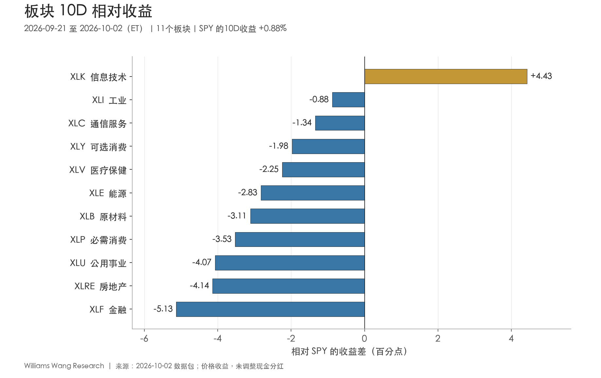
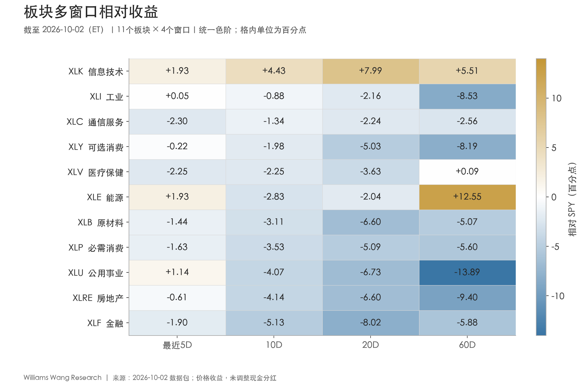
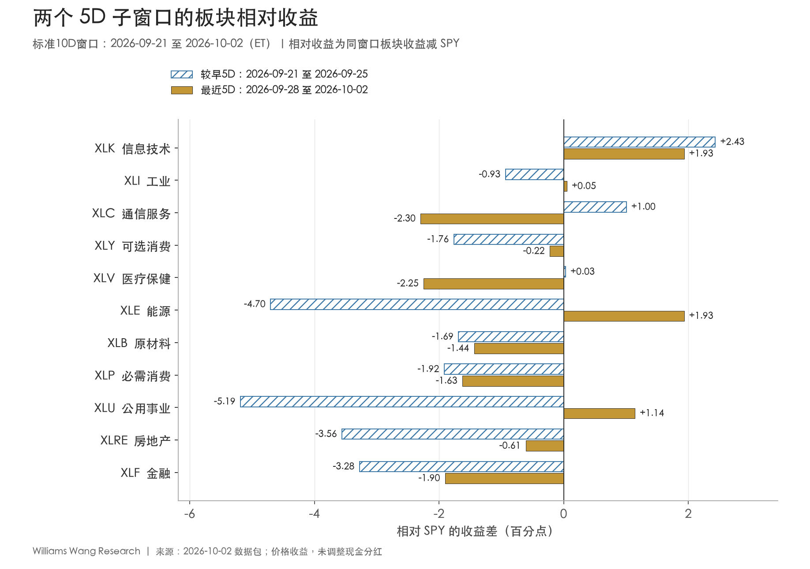

+++
title = "2026年10月2日板块轮动双周复盘：科技单点领先，市场参与面收窄"
author = "Williams Wang Research"
report_period = "2026-09-21 至 2026-10-02 ET"
data_as_of = "2026-10-02"
created_at = "2026-10-03T11:32:18.109644+08:00"
source_package = "2026-10-02_sector_rotation_biweekly.zip"
return_basis = "close-to-close price return; dividends not adjusted"
date = "2026-10-03"
draft = false
description = "复盘9月21日至10月2日板块、风格与跨资产表现，区分科技集中领先、局部反弹和市场参与面收窄。"
series = "市场板块轮动双周复盘"
categories = ["市场结构", "宏观与政策"]
tags = ["板块轮动", "ETF", "市场广度", "SPY"]
featured = false
private = false
content_preservation = "verbatim"
source_sha256 = "cb7bb52b966a05675fde2ecddaf6f25a95c1a2d167cb6788d957d12f0c0a29db"
source_front_matter_reviewed = true
data_as_of_note = "股票数据截至10月2日；多数利率、信用和VIX截至10月1日，WTI截至9月29日；报告生成于10月3日。"
+++

# 2026年10月2日板块轮动双周复盘：科技单点领先，市场参与面收窄

## Executive Summary

- **指数上涨主要对应科技方向的领先，板块参与面明显不足。** 9月21日至10月2日，SPY上涨0.88%、QQQ上涨3.79%，但RSP下跌1.28%、IWM下跌0.94%。11个板块中，只有XLK在完整10D上涨、跑赢SPY并于期末站上20日均线；板块收益中位数为−1.95%。
- **科技延续，通信和医疗退出近期领先，能源与公用事业出现反弹。** XLK的10D收益为+5.30%，四个窗口均跑赢SPY，但最近5D相对优势从+2.43收窄至+1.93个百分点。XLC、XLV最近5D分别下跌2.60%、2.56%；XLE、XLU转涨，但10D与20D仍落后，尚未形成广泛接力。
- **近期“跑赢数量增加”不等于breadth改善。** 最近5D跑赢SPY的板块从3个增至4个，同时绝对上涨板块从4个降至3个，20日均线上方板块从9月25日的3个降至1个。工业仅靠跌幅略小于SPY而跑赢，反映的是抗跌，不能与绝对上涨混为一谈。
- **利率和信用不支持全面risk-on的解释。** 9月18日至10月1日，10Y、30Y收益率分别上升23bp、27bp，高收益债OAS扩大56bp，VIX上升1.58点。HYG虽然相对LQD表现较好，两者价格均下跌；债券ETF相对收益不能代替信用利差判断。10月2日股市普涨是反证，但包内多数利率、信用与VIX数据止于前一日，尚不能确认跨资产同步改善。

## 一、本期窗口与收益口径

本报告事件覆盖期为**2026年9月21日至10月2日（ET）**，共10个交易日。收益从9月18日收盘起算；较早和最近两个5D不重叠。排名比较采用包内规定的前一等长10D，不能直接拿上一份报告的排名代替。

| 用途 | 交易日范围（ET） | 收益基准收盘日 |
| --- | --- | --- |
| 本报告／标准10D | 2026-09-21—2026-10-02 | 2026-09-18 |
| 较早5D | 2026-09-21—2026-09-25 | 2026-09-18 |
| 最近5D | 2026-09-28—2026-10-02 | 2026-09-25 |
| 等长比较期 | 2026-09-04—2026-09-18 | 2026-09-03 |
| 历史价格覆盖 | 2026-07-09—2026-10-02，共61个交易日 | 60D收益基准为2026-07-09 |

ETF收益均为**未调整现金分红的收盘价收益**，不是总回报；拆分处理沿用数据商默认。相对收益为同窗口ETF收益减SPY收益，单位是百分点（pp），未进行beta或行业暴露中性化。两个5D绝对收益按复利连接，不能直接相加。本文的“领先”“修复”均指已观察到的价格表现，不代表资金净流入、预测能力或交易信号。

## 二、SPY仍有涨幅，但典型板块下跌

**完整10D的指数涨幅，掩盖了后半段转弱和多数行业的负收益。** SPY从较早5D的+1.19%转为最近5D的−0.31%；QQQ仍上涨，但涨幅由3.23%降至0.54%。RSP最近5D跌幅扩大至0.96%，IWM下跌0.32%，几乎与SPY同步。

| 代理 | 较早5D | 最近5D | 10D | 20D | 60D |
| --- | --- | --- | --- | --- | --- |
| SPY | +1.19% | -0.31% | +0.88% | -0.45% | +2.39% |
| QQQ | +3.23% | +0.54% | +3.79% | +4.42% | +3.61% |
| RSP | -0.33% | -0.96% | -1.28% | -4.68% | -1.75% |
| IWM | -0.63% | -0.32% | -0.94% | -4.69% | -5.35% |

11个板块10D收益的简单平均为−1.38%，中位数为−1.95%；剔除XLK后，剩余10个板块均值为−2.05%。RSP与SPY的10D差值为−2.15个百分点，20D差值为−4.22个百分点；IWM相对SPY在20D和60D分别落后4.23和7.73个百分点。它们共同表明，科技方向的领先尚未得到等权和小盘的确认。这些代理差值不是SPY的成分股贡献分解，也不能精确识别权重集中度。

本期最高与最低板块收益差为**9.56个百分点**，横截面总体标准差为**2.44个百分点**；两端分别是XLK的+5.30%与XLF的−4.26%。10D只有1/11跑赢SPY、1/11绝对上涨；20D仍只有1/11跑赢，60D为3/11。60D跑赢者是XLK、XLE和XLV，其中XLV优势仅约0.09个百分点，不能将三个成员看作同等稳健的中期领先。

**期末存在单日扩散，但还未改变完整窗口。** 10月2日，SPY上涨0.74%，11个板块中10个上涨；这是不能忽略的改善迹象。不过，20日均线上方的板块数从9月18日的2个、9月25日的3个，降至10月2日的1个。单日普涨与中期参与面收窄可以同时存在，下一期需要看普涨能否持续到完整5D，而不是仅根据最后一个交易日宣布轮动扩散。

## 三、板块分层：科技持续领先，名次靠前未必代表上涨

**XLK是本期唯一同时满足绝对上涨、相对领先和多窗口一致性的板块。** 工业和通信虽然排名第二、第三，10D仍未上涨。表中名次变化相对于9月4—18日的等长比较期。

| 板块 | 比较期名次→本期 | 10D收益 | 10D相对SPY（pp） | 20D相对（pp） | 60D相对（pp） |
| --- | --- | --- | --- | --- | --- |
| XLK 信息技术 | 1→1 | +5.30% | +4.43 | +7.99 | +5.51 |
| XLI 工业 | 4→2 | -0.01% | -0.88 | -2.16 | -8.53 |
| XLC 通信服务 | 3→3 | -0.47% | -1.34 | -2.24 | -2.56 |
| XLY 可选消费 | 10→4 | -1.11% | -1.98 | -5.03 | -8.19 |
| XLV 医疗保健 | 5→5 | -1.37% | -2.25 | -3.63 | +0.09 |
| XLE 能源 | 2→6 | -1.95% | -2.83 | -2.04 | +12.55 |
| XLB 原材料 | 11→7 | -2.24% | -3.11 | -6.60 | -5.07 |
| XLP 必需消费 | 6→8 | -2.65% | -3.53 | -5.09 | -5.60 |
| XLU 公用事业 | 8→9 | -3.20% | -4.07 | -6.73 | -13.89 |
| XLRE 房地产 | 7→10 | -3.26% | -4.14 | -6.60 | -9.40 |
| XLF 金融 | 9→11 | -4.26% | -5.13 | -8.02 | -5.88 |

**科技XLK：持续性仍在，但近期优势有所收窄。** 10D上涨5.30%、跑赢SPY4.43个百分点；20D和60D相对收益分别为+7.99和+5.51个百分点，四个窗口均为正。它也是唯一在两个5D都跑赢SPY的板块。不过，绝对涨幅从较早5D的3.62%降至最近5D的1.62%，相对优势从2.43降至1.93个百分点。证据支持领先延续，不支持无条件外推为继续加速。包内没有成分股盈利、估值或资金流，不能进一步断言具体产业催化剂。

**工业XLI：排名升至第二，实质仍接近持平。** 10D精确收益约−0.0059%，两位小数显示为−0.01%；它落后SPY0.88个百分点。最近5D下跌0.26%，仅比下跌0.31%的SPY好约0.05个百分点；20D和60D相对收益仍为−2.16和−8.53个百分点。这种小幅抗跌不足以确认新leadership，尤其收益未调整现金分红。

**通信XLC与医疗XLV：后半段转弱。** 通信较早5D上涨2.19%，最近5D下跌2.60%，相对收益由+1.00转为−2.30个百分点；完整10D下跌0.47%，四个窗口均落后SPY。医疗较早5D的相对优势本来就只有约0.03个百分点，最近5D转为落后2.25个百分点，10D下跌1.37%。医疗60D仍略跑赢，20D却落后3.63个百分点，不能用很小的长窗口优势掩盖近期弱化。

**能源XLE与公用事业XLU：尾部反弹尚待中期确认。** 两者最近5D分别上涨1.62%和0.83%，相对SPY为+1.93和+1.14个百分点；但完整10D仍下跌1.95%和3.20%，20D也分别落后2.04和6.73个百分点。能源60D仍跑赢12.55个百分点，属于较长窗口优势之上的短期修复；公用事业60D落后13.89个百分点，当前证据更接近跌后反弹。两者不能因最近5D同涨而归入同一种趋势阶段。

**金融XLF和房地产XLRE仍居尾部。** 金融10D下跌4.26%，两个5D均跌逾2%，20D下跌8.47%；房地产10D下跌3.26%，最近5D跌幅收窄，但四个窗口仍全部落后SPY。利率上行与信用走弱是相关背景，包内证据不足以区分估值、融资成本、基本面与持仓调整各自的贡献。

该矩阵说明，近期反弹与中期领先需要分别判断：科技是唯一四窗口均跑赢者；通信、可选消费、原材料、必需消费、房地产、金融六个板块四窗口均落后。把一次相对反转直接写成趋势切换，会忽略其20D和60D背景。

## 四、轮动换位有限，5D相对反转不代表全面扩散

**排名结构保留了较多延续性。** 本期与前一等长10D的Spearman排名相关系数为0.59，Top 3重合2席，只有可选消费XLY的绝对名次变动达到5位以上：由第10升至第4，共改善6位。比较期前三为XLK、XLE、XLC，本期变为XLK、XLI、XLC。这个变化说明局部换位，不能据此推断市场出现广泛资金迁移。

XLY名次改善尤其容易被误读：它的10D收益仍为−1.11%，最近5D仍落后SPY0.22个百分点，20D与60D也明显落后。名次提升反映相对其他板块少跌，不等于它已成为持续跑赢的方向。排名相关、Top 3重合及“五位变化”均为描述性统计，没有对应经过历史校准的强弱等级。

两个5D之间共有五个板块发生相对符号反转，需要区分方向：

- **由落后转为跑赢：XLE、XLU、XLI。** 能源与公用事业同时转为绝对上涨；工业仍下跌，只是跌幅略小于SPY。
- **由跑赢转为落后：XLC、XLV。** 通信与医疗均由绝对上涨转为下跌，原有近期领先未能延续。
- **连续跑赢：仅XLK。** 科技保持领先，但两个5D之间的相对优势收窄约0.50个百分点。

因此，最近5D跑赢板块由3个增至4个，与绝对上涨板块由4个降至3个并不矛盾：基准SPY从上涨转为下跌，使“少跌”也能计入跑赢。最近5D板块均值为−0.79%，均线breadth也下降。**本期更准确的描述是领先集中、局部反弹与内部换位并存，广泛扩散尚未确认。**

## 五、风格与商品：成长和质量相对占优，周期优势主要体现为少跌

**成长相对价值的优势获得跨窗口确认，但规模方向仍缺少跟进。** 下表统一使用同窗口价格收益差，单位为百分点。

| 代理 | 定义 | 最近5D | 10D | 20D | 60D |
| --- | --- | --- | --- | --- | --- |
| 成长－价值 | SPYG－SPYV | +1.30 | +3.40 | +5.64 | +4.31 |
| 大盘成长－大盘价值 | IWF－IWD | +1.05 | +3.75 | +6.66 | +1.69 |
| 等权－市值加权 | RSP－SPY | -0.65 | -2.15 | -4.22 | -4.14 |
| 小盘－大盘 | IWM－SPY | -0.01 | -1.82 | -4.23 | -7.73 |
| 动量－市场 | MTUM－SPY | +1.82 | +3.54 | +8.43 | -1.73 |
| 质量－市场 | QUAL－SPY | +0.65 | +1.13 | +0.89 | +0.33 |
| 低波－市场 | USMV－SPY | +0.02 | -1.26 | -3.07 | -1.75 |
| 周期－防御 | 五板块均值－三板块均值 | +0.59 | +0.50 | +0.38 | +3.44 |
| 高收益债－投资级债 | HYG－LQD | +0.23 | +0.52 | +0.42 | +1.75 |
| 长久期－中期国债 | TLT－IEF | -1.27 | -2.61 | -2.05 | -3.29 |

SPYG－SPYV、IWF－IWD在四个窗口均为正，10D分别领先3.40和3.75个百分点。QUAL相对SPY也在四个窗口均为正，但60D优势只有0.33个百分点，证据强度不应与科技的多窗口差距等同。MTUM最近20D领先8.43个百分点，60D仍落后1.73个百分点，仍有时间尺度冲突。

小盘相对大盘最近5D仅落后约0.01个百分点，显示短期差距明显缩小，但IWM自身下跌0.32%，且20D、60D仍落后；这更接近相对持平，尚不能认定规模风格反转。USMV最近5D仅领先约0.02个百分点，10D、20D、60D仍落后，也不足以说明低波风格全面占优。

周期组定义为XLY、XLF、XLI、XLB、XLE简单平均，防御组为XLP、XLU、XLV简单平均。两组10D分别下跌1.91%和2.41%，周期相对领先0.50个百分点；最近5D分别下跌0.63%和1.22%，周期领先0.59个百分点。**周期优势主要是少跌，两组均未实现整体上涨。** 剔除周期组能源后，10D对完整防御组的优势仍约0.51个百分点，说明这一组间差异并非由能源单独推动；但它依然不是全面增长交易的证据。

美元、黄金与商品代理如下，数值为绝对价格收益：

| 代理 | 最近5D | 10D | 20D | 60D |
| --- | --- | --- | --- | --- |
| UUP | +0.87% | +2.01% | +3.18% | +1.90% |
| GLD | -3.09% | -5.13% | -7.15% | +0.72% |
| USO | -1.15% | -4.80% | +3.35% | +34.71% |
| DBC | +1.02% | -0.14% | +3.11% | +19.48% |

UUP在5D至60D均上涨，GLD最近10D下跌5.13%、20D下跌7.15%，与美元及实际收益率上行的背景相容。USO的10D收益为−4.80%，60D仍为+34.71%；DBC最近5D上涨1.02%，10D仍略跌，商品内部与时间尺度之间都存在差异。

**能源反弹没有得到统一的油价证据确认。** XLE最近5D上涨1.62%，USO同期下跌1.15%。包内WTI现货只到9月29日，并记录9月25日85.23、9月28日99.37、9月29日96.16美元/桶；其中存在明显跳变。即使将日期对齐到9月25—29日，WTI现货上涨12.82%，USO仍下跌3.51%，分歧并未消失。USO涉及期货和展期、现货另有报价口径，但本包不足以确认这种差异的具体原因。本文保留原值，降低现货序列对能源板块反弹的解释权重，不把它写成已确认的“油价驱动”。

UUP、GLD、USO和DBC都只是相关资产的基金代理，不能直接替代指数或现货；风格差值也没有剔除成分、行业、久期和现金分配差异，不能当作纯因子收益。

## 六、利率曲线陡峭化，信用与波动率未提供同步支持

**10D背景的主要压力来自长端收益率与信用利差上行。** 各序列截止日不同，下表保留实际观察日；“较9月25日”只表示从该日到最新观测的差值，不代表统一、完整的最近5D变化。

| 指标 | 9月18日 | 最新值 | 实际观察日（ET） | 较9月18日 | 较9月25日 |
| --- | --- | --- | --- | --- | --- |
| 2Y美债收益率 | 4.76% | 4.78% | 2026-10-01 | +2bp | -3bp |
| 10Y美债收益率 | 5.01% | 5.24% | 2026-10-01 | +23bp | +7bp |
| 30Y美债收益率 | 5.34% | 5.61% | 2026-10-01 | +27bp | +12bp |
| 10Y－2Y利差 | 0.25% | 0.45% | 2026-10-02 | +20bp | +9bp |
| 10Y－3M利差 | 0.87% | 1.09% | 2026-10-02 | +22bp | +16bp |
| 10Y实际收益率 | 2.68% | 2.88% | 2026-10-01 | +20bp | +5bp |
| 10Y盈亏平衡通胀率 | 2.33% | 2.36% | 2026-10-02 | +3bp | +2bp |
| 高收益债OAS | 2.68% | 3.24% | 2026-10-01 | +56bp | +31bp |
| 投资级债OAS | 0.77% | 0.86% | 2026-10-01 | +9bp | +5bp |
| VIX | 14.81点 | 16.39点 | 2026-10-01 | +1.58点 | +1.52点 |
| WTI现货 | 101.44美元/桶 | 96.16美元/桶 | 2026-09-29 | -5.28美元/桶 | +10.93美元/桶 |

**利率：长端上行更快，后半段短端回落也未带来长债修复。** 对齐至10月1日，2Y、10Y、30Y较9月18日分别上升2bp、23bp、27bp，2s10s由25bp扩大至46bp。9月25日至10月1日，2Y下降3bp，10Y和30Y反而上升7bp、12bp，曲线继续陡峭化。独立T10Y2Y序列到10月2日为45bp；不能与10月1日的国债单腿机械混算。

同日10Y实际收益率从2.68%升至2.88%，增加20bp，盈亏平衡通胀率从2.33%升至2.36%，增加3bp；与名义10Y的23bp升幅相符。这支持“实际收益率上行占主要部分”的描述，不足以识别其来自增长预期、期限溢价还是其他因素。盈亏平衡通胀率也不是纯通胀预期。

TLT的10D价格收益为−4.57%，IEF为−1.96%，长久期落后2.61个百分点；最近5D分别下跌2.31%和1.03%。科技依然上涨，说明科技相对强势与利率约束可以同时存在，不能将股市表现统一解释为降息交易。

**信用：相对价格更抗跌，不等于信用风险缓解。** HYG的10D价格收益为−2.22%，LQD为−2.74%，前者领先0.52个百分点；但高收益债OAS从268bp扩大至324bp，投资级OAS从77bp扩大至86bp。仅9月25日至10月1日，高收益和投资级OAS就分别扩大31bp、5bp。债券ETF的久期、信用构成和分配差异，使HYG－LQD无法作为纯信用指标；本期应保留OAS对risk appetite的反证。

**波动率：截至10月1日仍在上行，不能判断就业数据发布后的终值。** VIX从9月18日14.81升至10月1日16.39，上升1.58点，其中较9月25日上升1.52点。本地股票已覆盖10月2日普涨，但多数利率、信用与VIX序列只到10月1日，因此无法据此确认10月2日的反弹是否得到跨资产响应。现有10月2日债券ETF价格也未同步转强：TLT、HYG、LQD分别下跌0.21%、0.08%、0.13%；但这些价格同时受利率等因素影响，仍不能替代当日OAS。WTI更只到9月29日，其+10.93美元/桶的后段变化并不是完整5D。

## 七、消费与增长数据有韧性，就业增量偏低

以下选取本期已发布、与分析框架相关的一手资料。事件日与经济数据所属月份分开列示；外部信息只用于背景，不替换包内行情，也没有引入未经核实的市场共识或“超预期”判断。

| 发布日（ET） | 已核对事实 | 解释边界 |
| --- | --- | --- |
| 9月24日 | 8月新屋销售季调年率68.4万套，环比+6.4%，公布误差范围±19.5个百分点；库存8.5个月。[Census／HUD](https://www.census.gov/construction/nrs/current/index.html) | 环比区间包含零，单月点估计不足以确认住房趋势反转；XLRE也不是纯住宅开发商组合。 |
| 9月30日 | 8月PCE价格指数环比+0.3%、同比+3.4%；核心分别为+0.2%、+3.0%。实际消费环比+0.6%，实际可支配收入持平。[BEA个人收入与支出](https://www.bea.gov/news/2026/personal-income-and-outlays-august-2026) | 消费扩张与仍高于2%的通胀读数并存；不能从一次月度数据直接推导下一次政策决定。 |
| 9月30日 | 二季度实际GDP第三次估计为季调环比折年增长2.2%，较第二次估计上修0.7个百分点。[BEA二季度GDP](https://www.bea.gov/news/2026/gdp-third-estimate-industries-corporate-profits-state-gdp-and-state-personal-income-2nd) | 反映二季度及本次修订信息，不是9月实时增长率；本次发布还含年度更新，跨版本比较需保留修订口径。 |
| 10月2日 | 9月非农就业增加2.9万，失业率4.2%；平均时薪环比+0.1%、同比+3.0%。7月与8月就业增量合计下修6万。[BLS就业报告](https://www.bls.gov/news.release/empsit.nr0.htm) | 就业增量有限，工资增幅也较温和；同日股市上涨不等于已识别“就业走弱促成宽松预期”的因果链。 |

**解释证据混杂。** 实际消费扩张、GDP上修与较低的就业增量并存，不能概括为所有增长指标同步加速或同步衰退。10月2日就业数据的释放晚于包内多数利率、信用和VIX最后观测，尤其不能用10月1日的数值描述市场对该报告的反应。缺少盘中变化和政策预期数据，本文不把最后一天的上涨归因于单一新闻。

本期未核实公司层面的科技、能源或医疗催化剂，因而不为板块价格强弱补写盈利、资金流或政策主题故事。上述事件也不是对10D收益的贡献分解。

## 八、下一报告期重点观察

下一期优先检验两个问题：科技之外是否出现可持续的绝对上涨与相对领先，以及长端利率和信用是否开始缓和。以下为复盘条件，不是经回测的交易阈值。

| 观察问题 | 本期起点 | 有助于确认的变化 | 主要反证 |
| --- | --- | --- | --- |
| 科技领先能否延续 | XLK四窗口跑赢，最近5D相对+1.93pp | 新的完整5D继续跑赢，20D优势与均线状态保持一致 | 相对收益转负且中期优势同步回落，不能仅靠名次第一维持判断 |
| 反弹能否扩散 | 期末均线上方仅1/11；10月2日10/11上涨 | 绝对上涨、跑赢与均线上方板块数持续增加，RSP／IWM同时跟进 | 仅因SPY下跌而增加“跑赢数”，或普涨只持续一天 |
| 能源、公用事业能否接力 | 最近5D转涨，10D与20D仍落后 | 连续5D跑赢并改善20D相对表现；能源还需更一致的油价证据 | 反弹迅速回吐，或只依赖存在跳变的现货序列解释 |
| 通信、医疗能否止弱 | 最近5D均跌逾2.5%，相对收益转负 | 恢复绝对上涨、相对优势及20日均线状态 | 只改善排名但仍持续落后，无法弥补中期弱化 |
| 跨资产是否确认股票修复 | 10Y 5.24%、实际利率2.88%、HY OAS 324bp，均截至10月1日 | 更新后数据同时显示长端压力减轻、OAS收窄及VIX回落 | 科技上涨但信用继续恶化；用不同日期的旧值拼接“确认” |

数据跟踪上，首先补齐10月2日及以后的利率、OAS和VIX观测，再评估就业报告之后的跨资产状态；能源部分则先复核WTI现货跳变及其与期货代理的差异。本文没有把这些尚未取得的数据作为既成事实。

## 免责声明

本报告仅供信息交流、研究与教育参考，不构成任何投资、交易、资产配置或其他专业建议，也不构成对任何证券或金融产品的买卖要约、推荐或收益承诺。报告依据指定时点的数据与公开资料撰写，相关数据可能存在误差、延迟或后续修订；历史表现、相对强弱及情景观察均不代表未来结果。读者应结合自身情况独立核实信息、评估风险并作出决定，投资判断、仓位安排与实际执行由读者自行负责。
