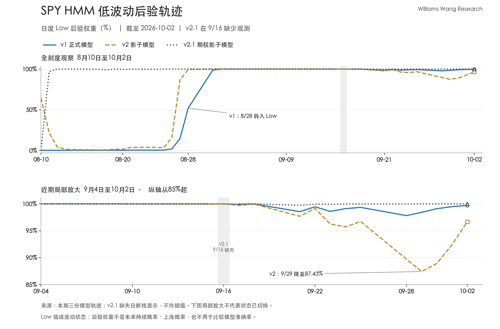

+++
title = "SPY 低波动状态与月底后验变化分析｜2026年10月2日"
date = "2026-10-04"
data_as_of = "2026-10-02"
data_as_of_note = "报告及数据截止日为2026年10月2日美股收盘，整理日期为2026年10月4日。"
description = "分析SPY低波动状态、月底Low后验变化及三模型的一致性与限制。"
series = "SPY HMM模型分析"
categories = ["市场结构", "研究方法"]
tags = ["SPY", "HMM", "波动率", "VIX"]
draft = false
featured = false
private = false
content_preservation = "verbatim"
source_sha256 = "82b285896bd551ba10e0f5bedf9429edbd2400c2193efd14b42d349c5846d562"
+++

# SPY 低波动状态与月底后验变化分析｜2026年10月2日

**Williams Wang Research｜标普500市场观察**  
报告及数据截止日：**2026年10月2日美股收盘**；整理日期：2026年10月4日。  

## 一、核心结论

1. **正式模型继续支持低波动判断，月底的后验松动尚未演变为状态切换。** v1 自8月28日起已连续 **25个观测日**维持 Low Volatility；10月2日的 Low 后验权重为 **99.71%**。normal、t1d、t2d 三种设定均为 Low，Low 权重均高于99.5%。这支持当前分类的内部一致性，不代表未来保持低波动的概率。

2. **本期值得关注的是模型内部分歧，而非硬标签方向改变。** v2 的 Low 权重在9月29日降至 **87.43%**，Mid 升至 **12.57%**；到10月2日，Low 回升至 **96.67%**。v1 的同期变化明显较小，v2.1 则持续高度集中于 Low。三者最新标签一致，但识别状态边界的敏感度不同。

3. **市场统计仍支持较温和的波动环境，短、中期波动水平已比较接近。** SPY 收于 **769.64美元**，近一周收益 **-0.22%**、近一月 **+0.84%**；20日与60日年化实现波动率分别为 **10.33%**、**11.08%**，前者约为后者的 **93.2%**。这些是当前窗口的比较，不能据此断言波动率正在持续上升或下降。

4. **VIX 小幅上行与 Low 状态可以并存。** 同日 VIX 为 **15.31**，近一周上升 **0.44点**、近一月上升 **0.11点**。这表明期权隐含波动指标在相应区间有所回升，但幅度本身不足以证明市场已转入高波动状态。

5. **最新日期对齐改善了模型比较条件，区间缺口仍需保留。** v2.1 在10月2日的 Low 权重高于 **99.99%**，可用于该日对照；但9月16日期权观测不完整，不能将缺失日视为已确认的 Low，也不能将三种模型的权重平均为某种市场置信概率。

## 二、SPY 市场与风险画像

### 周度回报略弱，较长窗口累计回报仍为正

SPY 近一周小幅回落，而近一月、近三个月和年初至今收益分别为 **+0.84%**、**+2.70%**、**+13.54%**。当前组合反映出周度表现与更长观察窗口之间的差异；它既不支持把 Low 标签直接解释为看涨，也不支持把一周下跌解释为高波动切换。

| 市场指标 | 本期数值 | 口径与含义 |
| --- | ---: | --- |
| SPY 收盘价 | 769.64美元 | 截至2026-10-02 |
| 近一周收益 | -0.22% | 沿用包内周度窗口 |
| 近一月收益 | +0.84% | 月度累计回报仍为正 |
| 近三个月收益 | +2.70% | 中期累计回报仍为正 |
| 年初至今收益 | +13.54% | 不代表年内路径平稳 |
| 20日实现波动率 | 10.33% | 年化，回看较短窗口 |
| 60日实现波动率 | 11.08% | 年化，回看较长窗口 |
| 近三个月最大回撤 | -3.38% | 窗口内最深峰谷回撤 |
| 年初至今最大回撤 | -8.88% | 年内最深峰谷回撤 |
| VIX | 15.31 | 截至2026-10-02 |
| VIX 近一周变化 | +0.44点／+2.96% | 同一截止日的周度变化 |
| VIX 近一月变化 | +0.11点／+0.72% | 同一截止日的月度变化 |

市场指标采用包内汇总值。**最大回撤是相应窗口内曾经发生的最深回撤，不是当前价格距高点的距离。** 本期未提供当前回撤或价格高点日期，不能将-3.38%或-8.88%写成当前浮亏或距高点跌幅。

### 20日实现波动略低于60日，不能从截面比较推导时间趋势

按未舍入值计算，20日实现波动率比60日低 **0.75个百分点**，两者比值为93.2%。这说明近期实现波动仍低于更长窗口，但两种估计已比较接近。本期没有提供它们各自完整的日度路径，因此无法判断当前差距的形成，是短期波动上升、长期波动下降，还是两者共同变化的结果。

20日和60日窗口相互重叠，也不是两项独立的风险证据。它们适合用于描述当前波动强度的不同时间尺度，不能仅凭比值较低就推导下一阶段波动继续回落。

### VIX 与实现波动率的差额只作背景对照

VIX 来自 SPX 期权价格，反映未来约30天的预期波动；SPY 实现波动率则是过去价格变化的统计量，两者的标的、期限和构造不同。[Cboe：VIX 定义](https://www.cboe.com/tradable-products/vix/vix-options/)

10月2日 VIX 比 SPY 20日年化实现波动率高约 **4.98个波动率点**。观察日期已对齐，使本期比较不再受最新时点错位影响，但该差额仍不能直接当作可获得的波动率收益，或用来认定期权高估、保护需求异常及卖出波动率具有正收益。

VIX 的月度变化为正，v1 的 High 权重相对20个观测间隔前也小幅增加，但最新 High 权重仍低于0.01%。这种方向一致只说明两个指标在所述窗口内同时上行；它不是已经完成的高波动切换，也不构成因果解释。包内没有提供实际跨资产收益或相关性序列，本文不进一步推断市场广度、信用利差或股债联动。

## 三、HMM 信号与状态演化

### 正式模型维持 Low，九月底曾出现轻微的权重再分配

本期轨迹显示，v1 在8月27日仍为 Mid；8月28日 Low 权重升至 **51.99%**、Mid 为 **47.99%**，开始本轮 Low 状态。8月31日，Low 权重升至 **98.72%**，随后持续主导。所有历史权重均取自本期数据包，不与旧报告中的历史数值拼接。

进入九月下旬，Low 权重不再始终紧贴100%。9月21日降至98.56%，9月28日进一步降至 **97.82%**，对应 Mid 权重为 **2.18%**；此后到10月2日，Low 连续回升至99.71%。这是一轮小幅松动后的修复，期间硬标签始终为 Low。

| v1 观测日 | Low 权重 | Mid 权重 | 硬标签 | 解释 |
| --- | ---: | ---: | --- | --- |
| 2026-08-28 | 51.99% | 47.99% | Low | 刚进入 Low，仍接近状态边界 |
| 2026-08-31 | 98.72% | 1.28% | Low | 权重明显向 Low 集中 |
| 2026-09-21 | 98.56% | 1.43% | Low | 出现小幅向 Mid 的再分配 |
| 2026-09-28 | 97.82% | 2.18% | Low | 最近20个观测日的 Low 权重低点 |
| 2026-09-30 | 99.11% | 0.89% | Low | 权重修复延续 |
| 2026-10-02 | 99.71% | 0.29% | Low | Low 仍明确主导 |

表中省略 High 列，并对数值作四舍五入；Low 与 Mid 显示值不必恰好相加为100%。

最近20个正式模型观测日，即9月4日至10月2日，全部为 Low。最近5个观测日，即9月28日至10月2日，平均 Low 权重为 **98.91%**，低于10月2日的期末值99.71%。因此，描述本周状态时应同时保留“整周曾有松动”和“期末已经修复”两层事实。

连续25个 Low 观测日说明该分类已持续一段时间，但持续期本身不能转换为剩余持续时间，也不能当作下一日状态不变的概率。

*图：上图为8月10日至10月2日的全刻度后验轨迹；下图放大9月4日以来的变化，纵轴从85%起。v2.1 在9月16日断线显示，未作插值。局部放大用于显示后验差异，不表示硬标签已切换。*

### 三种正式模型设定均支持当前分类

| v1 设定 | 观测截止日 | 状态 | Low 权重 | Mid 权重 | High 权重 |
| --- | --- | --- | ---: | ---: | ---: |
| normal | 2026-10-02 | Low | 99.71% | 0.29% | <0.01% |
| t1d | 2026-10-02 | Low | 99.55% | 0.45% | <0.01% |
| t2d | 2026-10-02 | Low | 99.63% | 0.37% | <0.01% |

三种设定都高度偏向 Low，说明当前分类对这些替代设定具有内部一致性。它们不构成三个独立实验，也不能排除共同的数据、特征或模型局限。

后验权重回答的是：**在该模型及其输入条件下，当前观测更符合哪一种隐状态。** 它不直接回答未来会不会发生跳跃、回撤或价格缺口。High 权重很小，不等于实际尾部损失概率同样很小。

## 四、模型分歧与不确定性

### 同日标签一致，后验集中程度存在差异

三个模型的最新观测均为10月2日，可以在这个共同日期比较。v1 为99.71%的 Low 权重，v2 为96.67%，v2.1 高于99.99%；差异主要表现为对 Mid 状态保留的权重不同。

| 模型 | 分析角色 | 10月2日状态 | Low 权重 | Mid 权重 | High 权重 |
| --- | --- | --- | ---: | ---: | ---: |
| v1 | 正式分析锚 | Low | 99.71% | 0.29% | <0.01% |
| v2 | 影子对照 | Low | 96.67% | 3.32% | <0.01% |
| v2.1 | 期权影子对照 | Low | >99.99% | <0.01% | <0.001% |

**权重更接近100%不代表模型更准确。** 不同模型的特征和设定不同，其后验集中程度不能直接用于准确率排名。这里可以确认的是同日标签一致，以及 v2 对 Mid 保留了更多相对权重；不能将三者平均为“低波动将持续”的置信概率。

### v2 的月底松动更明显，期末修复尚未抹去整周差异

| 共同观测日 | v1 Low 权重 | v2 Low 权重 | v2.1 Low 权重 | 三者硬标签 |
| --- | ---: | ---: | ---: | --- |
| 2026-09-25 | 99.35% | 96.73% | 99.98% | 均为 Low |
| 2026-09-28 | 97.82% | 89.74% | 99.98% | 均为 Low |
| 2026-09-29 | 98.43% | 87.43% | 99.99% | 均为 Low |
| 2026-09-30 | 99.11% | 88.92% | >99.99% | 均为 Low |
| 2026-10-01 | 99.48% | 92.40% | >99.99% | 均为 Low |
| 2026-10-02 | 99.71% | 96.67% | >99.99% | 均为 Low |

9月29日，v2 的 Mid 权重达到12.57%，而 High 仍低于0.01%，因此当日变化主要发生在 Low 与 Mid 之间。到10月2日，v2 的 Low 权重较该低点回升 **9.24个百分点**，Mid 回落至3.32%。同期 v1 与 v2.1 的 Low 权重也回升，但变化幅度小得多。

按共同的周度观测窗口，v2 在9月28日至10月2日的平均 Low 权重为 **91.03%**，低于9月21日至25日的 **97.11%**。所以，期末修复是事实，整周后验集中度弱于前一周也是事实。仅看10月2日一行，会低估月底已经出现的模型差异。

## 五、条件情景与下期观察

本期基线仍是 Low 主导，但下一期应重点判断：月底的权重松动是否继续修复，或再次发展为更持续的状态边界变化。下表是条件监控框架，不附加未经校准的情景概率。

| 条件情景 | 可观测证据 | 对本期判断的影响 |
| --- | --- | --- |
| Low 维持且模型差异收敛 | v1 及替代设定继续为 Low；v2 的 Mid 权重进一步回落；同日期的市场波动指标未持续升温 | 增强当前低波动描述的稳定性证据，仍不决定收益方向 |
| 向 Mid 迁移 | v1 的 Low 权重连续下降、Mid 上升；v2 再次出现更大幅度松动；20日实现波动因自身上升而接近或超过60日 | 削弱现有 Low 判断；即使硬标签未变，也应重新评估状态不确定性 |
| 向 High 升级 | High 权重显著并持续抬升，同时实际波幅、实现波动或 VIX 出现相互印证的上行 | 当前基线受到实质挑战；High 仍描述波动强度，不表示必然下跌 |
| 价格走弱但仍低波动 | 价格区间收益持续偏弱，而波动指标和后验结构保持稳定 | 分开讨论方向性损失与波动状态，不能因为 Low 而忽略缓慢累积的亏损 |
| 同日模型分歧延续 | v2 对 Mid 的权重再次扩大，而 v1、v2.1 仍高度偏向 Low | 保留正式模型作为分析锚，同时承认跨模型不确定性，等待进一步可比观测 |

监控时需要同时看**水平、持续性和实际市场路径**。v2 的一次回落不足以宣布状态切换，10月2日的一次修复也不足以宣布分歧已经永久消失。若实际市场发生剧烈跳跃，模型尚未改变标签也不能否定已经发生的风险。

对风险预算而言，Low 可作为当前波动环境的描述，但不能单凭这一标签推导仓位或杠杆。依赖近期波动估计的风险预算在波动较低时可能容纳更大名义敞口，因此仍需考虑突然升温的压力情景。本包没有给出组合持仓、相关性、流动性约束或策略损益分布，无法据此计算具体风险额度和对冲规模。

下一期优先观察三项：**v2 的 Mid 权重能否持续回落；v1 的替代设定是否出现同方向松动；20日波动、60日波动与 VIX 各自如何变化。** 继续核对期权观测的区间完整性，避免将恢复到最新日期误写成所有历史缺口已经修复。

**免责声明：** 本文仅供一般性信息、教育及研究讨论，不构成投资、理财、交易建议或买卖证券的推荐，也不构成购买或出售任何金融工具的邀请或要约。模型状态与条件情景不保证未来结果，具体投资判断、仓位安排及执行由读者自行决定。
