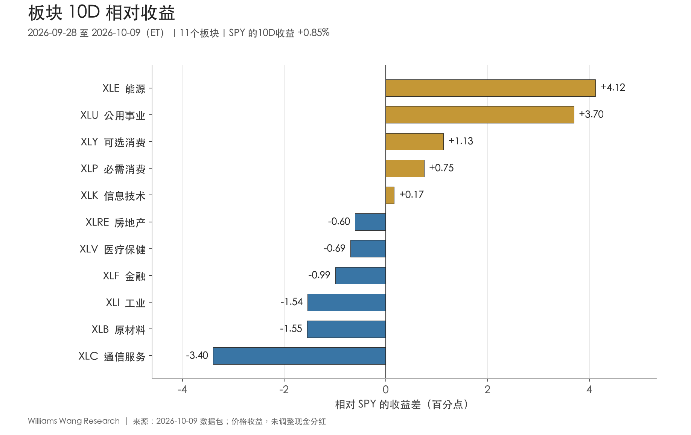
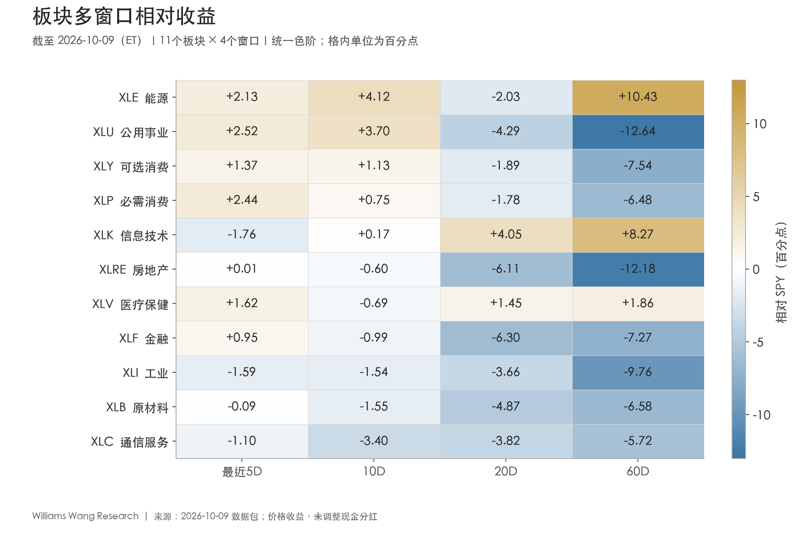
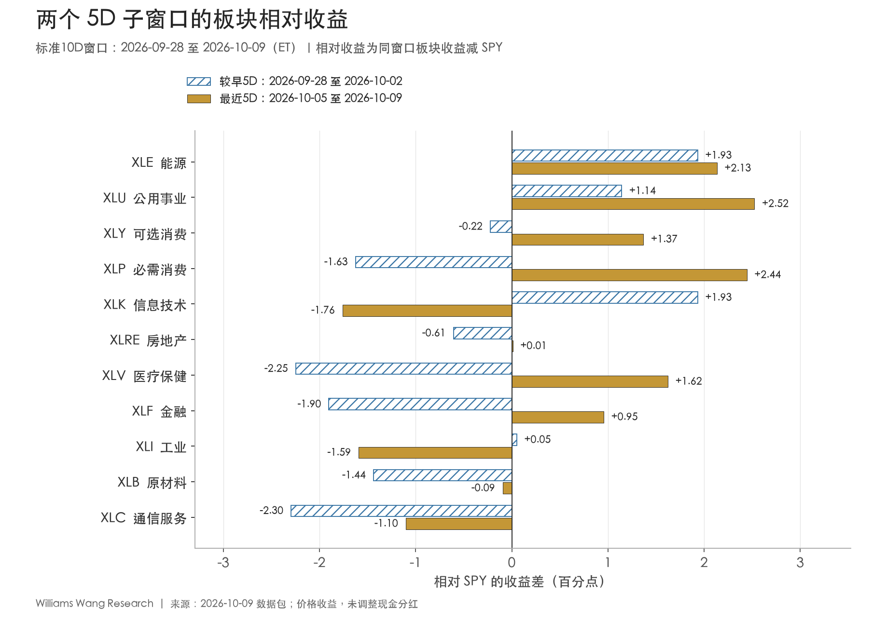

+++
title = "市场板块轮动双周分析报告｜截至 2026-10-09（ET）"
data_as_of = ["2026-10-06", "2026-10-08", "2026-10-09"]
data_as_of_note = "权益价格窗口为9月28日至10月9日ET，股票及部分利差截至10月9日；多数国债收益率、信用利差和VIX截至10月8日，WTI现货截至10月6日；分别保留原文观察日，不以填充值统一终点。"
description = "复盘截至10月9日的板块轮动，区分能源与公用事业接棒、参与面修复，以及小盘与高收益信用尚未同步确认的边界。"
series = "市场板块轮动双周复盘"
categories = ["市场结构", "宏观与政策"]
tags = ["板块轮动", "ETF", "市场广度", "SPY"]
date = "2026-10-10"
draft = false
featured = false
private = false
content_preservation = "verbatim"
source_sha256 = "7810de7993c54f10b4ad885bd3a6dfa01548dc0d707d833f23fb7a389a4fca2e"
+++

# 市场板块轮动双周分析报告｜截至 2026-10-09（ET）

**能源与公用事业接棒，参与面修复仍有边界**

## 一、本报告期结论

**本期最清楚的变化是 leadership 切换，同时出现有限的 breadth 修复。** 能源 XLE 和公用事业 XLU 的10D价格收益分别为 **+4.97%、+4.54%**，领先 SPY **4.12、3.70个百分点**。相对于9月14—25日的非重叠10D对照期，两者都上升9个名次，原前三名科技、医疗、通信全部退出本期前三。排名相关系数为 **−0.455**，Top 3 overlap 为 **0/3**，表明领涨名单确实更换。

参与面的改善主要发生在后半段。最近5D中，SPY上涨 **1.16%**，11个板块中 **9个上涨、7个跑赢SPY**；较早5D分别只有3个和4个。高于20日均线的板块从10月2日的 **1/11** 回到10月9日的 **6/11**，RSP最近5D也领先SPY **0.41个百分点**。这组证据支持上涨参与面扩大。

**全面 risk-on 的证据仍不齐全。** IWM最近5D下跌 **0.86%**、落后SPY **2.01个百分点**，工业同期下跌 **0.44%**；低波动因子和防御组领先。HY OAS截至10月8日较9月25日扩大 **22bp**，较10月2日仍扩大 **5bp**。股票反弹尚未得到小盘与高收益信用同步确认。

中期背景也限制了新领涨的解释：没有一个板块在5D、10D、20D、60D四个窗口都跑赢SPY。公用事业虽短期领先，60D仍落后 **12.64个百分点**；科技最近5D落后 **1.76个百分点**，但20D、60D仍分别领先 **4.05、8.27个百分点**。当前更适合描述为“短期领涨迁移与部分落后板块修复”，尚不足以认定中期主线已经完成转换。

| ETF | 较早5D | 最近5D | 完整10D | 20D | 60D |
| --- | --- | --- | --- | --- | --- |
| SPY | -0.31% | +1.16% | +0.85% | +1.84% | +3.71% |
| QQQ | +0.54% | +0.25% | +0.79% | +5.07% | +6.42% |
| RSP | -0.96% | +1.56% | +0.59% | -0.91% | -0.94% |
| IWM | -0.32% | -0.86% | -1.17% | -3.50% | -5.63% |

表1：核心权益代理的价格收益。最近5D为10月5—9日；完整10D为9月28日—10月9日。

## 二、板块轮动证据：参与面与排名更替分别看

本期与对照期的定义必须分开：完整10D收益以 **9月25日收盘** 为基准；较早5D为9月28日—10月2日，最近5D以10月2日收盘为基准。排名变动比较的是 **9月14—25日** 与本期两个非重叠10D窗口，前者以9月11日收盘为基准。manifest 中 `previous_package_end_et=2026-10-02` 只表示上次出包日期，不是本表排名变动的对照期。

| 证据 | 本期结果 | 解释边界 |
| --- | --- | --- |
| 10D最高−最低板块收益 | 7.52个百分点 | 能源与通信的横截面差距，不是组合可实现收益 |
| 10D板块收益离散度 | 2.14个百分点 | 11板块总体标准差，ddof=0，未年化 |
| 10D绝对上涨 / 跑赢SPY | 7/11 / 5/11 | 多数上涨，但跑赢市值加权基准的仍少于一半 |
| 高于20日均线 | 6/11 | 9/25为3/11，10/02为1/11，10/09为6/11 |
| 20D / 60D跑赢SPY | 2/11 / 3/11 | 中期相对领先仍集中 |
| 排名相关系数 | −0.455 | 与非重叠10D对照期比较，无预测概率含义 |
| Top 3 overlap | 0/3 | 本期XLE、XLU、XLY；对照期XLK、XLV、XLC |
| 名次变动绝对值≥5 | 5个板块 | XLE +9、XLU +9、XLV −5、XLI −5、XLC −8 |

11个板块10D收益的简单均值为 **+0.95%**，中位数仅 **+0.24%**；去掉收益最高的能源后，其余10板块均值为 **+0.54%**，低于SPY的 **+0.85%**。这说明本期涨幅分布仍受能源和公用事业等领先板块影响。该均值是板块ETF的等权统计，不是SPY行业贡献，也不是成分股上涨比例。

排名更替与参与面改善同时存在，但两者不能互相替代。0/3的前三名重合度能证明名单变化，不能证明新名单的领先会持续；6/11的均线 breadth 能证明更多板块修复，不能代表所有规模或风格都已转强。报告使用这些可复算数值，不为“轮动强度”附加未经历史校准的强、中、弱等级。

## 三、Leadership 与 laggards：短期排序需要中期确认

| 名次 | 板块 | 10D收益 | 10D相对SPY | 20D相对SPY | 60D相对SPY | 对照期名次→本期 | 高于20日均线 |
| --- | --- | --- | --- | --- | --- | --- | --- |
| 1 | XLE 能源 | +4.97% | +4.12 | -2.03 | +10.43 | 10→1 | 是 |
| 2 | XLU 公用事业 | +4.54% | +3.70 | -4.29 | -12.64 | 11→2 | 是 |
| 3 | XLY 可选消费 | +1.98% | +1.13 | -1.89 | -7.54 | 6→3 | 是 |
| 4 | XLP 必需消费 | +1.60% | +0.75 | -1.78 | -6.48 | 5→4 | 是 |
| 5 | XLK 信息技术 | +1.01% | +0.17 | +4.05 | +8.27 | 1→5 | 是 |
| 6 | XLRE 房地产 | +0.24% | -0.60 | -6.11 | -12.18 | 9→6 | 否 |
| 7 | XLV 医疗保健 | +0.15% | -0.69 | +1.45 | +1.86 | 2→7 | 是 |
| 8 | XLF 金融 | -0.15% | -0.99 | -6.30 | -7.27 | 8→8 | 否 |
| 9 | XLI 工业 | -0.69% | -1.54 | -3.66 | -9.76 | 4→9 | 否 |
| 10 | XLB 原材料 | -0.70% | -1.55 | -4.87 | -6.58 | 7→10 | 否 |
| 11 | XLC 通信服务 | -2.55% | -3.40 | -3.82 | -5.72 | 3→11 | 否 |

表2：相对收益列单位为百分点；名次1为10D收益最高。均线状态使用10月9日收盘与截至当日20个交易日平均收盘价比较。

**能源：两段5D都领先，但20D仍是缺口。** XLE在较早与最近5D分别跑赢SPY **1.93、2.13个百分点**，是少数连续两段领先的板块之一；60D也领先 **10.43个百分点**。但其20D价格收益仍为 **−0.18%**、相对SPY **−2.03个百分点**，显示近期反弹并未完全覆盖此前回撤。能源股收益与原油代理不能直接等同，油价证据另见第六节。

**公用事业：短期接棒明确，中期落后尚未修复。** XLU最近5D上涨 **3.68%**、相对SPY **+2.52个百分点**，高于较早5D的 **+1.14个百分点**。然而20D、60D相对收益分别为 **−4.29、−12.64个百分点**。可以确认的是反弹和短期领先增强；“长期趋势反转”仍需后续窗口验证。

**消费：可选与必需消费共同改善，不能简单归为单边周期交易。** XLY最近5D上涨 **2.53%**，把完整10D收益推至 **+1.98%**；XLP最近5D上涨 **3.60%**，10D为 **+1.60%**。两者20D、60D仍落后SPY。XLY参与反弹提供部分需求敏感板块的支持，XLP和XLU同步领先则保留防御倾向。

**科技与医疗：近期方向不同，中期仍有相对优势。** XLK由较早5D相对 **+1.93个百分点** 转为最近5D **−1.76个百分点**，10D仅剩 **+0.17个百分点** 的优势；20D和60D相对收益仍为正。XLV则从较早5D相对 **−2.25个百分点** 转为最近5D **+1.62个百分点**，但10D相对仍为 **−0.69个百分点**。科技是中期领先中的短期回落，医疗是本期回撤后的修复，不能只凭10D名次将两者归为同一种衰减。

**通信、工业与原材料：跨窗口相对落后。** XLC、XLI、XLB是仅有的四个观察窗口均落后SPY的板块。XLC完整10D下跌 **2.55%**、相对 **−3.40个百分点**；最近5D虽然微涨 **0.05%**，仍落后 **1.10个百分点**。XLI最近5D继续下跌，XLB上涨 **1.06%** 但略落后SPY。金融与房地产虽在最近5D反弹，均线状态仍在20日均线下方，20D相对落后分别为 **6.30、6.11个百分点**。

图2：没有板块获得四个窗口同时为正的确认。各窗口相互嵌套，不是四份独立证据。

## 四、两个5D子窗口：能源与公用事业延续，修复范围扩大

| 板块 | 较早5D收益 | 最近5D收益 | 较早5D相对SPY | 最近5D相对SPY |
| --- | --- | --- | --- | --- |
| XLE 能源 | +1.62% | +3.29% | +1.93 | +2.13 |
| XLU 公用事业 | +0.83% | +3.68% | +1.14 | +2.52 |
| XLY 可选消费 | -0.53% | +2.53% | -0.22 | +1.37 |
| XLP 必需消费 | -1.93% | +3.60% | -1.63 | +2.44 |
| XLK 信息技术 | +1.62% | -0.60% | +1.93 | -1.76 |
| XLRE 房地产 | -0.92% | +1.17% | -0.61 | +0.01 |
| XLV 医疗保健 | -2.56% | +2.78% | -2.25 | +1.62 |
| XLF 金融 | -2.21% | +2.11% | -1.90 | +0.95 |
| XLI 工业 | -0.26% | -0.44% | +0.05 | -1.59 |
| XLB 原材料 | -1.75% | +1.06% | -1.44 | -0.09 |
| XLC 通信服务 | -2.60% | +0.05% | -2.30 | -1.10 |

表3：绝对收益单位为%；相对SPY列单位为百分点。完整10D收益按两段5D复合计算，不能将两个百分比简单相加。

**持续并增强的相对领先只有能源和公用事业。** 两者在两个5D子窗口均上涨且跑赢SPY，XLU的相对优势扩张更明显。相比之下，科技绝对收益从 **+1.62%** 转为 **−0.60%**，工业从 **−0.26%** 转为 **−0.44%**；其相对表现由正转负。工业较早5D的微幅跑赢仅为 **0.05个百分点**，当时本身仍下跌。

**由相对落后转为领先的板块有5个：XLY、XLP、XLRE、XLV、XLF。** 其中房地产最近5D只领先约 **0.01个百分点**，应视为接近持平；这类小差异不足以支持明确的 leadership 判断，也容易受未调整现金分红影响。医疗、必需消费与金融的修复幅度更大，但金融仍未收复完整10D跌幅。

最近5D的11板块平均价格收益达到 **+1.75%**，SPY也由较早5D的 **−0.31%** 转为 **+1.16%**。因此，新增的相对领先包含真实的价格回升。与此同时，IWM从 **−0.32%** 转为 **−0.86%**，表明改善主要发生在大盘板块内部，尚未覆盖小盘。

截至最后交易日10月9日，SPY上涨 **0.60%**，9/11板块上涨；房地产和医疗分别上涨 **1.86%、1.58%**，但能源下跌 **0.25%**、通信下跌 **1.51%**。最后一日的表现提醒我们：双周第一名不等于每天持续领涨，短期修复也可能继续在板块之间迁移。

## 五、外部上下文：增长、就业与政策信息存在分歧

以下只补充 **9月28日—10月9日** 内发布的信息，不替代本地市场序列，也不把发布前后的价格相关性写成事件因果。宏观发布所描述的月份、季度与发布日期分别列示。

**9月30日｜8月消费与通胀。** BEA公布8月实际PCE环比 **+0.6%**，PCE价格指数环比 **+0.3%**、同比 **+3.4%**，核心PCE环比 **+0.2%**、同比 **+3.0%**。同次发布包含年度更新。消费仍有韧性与通胀仍高于目标并存；这里保留该日发布版本，不把新版历史数据当作此前已知信息。[BEA，2026-09-30](https://www.bea.gov/news/2026/personal-income-and-outlays-august-2026)

**9月30日｜二季度GDP第三次估计。** 实际GDP环比折年率为 **+2.2%**，较第二次估计上修 **0.7个百分点**；私人国内最终购买实际增速为 **4.6%**。这是对二季度的修订，能够补充需求背景，但不能直接证明10月所有周期板块盈利同步改善。[BEA，2026-09-30](https://bea.gov/news/2026/gdp-third-estimate-industries-corporate-profits-state-gdp-and-state-personal-income-2nd)

**10月2日｜9月就业。** 非农就业新增 **2.9万人**，失业率 **4.2%**；7、8月就业增量合计下修 **6万人**。这组数据使就业扩张的证据弱于消费与GDP背景，但单月数据及后续修订风险不支持直接推导衰退结论。[BLS，2026-10-02](https://www.bls.gov/news.release/archives/empsit_10022026.htm)

**10月6日｜8月贸易。** 商品与服务逆差为 **1056亿美元**，较7月扩大 **127亿美元**；出口、进口环比分别增长 **1.4%、4.3%**。数据经季调但未扣除价格变化，不能仅凭名义进口增加推导实际内需或特定板块利润变化。[BEA / Census，2026-10-06](https://www.bea.gov/news/2026/us-international-trade-goods-and-services-august-2026)

**10月7日｜9月FOMC会议纪要。** 纪要显示，9月会议多数与会者认为年底前进一步加息可能适宜，同时强调取决于后续信息。需要保留时间边界：这反映 **9月15—16日会议时** 的判断，未纳入其后公布的上述消费、GDP和就业信息；10月7日是纪要公开日，不是新的利率决议日。[FOMC纪要](https://www.federalreserve.gov/monetarypolicy/fomcminutes20260916.htm)；[美联储发布说明，2026-10-07](https://www.federalreserve.gov/newsevents/pressreleases/monetary20261007a.htm)

**可能解释与反证：解释证据混杂。** 就业偏弱和最近一周国债收益率下降，与防御及部分利率敏感板块修复的方向相容；但较有韧性的需求数据和纪要中的通胀担忧，使“持续宽松驱动的全面风险偏好上升”缺乏充分支持。本地小盘落后、HY利差扩大也与全面risk-on不一致。这里没有事件研究、市场预期差或资金流资料，无法将板块收益归因到某一项发布。

## 六、风格与跨资产：防御、低波动占优，小盘仍未接力

| 收益差（百分点） | 最近5D | 10D | 20D | 60D |
| --- | --- | --- | --- | --- |
| SPYG−SPYV：成长−价值 | -0.22 | +1.10 | +5.29 | +6.33 |
| IWF−IWD：大盘成长−价值 | -0.86 | +0.20 | +5.07 | +3.90 |
| RSP−SPY：等权−市值加权 | +0.41 | -0.25 | -2.75 | -4.65 |
| IWM−SPY：小盘−大盘 | -2.01 | -2.02 | -5.34 | -9.34 |
| MTUM−SPY：动量 | -2.18 | -0.37 | +2.46 | +1.76 |
| QUAL−SPY：质量 | +0.04 | +0.70 | +1.29 | -0.78 |
| USMV−SPY：低波动 | +1.19 | +1.22 | -1.31 | -0.21 |
| 周期组−防御组 | -1.64 | -1.02 | -2.21 | +1.61 |
| HYG−LQD：信用价格代理 | +0.01 | +0.23 | +0.36 | +1.51 |
| TLT−IEF：久期价格代理 | +0.21 | -1.08 | -1.81 | -2.79 |

表4：所有单元格均为同窗口价格收益差，单位为百分点。周期组等权平均为 XLY、XLF、XLI、XLB、XLE；防御组为 XLP、XLU、XLV。上述风格ETF并非纯因子，资产持仓和行业权重存在差异。

**成长的中期优势仍在，最近5D则偏向价值和低波动。** SPYG−SPYV的20D、60D差为 **+5.29、+6.33个百分点**，最近5D转为 **−0.22个百分点**；IWF−IWD也由中期领先转为最近5D **−0.86个百分点**。MTUM最近5D落后SPY **2.18个百分点**，USMV领先 **1.19个百分点**。这些是风格收益迁移的证据，不能直接证明动量拥挤解除或强制去杠杆。

**等权回升不能替代规模确认。** RSP最近5D领先SPY **0.41个百分点**，但10D、20D、60D分别仍落后 **0.25、2.75、4.65个百分点**。IWM在四个窗口全部落后，60D相对差达到 **−9.34个百分点**。因此，当前更接近大盘内部参与面的修复，小盘接力尚未出现。

**周期组没有因能源领跑而整体胜过防御组。** 周期组10D平均上涨 **1.08%**，防御组上涨 **2.10%**；最近5D分别为 **+1.71%、+3.35%**。去掉周期组中的能源后，10D相对防御组的差由 **−1.02** 扩至 **−1.99个百分点**。若去掉防御组中的医疗，周期组仍落后剩余防御组约 **1.99个百分点**。该方向不依赖某一个组内落后板块，仍只是所选ETF集合的描述性比较。

| 资产代理 | 最近5D | 10D | 20D | 60D |
| --- | --- | --- | --- | --- |
| UUP | +0.42% | +1.29% | +3.46% | +2.40% |
| GLD | +0.97% | -2.15% | -3.44% | +5.38% |
| USO | +0.92% | -0.24% | -4.17% | +24.22% |
| DBC | +0.02% | +1.04% | -0.06% | +15.81% |

表5：美元、黄金、原油及综合商品的ETF价格代理。UUP不是美元指数的精确复制，USO与DBC也不能当作现货商品价格本身。

美元代理UUP在5D、10D、20D、60D均上涨；黄金GLD最近5D反弹 **0.97%**，但10D和20D仍为 **−2.15%、−3.44%**。USO最近5D上涨 **0.92%**，完整10D却下跌 **0.24%**。能源股XLE的10D **+4.97%** 明显强于原油ETF，单凭这一差异不能确定资金流、盈利预期或现货供给冲击的贡献。

另一方面，仅看最近已齐备的 **10月2—6日**，现货为 **−1.69%**，USO同窗口为 **−1.32%**，方向一致。因而“现货持续上涨推动能源股接棒”的解释并不稳固：既有基准敏感性，也有现货与期货型ETF口径差异。本报告保留原始值，不擅自修正；该问题限制油价归因，不改变从ETF收盘价计算出的板块排序。

## 七、Rates / credit / volatility：利率短期缓和，信用未同步改善

| 指标 | 9/25基准 | 最后有效值 | 观察日（ET） | 较9/25变化 | 较10/02变化 |
| --- | --- | --- | --- | --- | --- |
| 2Y国债收益率 | 4.81% | 4.75% | 2026-10-08 | -6bp | -8bp |
| 10Y国债收益率 | 5.17% | 5.22% | 2026-10-08 | +5bp | -6bp |
| 30Y国债收益率 | 5.49% | 5.60% | 2026-10-08 | +11bp | -3bp |
| 10Y−2Y利差 | 0.36% | 0.44% | 2026-10-09 | +8bp | -1bp |
| 10Y−3M利差 | 0.93% | 0.99% | 2026-10-09 | +6bp | -10bp |
| 10Y实际收益率 | 2.83% | 2.87% | 2026-10-08 | +4bp | -5bp |
| 10Y通胀补偿 | 2.34% | 2.33% | 2026-10-09 | -1bp | -3bp |
| HY OAS | 2.93% | 3.15% | 2026-10-08 | +22bp | +5bp |
| IG OAS | 0.81% | 0.82% | 2026-10-08 | +1bp | -3bp |
| VIX | 14.87点 | 15.41点 | 2026-10-08 | +0.54点 | +0.10点 |
| WTI现货 | 85.23美元/桶 | 96.24美元/桶 | 2026-10-06 | +11.01美元/桶 | -1.65美元/桶 |

表6：利率和信用利差的水平单位为%；变化单位为bp，1bp=0.01个百分点。VIX变化为指数点，WTI变化为美元/桶。“较10/02变化”终点仍为各序列的最后有效观察日，不是一致截至10月9日的5D变化。没有以填充值补出缺失观察。

**利率全期与最近一周方向不同。** 9月25日至10月8日，2Y下降 **6bp**，10Y、30Y分别上升 **5bp、11bp**；属于前端下行、长端上行的曲线变陡。10月2日至8日，2Y、10Y、30Y则分别下降 **8bp、6bp、3bp**，利率压力在最近一周有所缓和。与之相容，TLT和IEF最近5D分别上涨 **0.56%、0.35%**，但完整10D仍下跌 **1.76%、0.69%**。不能用最近一周反弹抹掉完整窗口的久期损失。

**曲线与通胀补偿必须按同日对齐。** 10月8日10Y−2Y按国债收益率计算为 **47bp**，相对9月25日36bp增加 **11bp**；10月9日单独发布的T10Y2Y为 **44bp**，相对期初增加 **8bp**。它们是不同终点的结果。10月2—8日的同日曲线差增加 **2bp**，也不能与10月9日利差较10月2日下降1bp混写。

同样，在 **9月25日—10月8日** 的共同观察窗口内，10Y名义收益率 **+5bp ≈ 实际收益率+4bp + 通胀补偿+1bp**。最近共同窗口10月2—8日则为 **−6bp ≈ −5bp −1bp**。10月9日T10YIE为2.33%，较期初下降1bp，但该终点与名义、实际收益率最后观察日不同，不能直接代入上述分解。通胀补偿包含风险及流动性溢价，不等于纯通胀预期；本包也不包含期限溢价识别模型。

**信用的关键分歧在HY。** 截至10月8日，HY OAS为315bp，较期初扩大22bp，且最近一周继续扩大5bp；IG OAS为82bp，较期初扩大1bp，较10月2日收窄3bp。HYG、LQD最近5D分别上涨 **0.51%、0.50%**，HYG−LQD仅 **+0.01个百分点**，不能据此覆盖OAS给出的分化。完整10D，HYG、LQD分别下跌 **0.77%、1.01%**；HYG较少下跌还受到两只ETF久期、持仓及现金分红差异影响，不是信用风险下降的纯度量。

**VIX没有给出同步舒缓证据。** 最后观察值为10月8日 **15.41**，较期初增加 **0.54点**，较10月2日增加 **0.10点**。这些是变化描述，未建立历史分位阈值；也没有10月9日VIX观测值或期权曲面，不能推断周五收盘波动率、尾部风险概率或交易商仓位。

## 八、下一报告期观察点

下面是条件跟踪清单，不是交易或仓位建议。阈值优先采用本期已经观察到的状态及零线，不为未来收益附加概率。

| 观察主题 | 本期锚点 | 支持延续的后续证据 | 削弱判断的反证 |
| --- | --- | --- | --- |
| 新领涨能否跨期延续 | XLE、XLU连续两段5D跑赢SPY | 下个5D继续领先，且20D相对差向零收敛 | 5D优势转负，20D相对差继续扩大 |
| breadth能否保持 | 最近5D上涨9/11、跑赢7/11；均线上方6/11 | 均线参与面不回落，RSP相对改善延续 | 指数上涨但均线参与面收缩、RSP再次落后 |
| 小盘与周期能否接力 | IWM最近5D相对−2.01个百分点；工业仍跌 | IWM、XLI同步改善，周期组相对防御差收敛 | 小盘继续负收益，改善仍集中防御板块 |
| 科技与医疗的不同路径 | XLK短期回落，XLV短期修复；两者20D领先 | 科技5D回升或医疗修复延续，同时保留20D优势 | 20D相对收益转负，修复仅维持一周 |
| 股票与信用能否重新一致 | HY OAS315bp且最近扩大5bp | 在同日口径下，HY利差转向收窄并与breadth改善并行 | 股票上涨而HY利差继续扩大 |
| 油价解释能否恢复可信度 | 现货基准跳变，最新仅至10/06 | 核实期初报价、补足观察日并重新比较同窗口代理 | 跳变无法解释或现货与代理继续背离 |

这些检查只能帮助区分“反弹延续”“参与面回撤”或“短期主线再切换”，不预设哪一种一定发生。若利率重新上行而防御、房地产仍领先，也需要重新审视单一 rates impulse 的解释。

## 免责声明

本报告仅用于研究、学习与信息交流，依据所列数据及截至报告观察日可获取的信息编制，不构成任何证券、基金、衍生品或其他金融产品的投资、交易、仓位或收益建议，也不构成买卖要约。数据可能存在延迟、修订、缺失或错误，分析判断具有不确定性；历史表现和描述性关系不代表未来收益，任何情景或观察条件均不构成保证。读者应结合自身情况独立判断并自行承担相关风险，必要时咨询具备资质的专业人士。投资决策及实际执行由读者自行负责。
